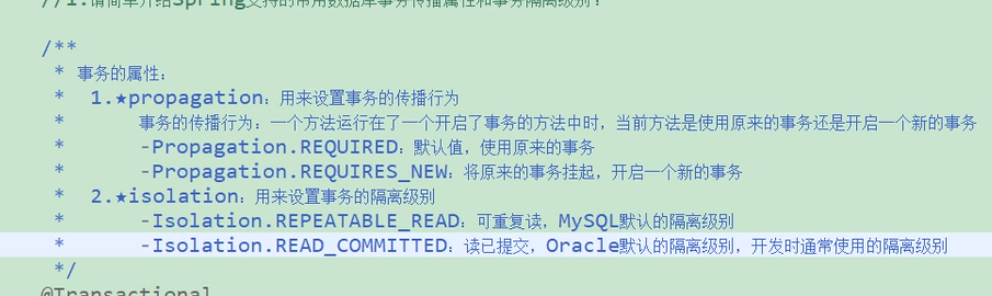
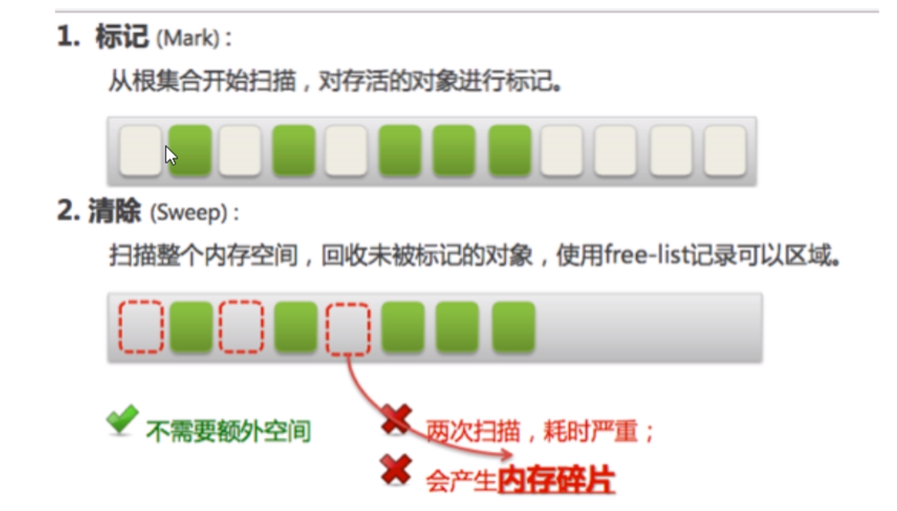

## 递归


上课传卷子





原子 隔离  一致性  持久性


```tex
更新丢失：最后的更新覆盖了其他事务之前的更新，而事务之间并不知道，发生更新丢失。更新丢失，可以完全避免，应用对访问的数据加锁即可。 　　

脏读(针对未提交的数据)：一个事务在更新一条记录，未提交前，第二个事务读到了第一个事务更新后的记录，那么第二个事务就读到了脏数据，会产生对第一个未提交 数据的依赖。一旦第一个事务回滚，那么第二个事务读到的数据，将是错误的脏数据。 　　

不可重复读（读取数据本身的对比）：一个事务在读取某些数据后的一段时间后，再次读取这个数据，发现其读取出来的数据内容已经发生了改变，就是不可重复读。 　　

幻读（读取结果集条数的对比）：一个事务按相同的查询条件查询之前检索过的数据，确发现检索出来的结果集条数变多或者减少（由其他事务插入、删除的），类似产生幻觉。
```


cnblogs.com/-mrl/p/13056433.html


off关


复制算法





concurrent 高并发

并行： 同一时刻

并发：同一时间间隔

## 三个包

1. java.util.concurrent
2. java.util.atomic
3. java.util.concurrent.locks

WWH

1. whate 是什么
2. why 为什么
3. how 有什么好处

main：主线程，一切程序的入口

如何编写企业级的多线程代码？

固定的套路+模板是什么？

1. 在高内聚低耦合的前提下， 线程  操作 资源类

   1.1 一言不合，先创建一个资源类（干啥事先new出来，自身封装好方法，对外暴露接口，高内聚低耦合）自己动手丰衣足食，不依赖于别人；内聚方法和变量

   1.2  

2. ReentranLock

   可重入锁

3. 

 


