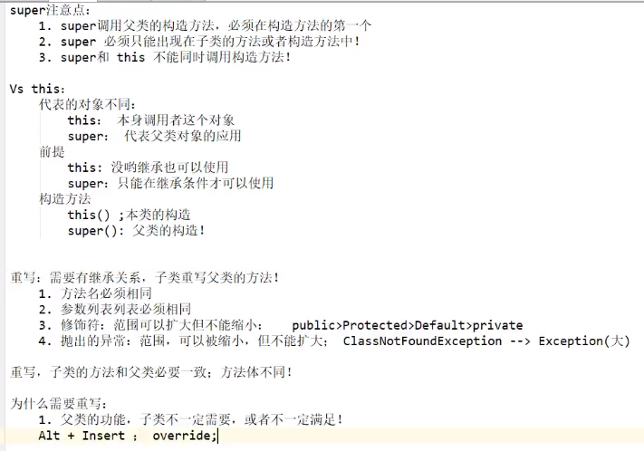
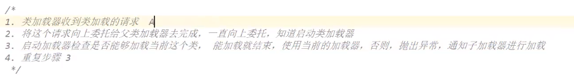
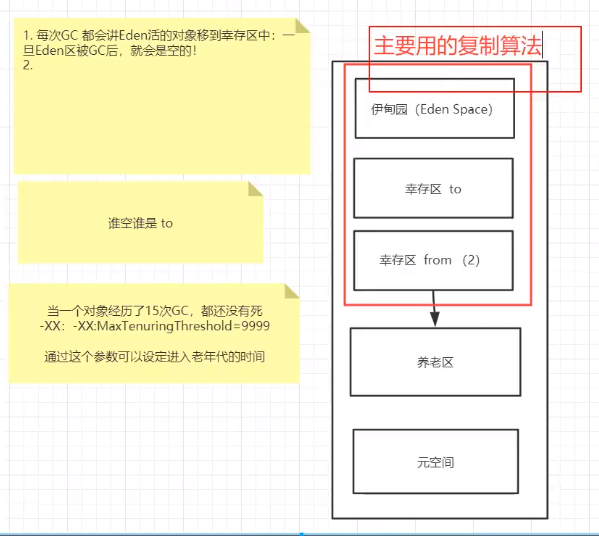
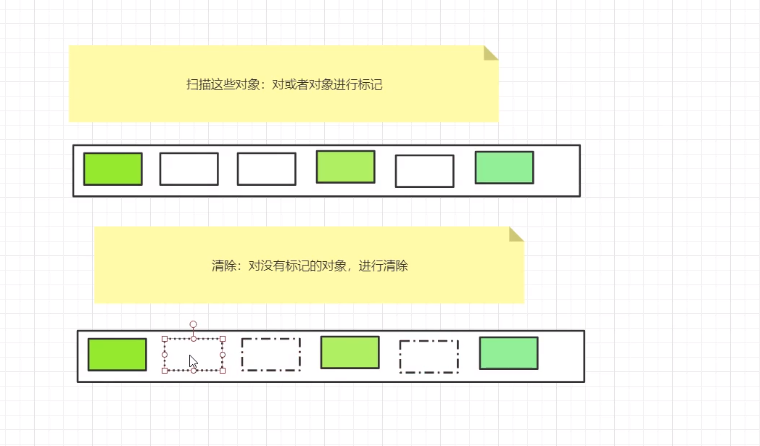
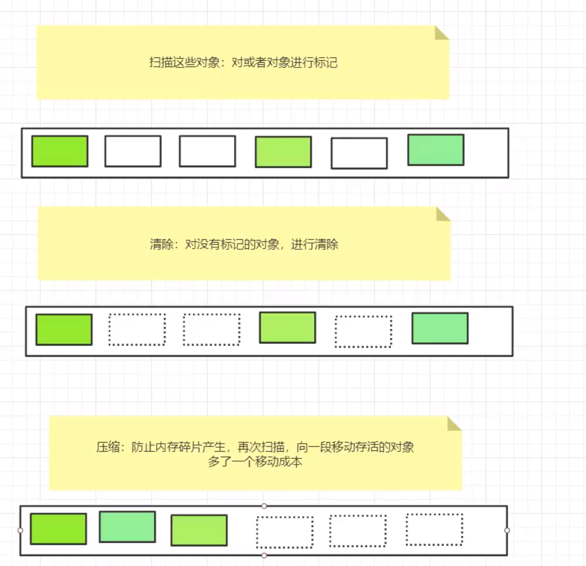
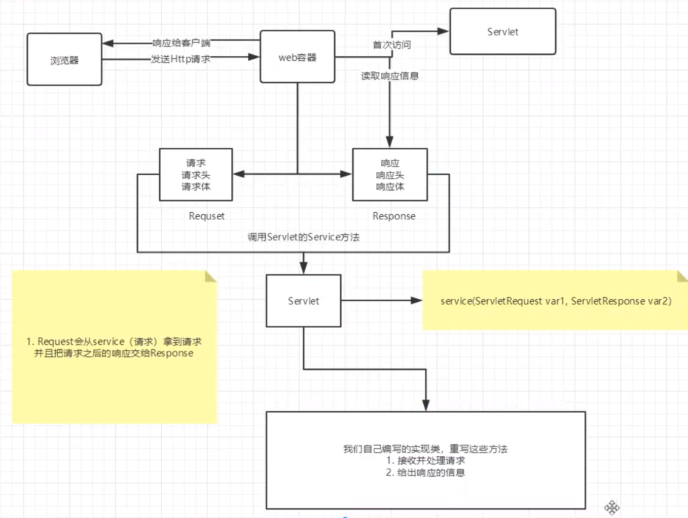

```bash
# 查看当前目录下的所有文件 dir
# 清屏cls
# 切换目录 cd
# 退出终端 exit
# 查看电脑的ip ipconfig
# 跳转到其他盘 cd \d  
# 文件操作
 md 目录名
 rd 目录名
 cd> 文件名
 del 文件名
```

## JAVA基础

### 1. 面向对象思想

* 面向对象是从宏观上，从整体上进行把握；
* 面向过程是面向对象的具体实现
* 以类的方式组织代码，以对象的组织（封装）数据
* 从认识论的角度是先有对象后有类
* 从编码角度是先有类后有对象，以类为模板创建对象

### 2. 可变参数

* 只能放在最后面

### 3. 对象创建

* 不写构造器，会有一个默认的无参构造器 

* 创建对象时除了分配空间还好进行默认的初始化

### 4. 内存分析

* 方法

  调用时放入栈中

* 创建对象

### 5. this、super



### 6. static

* 静态代码块 类加载的时候初始化一次
* 代码块 初始化的时候加载一次，在构造方法之前

### 7. 多态的条件

* 继承
* 重写
* 父类引用指向子类应用

### 8. instance关键字

​	x instance Y

* 判断是否父子关系
* x对象，Y是一个父类Class类型

### 9.内部类

* 成员内部类
* 静态内部类
* 局部内部类
* 匿名内部类


### 10.注解

* 元注解

  注解其他注解的注解

  * @Target
  * @Retention
  * @Documented
  * @Inherited

* 自定义注解

  * @Target用在什么地方
  * @Retention触发时刻
  * 参数

### 11.反射

* 通过反射可以获取类的任何信息
* 一个类只有一个class
* 获取class的三种方法
  * 对象.Class
  * 类.class
  * class.formName
  * 基本类型，包装类.TYPE


## JVM入门

### 1. JVM的体系结构

运行在操作系统之上的程序

* 那里没有垃圾

  栈、本地方法栈、程序计数器

* jvm调优

  在调堆以及方法区

### 2. 类加载器以及双亲委派机制

作用：加载class文件

1. 虚拟机自带的加载器
2. 启动类（root）加载器
3. 扩展类加载器
4. 应用程序（系统）加载器

双亲委派机制

1. App->EXC->BOOt（最终）
2. 

### 3.  沙箱安全机制

java安全模型的核心就是java沙箱

**组成部分**

* 字节码校验器

### 4. native、方法区

本地方法栈 ,java的作用域达不到了，获取调用底层c语言的库

* 进入本地方法栈

* 调用本地方法接口JNI

* JNI作用：扩展java的室友，融合不同的编程语言为java所有

* 在内存区域中专门开辟了一块标记区域，：NAtive method strack，登记native方法

* 最终执行的时候，加载本地方法库中的方法通过JNI

  ***

  方法区

* 被所有线程共享

* 静态变量、常量、类信息（构造方法、接口定义）、运行时的常量池存在方法区中，但是实例变量存在堆内存中，和方法无关

* static class 常量

### 5.  栈

栈：喝多了吐，栈内存，主管程序的运行，生命周期和线程同步；线程结束，栈内存也就释放了；不存在垃圾回收，一旦线程结束，栈就Over

栈：8大基本类型+对象引用+实例的方法

队：吃多了拉

栈运行原理：栈帧

### 6. HotSpot和堆

**新生区**

* 类：诞生和成长的地方，甚至是死亡

* 伊甸园（所以对象是在伊甸园去new出来的）

* 辛存区（0,1）from  to

  谁空谁是to

* 轻GC，重GC

**养老区**

* 

**真理**：经过研究，99%的对象都是临时对象

**永久区**

这个区域常驻内存，用来存放jdk自身携带的clas对象、interfatc元数据存储的是java运行时的一些环境或类信息，这个取悦不存在垃圾回收！关闭JVM就会释放这个区域的内存

一个启动类，加载了大量的第三方jar，tomcat部署了太多的应用，大量动态生成的反射类，不断的被加载，直到内存慢就会出现oom

* 1.6永久代，常量在方法区
* 1.7，永久代，但是慢慢退化了，`去永久代`，常量池在堆中
* 1.8之后，无永久代，常量池在元空间

### 7.  使用JPofilter工具分析OOM原因

项目出现OOM故障，如何排除-研究为什么出错

* 能够看到代码第几行出错：内存快照分析共苦MAT，Jprofiler

* vm options

  * 报错导出文件

    ​         Xms1m -Xmx8m -XX:+HeapDumpOnOutofMemoryError

  * 设置初始化内存分配大小

    -Xms

  * 设置最大分配内存

    -Xms

  * 打印详细信息

    -XX:+PrintGCDetails


### 8. GC介绍之引用计数法

* 轻GC

* 重GC

* JVM的内存模型和分区-详细到每个区放什么？

* 堆里面的分区有哪些？Eden，from，to 老年区，说说他们的特点

* GC的算法有哪些？标记清楚法，标记压缩，引用计数器，怎么用？

  本身也会有消耗

* 轻GC和重GC

### 9. GC之复制算法



* 好处：没有内存的碎片
* 坏处：浪费了内存空间

### 10. 标记清除压缩算法

**标记清楚**



* 优点

  不需要额外空间

* 缺点

  两次扫描，严重浪费时间，会产生内存碎片

  **标记清楚压缩**

  

  

  ### 11.垃圾回收算法总结、

  * 内存效率：复制》标记清楚》标记压缩
  * 内存整齐度：复制算法=标记压缩算法》标记清楚算法
  * 内存利用率：标记压缩算法=标记清楚算法》辅助算法

  难道没有最优算法？

  ​	没有，没有最好的算法，只有最合适的算法--》GC：分代收集算法

  **年轻代：**

  * 存活率低
  * 复制算法

  **老年代**

  * 区域大：存活率低
  * 标记清楚（内存碎片不是太多）+标记压缩混合实现

  ### 12JMM

  1. 什么是jmm
  2. 它干嘛的？
  3. 它该如何学习

## ES6

### 1.数据类型

```
var arr= [1，2,3]；
```

1. 长度

   arr.length

2. indexOf

   获取下标

3. slice

   截取数组的一部分，类似subString

4. push，pop尾部

   ```js
   push：压入到尾部
   pop：弹出尾部的一个元素
   ```

5. unshift，shift头部

   ```
   unshift：压入头部
   shift：弹出头部的一个元素
   ```

6. sort

   排序

7. 元素翻转reverse

8. concat，

### 2.对象

若干个键值对

```js
var 对象名 ={
属性名：属性值，
属性名：属性值，
属性名：属性值

}
```

1. 对象赋值

   对象.属性 = 值

2. 动态的删减属性

   delete 对象.属性

3. 动态添加属性

   对象.属性=值
   
4. 使用一个不存在的属性会报undefined

5. 判断属性值是否在这个对象中xxx in xxx

6. 判断一个属性是否是这个对象自身拥有的hasOwnProperty

### 3.流程控制

for


forEach


for in

```js
// 遍历map
var map = new Map（）；
for (let x of map) {

}
// 遍历for
var set = new Set（）；
for(let x of set){

}
```


### 4.Map和Set

Map

```js
var map = newMap([["tom","aa"],["ss","sa"],["c","s"]])
map.get("tom");
```

Set

无序不重复

### 5.变量的作用域

```
全局变量都是在windows上绑定着

吧自己的代码全部放入自己定义的唯一空间名字中，降低全局命名冲突问题
```

### 6.Class继承

```
class Student{
constract（name）{
	this.name=name；
}
}
class puil extends Student{
	constractor(name,grade){
		super(name)
		this.grade = grade
	}
}

```

### 7.操作dom对象

1. window代表浏览器窗口
2. Navigator，封装了浏览器的信息
3. screen代表屏幕尺寸
4. location代表页面URL信息
5. document代表当前的页面，HTML DOM文档树
6. history 不建议使用

## JavaWeb

### 1. web服务器

接收请求、返回响应

服务器是一种被动的操作，用来处理用户请求和给用户一些响应信息

### 2.Tomcat

### 3.Http

1. http（超文本传输协议）是一个简单的请求协议，通常运行在TCP之上
2. 两个时代
   * http/1.0：客户端与web服务器连接后，只能获得一个web资源
   * http/2.0客户端与web服务器连接后，可以会的对个web资源
3. http请求
4. http响应

### 4.Maven

Maven·的核心思想：**约定大于配置**

### 5.Servlet原理




请求路径：固定的优先级最高

### 6.cookie

### 7.Session

什么是session

* 服务器给每一个用户（浏览器）创建一个Session
* 一个Session独占一个浏览器，只要浏览器没有关闭，这个Session就存在
* 用户登录之后，整个网站它都可以访问

**Session与cookie的区别**

* cookie是吧用户的数据写给用户的浏览器，浏览器保存（可以保存多个）

* session 把用户的数据写到用户独占session中，服务端保存（保存重要信息，减少服务器资源浪费）

* session对象由服务器创建

  使用场景

  * 保存一个登陆用户信息
  * 购物车信息
  * 整个网站中经常使用的数据

### 9.过滤器

过滤网站数据

* 处理中文乱码
* 登陆请求

### 10. 监听器


​      


