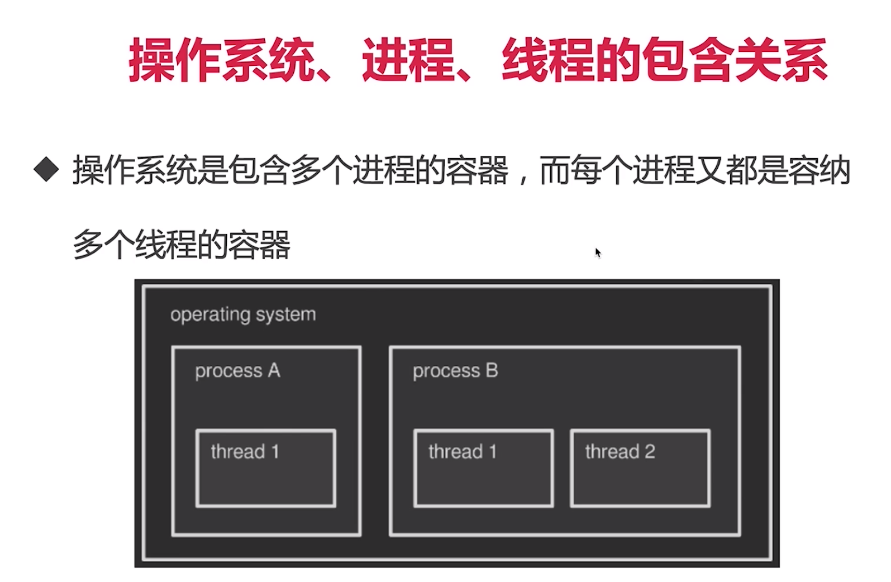
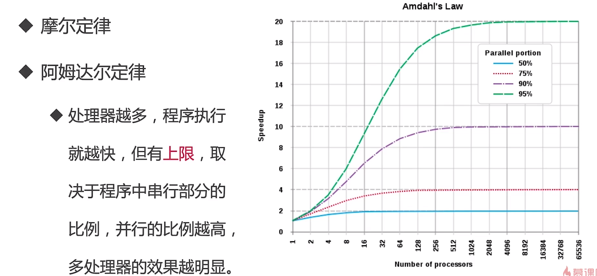
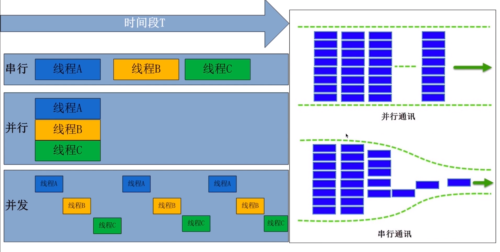
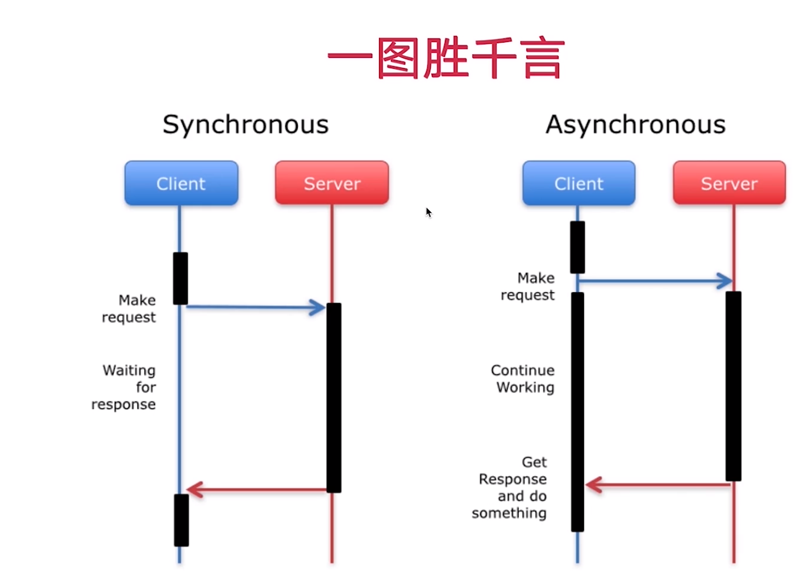
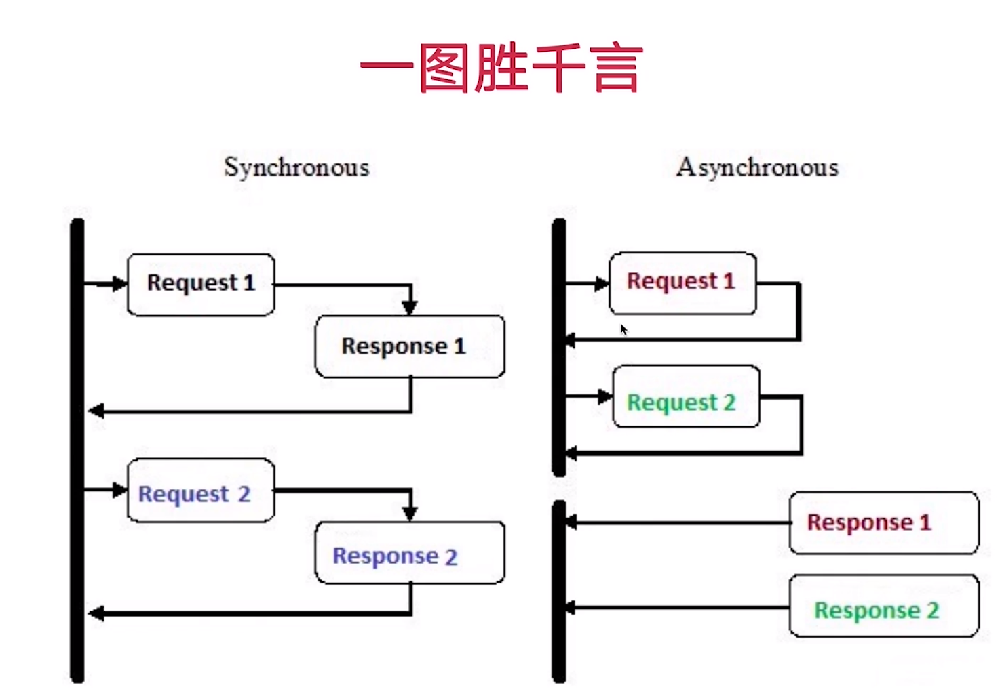
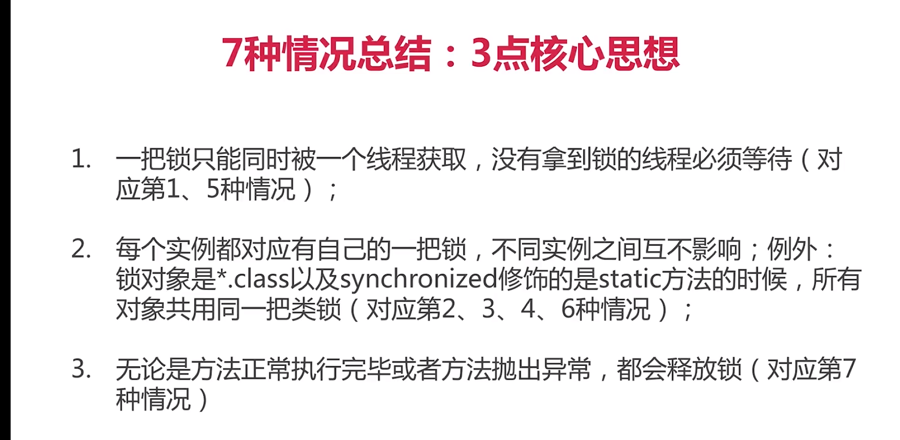

## 什么是线程

## 进程和线程的不同

* 起源不同

  cpu的处理速度比外设快，为了提高cpu的执行速度

  先有进程后有线程，为了提高cpu利用率。

* 概念不同

  进程是程序运行起来的独立活动，是一个实例，是系统分配资源和调度资源独立单位，线程是cpu调度的独立单位

* 内存共享方式

  进程共享很难，需要一些特殊处理

* 拥有资源不同

  * 共享内容包括
    * 进程代码
    * 进程的公园数据
    * 打开的文件描述符
    * 信号处理器
    * 进程的当前目录
    * 用户ID与进程组ID
  * 线程独有的
    * 线程id
    * 寄存器组的值
    * 线程的堆栈
    * 错误返回码
    * 线程的信号屏蔽码

* 数量不同

* 开销不同

  * 线程的创建、终止时间比进程短
  * 同一进程内的线程切换时间比进程切换短
  * 同一进程的各个线程间共享内存和文件资源，可以不通过内核进行通信

### 相同

在状态上非常相似的

# 多线程

## java语言和多线程的渊源和关系

* java设计之初----支持多线程
* 在后端的定位----长居前三
* 一对一映射到操作系统的内核线程
* jvm自动启动线程
  * SignalDispatch 操作系统发来的信号分发给适当的处理程序
  * Finalizer 负责对象的finalize（）方法
  * Reference Handle 和GC引用相关的线程
  * main 主线程，用户程序的入口

##  什么是多线程

多线程实例：抢火车

资源共享的任务
## 为什么需要多线程

* 便于编建模

* 计算机定律：阿姆达尔定律

  

* 那些场景会用到

  * 什么时候需要新开线程
    * 同事做多件不同的事
    * 为了提高工作效率、处理能力
    * 需要同时有很大并发量的时候

* 局限

  * 性能问题：上下文切换带来的消耗
  * 异构化任务（任务结构不一样）
  * 线程安全：死锁、线程饥饿

  

## 串行、并性、并发

* 串行和并行

  

* 并发和并行

  * 并发
  	
  	
  	
  	
  	
  * 并行 

    

* 是什么让并发和并行成为可能

  * cpu升级
  * 操作系统升级
  * 编程语言升级

  ## 高并发

  ## 什么是高并发

  ## 高并发和多线程的联系和不同
	 	一种解决方案

  ## 高并发有哪些指标

  

并发连接数

服务器平均请求等待时间

同步阻塞

同步非阻塞

异步阻塞

异步非阻塞

[知识图谱](http://naotu.baidu.com/file/b8a70ff9e7f3af1437594b2d0fb4ebfd?token=11150672c00909cb)

## Synchronized

* 对象锁
  * 方法锁 默认锁对象为this当前实例对象
  * 同步代码块锁 自己制定锁对象
  
* 类锁
  
  本质上类锁不过是Class对象的锁而已
  
  * 由synchronized修飾的静态方法
  
    类似全局锁
  
  * 指定锁为class的class对象

## 多线程访问同步方法的七种情况

* 两个线程同时访问一个对象的同步方法

  干扰，相互干扰

* 两个线程访问的是两个对象的同步方法

  不干扰

* 两个线程访问的是synchronized的静态方法

  干扰

* 同时访问同步方法与非同步方法

  非同步方法不受影响

* 访问同一个对象的不同普通同步方法

  同一个对象，同一个锁，同步

* 同时访问静态synchronized和非静态synchronized方法

  不会  一个是this 一个是class

* 方法跑出异常后，会释放锁

  lock（不会） synchroized（会释放）

## synchronized性质

* 可重入（递归锁）

  同一线程的外层函数获取锁之后，内层函数可以直接再次获取该锁

  避免死锁、提升封装性

  粒度：线程而非粒度

  * 同一个方法是可重入
  * 不要求同一个方法
  * 不要求同一个类

* 不可中断

* 缺陷

  

  效率低：锁的释放情况少、试图获得锁时不能设定超时、不能中断一个正在试图获得锁的线程

  不够灵活：加锁和释放的时机单一，每个锁仅有单一的条件

  无法知道是否成功获取到锁

## 原理
* 枷锁和释放锁的原理： 现象、时机、深入jvm看字节码

  内置锁

* 可重入原理：加锁次数计时器

* 保证可见性原理：内存模型

## 常见面试题

1. 锁不能为空、作用域不易过大。避免死锁
2. 如何选择lock与synchronized
   * 尽量使用juc
   * 尽量使用sychronized，可以少编写代码

## 思考题

* 

## 线程8大核心基础知识

* 基础知识的重要性

  * 

* 纵览全貌-思维导图

* 知识架构

  * 实现多线程的方式

    * 实现Runnable（更好）

      

    * 继承Thread类

      缺点

      * 不解耦
      * 只能新建独立线程（耗费性能）
      * 限制可扩展性

    * 本质

      * 方法一：最终调用target.run
        * 使用的是thread类的run方法
  * 方法二：run整个被重写
        * 使用的是我们重写后的run方法

    * 同时使用两种方法会怎样

      执行thread

    * 面试
    
  * oracle说的有两种
      * 准确的说创建线程只有一种方式就是构造Threa类，而实现线程的执行单元有两种

    * 错误观点
    
  * 线程池属于创建线程的一种方式
    
      * 无返回值是runnabel
  * 
  
* 学习编程的优质路径
  
  * 宏观上
  
        * 并不是靠工作年限，有的人工作了五年技术却还是只懂皮毛
        * 要有强大的责任心，不放过任务bug，找到原因并去解决
    * 主动：永远不会觉得自己的时间多于，重构、优化、学习、总结
      
        * 敢于承担：虽然这个技术没碰到过，但是移动的调研后，敢于承担技术难题
    * 关心产品，关系业务
    
      * 微观上
      
        * 看经典书籍（比如java并发编程实战、自顶向下计算机网络）
        * 看官方文档
    * 英文google和stackoverflow
      
        * 自己动手写，实践写demo尝试用到项目里
    * 不理解的参考领域的多个书本，综合判断
  
      * 如何了解技术领域的最新动态
  
        * 高质量固定途径 掘金
    * 订阅技术论坛 infoq
    
  * 如何在业务开发中成长
    
        * 偏业务方向
    
      * 核心模型
          * 复杂的业务抽象化
      * 进行思考，业务扩展等
    
        * 偏技术方法
    
        * 两个25%

 * 启动线程的正确和错误方式

   * start和run的比较

     run是在主线程中而不是新建一个线程

   * start方法原理

     * 含义

       启动新线程（由主线程或父线程调用之后才创建新的线程）

       start的准备工作

       1. 就绪准备（获取了除cpu以外的其他资源）
2. 等待获取cpu资源
       3. 不能重复调用start方法，否则会报错

     * 源码解析

       1. 启动线程检查线程状态

       2. 加入线程组

       3. 调用start0（本地方法）

     * 深入JDK源码

   * run方法原理

     * 实现runable
  * 重写run方法      
   
  * 停止线程的方法

  * 原因
    * 使用interrupt来通知，而不是强制
  * 如何正确停止
    * 通常线程会在什么情况下停止
      * run方法正常结束
      * 出现异常未捕获
    * 正确的停止方法：interrupt
      * 通常线程会在什么情况下停止普通情况
      * 线程可能被阻塞
      * 如果线程在每次迭代后都阻塞
      * 实际开发中的两种最佳实践
        * 优先选择：传递中断
        * 不想或无法传递：恢复中断
        * 不赢屏蔽中断
        * 
    * 正确停止带来的好处
  * 错误方法
  * 重要函数解析
  * 常见面试问题

  * 线程的6个状态

  * 面试题
    * 一个线程两次调用start方法会出现什么情况？为什么？
    * 既然·start方法会调用run方法，为什么我们选择调用start方法，而不是调用run方法？

  * Thread和Object和线程相关的方法

  * 线程各属性

  * 线程的未铺货异常UncaughtException应该如何处理

  * 线程是把双刃剑：多线程会导致性能问题（线程引入的开销、上线文切换）

  * 常见面试题

* 

# 线程的一生

* 6中状态

  * new
    * 已创建但是未运行
  * runnable
    * ready
    * running
    * 被拿走，也是这个状态
  * blocked
    * 被sychronized修饰时才会走到blocked
  * waitting
    * 
  * timed waitting
  * terminated

* 每个状态是什么含义

  

* 阻塞状态是什么

* 常见面试问题

# 中流砥柱 -7个重要方法 

1. 为什么线程通信的方法wait，notify和notifyAll被定义在Object，sleep定义在Thread类里

   

2. 用3种方式实现生产者模式

3. javase8，java1.8和jdk8是什么关系，是同一个东西吗

4. join和sleep和wait期间线程的状态分别是什么？为什么？

   * wait， notify，notifyAll

     wait释放了锁

     只释放当前monitor

     * 阻塞阶段
       * 另外一个线程调用
       * 
     * 唤醒阶段
     * 遇到中断

# 线程的重要属性

* 什么时候需要设置守护线程
* 线程各属性
  * 线程ID
  * 名称
  * 守护线程
  * 优先级

