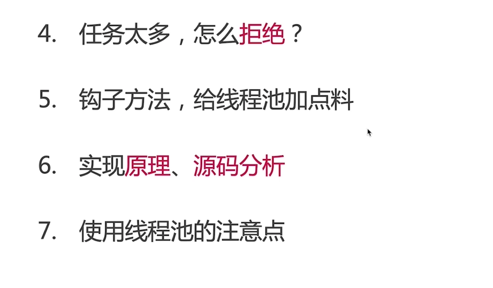
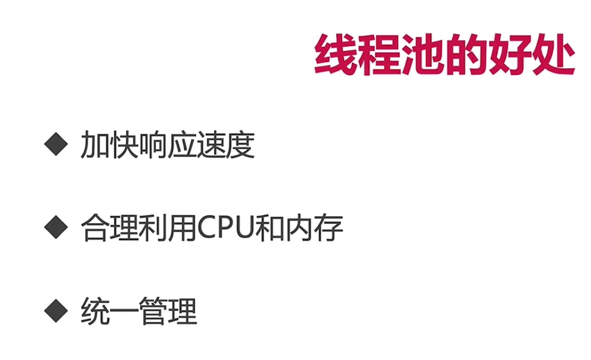
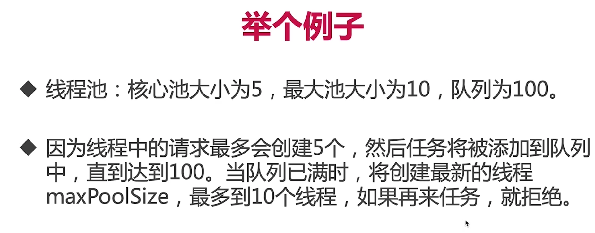
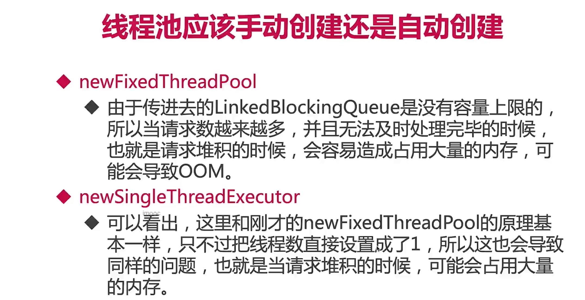
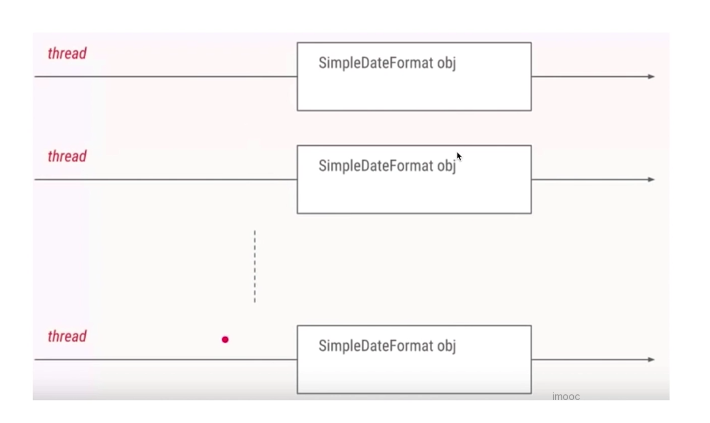
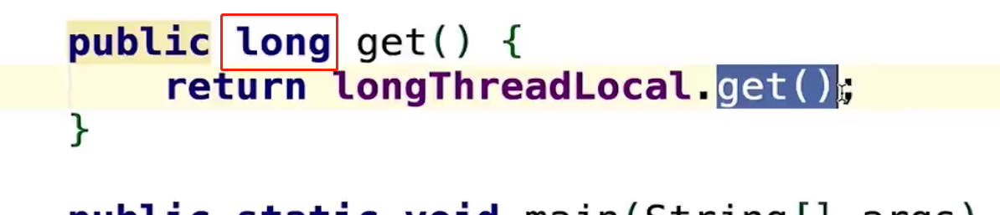
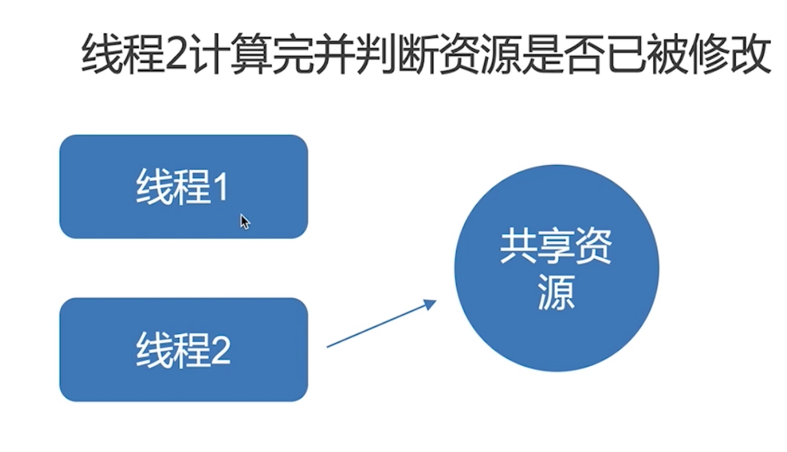
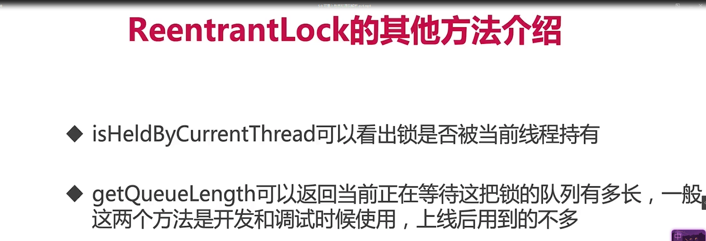
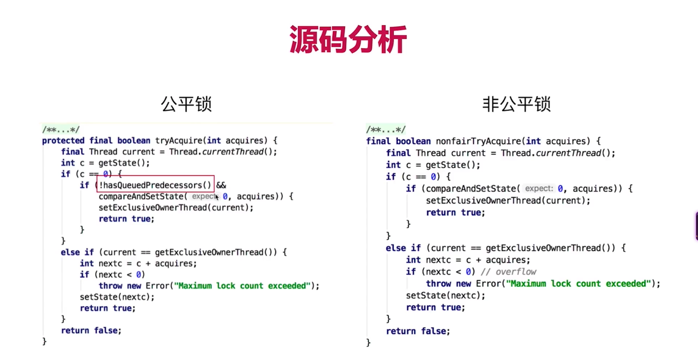

## 第1章 开宗明义【告诉你：学什么+收获什么】

  相信很多小伙伴学习过悟空第一门并发基础课，是不是觉得不过瘾？因此我们盛情邀请实力人气新生代讲师：悟空大佬二度出山，带你深入并发，带你并发领域升级打怪，本章告诉你本课程学什么，你将收获什么~期待小伙伴在并发领域：百尺竿头，更进一步~~...

### 1-1 Java并发成神之路——精通JUC并发工具十八般武艺**试看**


  ## 第2章 鸟瞰Java并发【上帝视角建立并发知识框架】

  要想达到线程安全，有多种方法，本章将从如何解决线程安全问题说起，引出可以解决安全问题的3大类手段，并逐一详细展开。

### 2-1 并发工具类纵览——建立起Java并发体系的大厦


[互斥同步与非互斥同步](https://blog.csdn.net/truelove12358/article/details/54963791)

互斥是方法，同步是目的

互斥同步-》堵塞-》悲观锁

非互斥同步-》非堵塞-》乐观锁

### 2-2 课程各章节思维导图汇总

[思维导图](https://naotu.baidu.com/file/89fb28b05e3395800f9dc2d332d2b198?token=9b45e08e55281667)

  ## 第3章 线程池【治理线程的最大法宝】

  线程池是非常重要的工具，如果你要成为一个好的工程师，还是得比较好地掌握这个知识，很多线上问题都是因为没有用好线程池导致的。即使你为了谋生，也要知道，这基本上是面试必问的题目，而且面试官很容易从被面试者的回答中捕捉到被面试者的技术水平。...

### 3-1 线程池的自我介绍




* 线程池的重要性

* 什么是“池”

  * 软件中的“池”，可以理解为计划经济

* 线程池的好处

  * 复用线程池
  * 控制开销

* 不使用线程池，每个任务都新开一个线程处理

  * 一个线
  * for循环创建线程
  * 当任务上升到1000
  * 这样开销太大，如果有固定数量的线程来执行这1000个线程，就避免了反复创建并销毁线程所带来的开销问题

  




### 3-2 增减线程的时机





### 3-3 keepAliveTime和线程工厂

* keepAliveTime

  * 如果线程池当前的线程数多于corePoolSize，那么如果多于的线程空闲时间超过keepAliveTime，他们就会被终止

* ThreadFactory用来创建线程

  通常用默认的就够了

  


### 3-4 演示内存溢出的情况

```java

package com.juc.juc.threadlocal.threadpool;

import java.util.concurrent.ExecutorService;
import java.util.concurrent.Executors;

/**
 * @Classname FixedThreadPoolTest
 * @Description TODO
 * @Date 2020/5/16 11:20
 * @Created by  wrsChen
 */
public class FixedThreadPoolTest {
    public static void main(String[] args) {
       ExecutorService executorService = Executors.newFixedThreadPool(4);
        for (int i =0; i<1000; i++) {
            executorService.execute(new Task());
        }
    }
}

class Task implements Runnable{

    @Override
    public void run() {
        try {
            Thread.sleep(500);
        } catch (InterruptedException e) {
            e.printStackTrace();
        }
        System.out.println(Thread.currentThread().getName());
    }
}
```

```java
/**
 * 描述：     演示newFixedThreadPool出错的情况
 */
public class FixedThreadPoolOOM {

    private static ExecutorService executorService = Executors.newFixedThreadPool(1);
    public static void main(String[] args) {
        for (int i = 0; i < Integer.MAX_VALUE; i++) {
            executorService.execute(new SubThread());
        }
    }

}

class SubThread implements Runnable {


    @Override
    public void run() {
        try {
            Thread.sleep(1000000000);
        } catch (InterruptedException e) {
            e.printStackTrace();
        }
    }
}

```


### 3-5 线程池用法演示



* newCachedThread
  * 可缓存线程池
  * 特点：无界线程池，具有自动回收对于线程的功能


* newSchedulepool


### 3-6 对比线程池的特点

* 常见线程池的特点

  * FixedThreadPool

    

  * CachedThreadPool

    * 可缓存线程池
    * 特点：具有自动回收多于线程的功能

    

  * ScheduleThreadPool

    * 支持定时及周期性任务执行的线程池

  * SingleThreadExecutor

    * 单线程的线程池：它只会用唯一的工作线程来执行任务
    * 它的原理和FixedThreadPool是一样的，但是此时的线程数量被设置为了1

    

    

    

### 3-7 五虎上将收服线程池

停止线程池的正确方法

* shutdown

  * 存量任务执行完成之后，后续任务将不会再执行

    ```java
    package threadpool;
    
    import java.util.List;
    import java.util.concurrent.ExecutorService;
    import java.util.concurrent.Executors;
    import java.util.concurrent.TimeUnit;
    
    /**
     * 描述：     演示关闭线程池
     */
    public class ShutDown {
    
        public static void main(String[] args) throws InterruptedException {
            ExecutorService executorService = Executors.newFixedThreadPool(10);
            for (int i = 0; i < 100; i++) {
                executorService.execute(new ShutDownTask());
            }
            Thread.sleep(1500);
    //        List<Runnable> runnableList = executorService.shutdownNow();
    
            executorService.shutdown();
            executorService.execute(new ShutDownTask());
    //        boolean b = executorService.awaitTermination(7L, TimeUnit.SECONDS);
    //        System.out.println(b);
    //        System.out.println(executorService.isShutdown());
    //        executorService.shutdown();
    //        System.out.println(executorService.isShutdown());
    //        System.out.println(executorService.isTerminated());
    //        Thread.sleep(10000);
    //        System.out.println(executorService.isTerminated());
    
    //        executorService.execute(new ShutDownTask());
        }
    }
    
    class ShutDownTask implements Runnable {
    
    
        @Override
        public void run() {
            try {
                Thread.sleep(500);
                System.out.println(Thread.currentThread().getName());
            } catch (InterruptedException e) {
                System.out.println(Thread.currentThread().getName() + "被中断了");
            }
        }
    }
    
    ```

* isShutdowm

  * 是不是开始停止了

* isTerminated

  * 完全停止

* awaitTerminated

  * 检测

* shutdowmNow

  * 威力最大

### 3-8 钩子：给线程池加点料


```java
package threadpool;

import java.util.concurrent.BlockingQueue;
import java.util.concurrent.LinkedBlockingQueue;
import java.util.concurrent.RejectedExecutionHandler;
import java.util.concurrent.ThreadFactory;
import java.util.concurrent.ThreadPoolExecutor;
import java.util.concurrent.TimeUnit;
import java.util.concurrent.locks.Condition;
import java.util.concurrent.locks.ReentrantLock;

/**
 * 描述：     演示每个任务执行前后放钩子函数
 */
public class PauseableThreadPool extends ThreadPoolExecutor {

    private final ReentrantLock lock = new ReentrantLock();
    private Condition unpaused = lock.newCondition();
    private boolean isPaused;


    public PauseableThreadPool(int corePoolSize, int maximumPoolSize, long keepAliveTime,
            TimeUnit unit,
            BlockingQueue<Runnable> workQueue) {
        super(corePoolSize, maximumPoolSize, keepAliveTime, unit, workQueue);
    }

    public PauseableThreadPool(int corePoolSize, int maximumPoolSize, long keepAliveTime,
            TimeUnit unit, BlockingQueue<Runnable> workQueue,
            ThreadFactory threadFactory) {
        super(corePoolSize, maximumPoolSize, keepAliveTime, unit, workQueue, threadFactory);
    }

    public PauseableThreadPool(int corePoolSize, int maximumPoolSize, long keepAliveTime,
            TimeUnit unit, BlockingQueue<Runnable> workQueue,
            RejectedExecutionHandler handler) {
        super(corePoolSize, maximumPoolSize, keepAliveTime, unit, workQueue, handler);
    }

    public PauseableThreadPool(int corePoolSize, int maximumPoolSize, long keepAliveTime,
            TimeUnit unit, BlockingQueue<Runnable> workQueue,
            ThreadFactory threadFactory, RejectedExecutionHandler handler) {
        super(corePoolSize, maximumPoolSize, keepAliveTime, unit, workQueue, threadFactory,
                handler);
    }

    @Override
    protected void beforeExecute(Thread t, Runnable r) {
        super.beforeExecute(t, r);
        lock.lock();
        try {
            while (isPaused) {
                unpaused.await();
            }
        } catch (InterruptedException e) {
            e.printStackTrace();
        } finally {
            lock.unlock();
        }
    }

    private void pause() {
        lock.lock();
        try {
            isPaused = true;
        } finally {
            lock.unlock();
        }
    }

    public void resume() {
        lock.lock();
        try {
            isPaused = false;
            unpaused.signalAll();
        } finally {
            lock.unlock();
        }
    }

    public static void main(String[] args) throws InterruptedException {
        PauseableThreadPool pauseableThreadPool = new PauseableThreadPool(10, 20, 10l,
                TimeUnit.SECONDS, new LinkedBlockingQueue<>());
        Runnable runnable = new Runnable() {
            @Override
            public void run() {
                System.out.println("我被执行");
                try {
                    Thread.sleep(10);
                } catch (InterruptedException e) {
                    e.printStackTrace();
                }
            }
        };
        for (int i = 0; i < 10000; i++) {
            pauseableThreadPool.execute(runnable);
        }
        Thread.sleep(1500);
        pauseableThreadPool.pause();
        System.out.println("线程池被暂停了");
        Thread.sleep(1500);
        pauseableThreadPool.resume();
        System.out.println("线程池被恢复了");

    }
}

```


### 3-9 Executor家族的辨析


* Excutor家族
  * Excetor
  * ExecutorService
  * Excetors
* 线程复用
  * runWorker

### 3-10 线程池状态和使用注意点


  ## 第4章 ThreadLocal【一次解决老大难问题】

  ThreadLocal是面试常客，同时也是工作中非常常用的工具，可以给我们开发提供很多便利。本章将对它做出详细解读。

### 4-1 ThreadLocal的两种用法


### 4-2 进化之路：故事从两个线程说起


```java
package com.juc.juc.threadlocal.threadlocal;

import java.text.SimpleDateFormat;
import java.util.Date;

/**
 * @Classname ThreadLocalNormalUsage00
 * @Description TODO
 * @Date 2020/5/16 18:42
 * @Created by  wrsChen
 */
public class ThreadLocalNormalUsage00 {
    public static void main(String[] args) {
        new Thread(new Runnable() {
            @Override
            public void run() {
            String date = new ThreadLocalNormalUsage00().date(10);
                System.out.println(date);
            }
        }).start();
        new Thread(new Runnable() {
            @Override
            public void run() {
                String date = new ThreadLocalNormalUsage00().date(1007);
                System.out.println(date);
            }
        }).start();
    }
    public String date(int seconds) {
        Date date = new Date(1000*seconds);
        SimpleDateFormat simpleDateFormat = new SimpleDateFormat("yyyy-MM-dd hh:mm:ss" );
        return simpleDateFormat.format(date);
    }
}

```

### 4-3 进化之路：线程池来帮忙，却好心办坏事



```java
package threadlocal;

import java.text.SimpleDateFormat;
import java.util.Date;

/**
 * 描述：     10个线程打印日期
 */
public class ThreadLocalNormalUsage01 {

    public static void main(String[] args) throws InterruptedException {
        for (int i = 0; i < 30; i++) {
            int finalI = i;
            new Thread(new Runnable() {
                @Override
                public void run() {
                    String date = new ThreadLocalNormalUsage01().date(finalI);
                    System.out.println(date);
                }
            }).start();
            Thread.sleep(100);
        }

    }

    public String date(int seconds) {
        //参数的单位是毫秒，从1970.1.1 00:00:00 GMT计时
        Date date = new Date(1000 * seconds);
        SimpleDateFormat dateFormat = new SimpleDateFormat("yyyy-MM-dd HH:mm:ss");
        return dateFormat.format(date);
    }
}

```


```java
package threadlocal;

import java.text.SimpleDateFormat;
import java.util.Date;
import java.util.concurrent.Executor;
import java.util.concurrent.ExecutorService;
import java.util.concurrent.Executors;

/**
 * 描述：     1000个打印日期的任务，用线程池来执行
 */
public class ThreadLocalNormalUsage02 {

    public static ExecutorService threadPool = Executors.newFixedThreadPool(10);

    public static void main(String[] args) throws InterruptedException {
        for (int i = 0; i < 1000; i++) {
            int finalI = i;
            threadPool.submit(new Runnable() {
                @Override
                public void run() {
                    String date = new ThreadLocalNormalUsage02().date(finalI);
                    System.out.println(date);
                }
            });
        }
        threadPool.shutdown();
    }

    public String date(int seconds) {
        //参数的单位是毫秒，从1970.1.1 00:00:00 GMT计时
        Date date = new Date(1000 * seconds);
        SimpleDateFormat dateFormat = new SimpleDateFormat("yyyy-MM-dd HH:mm:ss");
        return dateFormat.format(date);
    }
}

```


```java
/**
 * 描述：     1000个打印日期的任务，用线程池来执行，出现线程安全问题
 */
public class ThreadLocalNormalUsage03 {

    public static ExecutorService threadPool = Executors.newFixedThreadPool(10);
    static SimpleDateFormat dateFormat = new SimpleDateFormat("yyyy-MM-dd HH:mm:ss");

    public static void main(String[] args) throws InterruptedException {
        for (int i = 0; i < 1000; i++) {
            int finalI = i;
            threadPool.submit(new Runnable() {
                @Override
                public void run() {
                    String date = new ThreadLocalNormalUsage03().date(finalI);
                    System.out.println(date);
                }
            });
        }
        threadPool.shutdown();
    }

    public String date(int seconds) {
        //参数的单位是毫秒，从1970.1.1 00:00:00 GMT计时
        Date date = new Date(1000 * seconds);
        return dateFormat.format(date);
    }
}
```

### 4-4 走过的弯路，你的套路

```java
/**
 * 描述：     加锁来解决线程安全问题
 */
public class ThreadLocalNormalUsage04 {

    public static ExecutorService threadPool = Executors.newFixedThreadPool(10);
    static SimpleDateFormat dateFormat = new SimpleDateFormat("yyyy-MM-dd HH:mm:ss");

    public static void main(String[] args) throws InterruptedException {
        for (int i = 0; i < 1000; i++) {
            int finalI = i;
            threadPool.submit(new Runnable() {
                @Override
                public void run() {
                    String date = new ThreadLocalNormalUsage04().date(finalI);
                    System.out.println(date);
                }
            });
        }
        threadPool.shutdown();
    }

    public String date(int seconds) {
        //参数的单位是毫秒，从1970.1.1 00:00:00 GMT计时
        Date date = new Date(1000 * seconds);
        String s = null;
        synchronized (ThreadLocalNormalUsage04.class) {
            s = dateFormat.format(date);
        }
        return s;
    }
}

```


### 4-5 ThreadLocal是救火队长

* 解决性能问题


```java
import java.text.SimpleDateFormat;
import java.util.Date;
import java.util.concurrent.ExecutorService;
import java.util.concurrent.Executors;

/**
 * 描述：     利用ThreadLocal，给每个线程分配自己的dateFormat对象，保证了线程安全，高效利用内存
 */
public class ThreadLocalNormalUsage05 {

    public static ExecutorService threadPool = Executors.newFixedThreadPool(10);

    public static void main(String[] args) throws InterruptedException {
        for (int i = 0; i < 1000; i++) {
            int finalI = i;
            threadPool.submit(new Runnable() {
                @Override
                public void run() {
                    String date = new ThreadLocalNormalUsage05().date(finalI);
                    System.out.println(date);
                }
            });
        }
        threadPool.shutdown();
    }

    public String date(int seconds) {
        //参数的单位是毫秒，从1970.1.1 00:00:00 GMT计时
        Date date = new Date(1000 * seconds);
//        SimpleDateFormat dateFormat = new SimpleDateFormat("yyyy-MM-dd HH:mm:ss");
        SimpleDateFormat dateFormat = ThreadSafeFormatter.dateFormatThreadLocal2.get();
        return dateFormat.format(date);
    }
}

class ThreadSafeFormatter {

    public static ThreadLocal<SimpleDateFormat> dateFormatThreadLocal = new ThreadLocal<SimpleDateFormat>() {
        @Override
        protected SimpleDateFormat initialValue() {
            return new SimpleDateFormat("yyyy-MM-dd HH:mm:ss");
        }
    };

    public static ThreadLocal<SimpleDateFormat> dateFormatThreadLocal2 = ThreadLocal
            .withInitial(() -> new SimpleDateFormat("yyyy-MM-dd HH:mm:ss"));
}
```

### 4-6 悔不当初：回顾进化之路


### 4-7 ThreadLocal的第二种用法 part1


### 4-8 ThreadLocal的第二种用法 part2


```java
package threadlocal;

/**
 * 描述：     演示ThreadLocal用法2：避免传递参数的麻烦
 */
public class ThreadLocalNormalUsage06 {

    public static void main(String[] args) {
        new Service1().process("");

    }
}

class Service1 {

    public void process(String name) {
        User user = new User("超哥");
        UserContextHolder.holder.set(user);
        new Service2().process();
    }
}

class Service2 {

    public void process() {
        User user = UserContextHolder.holder.get();
        ThreadSafeFormatter.dateFormatThreadLocal.get();
        System.out.println("Service2拿到用户名：" + user.name);
        new Service3().process();
    }
}

class Service3 {

    public void process() {
        User user = UserContextHolder.holder.get();
        System.out.println("Service3拿到用户名：" + user.name);
        UserContextHolder.holder.remove();
    }
}

class UserContextHolder {

    public static ThreadLocal<User> holder = new ThreadLocal<>();


}

class User {

    String name;

    public User(String name) {
        this.name = name;
    }
}
```


### 4-9 ThreadLocal的两种用法总结


### 4-10 ThreadLocal的好处

* 达到线程安全
* 不需要加锁，提高效率
* 更高效得利用内存、节省开销：相比于每个任务都新建一个SimpleDateFormat，显然用ThreadLocal可以节省内存和开销
* 免去传参的繁琐：无论是场景一的工具类，还是场景二的用户名，都可以在任何地方直接通过ThreadLocal拿到，再也不需要每次都传递同样的参数。ThreadLocal使得代码耦合度更低，更优雅

### 4-11 ThreadLocal原理


### 4-12 ThreadLocal的重要方法介绍

* T  initialValue()
  * 该方法会返回当前线程对应的“初始值”，这是一个延迟加载的方法，只有在调用get的时候，才会触发。
  * 当线程第一次使用get方法访问变量时，将调用此方法，除非线程先前调用了set方法，在这种情况下，不会为线程调用本initialValue方法·
  * 通常，每个线程最多调用一次此方法，但如果已经调用了remove后，再调用get，则可以再次调用此方法
  * 如果不重写本地方法，这个方法会返回null、一般使用匿名内部类的方法来重写initialValue方法，以便后续使用中可以初始化副本对象
  * 应对了上面那两种方法
* void set（T t）为这个县城设置一个新值
* T get()：得到这个县城对应的value。如果首次调用get()，则会调用initialze来得到这个值
* void remove(): 删除对应这个县城的值

### 4-13 重要方法的源码分析


### 4-14 两种场景，殊途同归


### 4-15 收不回来的value

* 内存泄漏

  


### 4-16 ThreadLocal的空指针异常问题

在做



### 4-17 ThreadLocal在Spring中的应用


* RequestContextHold

## 第5章 不可不说的“锁”事【种类繁多，如何一一突破？】

  各种类型的锁很多，包括悲观锁、乐观锁、共享锁、公平锁、可重入锁、自旋锁等等，乱花渐欲迷人眼，如何拨开迷雾，看透本质？

### 5-1 本章纵览

1. Lock接口
2. 锁的分类
3. 乐观锁和悲观锁
4. 可重入锁和非可重入锁，已ReentrantLock为例（重点）
5. 公平锁和非公平锁
6. 共享锁和排它锁：以ReentrantReadWriteLock读写锁为列（重点）
7. 自旋锁和阻塞锁
8. 可中断锁：冠名思议，就是可以响应中断的锁
9. 锁优化

### 5-2 内置锁的能力不足以满足需求


```java
package lock.lock;

import java.util.concurrent.locks.Lock;
import java.util.concurrent.locks.ReentrantLock;

/**
 * 描述：     Lock不会像synchronized一样，异常的时候自动释放锁，所以最佳实践是，finally中释放锁，以便保证发生异常的时候锁一定被释放
 */
public class MustUnlock {

    private static Lock lock = new ReentrantLock();

    public static void main(String[] args) {
        lock.lock();
        try{
            //获取本锁保护的资源
            System.out.println(Thread.currentThread().getName()+"开始执行任务");
        }finally {
            lock.unlock();
        }
    }
}
```


### 5-3 tryLock尝试获取锁

```java
package lock.lock;

import java.util.Random;
import java.util.concurrent.ThreadPoolExecutor;
import java.util.concurrent.TimeUnit;
import java.util.concurrent.locks.Lock;
import java.util.concurrent.locks.ReentrantLock;

/**
 * 描述：     用tryLock来避免死锁
 */
public class TryLockDeadlock implements Runnable {


    int flag = 1;
    static Lock lock1 = new ReentrantLock();
    static Lock lock2 = new ReentrantLock();

    public static void main(String[] args) {
        TryLockDeadlock r1 = new TryLockDeadlock();
        TryLockDeadlock r2 = new TryLockDeadlock();
        r1.flag = 1;
        r1.flag = 0;
        new Thread(r1).start();
        new Thread(r2).start();

    }

    @Override
    public void run() {
        for (int i = 0; i < 100; i++) {
            if (flag == 1) {
                try {
                    if (lock1.tryLock(800, TimeUnit.MILLISECONDS)) {
                        try {
                            System.out.println("线程1获取到了锁1");
                            Thread.sleep(new Random().nextInt(1000));
                            if (lock2.tryLock(800, TimeUnit.MILLISECONDS)) {
                                try {
                                    System.out.println("线程1获取到了锁2");
                                    System.out.println("线程1成功获取到了两把锁");
                                    break;
                                } finally {
                                    lock2.unlock();
                                }
                            } else {
                                System.out.println("线程1获取锁2失败，已重试");
                            }
                        } finally {
                            lock1.unlock();
                            Thread.sleep(new Random().nextInt(1000));
                        }
                    } else {
                        System.out.println("线程1获取锁1失败，已重试");
                    }
                } catch (InterruptedException e) {
                    e.printStackTrace();
                }
            }

            if (flag == 0) {
                try {
                    if (lock2.tryLock(3000, TimeUnit.MILLISECONDS)) {
                        try {
                            System.out.println("线程2获取到了锁2");
                            Thread.sleep(new Random().nextInt(1000));
                            if (lock1.tryLock(800, TimeUnit.MILLISECONDS)) {
                                try {
                                    System.out.println("线程2获取到了锁1");
                                    System.out.println("线程2成功获取到了两把锁");
                                    break;
                                } finally {
                                    lock1.unlock();
                                }
                            } else {
                                System.out.println("线程2获取锁1失败，已重试");
                            }
                        } finally {
                            lock2.unlock();
                            Thread.sleep(new Random().nextInt(1000));
                        }
                    } else {
                        System.out.println("线程2获取锁2失败，已重试");
                    }
                } catch (InterruptedException e) {
                    e.printStackTrace();
                }
            }
        }
    }
}
```

### 5-4 代码演示：获取锁时被中断


```java
package lock.lock;

import java.util.concurrent.ThreadPoolExecutor;
import java.util.concurrent.locks.Lock;
import java.util.concurrent.locks.ReentrantLock;

/**
 * 描述：     TODO
 */
public class LockInterruptibly implements Runnable {

    private Lock lock = new ReentrantLock();
public static void main(String[] args) {
    LockInterruptibly lockInterruptibly = new LockInterruptibly();
    Thread thread0 = new Thread(lockInterruptibly);
    Thread thread1 = new Thread(lockInterruptibly);
    thread0.start();
    thread1.start();

    try {
        Thread.sleep(2000);
    } catch (InterruptedException e) {
        e.printStackTrace();
    }
    thread1.interrupt();
}
    @Override
    public void run() {
        System.out.println(Thread.currentThread().getName() + "尝试获取锁");
        try {
            lock.lockInterruptibly();
            try {
                System.out.println(Thread.currentThread().getName() + "获取到了锁");
                Thread.sleep(5000);
            } catch (InterruptedException e) {
                System.out.println(Thread.currentThread().getName() + "睡眠期间被中断了");
            } finally {
                lock.unlock();
                System.out.println(Thread.currentThread().getName() + "释放了锁");
            }
        } catch (InterruptedException e) {
            System.out.println(Thread.currentThread().getName() + "获得锁期间被中断了");
        }
    }
}

```

****

### 5-5 锁的可见性保证

* 可见性
* happens-before
* Lock的加解锁和sychronized有同样的内存语义，也就是说，下一个线程加锁后可以看到所有前一个线程解锁前发生的所有操作。


### 5-6 互斥同步锁





### 5-7 非互斥同步锁


```java
package lock.lock;

import java.util.concurrent.atomic.AtomicInteger;

/**
 * 描述：     
 */
public class PessimismOptimismLock {

    int a;

    public static void main(String[] args) {
        AtomicInteger atomicInteger = new AtomicInteger();
        atomicInteger.incrementAndGet();//乐观锁
    }

    public synchronized void testMethod() {//悲观锁
        a++;
    }


}

```


### 5-8 可重入锁的用法


```java
package lock.reentrantlock;

import java.util.concurrent.locks.ReentrantLock;

/**
 * 描述：     演示多线程预定电影院座位
 */
public class CinemaBookSeat {

    private static ReentrantLock lock = new ReentrantLock();

    private static void bookSeat() {
        lock.lock();
        try {
            System.out.println(Thread.currentThread().getName() + "开始预定座位");
            Thread.sleep(1000);
            System.out.println(Thread.currentThread().getName() + "完成预定座位");
        } catch (InterruptedException e) {
            e.printStackTrace();
        } finally {
            lock.unlock();
        }
    }

    public static void main(String[] args) {
        new Thread(() -> bookSeat()).start();
        new Thread(() -> bookSeat()).start();
        new Thread(() -> bookSeat()).start();
        new Thread(() -> bookSeat()).start();
    }
}

```

```java
package lock.reentrantlock;

import java.util.concurrent.locks.Lock;
import java.util.concurrent.locks.ReentrantLock;

/**
 * 描述：     演示ReentrantLock的基本用法，演示被打断
 */
public class LockDemo {

    public static void main(String[] args) {
        new LockDemo().init();
    }

    private void init() {
        final Outputer outputer = new Outputer();
        new Thread(new Runnable() {
            @Override
            public void run() {
                while (true) {
                    try {
                        Thread.sleep(5);
                    } catch (InterruptedException e) {
                        e.printStackTrace();
                    }
                    outputer.output("悟空");
                }

            }
        }).start();

        new Thread(new Runnable() {
            @Override
            public void run() {
                while (true) {
                    try {
                        Thread.sleep(5);
                    } catch (InterruptedException e) {
                        e.printStackTrace();
                    }
                    outputer.output("大师兄");
                }

            }
        }).start();
    }

    static class Outputer {

        Lock lock = new ReentrantLock();

        //字符串打印方法，一个个字符的打印
        public void output(String name) {

            int len = name.length();
            lock.lock();
            try {
                for (int i = 0; i < len; i++) {
                    System.out.print(name.charAt(i));
                }
                System.out.println("");
            } finally {
                lock.unlock();
            }
        }
    }
}
```

### 5-9 可重入性质和源码解析


```java
package lock.reentrantlock;

import java.util.concurrent.locks.ReentrantLock;

/**
 * 描述：     TODO
 */
public class GetHoldCount {
    private  static ReentrantLock lock =  new ReentrantLock();

    public static void main(String[] args) {
        System.out.println(lock.getHoldCount());
        lock.lock();
        System.out.println(lock.getHoldCount());
        lock.lock();
        System.out.println(lock.getHoldCount());
        lock.lock();
        System.out.println(lock.getHoldCount());
        lock.unlock();
        System.out.println(lock.getHoldCount());
        lock.unlock();
        System.out.println(lock.getHoldCount());
        lock.unlock();
        System.out.println(lock.getHoldCount());
    }
}
```

```java
package lock.reentrantlock;

import java.util.concurrent.locks.ReentrantLock;

/**
 * 描述： 可以反复拿到锁
 */
public class RecursionDemo {

    private static ReentrantLock lock = new ReentrantLock();

    private static void accessResource() {
        lock.lock();
        try {
            System.out.println("已经对资源进行了处理");
            if (lock.getHoldCount()<5) {
                System.out.println(lock.getHoldCount());
                accessResource();
                System.out.println(lock.getHoldCount());
            }
        } finally {
            lock.unlock();
        }
    }
    public static void main(String[] args) {
        accessResource();
    }
}
```




### 5-10 是否允许一部分人“先富起来”


### 5-11 代码演示：先来后到的特例、优劣、源码分析

·

```java
package lock.reentrantlock;

import java.util.Random;
import java.util.concurrent.locks.Lock;
import java.util.concurrent.locks.ReentrantLock;

/**
 * 描述：     演示公平和不公平两种情况
 */
public class FairLock {

    public static void main(String[] args) {
        PrintQueue printQueue = new PrintQueue();
        Thread thread[] = new Thread[10];
        for (int i = 0; i < 10; i++) {
            thread[i] = new Thread(new Job(printQueue));
        }
        for (int i = 0; i < 10; i++) {
            thread[i].start();
            try {
                Thread.sleep(100);
            } catch (InterruptedException e) {
                e.printStackTrace();
            }
        }
    }
}

class Job implements Runnable {

    PrintQueue printQueue;

    public Job(PrintQueue printQueue) {
        this.printQueue = printQueue;
    }

    @Override
    public void run() {
        System.out.println(Thread.currentThread().getName() + "开始打印");
        printQueue.printJob(new Object());
        System.out.println(Thread.currentThread().getName() + "打印完毕");
    }
}

class PrintQueue {

    private Lock queueLock = new ReentrantLock(true);

    public void printJob(Object document) {
        queueLock.lock();
        try {
            int duration = new Random().nextInt(10) + 1;
            System.out.println(Thread.currentThread().getName() + "正在打印，需要" + duration);
            Thread.sleep(duration * 1000);
        } catch (InterruptedException e) {
            e.printStackTrace();
        } finally {
            queueLock.unlock();
        }

        queueLock.lock();
        try {
            int duration = new Random().nextInt(10) + 1;
            System.out.println(Thread.currentThread().getName() + "正在打印，需要" + duration+"秒");
            Thread.sleep(duration * 1000);
        } catch (InterruptedException e) {
            e.printStackTrace();
        } finally {
            queueLock.unlock();
        }
    }
}
```




### 5-12 共享锁和排它锁的用法


```java
package lock.readwrite;

import java.util.concurrent.locks.ReentrantReadWriteLock;

/**
 * 描述：     TODO
 */
public class CinemaReadWrite {

    private static ReentrantReadWriteLock reentrantReadWriteLock = new ReentrantReadWriteLock();
    private static ReentrantReadWriteLock.ReadLock readLock = reentrantReadWriteLock.readLock();
    private static ReentrantReadWriteLock.WriteLock writeLock = reentrantReadWriteLock.writeLock();

    private static void read() {
        readLock.lock();
        try {
            System.out.println(Thread.currentThread().getName() + "得到了读锁，正在读取");
            Thread.sleep(1000);
        } catch (InterruptedException e) {
            e.printStackTrace();
        } finally {
            System.out.println(Thread.currentThread().getName() + "释放读锁");
            readLock.unlock();
        }
    }

    private static void write() {
        writeLock.lock();
        try {
            System.out.println(Thread.currentThread().getName() + "得到了写锁，正在写入");
            Thread.sleep(1000);
        } catch (InterruptedException e) {
            e.printStackTrace();
        } finally {
            System.out.println(Thread.currentThread().getName() + "释放写锁");
            writeLock.unlock();
        }
    }

    public static void main(String[] args) {
        new Thread(()->read(),"Thread1").start();
        new Thread(()->read(),"Thread2").start();
        new Thread(()->write(),"Thread3").start();
        new Thread(()->write(),"Thread4").start();
    }
}
```

### 5-13 深入理解交互思想


### 5-14 看似读锁按部就班


### 5-15 超越95%面试者的秘籍 part 1

```java
package lock.readwrite;

import java.util.concurrent.locks.ReentrantReadWriteLock;

/**
 * 描述：     演示非公平和公平的ReentrantReadWriteLock的策略
 */
public class NonfairBargeDemo {

    private static ReentrantReadWriteLock reentrantReadWriteLock = new ReentrantReadWriteLock(
            true);

    private static ReentrantReadWriteLock.ReadLock readLock = reentrantReadWriteLock.readLock();
    private static ReentrantReadWriteLock.WriteLock writeLock = reentrantReadWriteLock.writeLock();

    private static void read() {
        System.out.println(Thread.currentThread().getName() + "开始尝试获取读锁");
        readLock.lock();
        try {
            System.out.println(Thread.currentThread().getName() + "得到读锁，正在读取");
            try {
                Thread.sleep(20);
            } catch (InterruptedException e) {
                e.printStackTrace();
            }
        } finally {
            System.out.println(Thread.currentThread().getName() + "释放读锁");
            readLock.unlock();
        }
    }

    private static void write() {
        System.out.println(Thread.currentThread().getName() + "开始尝试获取写锁");
        writeLock.lock();
        try {
            System.out.println(Thread.currentThread().getName() + "得到写锁，正在写入");
            try {
                Thread.sleep(40);
            } catch (InterruptedException e) {
                e.printStackTrace();
            }
        } finally {
            System.out.println(Thread.currentThread().getName() + "释放写锁");
            writeLock.unlock();
        }
    }

    public static void main(String[] args) {
        new Thread(()->write(),"Thread1").start();
        new Thread(()->read(),"Thread2").start();
        new Thread(()->read(),"Thread3").start();
        new Thread(()->write(),"Thread4").start();
        new Thread(()->read(),"Thread5").start();
        new Thread(new Runnable() {
            @Override
            public void run() {
                Thread thread[] = new Thread[1000];
                for (int i = 0; i < 1000; i++) {
                    thread[i] = new Thread(() -> read(), "子线程创建的Thread" + i);
                }
                for (int i = 0; i < 1000; i++) {
                    thread[i].start();
                }
            }
        }).start();
    }
}
```

### 5-16 超越95%面试者的秘籍 part 2


### 5-17 读写锁的由奢入俭“易”

```java
package lock.readwrite;

import java.util.concurrent.atomic.AtomicInteger;
import java.util.concurrent.locks.ReentrantReadWriteLock;

/**
 * 描述：     演示ReentrantReadWriteLock可以降级，不能升级
 */
public class Upgrading {

    private static ReentrantReadWriteLock reentrantReadWriteLock = new ReentrantReadWriteLock(
            false);
    private static ReentrantReadWriteLock.ReadLock readLock = reentrantReadWriteLock.readLock();
    private static ReentrantReadWriteLock.WriteLock writeLock = reentrantReadWriteLock.writeLock();

    private static void readUpgrading() {
        readLock.lock();
        try {
            System.out.println(Thread.currentThread().getName() + "得到了读锁，正在读取");
            Thread.sleep(1000);
            System.out.println("升级会带来阻塞");
            writeLock.lock();
            System.out.println(Thread.currentThread().getName() + "获取到了写锁，升级成功");
        } catch (InterruptedException e) {
            e.printStackTrace();
        } finally {
            System.out.println(Thread.currentThread().getName() + "释放读锁");
            readLock.unlock();
        }
    }

    private static void writeDowngrading() {
        writeLock.lock();
        try {
            System.out.println(Thread.currentThread().getName() + "得到了写锁，正在写入");
            Thread.sleep(1000);
            readLock.lock();
            System.out.println("在不释放写锁的情况下，直接获取读锁，成功降级");
        } catch (InterruptedException e) {
            e.printStackTrace();
        } finally {
            readLock.unlock();
            System.out.println(Thread.currentThread().getName() + "释放写锁");
            writeLock.unlock();
        }
    }

    public static void main(String[] args) throws InterruptedException {
//        System.out.println("先演示降级是可以的");
//        Thread thread1 = new Thread(() -> writeDowngrading(), "Thread1");
//        thread1.start();
//        thread1.join();
//        System.out.println("------------------");
//        System.out.println("演示升级是不行的");
        Thread thread2 = new Thread(() -> readUpgrading(), "Thread2");
        thread2.start();
    }
}
```


### 5-18 循环尝试，不释放CPU


```java
package lock.spinlock;

import java.util.concurrent.atomic.AtomicReference;

/**
 * 描述：     自旋锁
 */
public class SpinLock {

    private AtomicReference<Thread> sign = new AtomicReference<>();

    public void lock() {
        Thread current = Thread.currentThread();
        while (!sign.compareAndSet(null, current)) {
            System.out.println("自旋获取失败，再次尝试");
        }
    }

    public void unlock() {
        Thread current = Thread.currentThread();
        sign.compareAndSet(current, null);
    }

    public static void main(String[] args) {
        SpinLock spinLock = new SpinLock();
        Runnable runnable = new Runnable() {
            @Override
            public void run() {
                System.out.println(Thread.currentThread().getName() + "开始尝试获取自旋锁");
                spinLock.lock();
                System.out.println(Thread.currentThread().getName() + "获取到了自旋锁");
                try {
                    Thread.sleep(300);
                } catch (InterruptedException e) {
                    e.printStackTrace();
                } finally {
                    spinLock.unlock();
                    System.out.println(Thread.currentThread().getName() + "释放了自旋锁");
                }
            }
        };
        Thread thread1 = new Thread(runnable);
        Thread thread2 = new Thread(runnable);
        thread1.start();
        thread2.start();
    }
}
```


### 5-19 可中断锁


### 5-20 我们如何才能让锁变得更好用？


### 5-21 “锁”事总结


  ## 第6章 atomic包【一刻也不能分割】

  对于原子包的6个类型做出用法和原理的讲解

### 6-1 什么是原子类，有什么作用？


### 6-2 6类原子类纵览


### 6-3 AtomicInteger案例演示


```java
package atomic;

import java.util.concurrent.atomic.AtomicInteger;

/**
 * 描述：     演示AtomicInteger的基本用法，对比非原子类的线程安全问题，使用了原子类之后，不需要加锁，也可以保证线程安全。
 */
public class AtomicIntegerDemo1 implements Runnable {

    private static final AtomicInteger atomicInteger = new AtomicInteger();

    public void incrementAtomic() {
        atomicInteger.getAndAdd(-90);
    }

    private static volatile int basicCount = 0;

    public synchronized void incrementBasic() {
        basicCount++;
    }

    public static void main(String[] args) throws InterruptedException {
        AtomicIntegerDemo1 r = new AtomicIntegerDemo1();
        Thread t1 = new Thread(r);
        Thread t2 = new Thread(r);
        t1.start();
        t2.start();
        t1.join();
        t2.join();
        System.out.println("原子类的结果：" + atomicInteger.get());
        System.out.println("普通变量的结果：" + basicCount);
    }

    @Override
    public void run() {
        for (int i = 0; i < 10000; i++) {
            incrementAtomic();
            incrementBasic();
        }
    }
}
```

### 6-4 Atomic数组，每个都安全

```java
package atomic;

import java.util.concurrent.atomic.AtomicIntegerArray;

/**
 * 描述：     演示原子数组的使用方法
 */
public class AtomicArrayDemo {

    public static void main(String[] args) {
        AtomicIntegerArray atomicIntegerArray = new AtomicIntegerArray(1000);
        Incrementer incrementer = new Incrementer(atomicIntegerArray);
        Decrementer decrementer = new Decrementer(atomicIntegerArray);
        Thread[] threadsIncrementer = new Thread[100];
        Thread[] threadsDecrementer = new Thread[100];
        for (int i = 0; i < 100; i++) {
            threadsDecrementer[i] = new Thread(decrementer);
            threadsIncrementer[i] = new Thread(incrementer);
            threadsDecrementer[i].start();
            threadsIncrementer[i].start();
        }

//        Thread.sleep(10000);
        for (int i = 0; i < 100; i++) {
            try {
                threadsDecrementer[i].join();
                threadsIncrementer[i].join();
            } catch (InterruptedException e) {
                e.printStackTrace();
            }
        }

        for (int i = 0; i < atomicIntegerArray.length(); i++) {
//            if (atomicIntegerArray.get(i)!=0) {
//                System.out.println("发现了错误"+i);
//            }
            System.out.println(atomicIntegerArray.get(i));
        }
        System.out.println("运行结束");
    }
}

class Decrementer implements Runnable {

    private AtomicIntegerArray array;

    public Decrementer(AtomicIntegerArray array) {
        this.array = array;
    }

    @Override
    public void run() {
        for (int i = 0; i < array.length(); i++) {
            array.getAndDecrement(i);
        }
    }
}

class Incrementer implements Runnable {

    private AtomicIntegerArray array;

    public Incrementer(AtomicIntegerArray array) {
        this.array = array;
    }

    @Override
    public void run() {
        for (int i = 0; i < array.length(); i++) {
            array.getAndIncrement(i);
        }
    }
}
```

### 6-5 Atomic引用在自旋锁的应用


### 6-6 把普通变量升级为原子变量


### 6-7 对比新旧工具的运行速度


### 6-8 剖析高速运转的原理


### 6-9 功能升级，不限于加操作


### 6-10 总结原子类


  ## 第7章 CAS【不可中断的典范】

  非互斥同步的灵魂——CAS，对于这个不易理解的概念，给出通俗易懂的解读

### 7-1 什么是CAS
### 7-2 CAS的等价代码、使用案例
### 7-3 CAS的应用场景、源码分析
### 7-4 CAS的缺点和总结


  ## 第8章 以不变应万变【最便捷的并发安全之道】

  介绍不变性和final关键字带来的线程安全

### 8-1 什么是“不变性”？
### 8-2 final变量的赋值时机
### 8-3 final的注意点
### 8-4 栈封闭技术
### 8-5 面试题：真假美猴王


  ## 第9章 ConcurrentHashMap等并发集合【面试超高频考点】

  精讲最常见的并发容器，包括ConcurrentHashMap、CopyOnWriteArrayList、各种阻塞队列，从用法到内部结构，面面俱到。

### 9-1 并发容器概览
### 9-2 集合类的历史，演进过程：Vector和Hashtable
### 9-3 前身：同步的HashMap和ArrayList
### 9-4 ConcurrentHashMap概览
### 9-5 Map接口的典型实现类、常用方法演示
### 9-6 彩蛋：调整JDK版本，以便查看对应版本的代码
### 9-7 HashMap的死循环导致CPU100%的问题分析
### 9-8 彩蛋：多线程调试技巧，每个线程独立调试
### 9-9 HashMap的死循环分析
### 9-10 HashMap 1.7和1.8的结构图和特点，红黑树的概念
### 9-11 ConcurrentHashMap 1.7和1.8结构图
### 9-12 ConcurrentHashMap源码分析-
### 9-13 ConcurrentHashMap1.7和1.8的对比，做了哪些升级？
### 9-14 ConcurrentHashMap难道也会发生线程安全问题？：组合操作的玄机
### 9-15 实际生产中并发安全事故的分享、ConcurrentHashMap复习
### 9-16 CopyOnWriteArrayList的适用场景、读写规则
### 9-17 CopyOnWrite设计理念、数据过期问题
### 9-18 CopyOnWrite源码、缺点分析
### 9-19 并发队列简介
### 9-20 彩蛋：轻松绘制漂亮的UML图
### 9-21 BlockingQueue入门
### 9-22 ArrayBlockingQueue代码演示、源码分析
### 9-23 LinkedBlockingQueue等典型介绍
### 9-24 并发容器总结


  ## 第10章 控制并发流程【做好线程之间的协调人】

  控制并发流程的工具类，作用就是帮助我们程序员更容易得让线程之间合作，让线程之间相互配合，来满足业务逻辑，比如让线程A等待线程B执行完毕后再执行等合作策略。

### 10-1 如何控制并发流程？
### 10-2 倒计时门闩，一等多
### 10-3 综合用法：运动员跑步
### 10-4 Semaphore颁发许可证
### 10-5 Semaphore用法和注意点
### 10-6 条件对象的作用和用法演示
### 10-7 用条件对象实现生产者模式
### 10-8 循环栅栏的作用
### 10-9 总结控制并发流程的要点


  ## 第11章 AQS【进阶必备，并发灵魂人物】

  AQS是众多并发工具底层的核心原理，掌握了它，你就打通了任督二脉，登上了并发大雅之堂。

### 11-1 如何学习AQS？
### 11-2 Semaphore和AQS的关系
### 11-3 比喻：HR和AQS的职责统一
### 11-4 AQS的三要素
### 11-5 AQS源码分析
### 11-6 AQS的许可证颁发
### 11-7 利用AQS实现独占锁
### 11-8 DIY一次性门闩
### 11-9 AQS的核心思路
### 11-10 AQS补充材料（选修）


  ## 第12章 获取子线程的执行结果【来而不往非礼也】

  Future的核心思想是：一个方法的计算过程可能非常耗时，一直在原地等待方法返回，显然不明智。可以把该计算过程放到线程池去执行，并通过Future去控制方法的计算过程，在计算出结果后直接获取该结果。

### 12-1 Future和Callable的关系
### 12-2 代码演示：submit返回Future对象，快速抽取返回值
### 12-3 批量接收结果
### 12-4 执行时异常和isDone演示
### 12-5 代码演示：默认广告的超时和取消
### 12-6 cancel方法与中断线程
### 12-7 用法二：用FutureTask获取结果
### 12-8 总结Future本章


  ## 第13章 从0到1打造高性能缓存【学以致用，直击痛点】

  理论结合实际，知识落地。把学到的知识运用在实际中，从0开始一步步搭建高性能缓存。

### 13-1 从最简单的缓存出发
### 13-2 暴露出来的性能和复用性问题
### 13-3 用装饰者模式解耦
### 13-4 用ConcurrentHashMap保证并发安全
### 13-5 用Future解决重复计算问题
### 13-6 原子组合操作填补漏洞
### 13-7 计算错误如何处理？
### 13-8 缓存“污染”问题的解决
### 13-9 缓存过期功能和随机性
### 13-10 用线程池测试缓存性能
### 13-11 用CountDownLatch实现压测
### 13-12 用ThreadLocal确认时间的统一性
### 13-13 打怪升级之路总结


  ## 第14章 结语【总结全课精华】

  全课精华总结，展望未来学习路径

### 14-1 全课精华总结 part 1
### 14-2 全课精华总结 part 2


  ## 第15章 【试看】学习本课程有困难？ 

  学习本课程有困难？不妨加持线程部分。特别开放试看章节~

### 15-1 Java并发核心知识体系精讲课程介绍 
### 15-2 核心1：实现多线程的方法是1种还是2种还是4种？-网上的观点和正确的观点 
### 15-3 同时使用两种方法；正确实现方法的总结 
### 15-4 典型错误观点 
### 15-5 彩蛋-优质学习路径 
### 15-6 彩蛋-如何了解技术前沿；如何在业务缠身的情况下让技术快速成长 
### 15-7 实现多线程-2个常见面试问题                    