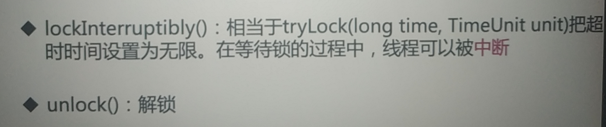
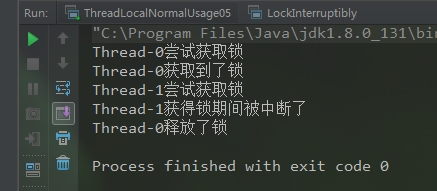
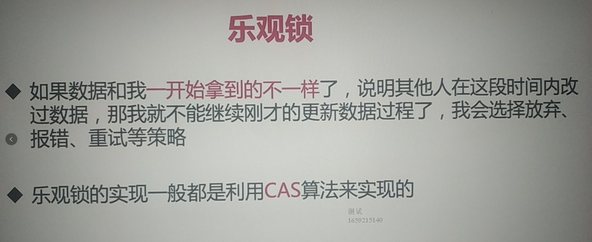
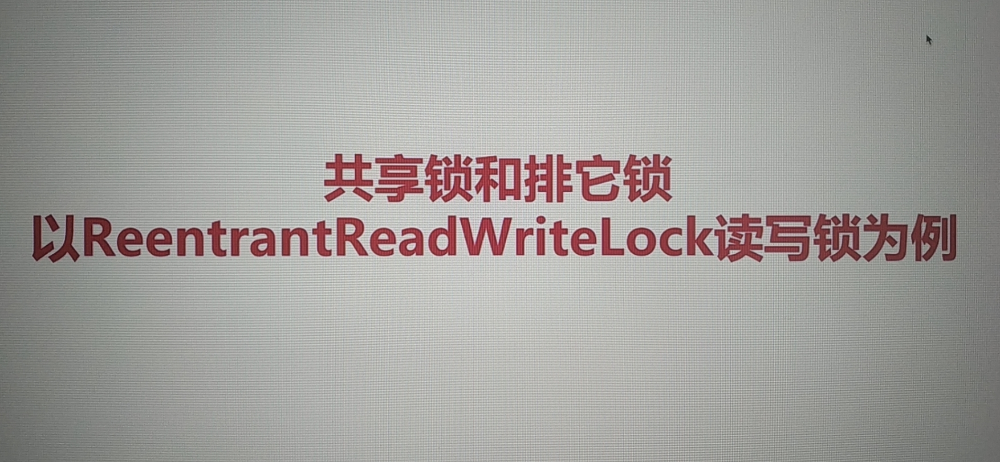
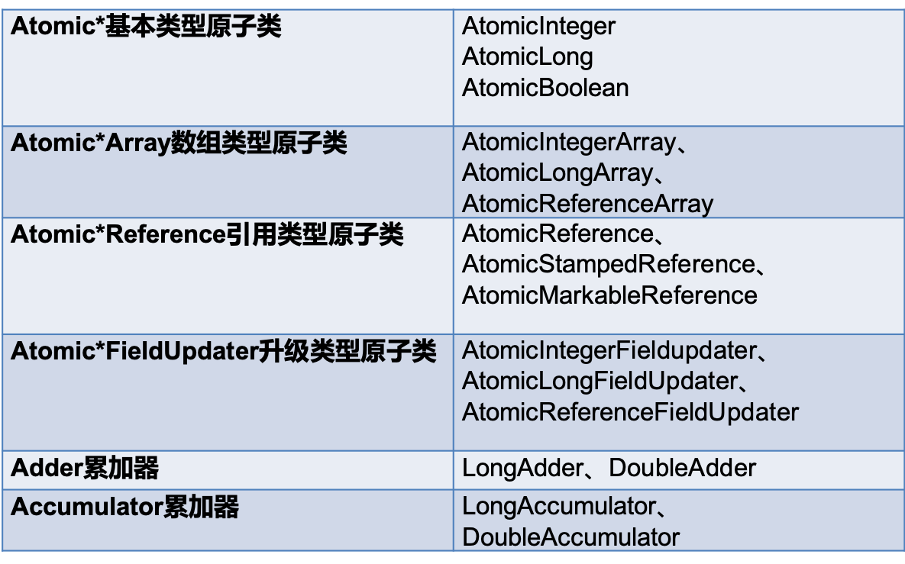
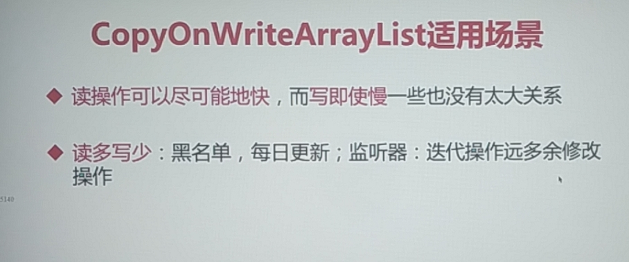
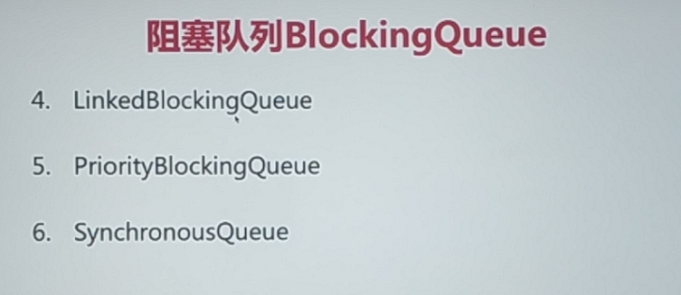
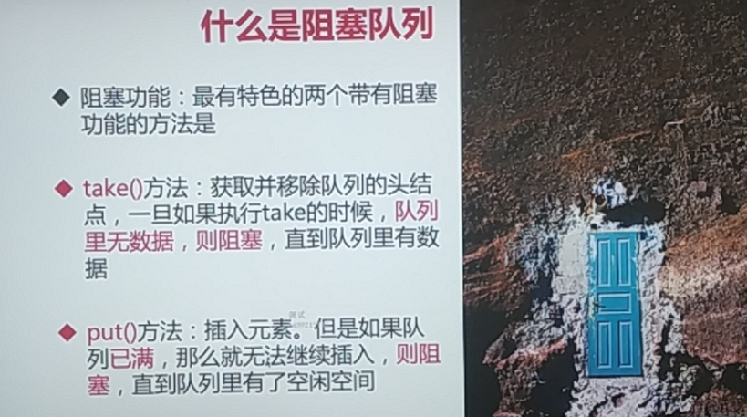
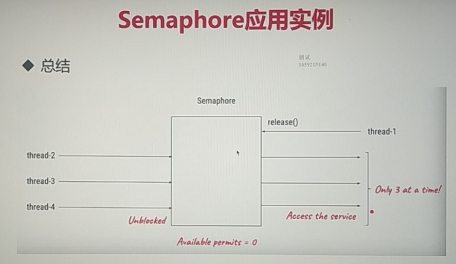

# 2-1并发工具类---分类

 看脑图

# 3-1线程池的自我介绍

## 添加线程规则


## 线程池构造函数的参数


## corePoolSize和maxPoolSize


## keepAliveTime


## 线程工厂


```java
private static final class CustomThreadFactory implements ThreadFactory {
        private final ThreadGroup group;
        private final AtomicInteger index = new AtomicInteger(1);

        private CustomThreadFactory() {
            SecurityManager sm = System.getSecurityManager();
            group = (sm != null) ? sm.getThreadGroup()
                    : Thread.currentThread().getThreadGroup();
        }

        @Override
        public Thread newThread(Runnable r) {
            Thread t = new Thread(group, r, "SocketStreamHandle-"
                    + index.getAndIncrement());
            t.setDaemon(true);
            if (t.getPriority() != Thread.NORM_PRIORITY) {
                t.setPriority(Thread.NORM_PRIORITY);
            }
            return t;
        }
    }
```


## 工作队列


## 手动与自动创建线程池


## 线程池之newFixedThreadPool


### 实验：演示newFixedThreadPool线程OOM错误


```java
package com.mayikt.www.mySelfFutureDemo.Juc;

import java.util.concurrent.ExecutorService;
import java.util.concurrent.Executors;
import java.util.concurrent.TimeUnit;

public class NewFixedThreadPoolOOP {
    public static void main(String[] args) {
        ExecutorService executorService = Executors.newFixedThreadPool(3);
        for (int i = 0; i < 1000000000; i++) {
            executorService.execute(new MyTask());
        }
    }
}
class MyTask implements Runnable{

    @Override
    public void run() {
        try {
            TimeUnit.SECONDS.sleep(10000000);
        } catch (InterruptedException e) {
            e.printStackTrace();
        }
    }
}

```


## 线程池之newSingleThreadExecutor


## 线程池之newCachedThreadPool


## 线程池之ScheduledThreadPool

**支持定时及周期性任务执行的线程池**

### 实验：ScheduledThreadPoolDemo

```java
package com.mayikt.www.mySelfFutureDemo.Juc;

import java.util.concurrent.Executors;
import java.util.concurrent.ScheduledExecutorService;
import java.util.concurrent.TimeUnit;

public class ScheduledThreadPoolDemo {
    public static void main(String[] args) {
        ScheduledExecutorService scheduledExecutorService = Executors.newScheduledThreadPool(3);
        scheduledExecutorService.scheduleAtFixedRate(new MyTask1(),1,3,TimeUnit.SECONDS);
    }

}
class MyTask1 implements Runnable{

    @Override
    public void run() {
        System.out.println(Thread.currentThread().getName()+".....正在运行！");
    }
}
```


## 正确创建线程池的方法

​	● 根据不同的业务场景，自己设置线程池的参数，比如我们的内存有多大，我们想给线程取什么名字等等

## 线程池里的线程数量设定为多少比较合适


平均等待时间：假如等待100秒读数据库

平均工作时间：花1秒去执行任务

cpu核心数：8核

线程数：8*（1+100/1）=800个线程

# 3-6 对比线程池的特点

## 常见线程池的特点

### **newFixedThreadPool**


### newCachedThreadPool


### newScheduledThreadPool

**支持定时及周期性任务执行的线程池**

### newSingleThreadExecutor

☺ 单线程的线程池：它只有用唯一的工作线程来执行任务

☺它的原理和FixedThreadPool是一样的，但是此时的线程数量被设置为1了。

### 以上4种线程池的构造函数的参数


## 阻塞队列分析


## workStealingPool(了解)


## 停止线程池的正确方法

### 1.shutdown

这个方法是一个预处理关闭线程池的方法，因为关闭线程池之后，线程池里还有正在执行的任务及阻塞队列里也有任务，所以就是预处理方法，**注意，在showdown之后再次提交的线程任务将会失败！**看实验2

#### 实验1

```java
package com.mayikt.www.mySelfFutureDemo.Juc;

import java.util.concurrent.ExecutorService;
import java.util.concurrent.Executors;
import java.util.concurrent.TimeUnit;

public class ThreadPoolShudownDemo {
    public static void main(String[] args) {
        ExecutorService executorService = Executors.newFixedThreadPool(10);
        for (int i = 0; i < 1000; i++) {
            executorService.execute(new MyTask2());
        }
        try {
            TimeUnit.SECONDS.sleep(2);
        } catch (InterruptedException e) {
            e.printStackTrace();
        }
        executorService.shutdown();
    }
}
class MyTask2 implements Runnable{

    @Override
    public void run() {
        try {
            TimeUnit.SECONDS.sleep(1);
        } catch (InterruptedException e) {
            e.printStackTrace();
        }
        System.out.println(Thread.currentThread().getName()+".....正在运行！");
    }
}
```


#### 实验2

```java
package com.mayikt.www.mySelfFutureDemo.Juc;

import java.util.concurrent.ExecutorService;
import java.util.concurrent.Executors;
import java.util.concurrent.TimeUnit;

public class ThreadPoolShudownDemo {
    public static void main(String[] args) {
        ExecutorService executorService = Executors.newFixedThreadPool(10);
        for (int i = 0; i < 1000; i++) {
            executorService.execute(new MyTask2());
        }
        try {
            TimeUnit.SECONDS.sleep(2);
        } catch (InterruptedException e) {
            e.printStackTrace();
        }
        executorService.shutdown();
        executorService.execute(new MyTask1());//2秒过后再提交一个新线程。
    }
}
class MyTask2 implements Runnable{

    @Override
    public void run() {
        try {
            TimeUnit.SECONDS.sleep(1);
        } catch (InterruptedException e) {
            e.printStackTrace();
        }
        System.out.println(Thread.currentThread().getName()+".....正在运行！");
    }
}
```


### 2.isShutDown

#### 实验3

```java
package com.mayikt.www.mySelfFutureDemo.Juc;

import java.util.concurrent.ExecutorService;
import java.util.concurrent.Executors;
import java.util.concurrent.TimeUnit;

public class ThreadPoolShudownDemo {
    public static void main(String[] args) {
        ExecutorService executorService = Executors.newFixedThreadPool(10);
        for (int i = 0; i < 1000; i++) {
            executorService.execute(new MyTask2());
        }
        try {
            TimeUnit.SECONDS.sleep(2);
        } catch (InterruptedException e) {
            e.printStackTrace();
        }
        System.out.println("执行关闭线程池前："+executorService.isShutdown());
        executorService.shutdown();
        System.out.println("执行关闭线程池后："+executorService.isShutdown());
    }
}
class MyTask2 implements Runnable{

    @Override
    public void run() {
        try {
            TimeUnit.SECONDS.sleep(1);
        } catch (InterruptedException e) {
            e.printStackTrace();
        }
        System.out.println(Thread.currentThread().getName()+".....正在运行！");
    }
}
```


### 3.isTerminated

​	若关闭后**所有任务**都已完成，则返回true。**注意除非首先调用shutdown，否则isTerminated永不为true**。返回：若关闭后所有任务都已完成，则返回true。

#### 实验4 

```java
package com.mayikt.www.mySelfFutureDemo.Juc;

import java.util.concurrent.ExecutorService;
import java.util.concurrent.Executors;
import java.util.concurrent.TimeUnit;

public class ThreadPoolShudownDemo {
    public static void main(String[] args) {
        ExecutorService executorService = Executors.newFixedThreadPool(10);
        for (int i = 0; i < 1000; i++) {//注意，我改这里了。目的就是看线程结束后isTerminated是否为true
            executorService.execute(new MyTask2());
        }
        try {
            TimeUnit.SECONDS.sleep(2);
           /* executorService.shutdown();
            System.out.println("执行关闭线程池shutdown方法后："+executorService.isShutdown());*/
            System.out.println("执行关闭线程池shutdown方法后的isTerminated："+executorService.isTerminated());
        } catch (InterruptedException e) {
            e.printStackTrace();

        }


    }
}
class MyTask2 implements Runnable{

    @Override
    public void run() {
       /* try {
            TimeUnit.SECONDS.sleep(1);
        } catch (InterruptedException e) {
            e.printStackTrace();
        }*/
        System.out.println(Thread.currentThread().getName()+".....正在运行！");
    }
}

```


#### 实验5

在执行isTerminated之前加入isShutDown方法

```java
package com.mayikt.www.mySelfFutureDemo.Juc;

import java.util.concurrent.ExecutorService;
import java.util.concurrent.Executors;
import java.util.concurrent.TimeUnit;

public class ThreadPoolShudownDemo {
    public static void main(String[] args) {
        ExecutorService executorService = Executors.newFixedThreadPool(10);
        for (int i = 0; i < 1000; i++) {//注意，我改这里了。目的就是看线程结束后isTerminated是否为true
            executorService.execute(new MyTask2());
        }
        try {
            TimeUnit.SECONDS.sleep(3);
            executorService.shutdown();
            System.out.println("执行关闭线程池shutdown方法后："+executorService.isShutdown()); 
            System.out.println("执行关闭线程池shutdown方法后的isTerminated："+executorService.isTerminated());
        } catch (InterruptedException e) {
            e.printStackTrace();

        }


    }
}
class MyTask2 implements Runnable{

    @Override
    public void run() {
       /* try {
            TimeUnit.SECONDS.sleep(1);
        } catch (InterruptedException e) {
            e.printStackTrace();
        }*/
        System.out.println(Thread.currentThread().getName()+".....正在运行！");
    }
}

```


### 4.awaitTermination

当前线程阻塞，直到

- 等所有已提交的任务（包括正在跑的和队列中等待的）执行完
- 或者等超时时间到
- 或者线程被中断，抛出`InterruptedException`

然后返回true（**shutdown请求后所有任务执行完毕**）或false（已超时）,不调用shutdown也不会返回true

```
实验发现，shuntdown()和awaitTermination()效果差不多，方法执行之后，都要等到提交的任务全部执行完才停。
```

#### 实验6 没加shutdown

```java
package com.mayikt.www.mySelfFutureDemo.Juc;

import java.util.concurrent.ExecutorService;
import java.util.concurrent.Executors;
import java.util.concurrent.TimeUnit;

public class ThreadPoolShudownDemo {
    public static void main(String[] args) {
        ExecutorService executorService = Executors.newFixedThreadPool(10);
        for (int i = 0; i < 100; i++) {//注意，我改这里了。目的就是看线程结束后isTerminated是否为true
            executorService.execute(new MyTask2());
        }
        try {
            //executorService.shutdown();
            boolean result = executorService.awaitTermination(3, TimeUnit.SECONDS);
            System.out.println("执行awaitTermination方法后："+result);
        } catch (InterruptedException e) {
            e.printStackTrace();

        }


    }
}
class MyTask2 implements Runnable{

    @Override
    public void run() {
        System.out.println(Thread.currentThread().getName()+".....正在运行！");
    }
}

```


#### 实验7 加了shutdown

```java
package com.mayikt.www.mySelfFutureDemo.Juc;

import java.util.concurrent.ExecutorService;
import java.util.concurrent.Executors;
import java.util.concurrent.TimeUnit;

public class ThreadPoolShudownDemo {
    public static void main(String[] args) {
        ExecutorService executorService = Executors.newFixedThreadPool(10);
        for (int i = 0; i < 100; i++) {//注意，我改这里了。目的就是看线程结束后isTerminated是否为true
            executorService.execute(new MyTask2());
        }
        try {
            executorService.shutdown();
            boolean result = executorService.awaitTermination(3, TimeUnit.SECONDS);
            System.out.println("执行awaitTermination方法后："+result);
        } catch (InterruptedException e) {
            e.printStackTrace();

        }


    }
}
class MyTask2 implements Runnable{

    @Override
    public void run() {
        System.out.println(Thread.currentThread().getName()+".....正在运行！");
    }
}
```


### 5.shutdownNow

将线程池状态置为`STOP`。**企图**立即停止，事实上不一定：

- 跟shutdown()一样，先停止接收外部提交的任务
- 忽略队列里等待的任务
- 尝试将正在跑的任务`interrupt`中断
- 返回未执行的**任务列表**

#### 实验 8

```java
package com.mayikt.www.mySelfFutureDemo.Juc;

import java.util.List;
import java.util.concurrent.ExecutorService;
import java.util.concurrent.Executors;
import java.util.concurrent.TimeUnit;

public class ThreadPoolShudownDemo {
    public static void main(String[] args) {
        ExecutorService executorService = Executors.newFixedThreadPool(3);
        for (int i = 0; i < 10; i++) {//注意，我改这里了。目的就是看线程结束后isTerminated是否为true
            executorService.execute(new MyTask2());
        }
        try {
            List<Runnable> runnables = executorService.shutdownNow();
            System.out.println("执行shutdownNow方法后：");
            for (Runnable runnable : runnables) {
                System.out.println(runnable);
            }
        } catch (Exception e) {
            e.printStackTrace();

        }


    }
}
class MyTask2 implements Runnable{

    @Override
    public void run() {
        try {
            TimeUnit.MICROSECONDS.sleep(500);
            System.out.println(Thread.currentThread().getName()+".....正在运行！");
        } catch (InterruptedException e) {
            System.out.println(Thread.currentThread().getName()+".....被中断了！");
            e.printStackTrace();
        }
    }
}

```


## 任务太多，怎么拒绝


### 四种拒绝策略

**AbortPolicy**

​	ThreadPoolExecutor.AbortPolicy:丢弃任务并抛出RejectedExecutionException异常。 

**DiscardPolicy**

​	ThreadPoolExecutor.DiscardPolicy：丢弃任务，但是不抛出异常。如果线程队列已满，则后续提交的任务都会被丢弃，且是静默丢弃。使用此策略，可能会使我们无法发现系统的异常状态。建议是一些无关紧要的业务采用此策略。例如，本人的博客网站统计阅读量就是采用的这种拒绝策略。 

**DiscardOldestPolicy**

​	ThreadPoolExecutor.DiscardOldestPolicy：丢弃队列最前面的任务，然后重新提交被拒绝的任务。此拒绝策略，是一种喜新厌旧的拒绝策略。是否要采用此种拒绝策略，还得根据实际业务是否允许丢弃老任务来认真衡量。 

**CallerRunsPolicy**

ThreadPoolExecutor.CallerRunsPolicy：由调用线程处理该任务 ,如果任务被拒绝了，则由调用线程（提交任务的线程）直接执行此任务 .

# 3-8 钩子：给线程池加点料

## 钩子方法，给线程池加点料

☺ 每个任务执行前后

☺ 日志、统计

### 实验

```java
package com.mayikt.www.JUC;

import java.util.concurrent.BlockingQueue;
import java.util.concurrent.LinkedBlockingQueue;
import java.util.concurrent.RejectedExecutionHandler;
import java.util.concurrent.ThreadFactory;
import java.util.concurrent.ThreadPoolExecutor;
import java.util.concurrent.TimeUnit;
import java.util.concurrent.locks.Condition;
import java.util.concurrent.locks.ReentrantLock;

/**
 * 描述：     演示每个任务执行前后放钩子函数
 */
public class PauseableThreadPool extends ThreadPoolExecutor {

    private final ReentrantLock lock = new ReentrantLock();
    private Condition unpaused = lock.newCondition();
    private boolean isPaused;


    public PauseableThreadPool(int corePoolSize, int maximumPoolSize, long keepAliveTime,
                               TimeUnit unit,
                               BlockingQueue<Runnable> workQueue) {
        super(corePoolSize, maximumPoolSize, keepAliveTime, unit, workQueue);
    }

    public PauseableThreadPool(int corePoolSize, int maximumPoolSize, long keepAliveTime,
                               TimeUnit unit, BlockingQueue<Runnable> workQueue,
                               ThreadFactory threadFactory) {
        super(corePoolSize, maximumPoolSize, keepAliveTime, unit, workQueue, threadFactory);
    }

    public PauseableThreadPool(int corePoolSize, int maximumPoolSize, long keepAliveTime,
                               TimeUnit unit, BlockingQueue<Runnable> workQueue,
                               RejectedExecutionHandler handler) {
        super(corePoolSize, maximumPoolSize, keepAliveTime, unit, workQueue, handler);
    }

    public PauseableThreadPool(int corePoolSize, int maximumPoolSize, long keepAliveTime,
                               TimeUnit unit, BlockingQueue<Runnable> workQueue,
                               ThreadFactory threadFactory, RejectedExecutionHandler handler) {
        super(corePoolSize, maximumPoolSize, keepAliveTime, unit, workQueue, threadFactory,
                handler);
    }

    @Override
    protected void beforeExecute(Thread t, Runnable r) {
        super.beforeExecute(t, r);
        lock.lock();
        try {
            while (isPaused) {
                unpaused.await();
            }
        } catch (InterruptedException e) {
            e.printStackTrace();
        } finally {
            lock.unlock();
        }
    }

    private void pause() {
        lock.lock();
        try {
            isPaused = true;
        } finally {
            lock.unlock();
        }
    }

    public void resume() {
        lock.lock();
        try {
            isPaused = false;
            unpaused.signalAll();
        } finally {
            lock.unlock();
        }
    }

    public static void main(String[] args) throws InterruptedException {
        PauseableThreadPool pauseableThreadPool = new PauseableThreadPool(10, 20, 10l,
                TimeUnit.SECONDS, new LinkedBlockingQueue<>());
        Runnable runnable = new Runnable() {
            @Override
            public void run() {
                System.out.println("我被执行");
                try {
                    Thread.sleep(10);
                } catch (InterruptedException e) {
                    e.printStackTrace();
                }
            }
        };
        for (int i = 0; i < 10000; i++) {
            pauseableThreadPool.execute(runnable);
        }
        Thread.sleep(1500);
        pauseableThreadPool.pause();
        System.out.println("线程池被暂停了");
        Thread.sleep(1500);
        pauseableThreadPool.resume();
        System.out.println("线程池被恢复了");

    }
}
```


## 实现原理、源码分析


# 3-9 Executor家族的辨析


```java
public void execute(Runnable command) {
        if (command == null)
            throw new NullPointerException();
        int c = ctl.get();
        if (workerCountOf(c) < corePoolSize) {
            if (addWorker(command, true))
                return;
            c = ctl.get();
        }
        if (isRunning(c) && workQueue.offer(command)) {
            int recheck = ctl.get();
            if (! isRunning(recheck) && remove(command))
                reject(command);
            else if (workerCountOf(recheck) == 0)
                addWorker(null, false);
        }
        else if (!addWorker(command, false))
            reject(command);
    }
```

# 3-10 线程池状态和使用注意点

## 线程池状态


**ThreadPoolExecutor**

```java
// runState is stored in the high-order bits
private static final int RUNNING    = -1 << COUNT_BITS;
private static final int SHUTDOWN   =  0 << COUNT_BITS;
private static final int STOP       =  1 << COUNT_BITS;
private static final int TIDYING    =  2 << COUNT_BITS;
private static final int TERMINATED =  3 << COUNT_BITS;
 public void execute(Runnable command) {
        if (command == null)
            throw new NullPointerException();
        /*
         * Proceed in 3 steps:
         *
         * 1. If fewer than corePoolSize threads are running, try to
         * start a new thread with the given command as its first
         * task.  The call to addWorker atomically checks runState and
         * workerCount, and so prevents false alarms that would add
         * threads when it shouldn't, by returning false.
         *
         * 2. If a task can be successfully queued, then we still need
         * to double-check whether we should have added a thread
         * (because existing ones died since last checking) or that
         * the pool shut down since entry into this method. So we
         * recheck state and if necessary roll back the enqueuing if
         * stopped, or start a new thread if there are none.
         *
         * 3. If we cannot queue task, then we try to add a new
         * thread.  If it fails, we know we are shut down or saturated
         * and so reject the task.
         */
        int c = ctl.get();
        if (workerCountOf(c) < corePoolSize) {
            if (addWorker(command, true))
                return;
            c = ctl.get();
        }
        if (isRunning(c) && workQueue.offer(command)) {
            int recheck = ctl.get();
            if (! isRunning(recheck) && remove(command))
                reject(command);
            else if (workerCountOf(recheck) == 0)
                addWorker(null, false);
        }
        else if (!addWorker(command, false))
            reject(command);
    }
```


# 4-1 ThreadLocal的两种用法


# 4-2 进化之路：故事从两个线程说起


## 实验：ThreadLocalNormalUsage00

```java
package concurrency_tools_practice.treadlocal;

import java.text.SimpleDateFormat;
import java.util.Date;

public class ThreadLocalNormalUsage00 {
    public static void main(String[] args) {
        new Thread(()->{
            System.out.println(Thread.currentThread().getName()+".....>"+new ThreadLocalNormalUsage00().date(10L));
        },"A线程").start();
        new Thread(()->{
            System.out.println(Thread.currentThread().getName()+".....>"+new ThreadLocalNormalUsage00().date(104707L));
        },"B线程").start();
    }
    public String date(Long second){
        Date date = new Date(second * 1000);
        SimpleDateFormat simpleDateFormat = new SimpleDateFormat("yyyy-MM-dd hh:mm:ss");
        return simpleDateFormat.format(date);
    }
}
```


# 4-3 进化之路：线程池来帮忙，却好心办坏事


## 实验：ThreadLocalNormalUsage01

```java
package concurrency_tools_practice.treadlocal;

import java.text.SimpleDateFormat;
import java.util.Date;
import java.util.concurrent.TimeUnit;

public class ThreadLocalNormalUsage01 {
    public static void main(String[] args) {
        for (int i = 1; i < 11; i++) {
            final Long FINALI= Long.valueOf(i);
            new Thread(()->{
                System.out.println(Thread.currentThread().getName()+".....>"+new ThreadLocalNormalUsage01().date(FINALI));
            },"子线程").start();
            try {
                TimeUnit.SECONDS.sleep(1);
            } catch (InterruptedException e) {
                e.printStackTrace();
            }
        }

    }
    public String date(Long second){
        Date date = new Date(second * 1000);
        SimpleDateFormat simpleDateFormat = new SimpleDateFormat("yyyy-MM-dd hh:mm:ss");
        return simpleDateFormat.format(date);
    }
}

```

```properties
子线程.....>1970-01-01 08:00:01
子线程.....>1970-01-01 08:00:02
子线程.....>1970-01-01 08:00:03
子线程.....>1970-01-01 08:00:04
子线程.....>1970-01-01 08:00:05
子线程.....>1970-01-01 08:00:06
子线程.....>1970-01-01 08:00:07
子线程.....>1970-01-01 08:00:08
子线程.....>1970-01-01 08:00:09
子线程.....>1970-01-01 08:00:10

Process finished with exit code 0
```


## 实验：ThreadLocalNormalUsage02

```java
package concurrency_tools_practice.treadlocal;

import java.text.SimpleDateFormat;
import java.util.Date;
import java.util.concurrent.ExecutorService;
import java.util.concurrent.Executors;
import java.util.concurrent.TimeUnit;

public class ThreadLocalNormalUsage02 {
    public static void main(String[] args) {
        ExecutorService executorService = Executors.newFixedThreadPool(10);
        for (int i = 0; i < 1000; i++) {
                final Long FINALI= Long.valueOf(i);
            executorService.submit(new Runnable() {
                @Override
                public void run() {
                    System.out.println(Thread.currentThread().getName()+".....>"+new ThreadLocalNormalUsage02().date(FINALI));
                }
            });
        }

    }
    public String date(Long second){
        Date date = new Date(second * 1000);
        SimpleDateFormat simpleDateFormat = new SimpleDateFormat("yyyy-MM-dd hh:mm:ss");
        return simpleDateFormat.format(date);
    }
}
```


## 实验：ThreadLocalNormalUsage03

```java
package concurrency_tools_practice.treadlocal;

import java.text.SimpleDateFormat;
import java.util.Date;
import java.util.concurrent.ExecutorService;
import java.util.concurrent.Executors;

public class ThreadLocalNormalUsage03 {
    private static SimpleDateFormat simpleDateFormat = new SimpleDateFormat("yyyy-MM-dd hh:mm:ss");
    public static void main(String[] args) {
        ExecutorService executorService = Executors.newFixedThreadPool(10);
        for (int i = 0; i < 1000; i++) {
                final Long FINALI= Long.valueOf(i);
            executorService.submit(new Runnable() {
                @Override
                public void run() {
                    System.out.println(Thread.currentThread().getName()+".....>"+new ThreadLocalNormalUsage03().date(FINALI));
                }
            });
        }

    }
    public String date(Long second){
        Date date = new Date(second * 1000);
        return simpleDateFormat.format(date);
    } 
}
```


**数据错乱！**


# 4-4 走过的弯路，你的套路

## 实验：ThreadLocalNormalUsage04

```java
package concurrency_tools_practice.treadlocal;

import java.text.SimpleDateFormat;
import java.util.Date;
import java.util.concurrent.ExecutorService;
import java.util.concurrent.Executors;
import java.util.concurrent.ThreadPoolExecutor;

public class ThreadLocalNormalUsage04 {
    private static SimpleDateFormat simpleDateFormat = new SimpleDateFormat("yyyy-MM-dd hh:mm:ss");
    public static void main(String[] args) {
        ExecutorService executorService = Executors.newFixedThreadPool(10);
        for (int i = 0; i < 1000; i++) {
                final Long FINALI= Long.valueOf(i);
            executorService.submit(new Runnable() {
                @Override
                public void run() {
                    System.out.println(Thread.currentThread().getName()+".....>"+new ThreadLocalNormalUsage04().date(FINALI));
                }
            });
        }

    }
    public String date(Long second){
        Date date = new Date(second * 1000);
        String format= "";
        synchronized (ThreadPoolExecutor.class){  //加锁：synchronized ()
            format = simpleDateFormat.format(date);
        }
        return format;
    } 
}
```


# 4-5 ThreadLocal是救火队长


## 实验：ThreadLocalNormalUsage05

```java
package concurrency_tools_practice.treadlocal;

import javax.lang.model.element.VariableElement;
import java.text.SimpleDateFormat;
import java.util.Date;
import java.util.concurrent.ExecutorService;
import java.util.concurrent.Executors;

public class ThreadLocalNormalUsage05 {
    public static void main(String[] args) {
        ExecutorService executorService = Executors.newFixedThreadPool(10);
        for (int i = 0; i < 1000; i++) {
                final Long FINALI= Long.valueOf(i);
            executorService.submit(new Runnable() {
                @Override
                public void run() {
                    System.out.println(Thread.currentThread().getName()+".....>"+new ThreadLocalNormalUsage05().date(FINALI));
                }
            });
        }

    }
    public String date(Long second){
        Date date = new Date(second * 1000);
        SimpleDateFormat simpleDateFormat = ThreadSafeDateFormate.lamdaDateFormatThreadLocal.get();
        //SimpleDateFormat simpleDateFormat2 = ThreadSafeDateFormate.dateFormatThreadLocal();
        return simpleDateFormat.format(date);
    }
}
class ThreadSafeDateFormate{
   public static ThreadLocal<SimpleDateFormat> dateFormatThreadLocal = new ThreadLocal<SimpleDateFormat>() {
       @Override
       protected SimpleDateFormat initialValue() {
           return new SimpleDateFormat("yyyy-MM-dd hh:mm:ss");
       }
   };

   public static ThreadLocal<SimpleDateFormat> lamdaDateFormatThreadLocal = ThreadLocal.withInitial(()->{
       return new SimpleDateFormat("yyyy-MM-dd hh:mm:ss");
   });

}
```


# 4-6 悔不当初：回顾进化之路


# 4-7 ThreadLocal的第二种用法 part1


# 4-8 ThreadLocal的第二种用法 part2

## 实验：ThreadLocalNormalUsage06

```java
package concurrency_tools_practice.treadlocal;

import com.sun.org.apache.xpath.internal.SourceTree;

public class ThreadLocalNormalUsage06 {
    public static void main(String[] args) {
        for (int i = 1; i < 4; i++) {
            new Thread(()->{
                new Service1().progress();
            },"线程"+i).start();
        }
    }
}
class Service1{
  public void progress(){

      ThreadLocal<User> userThreadLocal = UserContextHolder.userThreadLocal;
      String userName = Thread.currentThread().getName();
      if(userName.contains("1")){
          userName="谢霆锋";
      }else if(userName.contains("2")){
          userName="张杰";
      }else{
          userName="马大哈";
      }
      userThreadLocal.set(new  User(userName));
      System.out.println(Thread.currentThread().getName()+"调用到service1:"+userThreadLocal.get().toString());
      new Service2().progress();
  }
}

class Service2{
    public void progress(){
        System.out.println(Thread.currentThread().getName()+"调用到service2:"+UserContextHolder.userThreadLocal.get().toString());
        new Service3().progress();
    }
}
class Service3{
    public void progress(){
        System.out.println(Thread.currentThread().getName()+"调用到service3:"+UserContextHolder.userThreadLocal.get().toString());
    }
}
class UserContextHolder{
    public static ThreadLocal<User> userThreadLocal = new ThreadLocal<>();
}
class User{
    private String userName;

    public User(String userName) {
        this.userName = userName;
    }

    @Override
    public String toString() {
        return "User{" + "userName='" + userName + '/'' + '}';
    }
}
```


# 4-9 ThreadLocal的两种用法总结


# 4-10 ThreadLocal的好处


# 4-11 ThreadLocal原理


# 4-12 ThreadLocal的重要方法介绍


## 实验：看源码

```java
    public T get() {
        Thread t = Thread.currentThread();
        ThreadLocalMap map = getMap(t);
        if (map != null) {
            ThreadLocalMap.Entry e = map.getEntry(this);
            if (e != null) {//注意这里
                @SuppressWarnings("unchecked")
                T result = (T)e.value;
                return result;
            }
        }
        return setInitialValue();//注意这里
    }
    ///////////////////////////////////////////
        private T setInitialValue() {
        T value = initialValue();
        Thread t = Thread.currentThread();
        ThreadLocalMap map = getMap(t);
        if (map != null)
            map.set(this, value);
        else
            createMap(t, value);
        return value;
    }
    ///////////////////////////////////////////
    protected T initialValue() {
        return null;
    }
```


## 实验：remove()

```java
package concurrency_tools_practice.treadlocal;

import com.sun.org.apache.xpath.internal.SourceTree;

public class ThreadLocalNormalUsage06 {
    public static void main(String[] args) {
            new Thread(()->{
                new Service1().progress();
            },"线程"+1).start();
    }
}
class Service1{
  public void progress(){

      ThreadLocal<User> userThreadLocal = UserContextHolder.userThreadLocal;
      String userName = Thread.currentThread().getName();
      if(userName.contains("1")){
          userName="谢霆锋";
      }else if(userName.contains("2")){
          userName="张杰";
      }else{
          userName="马大哈";
      }
      userThreadLocal.set(new  User(userName));
      System.out.println(Thread.currentThread().getName()+"调用到service1:"+userThreadLocal.get().toString());
      new Service2().progress();
  }
}

class Service2{
    public void progress(){
        System.out.println(Thread.currentThread().getName()+"调用到service2:"+UserContextHolder.userThreadLocal.get().toString());
        UserContextHolder.userThreadLocal.remove();//注意这个方法 2020年3月16日17:34:23
        new Service3().progress();
    }
}
class Service3{
    public void progress(){
        System.out.println(Thread.currentThread().getName()+"调用到service3:"+UserContextHolder.userThreadLocal.get().toString());
    }
}
class UserContextHolder{
    public static ThreadLocal<User> userThreadLocal = new ThreadLocal<>();
}
class User{
    private String userName;

    public User(String userName) {
        this.userName = userName;
    }

    @Override
    public String toString() {
        return "User{" + "userName='" + userName + '/'' + '}';
    }
}
```


# 4-13 重要方法的源码分析

## 1.get方法


## 2.set方法


## 3.initialValue  & remove方法


# 4-14 两种场景，殊途同归

## 1.ThreadLocalMap类


## 2.两种使用场景殊途同归


# 4-15 收不回来的value

## 1.内存泄漏


```java
static class Entry extends WeakReference<ThreadLocal<?>> {//它继承了下面的WeakReference(弱引用)
    /** The value associated with this ThreadLocal. */
    Object value;

    Entry(ThreadLocal<?> k, Object v) {
        super(k);//这个可能会被回收，因为他是弱引用
        value = v;//这里是强引用，GC不会回收它，key是弱引用，这不可能会造成内存泄露。
    }
}
////////////////////////////////////////////
public WeakReference(T referent) {
    super(referent);
}
```


## 2.如何避免内存泄露


# 4-16 ThreadLocal的空指针异常问题

```java
package threadlocal;
 
public class ThreadLocalNPE {

    ThreadLocal<Long> longThreadLocal = new ThreadLocal<Long>();

    public void set() {
        longThreadLocal.set(Thread.currentThread().getId());
    }

    public Long get() {
        return longThreadLocal.get();
    }

    public static void main(String[] args) {
        ThreadLocalNPE threadLocalNPE = new ThreadLocalNPE();
        System.out.println(threadLocalNPE.get());//注意空指针异常，拆箱，装箱问题！
        Thread thread1 = new Thread(new Runnable() {
            @Override
            public void run() {
                threadLocalNPE.set();
                System.out.println(threadLocalNPE.get());
            }
        });
        thread1.start();
    }
}

```

# 4-17 ThreadLocal在Spring中的应用

## 1.ThreadLocal注意点


## 2.在Spring中的实例分析


### 实验：DateTimeContextHolder


### 实验：RequestContextHolder


# 5-1 本章纵览


# 5-2 内置锁的能力不足以满足需求


## 为什么需要Lock


## Lock有要方法介绍


### lock()


说明：

**Lock不会像Synchronized一样，异常的时候自动释放锁，所以最佳实践是，finally中释放锁，以便保证发生异常的时候锁一定被释放**

### 实验：

```java
package lock.lock;

import java.util.concurrent.locks.Lock;
import java.util.concurrent.locks.ReentrantLock;

/**
 * 描述：     Lock不会像synchronized一样，异常的时候自动释放锁，所以最佳实践是，finally中释放锁，以便保证发生异常的时候锁一定被释放
 */
public class MustUnlock {

    private static Lock lock = new ReentrantLock();

    public static void main(String[] args) {
        lock.lock();
        try{
            //获取本锁保护的资源
            System.out.println(Thread.currentThread().getName()+"开始执行任务");
        }finally {
            lock.unlock();
        }
    }
}
```

### tryLock()

**说白了，就是超时放弃获得锁操作**


# 5-3 tryLock尝试获取锁


### 实验：※※※※※

```java
package lock;
import java.util.Random;
import java.util.concurrent.ThreadPoolExecutor;
import java.util.concurrent.TimeUnit;
import java.util.concurrent.locks.Lock;
import java.util.concurrent.locks.ReentrantLock;

/**
 * 描述：     用tryLock来避免死锁
 */
public class TryLockDeadlock implements Runnable {


    int flag = 1;
    static Lock lock1 = new ReentrantLock();
    static Lock lock2 = new ReentrantLock();

    public static void main(String[] args) {
        TryLockDeadlock r1 = new TryLockDeadlock();
        TryLockDeadlock r2 = new TryLockDeadlock();
        r1.flag = 1;
        r1.flag = 0;
        new Thread(r1).start();
        new Thread(r2).start();

    }

    @Override
    public void run() {
        for (int i = 0; i < 100; i++) {
            if (flag == 1) {
                try {
                    if (lock1.tryLock(800, TimeUnit.MILLISECONDS)) {
                        try {
                            System.out.println("线程1获取到了锁1");
                            Thread.sleep(new Random().nextInt(1000));
                            if (lock2.tryLock(800, TimeUnit.MILLISECONDS)) {
                                //超时就放弃！2020年3月16日21:55:40
                                try {
                                    System.out.println("线程1获取到了锁2");
                                    System.out.println("线程1成功获取到了两把锁");
                                    break;
                                } finally {
                                    lock2.unlock();
                                }
                            } else {
                                System.out.println("线程1获取锁2失败，已重试");
                            }
                        } finally {
                            lock1.unlock();
                            Thread.sleep(new Random().nextInt(1000));
                        }
                    } else {
                        System.out.println("线程1获取锁1失败，已重试");
                    }
                } catch (InterruptedException e) {
                    e.printStackTrace();
                }
            }

            if (flag == 0) {
                try {
                    if (lock2.tryLock(3000, TimeUnit.MILLISECONDS)) {
                         //超时就放弃！2020年3月16日21:55:40
                        try {
                            System.out.println("线程2获取到了锁2");
                            Thread.sleep(new Random().nextInt(1000));
                            if (lock1.tryLock(800, TimeUnit.MILLISECONDS)) {
                                try {
                                    System.out.println("线程2获取到了锁1");
                                    System.out.println("线程2成功获取到了两把锁");
                                    break;
                                } finally {
                                    lock1.unlock();
                                }
                            } else {
                                System.out.println("线程2获取锁1失败，已重试");
                            }
                        } finally {
                            lock2.unlock();
                            Thread.sleep(new Random().nextInt(1000));
                        }
                    } else {
                        System.out.println("线程2获取锁2失败，已重试");
                    }
                } catch (InterruptedException e) {
                    e.printStackTrace();
                }
            }
        }
    }
}

```


# 5-4 代码演示：获取锁时被中断



**说白了，就是有中断就释放锁或者获得锁操作**

## 实验：

```java
package lock.lock;

import java.util.concurrent.ThreadPoolExecutor;
import java.util.concurrent.locks.Lock;
import java.util.concurrent.locks.ReentrantLock;

/**
 * 描述：     TODO
 */
public class LockInterruptibly implements Runnable {

    private Lock lock = new ReentrantLock();
	public static void main(String[] args) {
    LockInterruptibly lockInterruptibly = new LockInterruptibly();
    Thread thread0 = new Thread(lockInterruptibly);
    Thread thread1 = new Thread(lockInterruptibly);
    thread0.start();
    thread1.start();

    try {
        Thread.sleep(2000);
    } catch (InterruptedException e) {
        e.printStackTrace();
    }
    thread1.interrupt();//中断thread1 
}
    @Override
    public void run() {
        System.out.println(Thread.currentThread().getName() + "尝试获取锁");
        try {
            lock.lockInterruptibly();//注意这个
            try {
                System.out.println(Thread.currentThread().getName() + "获取到了锁");
                Thread.sleep(5000);
            } catch (InterruptedException e) {
                System.out.println(Thread.currentThread().getName() + "睡眠期间被中断了");
            } finally {
                lock.unlock();
                System.out.println(Thread.currentThread().getName() + "释放了锁");
            }
        } catch (InterruptedException e) {
            System.out.println(Thread.currentThread().getName() + "获得锁期间被中断了");
        }
    }
}

```




# 5-5 锁的可见性保证


# 5-6 互斥同步锁

## 1.锁的分类


## 2.乐观锁与悲观锁

### 2.1**为什么会诞生非互斥同步锁——互斥同步锁的劣势**


### **2.2 什么是乐观锁和悲观锁**


#### 悲观锁


### 2.3.乐观锁





# 5-7 非互斥同步锁

## 1.**典型粟子**


```java
package lock.lock;

import java.util.concurrent.atomic.AtomicInteger;
 
public class PessimismOptimismLock {

    int a;

    public static void main(String[] args) {
        AtomicInteger atomicInteger = new AtomicInteger();
        atomicInteger.incrementAndGet();
    }

    public synchronized void testMethod() {
        a++;
    }
}

```


## 2.开销对比


## **3.两种锁各自的使用场景**


# 5-8 可重入锁的用法


## 1.可重入锁和非可重入锁


### 1.1 ReentrantLock使用案例


#### 实验: CinemaBookSeat

```java
package lock.reentrantlock;

import java.util.concurrent.locks.ReentrantLock;

/**
 * 描述：     演示多线程预定电影院座位
 */
public class CinemaBookSeat {

    private static ReentrantLock lock = new ReentrantLock();

    private static void bookSeat() {
        lock.lock();
        try {
            System.out.println(Thread.currentThread().getName() + "开始预定座位");
            Thread.sleep(1000);
            System.out.println(Thread.currentThread().getName() + "完成预定座位");
        } catch (InterruptedException e) {
            e.printStackTrace();
        } finally {
            lock.unlock();
        }
    }

    public static void main(String[] args) {
        new Thread(() -> bookSeat()).start();
        new Thread(() -> bookSeat()).start();
        new Thread(() -> bookSeat()).start();
        new Thread(() -> bookSeat()).start();
    }
}

```


#### 实验:LockDemo

```java
package lock;


import java.util.concurrent.locks.Lock;
import java.util.concurrent.locks.ReentrantLock;

/**
 * 描述：     演示ReentrantLock的基本用法，演示被打断
 */
public class LockDemo {

    public static void main(String[] args) {
        new LockDemo().init();
    }

    private void init() {
        final Outputer outputer = new Outputer();
        new Thread(new Runnable() {
            @Override
            public void run() {
                while (true) {
                    try {
                        Thread.sleep(5);
                    } catch (InterruptedException e) {
                        e.printStackTrace();
                    }
                    outputer.output("悟空");
                }

            }
        }).start();

        new Thread(new Runnable() {
            @Override
            public void run() {
                while (true) {
                    try {
                        Thread.sleep(5);
                    } catch (InterruptedException e) {
                        e.printStackTrace();
                    }
                    outputer.output("大师兄");
                }

            }
        }).start();
    }

    static class Outputer {

        Lock lock = new ReentrantLock();

        //字符串打印方法，一个个字符的打印
        public void output(String name) {

            int len = name.length();
            lock.lock();
            try {
                for (int i = 0; i < len; i++) {
                    System.out.print(name.charAt(i));
                }
                System.out.println("");
            } finally {
                lock.unlock();
            }
        }
    }
}
```


实验:

```java
package lock;

import java.util.concurrent.locks.ReentrantLock;

public class GetHoldCountGaga {
    private static ReentrantLock reentrantLock = new ReentrantLock();
    public static void main(String[] args) {
        reentrantLock.lock();
        System.out.println(reentrantLock.getHoldCount()); 
        reentrantLock.lock();
        System.out.println(reentrantLock.getHoldCount());
        reentrantLock.lock();
        System.out.println(reentrantLock.getHoldCount());
 
        System.out.println(reentrantLock.getHoldCount());
        reentrantLock.unlock();
        System.out.println(reentrantLock.getHoldCount());
        reentrantLock.unlock();
        System.out.println(reentrantLock.getHoldCount());
        reentrantLock.unlock();
    }
}
```


实验2:

```java
package lock;

import java.util.concurrent.locks.ReentrantLock;

public class RecursionDemo {
    private static ReentrantLock reentrantLock = new ReentrantLock();
    public static void main(String[] args) {
        accessResource();
    }
    private static void accessResource(){
        reentrantLock.lock();
        System.out.println(reentrantLock.getHoldCount());
        try {
            if(reentrantLock.getHoldCount()<5){
                accessResource();
            }
        }finally {
            reentrantLock.unlock();
            System.out.println(reentrantLock.getHoldCount());
        }
    }
}
//说明:getHoldCount()获得当前重入锁的数量 2020年3月17日10:14:03
```


# 5-9 可重入性质和源码解析

## 1.**可重入锁ReentrantLock以及非可重入锁ThreadPoolExecutor的Worker类**


## 2.ReentranlLock的其他方法介绍


# 5-10 是否允许一部分人“先富起来”

## 1.公平锁与非公平锁


## 2.什么是公平和非公平


## 3.为什么要有非公平锁


## 4.公平的情况


## 5.不公平的情况


# 5-11 代码演示：先来后到的特例、优劣、源码分析

## 实验:演示公平和不公平两种情况※

### 实验:公平锁 FairLock

```java
package lock;

import sun.misc.Lock;

import javax.lang.model.element.VariableElement;
import java.util.Random;
import java.util.concurrent.TimeUnit;
import java.util.concurrent.locks.ReentrantLock;
/**
打印之前先排好队,一个一个按顺序打印,线程1打完了,线程9打,线程9打完了,线程3打....
注意:这个打印之前排队是看线程的启动顺序.不一定1,2,3,4........这样排队! 2020年3月17日11:23:33
*/
public class FairLock {
    public static void main(String[] args) {
        PrintQueue printQueue = new PrintQueue();
        for (int i = 1; i < 11; i++) {
            new Thread(new Job(printQueue),"子线程"+i).start();
        }
    }
}

class Job implements Runnable{
    private PrintQueue printQueue;
    public Job(PrintQueue printQueue){
        this.printQueue = printQueue;
    }
    @Override
    public void run() {
        System.out.println(Thread.currentThread().getName()+"*****开始打印****");
        printQueue.printJob();
        System.out.println(Thread.currentThread().getName()+"*****打印结束****");
    }
}

class PrintQueue{
    private ReentrantLock lock = new ReentrantLock(true);//公平与公平开关。2020年3月17日11:20:04
    public void printJob(){
        lock.lock();
        try {
            long second = new Random().nextInt(5)+1;
            System.out.println(Thread.currentThread().getName()+"第1份打印中.........需要："+second);
            TimeUnit.SECONDS.sleep(second);
        } catch (InterruptedException e) {
            e.printStackTrace();
        } finally {
            lock.unlock();
        }
        lock.lock();

        try {
            long second = new Random().nextInt(5)+1;
            System.out.println(Thread.currentThread().getName()+"第2份打印中.........需要："+second+" 秒！");
            TimeUnit.SECONDS.sleep(second);
        } catch (InterruptedException e) {
            e.printStackTrace();
        } finally {
            lock.unlock();
        }

    }

}
```


### 实验:非公平锁UnFairLock

```java
package lock;

import sun.misc.Lock;

import javax.lang.model.element.VariableElement;
import java.util.Random;
import java.util.concurrent.TimeUnit;
import java.util.concurrent.locks.ReentrantLock;
/**
非公平锁:就是尽量在唤醒慢的线醒来的区间,尽量让醒着的线程去执行.这样能[双赢],即不耽误排队的线程也可能让那些[聪明]的线程执行操作.
*/
public class UnFairLock {
    public static void main(String[] args) {
        PrintQueue printQueue = new PrintQueue();
        for (int i = 1; i < 11; i++) {
            new Thread(new Job(printQueue),"子线程"+i).start();
        }
    }
}

class Job implements Runnable{
    private PrintQueue printQueue;
    public Job(PrintQueue printQueue){
        this.printQueue = printQueue;
    }
    @Override
    public void run() {
        System.out.println(Thread.currentThread().getName()+"*****开始打印****");
        printQueue.printJob();
        System.out.println(Thread.currentThread().getName()+"*****打印结束****");
    }
}

class PrintQueue{
    private ReentrantLock lock = new ReentrantLock(false);//公平与公平开关。2020年3月17日11:20:04
    public void printJob(){
        lock.lock();
        try {
            long second = new Random().nextInt(5)+1;
            System.out.println(Thread.currentThread().getName()+"第1份打印中.........需要："+second);
            TimeUnit.SECONDS.sleep(second);
        } catch (InterruptedException e) {
            e.printStackTrace();
        } finally {
            lock.unlock();
        }
        lock.lock();

        try {
            long second = new Random().nextInt(5)+1;
            System.out.println(Thread.currentThread().getName()+"第2份打印中.........需要："+second+" 秒！");
            TimeUnit.SECONDS.sleep(second);
        } catch (InterruptedException e) {
            e.printStackTrace();
        } finally {
            lock.unlock();
        }

    }

}
```


## 特粟:


# 5-12 共享锁和排它锁的用法

## 1.ReentrantReadWriteLock读写锁为例




### 1.1什么是共享锁和排它锁


### 1.2读写锁的作用


### 1.3读写锁的规则


### 1.4ReentranReadWriteLock具体用法:


**☺之前的情况,未使用读写锁**


**☺现在用了读写锁,线程1和线程2可以同时用读锁,提高了效率**


**☺当线程1和线程2都释放了锁以后,线程3和线程4就可以写入了,但是只能有一个线程持有写锁**


#### 实验:必做※※※

```java
package lock;

import java.util.Random;
import java.util.concurrent.TimeUnit;
import java.util.concurrent.locks.ReentrantReadWriteLock;

public class CinemaReadWriteQueue {
    private static ReentrantReadWriteLock readWriteLock =new ReentrantReadWriteLock();
    private static ReentrantReadWriteLock.ReadLock  readLock= readWriteLock.readLock();
    private static ReentrantReadWriteLock.WriteLock  writeLock= readWriteLock.writeLock();

    public void readOperate(){
        readLock.lock();
        try{
            System.out.println(Thread.currentThread().getName()+"----我正在读数据.....");
            long time = new Random().nextInt(5);
            TimeUnit.SECONDS.sleep(time);
            System.out.println(Thread.currentThread().getName()+"----我已经读完数据了！.....");
        }catch (Exception e){
            e.printStackTrace();
        }finally {
            System.out.println(Thread.currentThread().getName()+"----我已经释放锁了！.....");
            readLock.unlock();
        }
    }

    public void writeOperate(){
        writeLock.lock();
        try{
            System.out.println(Thread.currentThread().getName()+"----我正在写数据.....");
            long time = new Random().nextInt(5);
            TimeUnit.SECONDS.sleep(time);
            System.out.println(Thread.currentThread().getName()+"----我已经写数据完毕！.....");
        }catch (Exception e){
            e.printStackTrace();
        }finally {
            System.out.println(Thread.currentThread().getName()+"----我已经释放锁了！.....");
            writeLock.unlock();
        }
    }

    public static void main(String[] args) {
        CinemaReadWriteQueue gaga = new CinemaReadWriteQueue();
        new Thread(()->{
            gaga.readOperate();
        },"线程1").start();
        new Thread(()->{
            gaga.readOperate();
        },"线程2").start();
        new Thread(()->{
            gaga.writeOperate();
        },"线程3").start();
        new Thread(()->{
            gaga.writeOperate();
        },"线程4").start();
    }

}
```


# 5-13 深入理解交互思想

## 1.读锁和写锁的交互方式


## 2.ReentrantReadWriteLock的实现


## 3.读锁插队策略


# 5-14 看似读锁按部就班


## 源码分析:

### 实验1

### 分析ReentrantReadWriteLock

```java
 private static ReentrantReadWriteLock readWriteLock = new ReentrantReadWriteLock();
```

#### AbstractQueuedSynchronizer.java

```java
/**
 * Nonfair version of Sync
 */
static final class NonfairSync extends Sync {//不公平锁的情况下
    private static final long serialVersionUID = -8159625535654395037L;

    final boolean writerShouldBlock() {//这个就是写判断是否可以阻塞的方法
        return false; // writers can always barge 对于非公平写锁.总是不阻塞的（也就是可以插队），对于写锁在非公平的情况下，2020年3月17日13:54:01
    }

    final boolean readerShouldBlock() {//判断非公平锁下的读锁是否阻塞！
        /* As a heuristic to avoid indefinite writer starvation,
         * block if the thread that momentarily appears to be head
         * of queue, if one exists, is a waiting writer.  This is
         * only a probabilistic effect since a new reader will not
         * block if there is a waiting writer behind other enabled
         * readers that have not yet drained from the queue.
         */
        return apparentlyFirstQueuedIsExclusive();//对于读锁，看看队列里第一个节占是不是排它锁(写锁),如果是写锁就shouldBlock(阻塞)
    }
}

/**
 * Fair version of Sync
 */
static final class FairSync extends ReentrantReadWriteLock.Sync {//公平的情况下
    private static final long serialVersionUID = -2274990926593161451L;

    final boolean writerShouldBlock() {
        return hasQueuedPredecessors();//对于写锁总是看看队列里还有没有其它的线程在排队，有就阻塞，没有就执行。2020年3月17日13:57:30
    }

    final boolean readerShouldBlock() {
        return hasQueuedPredecessors();//对于读锁也一样总是看看队列里还有没有其它的线程在排队，有就阻塞，没有就执行。。2020年3月17日13:57:30
    }
}
```

#### ReentrantReadWriteLock.java

```java
protected final int tryAcquireShared(int unused) {//指的是读锁一旦想获取调的这个方法.
    /*
     * Walkthrough:
     * 1. If write lock held by another thread, fail.
     * 2. Otherwise, this thread is eligible for
     *    lock wrt state, so ask if it should block
     *    because of queue policy. If not, try
     *    to grant by CASing state and updating count.
     *    Note that step does not check for reentrant
     *    acquires, which is postponed to full version
     *    to avoid having to check hold count in
     *    the more typical non-reentrant case.
     * 3. If step 2 fails either because thread
     *    apparently not eligible or CAS fails or count
     *    saturated, chain to version with full retry loop.
     */
    Thread current = Thread.currentThread();
    int c = getState();
    if (exclusiveCount(c) != 0 &&
        getExclusiveOwnerThread() != current)
        return -1;
    int r = sharedCount(c);
    if (!readerShouldBlock() &&  //看这里,调用上面的方法,是不是该阻塞 2020年3月17日14:04:54
        r < MAX_COUNT &&
        compareAndSetState(c, c + SHARED_UNIT)) {
        if (r == 0) {
            firstReader = current;
            firstReaderHoldCount = 1;
        } else if (firstReader == current) {
            firstReaderHoldCount++;
        } else {
            HoldCounter rh = cachedHoldCounter;
            if (rh == null || rh.tid != getThreadId(current))
                cachedHoldCounter = rh = readHolds.get();
            else if (rh.count == 0)
                readHolds.set(rh);
            rh.count++;
        }
        return 1;
    }
    return fullTryAcquireShared(current);
}
```

## 实验2:验证头结点是【写锁】不能插队

```java
package lock;
 

import java.util.Random;
import java.util.concurrent.TimeUnit;
import java.util.concurrent.locks.ReentrantReadWriteLock;

public class CinemaReadWriteQueue {
    private static ReentrantReadWriteLock readWriteLock = new ReentrantReadWriteLock(false);
    private static ReentrantReadWriteLock.ReadLock readLock = readWriteLock.readLock();
    private static ReentrantReadWriteLock.WriteLock writeLock = readWriteLock.writeLock();

    public void readOperate() {
        System.out.println(Thread.currentThread().getName() + "----我正在尝试获取读锁.....");
        readLock.lock();
        try {
            System.out.println(Thread.currentThread().getName() + "----我已经获取读锁正在读数据.....");
            long time = new Random().nextInt(5);
            TimeUnit.SECONDS.sleep(time);
            System.out.println(Thread.currentThread().getName() + "----我已经读完数据了！.....");
        } catch (Exception e) {
            e.printStackTrace();
        } finally {
            System.out.println(Thread.currentThread().getName() + "----我已经释放锁了！.....");
            readLock.unlock();
        }
    }

    public void writeOperate() {
        System.out.println(Thread.currentThread().getName() + "----我正在尝试获取写锁.....");
        writeLock.lock();
        try {
            System.out.println(Thread.currentThread().getName() + "----我已经获取写锁正在写数据，等我会儿.....");
            long time = new Random().nextInt(5);
            TimeUnit.SECONDS.sleep(time);
            System.out.println(Thread.currentThread().getName() + "----我已经写数据完毕！.....");
        } catch (Exception e) {
            e.printStackTrace();
        } finally {
            System.out.println(Thread.currentThread().getName() + "----我已经释放锁了！.....");
            writeLock.unlock();
        }
    }

    public static void main(String[] args) {
        CinemaReadWriteQueue gaga = new CinemaReadWriteQueue();
        new Thread(() -> {
            gaga.writeOperate();
        },"线程3").start();//将队列头结点设置为写锁，非公平。
        new Thread(() -> {
            gaga.readOperate();
        }, "线程1").start();
        new Thread(() -> {
            gaga.readOperate();
        }, "线程2").start();

        new Thread(() -> {
            gaga.writeOperate();
        }, "线程4").start();
        new Thread(() -> {
            gaga.readOperate();
        }, "线程5").start();//看看线程5能插队吗？
    }
}
```


# 5-15 超越95%面试者的秘籍 part 1

**当队列头结点是读锁，并且是非公平锁时，读锁是有一定概率可以插队成功的！**

## 实验：非公平锁

```java
package lock;


import java.util.Random;
import java.util.concurrent.TimeUnit;
import java.util.concurrent.locks.ReentrantReadWriteLock;

public class CinemaReadWriteQueue {
    private static ReentrantReadWriteLock readWriteLock = new ReentrantReadWriteLock(false);
    private static ReentrantReadWriteLock.ReadLock readLock = readWriteLock.readLock();
    private static ReentrantReadWriteLock.WriteLock writeLock = readWriteLock.writeLock();

    public void readOperate() {
        System.out.println(Thread.currentThread().getName() + "----我正在尝试获取读锁.....");
        readLock.lock();
        try {
            System.out.println(Thread.currentThread().getName() + "----我已经获取读锁正在读数据.....");

            TimeUnit.MICROSECONDS.sleep(40);
            System.out.println(Thread.currentThread().getName() + "----我已经读完数据了！.....");
        } catch (Exception e) {
            e.printStackTrace();
        } finally {
            System.out.println(Thread.currentThread().getName() + "----我已经释放锁了！.....");
            readLock.unlock();
        }
    }

    public void writeOperate() {
        System.out.println(Thread.currentThread().getName() + "----我正在尝试获取写锁.....");
        writeLock.lock();
        try {
            System.out.println(Thread.currentThread().getName() + "----我已经获取写锁正在写数据，等我会儿.....");
            TimeUnit.MICROSECONDS.sleep(40);
            System.out.println(Thread.currentThread().getName() + "----我已经写数据完毕！.....");
        } catch (Exception e) {
            e.printStackTrace();
        } finally {
            System.out.println(Thread.currentThread().getName() + "----我已经释放锁了！.....");
            writeLock.unlock();
        }
    }

    public static void main(String[] args) {
        CinemaReadWriteQueue gaga = new CinemaReadWriteQueue();
        new Thread(() -> {
            gaga.writeOperate();
        },"线程3").start();//将队列头结点设置为写锁，非公平。
        new Thread(() -> {
            gaga.readOperate();
        }, "线程1").start();
        new Thread(() -> {
            gaga.readOperate();
        }, "线程2").start();

        new Thread(() -> {
            gaga.writeOperate();
        }, "线程4").start();
        new Thread(() -> {
            gaga.readOperate();
        }, "线程5").start();
        for (int i = 0; i < 1000; i++) {
            new Thread(new Runnable() {
                @Override
                public void run() {
                    gaga.readOperate();
                }
            },"子线程创建的"+i).start();
        }
    }
}
```


## 实验：公平锁

```java
package lock;


import java.util.Random;
import java.util.concurrent.TimeUnit;
import java.util.concurrent.locks.ReentrantReadWriteLock;

public class CinemaReadWriteQueue {
    private static ReentrantReadWriteLock readWriteLock = new ReentrantReadWriteLock(true);//注意这里！2020年3月17日15:16:53
    private static ReentrantReadWriteLock.ReadLock readLock = readWriteLock.readLock();
    private static ReentrantReadWriteLock.WriteLock writeLock = readWriteLock.writeLock();

    public void readOperate() {
        System.out.println(Thread.currentThread().getName() + "----我正在尝试获取读锁.....");
        readLock.lock();
        try {
            System.out.println(Thread.currentThread().getName() + "----我已经获取读锁正在读数据.....");

            TimeUnit.MICROSECONDS.sleep(40);
            System.out.println(Thread.currentThread().getName() + "----我已经读完数据了！.....");
        } catch (Exception e) {
            e.printStackTrace();
        } finally {
            System.out.println(Thread.currentThread().getName() + "----我已经释放锁了！.....");
            readLock.unlock();
        }
    }

    public void writeOperate() {
        System.out.println(Thread.currentThread().getName() + "----我正在尝试获取写锁.....");
        writeLock.lock();
        try {
            System.out.println(Thread.currentThread().getName() + "----我已经获取写锁正在写数据，等我会儿.....");
            TimeUnit.MICROSECONDS.sleep(40);
            System.out.println(Thread.currentThread().getName() + "----我已经写数据完毕！.....");
        } catch (Exception e) {
            e.printStackTrace();
        } finally {
            System.out.println(Thread.currentThread().getName() + "----我已经释放锁了！.....");
            writeLock.unlock();
        }
    }

    public static void main(String[] args) {
        CinemaReadWriteQueue gaga = new CinemaReadWriteQueue();
        new Thread(() -> {
            gaga.writeOperate();
        },"线程3").start();//将队列头结点设置为写锁，非公平。
        new Thread(() -> {
            gaga.readOperate();
        }, "线程1").start();
        new Thread(() -> {
            gaga.readOperate();
        }, "线程2").start();

        new Thread(() -> {
            gaga.writeOperate();
        }, "线程4").start();
        new Thread(() -> {
            gaga.readOperate();
        }, "线程5").start();
        for (int i = 0; i < 1000; i++) {
            new Thread(new Runnable() {
                @Override
                public void run() {
                    gaga.readOperate();
                }
            },"子线程创建的"+i).start();
        }
    }


}
```


# 5-16 超越95%面试者的秘籍 part 2


# 5-17 读写锁的由奢入俭“易”

## 锁的升降级


对于**ReentrantLock**

**升级：获得读锁的同时，再获取写锁。**✘ 

**降级：获得写锁的同时，再获取读锁。** ✔ 

其它有些锁支持升、降级。

### 实验：升级

```java
package lock;

import java.util.concurrent.TimeUnit;
import java.util.concurrent.locks.ReentrantReadWriteLock;

public class ReentrantLockShengJiangGradeDemo {
    private static ReentrantReadWriteLock readWriteLock = new ReentrantReadWriteLock(true);
    private static ReentrantReadWriteLock.ReadLock readLock = readWriteLock.readLock();
    private static ReentrantReadWriteLock.WriteLock writeLock = readWriteLock.writeLock();

    public void readOperate() {
        System.out.println(Thread.currentThread().getName() + "----我正在尝试获取读锁.....");
        readLock.lock();
        try {
            System.out.println(Thread.currentThread().getName() + "----我已经获取读锁正在读数据.....");

            TimeUnit.MICROSECONDS.sleep(40);
            System.out.println(Thread.currentThread().getName()+"我要升级为写锁啦！！！！");
            writeLock.lock();//升级为写锁 测试
            System.out.println(Thread.currentThread().getName()+"升级为写锁成功啦！！！！O(∩_∩)O~~");
            System.out.println(Thread.currentThread().getName() + "----我已经读完数据了！.....");
        } catch (Exception e) {
            e.printStackTrace();
        } finally {
            readLock.unlock();
            writeLock.unlock();
            System.out.println(Thread.currentThread().getName() + "----我已经释放两把锁了！.....");
        }
    }

    public void writeOperate() {
        System.out.println(Thread.currentThread().getName() + "----我正在尝试获取写锁.....");
        writeLock.lock();
        try {
            System.out.println(Thread.currentThread().getName() + "----我已经获取写锁正在写数据，等我会儿.....");
            TimeUnit.MICROSECONDS.sleep(40);
            System.out.println(Thread.currentThread().getName() + "----我准备要降级为读锁喽！");
            readLock.lock();
            System.out.println(Thread.currentThread().getName() + "----我降级成功读锁喽！O(∩_∩)O~~");
            System.out.println(Thread.currentThread().getName() + "----我已经写数据完毕！.....");
        } catch (Exception e) {
            e.printStackTrace();
        } finally {
            writeLock.unlock();
            readLock.unlock();
            System.out.println(Thread.currentThread().getName() + "----我已经释放两把锁了！.....");
        }
    }

    public static void main(String[] args) {
       ReentrantLockShengJiangGradeDemo gaga = new ReentrantLockShengJiangGradeDemo();
       /*  new Thread(() -> {
            gaga.writeOperate();
        },"线程3").start();*///将队列头结点设置为写锁，非公平。
        new Thread(() -> {
            gaga.readOperate();
        }, "线程1").start();

    }
}
```


### 实验：降级

```java
package lock;

import java.util.concurrent.TimeUnit;
import java.util.concurrent.locks.ReentrantReadWriteLock;

public class ReentrantLockShengJiangGradeDemo {
    private static ReentrantReadWriteLock readWriteLock = new ReentrantReadWriteLock(true);
    private static ReentrantReadWriteLock.ReadLock readLock = readWriteLock.readLock();
    private static ReentrantReadWriteLock.WriteLock writeLock = readWriteLock.writeLock();

    public void readOperate() {
        System.out.println(Thread.currentThread().getName() + "----我正在尝试获取读锁.....");
        readLock.lock();
        try {
            System.out.println(Thread.currentThread().getName() + "----我已经获取读锁正在读数据.....");

            TimeUnit.MICROSECONDS.sleep(40);
            System.out.println(Thread.currentThread().getName()+"我要升级为写锁啦！！！！");
            writeLock.lock();//升级为写锁 测试
            System.out.println(Thread.currentThread().getName()+"升级为写锁成功啦！！！！O(∩_∩)O~~");
            System.out.println(Thread.currentThread().getName() + "----我已经读完数据了！.....");
        } catch (Exception e) {
            e.printStackTrace();
        } finally {
            readLock.unlock();
            writeLock.unlock();
            System.out.println(Thread.currentThread().getName() + "----我已经释放两把锁了！.....");
        }
    }

    public void writeOperate() {
        System.out.println(Thread.currentThread().getName() + "----我正在尝试获取写锁.....");
        writeLock.lock();
        try {
            System.out.println(Thread.currentThread().getName() + "----我已经获取写锁正在写数据，等我会儿.....");
            TimeUnit.MICROSECONDS.sleep(40);
            System.out.println(Thread.currentThread().getName() + "----我准备要降级为读锁喽！");
            readLock.lock();
            System.out.println(Thread.currentThread().getName() + "----我降级成功读锁喽！O(∩_∩)O~~");
            System.out.println(Thread.currentThread().getName() + "----我已经写数据完毕！.....");
        } catch (Exception e) {
            e.printStackTrace();
        } finally {
            writeLock.unlock();
            readLock.unlock();
            System.out.println(Thread.currentThread().getName() + "----我已经释放两把锁了！.....");
        }
    }

    public static void main(String[] args) {
       ReentrantLockShengJiangGradeDemo gaga = new ReentrantLockShengJiangGradeDemo();
         new Thread(() -> {
            gaga.writeOperate();
        },"线程3").start();//将队列头结点设置为写锁，非公平。
        /*new Thread(() -> {
            gaga.readOperate();
        }, "线程1").start();*/

    }
}
```


## 共享锁和排它锁总结


# 5-18 循环尝试，不释放CPU

## 自旋锁与阻塞锁


## 实验：自旋锁

```java
package lock;

import java.util.concurrent.TimeUnit;
import java.util.concurrent.atomic.AtomicReference;

public class SpinLock {
    private AtomicReference<Thread> atomicReference = new AtomicReference<>();
    public void lock(){
        Thread thread = Thread.currentThread();

        while(!atomicReference.compareAndSet(null,thread)){
            System.out.println(Thread.currentThread().getName()+": 自旋获取失败，再次尝试！我要自旋等待！");//设置当前线程，如果不为空，我就自旋。也就是锁定，直到成功！ 2020年3月17日17:27:55
        }

    }
    public void unlock(){
        Thread thread = Thread.currentThread();
        atomicReference.compareAndSet(thread,null);//设置当前线程为null，也就是释放锁！2020年3月17日17:27:29
        System.out.println(Thread.currentThread().getName()+"....释放了资源");
    }

    public static void main(String[] args) {
        SpinLock spinLock = new SpinLock();
        Runnable gaga = new Runnable() {
            @Override
            public void run() {
                try{
                    System.out.println(Thread.currentThread().getName()+"....试图获得自旋锁");
                    spinLock.lock();
                    TimeUnit.MICROSECONDS.sleep(200);
                    System.out.println(Thread.currentThread().getName()+"....O(∩_∩)O~~获取了自旋锁！");

                } catch (Exception e) {
                    e.printStackTrace();
                } finally {
                    System.out.println(Thread.currentThread().getName()+"....释放了自旋锁");
                    spinLock.unlock();
                }
            }
        };
        new Thread(gaga,"线程1").start();
        new Thread(gaga,"线程2").start();
    }
}
```


# 5-19 可中断锁


### 实验：LockInterruptibly

```java
package lock;

import java.util.concurrent.ThreadPoolExecutor;
import java.util.concurrent.locks.Lock;
import java.util.concurrent.locks.ReentrantLock;

/**
 * 描述：     TODO
 */
public class LockInterruptibly implements Runnable {

    private Lock lock = new ReentrantLock();
    public static void main(String[] args) {
        LockInterruptibly lockInterruptibly = new LockInterruptibly();
        Thread thread0 = new Thread(lockInterruptibly);
        Thread thread1 = new Thread(lockInterruptibly);
        thread0.start();
        thread1.start();

        try {
            Thread.sleep(2000);
        } catch (InterruptedException e) {
            e.printStackTrace();
        }
        thread1.interrupt();
    }
    @Override
    public void run() {
        System.out.println(Thread.currentThread().getName() + "尝试获取锁");
        try {
            lock.lockInterruptibly();
            try {
                System.out.println(Thread.currentThread().getName() + "获取到了锁");
                Thread.sleep(5000);
            } catch (InterruptedException e) {
                System.out.println(Thread.currentThread().getName() + "睡眠期间被中断了");
            } finally {
                lock.unlock();
                System.out.println(Thread.currentThread().getName() + "释放了锁");
            }
        } catch (InterruptedException e) {
            System.out.println(Thread.currentThread().getName() + "获得锁期间被中断了");
        }
    }
}
```


# 5-20 我们如何才能让锁变得更好用？

## 锁优化

### java虚拟机对锁的优化


# 5-21 “锁”事总结


# 6-1 什么是原子类，有什么作用？

## 原子类


### 1.什么是原子类


# 6-2 6类原子类纵览



# 6-3 AtomicInteger案例演示

## AtomicInteger常用方法


### 实验1：getAndIncrement()

```java
package atomic;

import java.util.concurrent.atomic.AtomicInteger;

/**
 * 描述：     演示AtomicInteger的基本用法，对比非原子类的线程安全问题，使用了原子类之后，不需要加锁，也可以保证线程安全。
 */
public class AtomicIntegerDemo1 implements Runnable {

    private static final AtomicInteger atomicInteger = new AtomicInteger();

    public void incrementAtomic() {
        atomicInteger.getAndAdd(-90);
    }

    private static volatile int basicCount = 0;

    public synchronized void incrementBasic() {
        basicCount++;
    }

    public static void main(String[] args) throws InterruptedException {
        AtomicIntegerDemo1 r = new AtomicIntegerDemo1();
        Thread t1 = new Thread(r);
        Thread t2 = new Thread(r);
        t1.start();
        t2.start();
        t1.join();
        t2.join();
        System.out.println("原子类的结果：" + atomicInteger.get());
        System.out.println("普通变量的结果：" + basicCount);
    }

    @Override
    public void run() {
        for (int i = 0; i < 10000; i++) {
            incrementAtomic();
            incrementBasic();
        }
    }
}

```


### 实验2：getAndAdd（）

```java
package atomic;

import java.util.concurrent.atomic.AtomicInteger;

public class AtomicIntegerDemo1 implements Runnable {
    private static final AtomicInteger atomicInteger = new AtomicInteger();
    public void addAtomicInteger(){
        atomicInteger.getAndAdd(2);//也以是负数。就是获得当前值后，再加2.
    }
    private static volatile Integer count=0;
    public void addBasicInteger(){
        count++;
    }

    public static void main(String[] args) throws Exception{
        AtomicIntegerDemo1 r = new AtomicIntegerDemo1();
        Thread t1 = new Thread(r);
        Thread t2 = new Thread(r);
        t1.start();
        t2.start();
        t1.join();
        t2.join();
        System.out.println("原子类的结果：" + atomicInteger.get());
        System.out.println("普通变量的结果：" + count);
    }
    @Override
    public void run() {
        for (int i = 0; i < 10000; i++) {
            addAtomicInteger();
            addBasicInteger();
        }

    }
}
```


# 6-4 Atomic数组，每个都安全

## getAndDecrement()&&getAndIncrement()


```java
package atomic;

import java.util.concurrent.atomic.AtomicIntegerArray;

/**
 * 描述：     演示原子数组的使用方法
 */
public class AtomicArrayDemo {

    public static void main(String[] args) {
        AtomicIntegerArray atomicIntegerArray = new AtomicIntegerArray(1000);
        Incrementer incrementer = new Incrementer(atomicIntegerArray);
        Decrementer decrementer = new Decrementer(atomicIntegerArray);
        Thread[] threadsIncrementer = new Thread[100];
        Thread[] threadsDecrementer = new Thread[100];
        for (int i = 0; i < 100; i++) {
            threadsDecrementer[i] = new Thread(decrementer);
            threadsIncrementer[i] = new Thread(incrementer);
            threadsDecrementer[i].start();
            threadsIncrementer[i].start();
        }

//        Thread.sleep(10000);
        for (int i = 0; i < 100; i++) {
            try {
                threadsDecrementer[i].join();
                threadsIncrementer[i].join();
            } catch (InterruptedException e) {
                e.printStackTrace();
            }
        }

        for (int i = 0; i < atomicIntegerArray.length(); i++) {
//            if (atomicIntegerArray.get(i)!=0) {
//                System.out.println("发现了错误"+i);
//            }
            System.out.println(atomicIntegerArray.get(i));
        }
        System.out.println("运行结束");
    }
}

class Decrementer implements Runnable {

    private AtomicIntegerArray array;

    public Decrementer(AtomicIntegerArray array) {
        this.array = array;
    }

    @Override
    public void run() {
        for (int i = 0; i < array.length(); i++) {
            array.getAndDecrement(i);
        }
    }
}

class Incrementer implements Runnable {

    private AtomicIntegerArray array;

    public Incrementer(AtomicIntegerArray array) {
        this.array = array;
    }

    @Override
    public void run() {
        for (int i = 0; i < array.length(); i++) {
            array.getAndIncrement(i);
        }
    }
}
```


# 6-5 Atomic引用在自旋锁的应用

**见自旋锁**


# 6-6 把普通变量升级为原子变量

## AtomicIntegerFieldUpdater


### 实验:

```java
package atomic;

import java.util.concurrent.atomic.AtomicIntegerFieldUpdater;

/**
 * 描述：     演示AtomicIntegerFieldUpdater的用法
 */
public class AtomicIntegerFieldUpdaterDemo implements Runnable{

    static Candidate tom;
    static Candidate peter;

    public static AtomicIntegerFieldUpdater<Candidate> scoreUpdater = AtomicIntegerFieldUpdater
            .newUpdater(Candidate.class, "score");

    @Override
    public void run() {
        for (int i = 0; i < 10000; i++) {
            peter.score++;
            scoreUpdater.getAndIncrement(tom);
        }
    }

    public static class Candidate {
        volatile int score;//注意这里要是Integer类型就报错!2020年3月18日12:45:02
    }

    public static void main(String[] args) throws InterruptedException {
        tom=new Candidate();
        peter=new Candidate();
        AtomicIntegerFieldUpdaterDemo r = new AtomicIntegerFieldUpdaterDemo();
        Thread t1 = new Thread(r);
        Thread t2 = new Thread(r);
        t1.start();
        t2.start();
        t1.join();
        t2.join();
        System.out.println("普通变量："+peter.score);
        System.out.println("升级后的结果"+ tom.score);
    }
}
```


## AtomicIntegerFieldUpdater注意点

**1.可见范围:如private就不可以**

**2.不支持static**

**3.被升级的类型必须是int类型。**

**类似的还有:AtomicLongFieldUpdater、AtomicStampedReference**

如果AtomicLongFieldUpdater在这里，被升级的类型必须是long类型


# 6-7 对比新旧工具的运行速度


## 实验：atomicLong

```java
package atomic;

import java.util.concurrent.ExecutorService;
import java.util.concurrent.Executors;
import java.util.concurrent.atomic.AtomicLong;

public class AtomicLongDemo {
    public static void main(String[] args) {
        long begin = System.currentTimeMillis();
        AtomicLong atomicLong = new AtomicLong(0);
        ExecutorService executorService = Executors.newFixedThreadPool(20);
        Task task = new Task(atomicLong);
        for (int i = 0; i < 10000; i++) {
            executorService.submit(task);
        }
        executorService.shutdown();
        while(!executorService.isTerminated()){

        }
        long end = System.currentTimeMillis();
        System.out.println(atomicLong.get());
        System.out.println("atomicLong计算出来的结果所需要的时间："+(end-begin)+" 毫秒");

    }
    public static class Task implements Runnable{
        private AtomicLong atomicLong;

        public Task(AtomicLong atomicLong) {
            this.atomicLong = atomicLong;
        }

        @Override
        public void run() {
            for (int i = 0; i < 10000; i++) {
                atomicLong.incrementAndGet();
            }
        }
    }
}
```


## 实验：LongAdderDemo

```java
package atomic;

import java.util.concurrent.ExecutorService;
import java.util.concurrent.Executors;
import java.util.concurrent.atomic.LongAdder;

public class LongAdderDemo {
    public static void main(String[] args) {
        LongAdder longAdder = new LongAdder();
        ExecutorService executorService = Executors.newFixedThreadPool(20);
        long begin = System.currentTimeMillis();
        for (int i = 0; i < 10000; i++) {
            executorService.submit(new Task(longAdder));
        }
        executorService.shutdown();
        while(!executorService.isTerminated()){
            
        }
        System.out.println(longAdder.sum());//注意这个方法！2020年3月18日13:18:19
        long end = System.currentTimeMillis();
        System.out.println("longAdder计算出来的结果所需要的时间："+(end-begin)+" 毫秒");
    }
    public static class Task implements Runnable{
        private LongAdder longAdder;

        public Task(LongAdder longAdder) {
            this.longAdder = longAdder;
        }

        @Override
        public void run() {
            for (int i = 0; i < 10000; i++) {
                longAdder.increment();
            }
        }
    }
}
```


# 6-8 剖析高速运转的原理


## AtomicLong的弊端


## LongAdder带来的改进和原理 


```java
public long sum() {
    Cell[] as = cells; Cell a;
    long sum = base;
    if (as != null) {
        for (int i = 0; i < as.length; ++i) {
            if ((a = as[i]) != null)
                sum += a.value;
        }
    }
    return sum;
}
```

## 对比AtomicLong和LongAdder


# 6-9 功能升级，不限于加操作

## Accumulater累加器


### 实验：LongAccumulatorDemo

```java
package atomic;

import java.util.concurrent.ExecutorService;
import java.util.concurrent.Executors;
import java.util.concurrent.atomic.LongAccumulator;
import java.util.stream.IntStream;

/**
 * 描述：     演示LongAccumulator的用法
 */
public class LongAccumulatorDemo {

    public static void main(String[] args) {
        LongAccumulator accumulator = new LongAccumulator((x, y) -> 2 + x * y, 1);
        //x是初始的值，y是后来的值。会把当前的值做为初始值计算下一个值
        ExecutorService executor = Executors.newFixedThreadPool(8);
        IntStream.range(1, 10).forEach(i -> executor.submit(() -> accumulator.accumulate(i)));

        executor.shutdown();
        while (!executor.isTerminated()) {

        }
        System.out.println(accumulator.getThenReset());
    }
}

```


# 6-10 总结原子类

 无

# 7-1 什么是CAS

## CAS原理


## 1.什么是CAS


```JAVA
package cas;

/**
 * 描述：     模拟CAS操作，等价代码
 */
public class SimulatedCAS {
    private volatile int value;

    public synchronized int compareAndSwap(int expectedValue, int newValue) {
        int oldValue = value;
        if (oldValue == expectedValue) {
            value = newValue;
        }
        return oldValue;
    }
}

```


# 7-2 CAS的等价代码、使用案例


### 实验：案例演示

```java
package cas;

import java.util.concurrent.ConcurrentHashMap;
import java.util.concurrent.atomic.AtomicInteger;
import java.util.concurrent.atomic.AtomicIntegerArray;

/**
 * 描述：     模拟CAS操作，等价代码
 */
public class TwoThreadsCompetition implements Runnable {

    private volatile int value;

    public synchronized int compareAndSwap(int expectedValue, int newValue) {
        int oldValue = value;
        if (oldValue == expectedValue) {
            value = newValue;
        }
        return oldValue;
    }

    public static void main(String[] args) throws InterruptedException {
        TwoThreadsCompetition r = new TwoThreadsCompetition();
        r.value = 0;
        Thread t1 = new Thread(r,"Thread 1");
        Thread t2 = new Thread(r,"Thread 2");
        t1.start();
        t2.start();
        t1.join();
        t2.join();
        System.out.println(r.value);
    }

    @Override
    public void run() {
        compareAndSwap(0, 1);
    }
}

```


# 7-3 CAS的应用场景、源码分析


### AtomicInteger.java


### Unsafe.java


# 7-4 CAS的缺点和总结

## ABA问题

详细见阳哥ABA问题说明 

## 自旋时间过长

# 8-1 什么是“不变性”？


### 实验:

```java
package immutable;

/**
 * 描述：     不可变的对象，演示其他类无法修改这个对象，public也不行
 */
public class Person {

    final int age = 18;
      String alice = new String("Alice");
    final String name = alice;
    //final TestFinal testFinal = new TestFinal();
    public static void main(String[] args) {
        Person person = new Person();
        person.alice = "44";
        System.out.println(person.name);
    }
}


```


# 8-2 final变量的赋值时机


## final修饰变量


# 8-3 final的注意点

## final修饰方法


## final修饰类

**不可被继承**

## final的注意点


# 8-4 栈封闭技术


### 实验:

```java
package immutable;

/**
 * 描述：     演示栈封闭的两种情况，基本变量和对象 先演示线程争抢带来错误结果，然后把变量放到方法内，情况就变了
 */
public class StackConfinement implements Runnable {

    int index = 0;

    public void inThread() {
        int neverGoOut = 0;
        synchronized (this) {//栈封闭,没必要加这个锁,即使加了,JVM也会给优化掉!2020年3月18日16:16:26
            for (int i = 0; i < 10000; i++) {
                neverGoOut++;
            }
        }

        System.out.println("栈内保护的数字是线程安全的：" + neverGoOut);
    }

    @Override
    public void run() {
        for (int i = 0; i < 10000; i++) {
            index++;
        }
        inThread();
    }

    public static void main(String[] args) throws InterruptedException {
        StackConfinement r1 = new StackConfinement();
        Thread thread1 = new Thread(r1);
        Thread thread2 = new Thread(r1);
        thread1.start();
        thread2.start();
        thread1.join();
        thread2.join();
        System.out.println(r1.index);
    }
}

```

# 8-5 面试题：真假美猴王

## 面试题:1

````java
package immutable;

/**
 * 描述：     TODO
 */
public class FinalStringDemo1 {

    public static void main(String[] args) {
        String a = "wukong2";
        final String b = "wukong";
        String d = "wukong";
        String c = b + 2;
        String e = d + 2;
        System.out.println((a == c));
        System.out.println((a == e));
    }
}

````

## 面试题:2

````java
package immutable;

/**
 * 描述：     TODO
 */
public class FinalStringDemo2 {

    public static void main(String[] args) {
        String a = "wukong2";
        final String b = getDashixiong();
        String c = b + 2;
        System.out.println(a == c);

    }

    private static String getDashixiong() {
        return "wukong";
    }
}

````

# 9-1 并发容器概览※


# 9-2 集合类的历史，演进过程：Vector和Hashtable※

## Vector和HashTable

**自己看源码一看便知.**

vector可以理解为线程安全的arraylist,

HashTable可以理解为线程安全的hashMap


# 9-3 前身：同步的HashMap和ArrayList※


# 9-4 ConcurrentHashMap概览※※※


# 9-5 Map接口的典型实现类、常用方法演示※


### 实验1:

````java
package collections.predecessor;

import java.util.HashMap;
import java.util.Map;

/**
 * 描述：     演示Map的基本用法
 */
public class MapDemo {
    public static void main(String[] args) {
        Map<String, Integer> map = new HashMap<>();
        System.out.println(map.isEmpty());
        map.put("东哥", 38);
        map.put("西哥", 28);
        System.out.println(map.keySet());
        System.out.println(map.get("西哥"));
        System.out.println(map.size());
        System.out.println(map.containsKey("东哥"));
        map.remove("东哥");
        System.out.println(map.containsKey("东哥"));

    }
}
````

# 9-6 彩蛋：调整JDK版本，以便查看对应版本的代码※


## Idea切换环境


# 9-7 HashMap的死循环导致CPU100%的问题分析

## HashMap多线程下死循环分析

<https://coolshell.cn/articles/9606.html> 


 **在多线程情况下,多个线程同时扩容,会导致扩容时链表造成循环链表.从而导致死循环.**

# 9-8 彩蛋：多线程调试技巧，每个线程独立调试


# 9-10 HashMap 1.7和1.8的结构图和特点，红黑树的概念


# 9-11 ConcurrentHashMap 1.7和1.8结构图


# 9-12 ConcurrentHashMap源码分析

## putVal()

```java
final V putVal(K key, V value, boolean onlyIfAbsent) {
    if (key == null || value == null) throw new NullPointerException();//如果key或value为null抛异常
    int hash = spread(key.hashCode());//计算hash值
    int binCount = 0;
    for (ConcurrentHashMap.Node<K,V>[] tab = table;;) { //插入value工作
        ConcurrentHashMap.Node<K,V> f; int n, i, fh;
        if (tab == null || (n = tab.length) == 0)
            tab = initTable();//初始化
        else if ((f = tabAt(tab, i = (n - 1) & hash)) == null) {//如果已经被初始化过了，并且在要插入的位置是空数据，那就直接存进去
            if (casTabAt(tab, i, null,
                    new ConcurrentHashMap.Node<K,V>(hash, key, value, null)))
                break;                   // no lock when adding to empty bin
        }
        else if ((fh = f.hash) == MOVED)//看看是不是扩容节点
            tab = helpTransfer(tab, f);
        else {
            V oldVal = null;
            synchronized (f) {
                if (tabAt(tab, i) == f) {
                    if (fh >= 0) {
                        binCount = 1;
                        for (ConcurrentHashMap.Node<K,V> e = f;; ++binCount) {//进行链表的操作
                            K ek;
                            if (e.hash == hash &&
                                    ((ek = e.key) == key ||
                                            (ek != null && key.equals(ek)))) {//判断当前存不存在这个key,如果存在返回oldVal
                                oldVal = e.val;
                                if (!onlyIfAbsent)
                                    e.val = value;
                                break;
                            }
                            ConcurrentHashMap.Node<K,V> pred = e;
                            if ((e = e.next) == null) {//说明是一个新的key,并且把它放在链表的最后
                                pred.next = new ConcurrentHashMap.Node<K,V>(hash, key,
                                        value, null);
                                break;
                            }
                        }
                    }
                    else if (f instanceof ConcurrentHashMap.TreeBin) {//判断是否为，红黑树并进行红黑树的相关操作。
                        ConcurrentHashMap.Node<K,V> p;
                        binCount = 2;
                        if ((p = ((ConcurrentHashMap.TreeBin<K,V>)f).putTreeVal(hash, key,
                                value)) != null) {//ConcurrentHashMap.TreeBin<K,V>)f).putTreeVal(hash, key,value) 把值放到树中去。并返回oldVal
                            oldVal = p.val;
                            if (!onlyIfAbsent)
                                p.val = value;
                        }
                    }
                }
            }
            if (binCount != 0) {//说明已经完成插入操作,并判断用不用把链表转的成树.
                if (binCount >= TREEIFY_THRESHOLD)//如果大于这个static final int TREEIFY_THRESHOLD = 8;阈值就转的树
                    treeifyBin(tab, i);
                if (oldVal != null)
                    return oldVal;//返回oldVal
                break;
            }
        }
    }
    addCount(1L, binCount);
    return null;
}
```


## get()

```java
public V get(Object key) {
    Node<K,V>[] tab; Node<K,V> e, p; int n, eh; K ek;
    int h = spread(key.hashCode());//算出hashVal
    if ((tab = table) != null && (n = tab.length) > 0 &&
        (e = tabAt(tab, (n - 1) & h)) != null) {
        if ((eh = e.hash) == h) {//槽点的hash符合
            if ((ek = e.key) == key || (ek != null && key.equals(ek)))//并且key也符合就返回val
                return e.val;
        }
        else if (eh < 0)//说明是红黑树结点或转义结点
            return (p = e.find(h, key)) != null ? p.val : null;//通过find去查找这个结点
        while ((e = e.next) != null) {//说明是一个链表,遍历链表返回值
            if (e.hash == h &&
                ((ek = e.key) == key || (ek != null && key.equals(ek))))
                return e.val;
        }
    }
    return null;//说明还没有初始化完毕,返回Null
}
```


# 9-13 ConcurrentHashMap1.7和1.8的对比，做了哪些升级？


# 9-14 ConcurrentHashMap难道也会发生线程安全问题？：组合操作的玄机


## replace()

### 实验:OptionsNotSafe

````java
package collections.concurrenthashmap;

import java.util.concurrent.ConcurrentHashMap;

/**
 * 描述：     组合操作并不保证线程安全
 */
public class OptionsNotSafe implements Runnable {

    private static ConcurrentHashMap<String, Integer> scores = new ConcurrentHashMap<String, Integer>();

    public static void main(String[] args) throws InterruptedException {
        scores.put("小明", 0);
        Thread t1 = new Thread(new OptionsNotSafe());
        Thread t2 = new Thread(new OptionsNotSafe());
        t1.start();
        t2.start();
        t1.join();
        t2.join();
        System.out.println(scores);
    }


    @Override
    public void run() {
        for (int i = 0; i < 1000; i++) {
            while (true) {
                Integer score = scores.get("小明");
                Integer newScore = score + 1;
                boolean b = scores.replace("小明", score, newScore);//注意这个replace
                if (b) {
                    break;
                }
            }
        }

    }
}

````


## putIfAbsent()

**说明:putIfAbsent   如果传入key对应的value已经存在，就返回存在的value，不进行替换。如果不存在，就添加key和value，返回null** 

### 实验:

```java
package lock;
 
import java.util.Map;
import java.util.concurrent.ConcurrentHashMap;

public class PutIfAbsentDemo {
    public static void main(String[] args) {
        Map map = new ConcurrentHashMap();
        map.put(1, "AA");
        map.put(2, "BB");
        map.put(3, "CC");
        Object obj = map.putIfAbsent(1, "EE");
        System.out.println(obj);
        map.forEach((key, value) -> System.out.println(key + ":" + value));
    }
}
```


### 实验:

```java
package lock;

import java.util.Map;
import java.util.concurrent.ConcurrentHashMap;

public class PutIfAbsentDemo {
    public static void main(String[] args) {
        Map map = new ConcurrentHashMap();
        map.put(1, "AA");
        map.put(2, "BB");
        map.put(3, "CC");
        Object obj = map.putIfAbsent(4, "EE");
        System.out.println(obj);
        map.forEach((key, value) -> System.out.println(key + ":" + value));
    }
}
```


# 9-15 实际生产中并发安全事故的分享、ConcurrentHashMap复习


# 9-16 CopyOnWriteArrayList的适用场景、读写规则


## CopyOnWriteArrayList诞生记


## CopyOnWriteArrayList适用场景



## CopyOnWriteArrayList读写规则


### 实验:

````java
package copyOnWrite;

import java.util.ArrayList;
import java.util.Iterator;
import java.util.concurrent.CopyOnWriteArrayList;

/**
 * 描述：演示CopyOnWriteArrayList可以在迭代的过程中修改数组内容，但是ArrayList不行，对比
 */
public class CopyOnWriteArrayListDemo1 {

    public static void main(String[] args) {
//        ArrayList<String> list = new ArrayList<>();
        CopyOnWriteArrayList<String> list = new CopyOnWriteArrayList<>();

        list.add("1");
        list.add("2");
        list.add("3");
        list.add("4");
        list.add("5");

        Iterator<String> iterator = list.iterator();

        while (iterator.hasNext()) {
            System.out.println("list is" + list);
            String next = iterator.next();
            System.out.println(next);

            if (next.equals("2")) {
                list.remove("5");
            }
            if (next.equals("3")) {
                list.add("3 found");
            }
        }
    }
}

````


# 9-17 CopyOnWrite设计理念、数据过期问题

### 实验:

````java
package copyOnWrite;

import java.util.Iterator;
import java.util.concurrent.CopyOnWriteArrayList;

/**
 * 描述：     对比两个迭代器
 */
public class CopyOnWriteArrayListDemo2 {

    public static void main(String[] args) throws InterruptedException {
        CopyOnWriteArrayList<Integer> list = new CopyOnWriteArrayList<>(new Integer[]{1, 2, 3});

        System.out.println(list);

        Iterator<Integer> itr1 = list.iterator();

        list.add(4);
        System.out.println(list);

        Iterator<Integer> itr2 = list.iterator();

        itr1.forEachRemaining(System.out::print);
        System.out.println();
        itr2.forEachRemaining(System.out::print);

    }
}

````


# 9-18 CopyOnWrite源码、缺点分析

## CopyOnWriteArrayList实现原理


## CopyOnWriteArrayList的缺点


```java
/**
 * Appends the specified element to the end of this list.
 *
 * @param e element to be appended to this list
 * @return {@code true} (as specified by {@link Collection#add})
 */
//说白了,就是写之前复制一份给读用的,然后自己写,写完了再将指针指向新的集合的位置
public boolean add(E e) {
    final ReentrantLock lock = this.lock;
    lock.lock();
    try {
        Object[] elements = getArray();
        int len = elements.length;
        Object[] newElements = Arrays.copyOf(elements, len + 1);//先复制出来当前集合中元素
        newElements[len] = e;//再将新值e设置进去.
        setArray(newElements);//再把新数据设置进去.
        return true;
    } finally {
        lock.unlock();
    }
}
/////////////////////////////
    /**
     * Sets the array.
     */
    final void setArray(Object[] a) {
        array = a;
    }
///////////////////////////////
    /** The array, accessed only via getArray/setArray. */
    private transient volatile Object[] array;

```

# 9-19 并发队列简介


## CopyOnWriteArrayList的缺点


## 并发队列


## 为什么要使用队列


## 各并发队列关系图


# 9-20 彩蛋：轻松绘制漂亮的UML图

无

# 9-21 BlockingQueue入门




## 什么是阻塞队列





## BlockingQueue主要方法


# 9-22 ArrayBlockingQueue代码演示、源码分析

## ArrayBlockingQueue


### 实验:ArrayBlockingQueueDemo

````java
package queue;

import java.util.concurrent.ArrayBlockingQueue;
import java.util.concurrent.TimeUnit;

public class ArrayBlockingQueueDemo {
    public static void main(String[] args) {
        ArrayBlockingQueue<String> queue = new ArrayBlockingQueue<>(3);
        new Thread(new interveiver(queue)).start();
        new Thread(new cadidater(queue)).start();
    }
}
class interveiver implements Runnable{
private ArrayBlockingQueue<String> arrayBlockingQueue;

    public interveiver(ArrayBlockingQueue<String> arrayBlockingQueue) {
        this.arrayBlockingQueue = arrayBlockingQueue;
    }

    @Override
    public void run() {
        System.out.println("10个人面试！！");
        for (int i = 1; i < 11; i++) {
            try {
                arrayBlockingQueue.put("求职者"+i);
                System.out.println("安排第"+i+"求职者面试！");
            } catch (InterruptedException e) {
                e.printStackTrace();
            }
        }
        try {
            arrayBlockingQueue.put("结束面试");
        } catch (InterruptedException e) {
            e.printStackTrace();
        }
    }
}

class cadidater implements Runnable{
    public cadidater(ArrayBlockingQueue<String> arrayBlockingQueue) {
        this.arrayBlockingQueue = arrayBlockingQueue;
    }

    private ArrayBlockingQueue<String> arrayBlockingQueue;
    @Override
    public void run() {
        String cadidater = "";
        try {
            while(true){
                TimeUnit.SECONDS.sleep(1);
                cadidater = arrayBlockingQueue.take();
                if(cadidater.contains("结束面试")){
                    System.out.println("10个面试者面试结束！");
                    break;
                }
                System.out.println(cadidater+" 可以面试！");
            }
        } catch (InterruptedException e) {
            e.printStackTrace();
        }
    }
}
````


# 9-23 LinkedBlockingQueue等典型介绍


````java
    /**
     * @throws NullPointerException {@inheritDoc}
     * @throws InterruptedException {@inheritDoc}
     */
    public void put(E e) throws InterruptedException {
        putLast(e);
    }
/////////////////////////////////////////////////////////    
/**
     * @throws NullPointerException {@inheritDoc}
     * @throws InterruptedException {@inheritDoc}
     */
    public void putLast(E e) throws InterruptedException {
        if (e == null) throw new NullPointerException();
        Node<E> node = new Node<E>(e);
        final ReentrantLock lock = this.lock;
        lock.lock();
        try {
            while (!linkLast(node))
                notFull.await();
        } finally {
            lock.unlock();
        }
    }
````


# 9-24 并发容器总结


# 10-1 如何控制并发流程？


## 什么是控制并发流程


## 有哪些控制并发流程的工具类


# 10-2 倒计时门闩，一等多


## CountDownLatch类的作用


## 类的主要方法介绍 


## 两个典型用法


### 实验:1等多

````java
package countdownlatch;

import javafx.scene.media.SubtitleTrack;
import sun.text.resources.cldr.ia.FormatData_ia;

import java.util.Random;
import java.util.concurrent.CountDownLatch;
import java.util.concurrent.TimeUnit;

public class CountdownlatchDemo {
    public static void main(String[] args) {
        CountDownLatch countDownLatch = new CountDownLatch(5);
        System.out.println("开始质检！！！");
        for (int i = 1; i < 6; i++) {
            new Thread(new ZhiJian(countDownLatch),"质检员"+i).start();
        }
        try {
            countDownLatch.await();
        } catch (InterruptedException e) {
            e.printStackTrace();
        }
        System.out.println("质检完毕，可以出厂了！");
    }
}
class ZhiJian implements Runnable{
private CountDownLatch countDownLatch;

    public ZhiJian(CountDownLatch countDownLatch) {
        this.countDownLatch = countDownLatch;
    }

    @Override

    public void run() {
        try {
            System.out.println(Thread.currentThread().getName()+"--->我正在检查产品的质量！！");
            TimeUnit.SECONDS.sleep(new Random().nextInt(5));
            System.out.println(Thread.currentThread().getName()+"--->检查产品的质量完毕！！");
        } catch (InterruptedException e) {
            e.printStackTrace();
        } finally {
            countDownLatch.countDown();
        }

    }
}

````


# 10-3 综合用法：运动员跑步


### 实验:多等1

```java
package countdownlatch;

import java.util.concurrent.CountDownLatch;
import java.util.concurrent.ExecutorService;
import java.util.concurrent.Executors;

/**
 * 描述：  模拟100米跑步，5名选手都准备好了，只等裁判员一声令下，所有人同时开始跑步。
 */

public class CountDownLatchDemo2 {
    public static void main(String[] args) throws InterruptedException {
        CountDownLatch begin = new CountDownLatch(1);//注意这里的定义 2020年3月19日18:07:02
        ExecutorService service = Executors.newFixedThreadPool(5);
        for (int i = 0; i < 5; i++) {
            final int no = i + 1;
            Runnable runnable = new Runnable() {
                @Override
                public void run() {
                    System.out.println("No." + no + "准备完毕，等待发令枪");
                    try {
                        begin.await();
                        System.out.println("No." + no + "开始跑步了");
                    } catch (InterruptedException e) {
                        e.printStackTrace();
                    }
                }
            };
            service.submit(runnable);
        }
        //裁判员检查发令枪...
        Thread.sleep(5000);
        System.out.println("发令枪响，比赛开始！");
        begin.countDown();
    }
}
```


# 10-4 Semaphore颁发许可证





# 10-5 Semaphore用法和注意点

### 实验:


```java
package semaphore;

import java.util.Random;
import java.util.concurrent.Semaphore;
import java.util.concurrent.TimeUnit;

public class SemphoreDemo1 implements Runnable{
    Semaphore semaphore = new Semaphore(3,true);

    public static void main(String[] args) {
        SemphoreDemo1 semphoreDemo1 = new SemphoreDemo1();
        for (int i = 0; i < 10; i++) {
            new Thread(semphoreDemo1,"线程"+i).start();
        }
    }

    @Override
    public void run() {
        try {
            semaphore.acquire();
            System.out.println(Thread.currentThread().getName()+":拿到了环保排污证了！用一段时间哈！");
            TimeUnit.SECONDS.sleep(new Random().nextInt(5));
        } catch (InterruptedException e) {
            e.printStackTrace();
        } finally {
            System.out.println(Thread.currentThread().getName()+":归还环保排污证！");
            semaphore.release();
        }

    }
}
```


## 信号量特殊用法


### 实验:

```java
package semaphore;

import java.util.Random;
import java.util.concurrent.Semaphore;
import java.util.concurrent.TimeUnit;

public class SemphoreDemo1{

    public static void main(String[] args) {
        Semaphore semaphore = new Semaphore(3,true);
        FactoryA factoryA = new FactoryA(semaphore);
        FactoryB factoryB = new FactoryB(semaphore);
        for (int i = 0; i < 3; i++) {
            new Thread(factoryA,"线程"+i).start();
            new Thread(factoryB,"线程"+i).start();
        }
    }

}
class FactoryA implements Runnable{
    private Semaphore semaphore;

    public FactoryA(Semaphore semaphore) {
        this.semaphore = semaphore;
    }

    @Override
    public void run() {
        try {
            semaphore.acquire(3);
            System.out.println(Thread.currentThread().getName()+":我是大厂子，拿到了环保排污证了！用一段时间哈！");
            TimeUnit.SECONDS.sleep(new Random().nextInt(5));
        } catch (InterruptedException e) {
            e.printStackTrace();
        } finally {
            System.out.println(Thread.currentThread().getName()+":归还环保排污证！");
            semaphore.release(3);
        }
    }
}

class FactoryB implements Runnable{
    private Semaphore semaphore;

    public FactoryB(Semaphore semaphore) {
        this.semaphore = semaphore;
    }

    @Override
    public void run() {
        try {
            semaphore.acquire();
            System.out.println(Thread.currentThread().getName()+":我是小厂子，拿到了环保排污证了！用一段时间哈！");
            TimeUnit.SECONDS.sleep(new Random().nextInt(5));
        } catch (InterruptedException e) {
            e.printStackTrace();
        } finally {
            System.out.println(Thread.currentThread().getName()+":归还环保排污证！");
            semaphore.release();
        }
    }
}
```


# 10-6 条件对象的作用和用法演示

## Condition接口


## Condition作用


## signalAll()和signal()区别


## Condition代码演示


### 实验:

```java
package condition;

import jdk.nashorn.internal.ir.CatchNode;

import java.util.concurrent.TimeUnit;
import java.util.concurrent.locks.Condition;
import java.util.concurrent.locks.ReentrantLock;

public class ConditionDemo1 {
    public static ReentrantLock lock = new ReentrantLock();

    public static Condition condition = lock.newCondition();
    public static void main(String[] args) {
        new Thread(()->{
            ConditionDemo1.method2();
        }).start();
        ConditionDemo1.method1();
    }

    public static  void method1(){
        lock.lock();
        try {
            System.out.println(Thread.currentThread().getName()+"   条件不满足，开始await/(ㄒoㄒ)/~~");
            condition.await();
            System.out.println(Thread.currentThread().getName()+"   条件OK了，O(∩_∩)O~~");
        } catch (Exception e){
            e.printStackTrace();
        }finally {
            lock.unlock();
        }
    }
    public static void method2(){
        lock.lock();
        try {
            System.out.println(Thread.currentThread().getName()+"   努力准备条件，↖(^ω^)↗");
            TimeUnit.SECONDS.sleep(5);
            condition.signal();
        } catch (Exception e){
            e.printStackTrace();
        }finally {
            lock.unlock();
        }
    }
}
```


### 面试题:

实现A->B->C三个线程启动，要求如下：

AA打印5次，BB打印10次，CC打印15次

```java
package condition;

import java.util.concurrent.locks.Condition;
import java.util.concurrent.locks.ReentrantLock;
import java.util.concurrent.locks.*;

class ShareResource {
    private int number = 1; //A:1   B:2     C:3
    private Lock lock = new ReentrantLock();

    private Condition c1 = lock.newCondition();
    private Condition c2 = lock.newCondition();
    private Condition c3 = lock.newCondition();


    public void print5() {

        lock.lock();
        try {
            //1   判断
            while (number != 1) {
                c1.await();
            }
            //2   干活
            for (int i = 1; i <= 5; i++) {
                System.out.println(Thread.currentThread().getName() + "/t" + i);
            }
            //3   通知2号
            number = 2;
            c2.signal();

        } catch (Exception e) {
            e.printStackTrace();
        } finally {
            lock.unlock();
        }
    }

    public void print10() {

        lock.lock();
        try {
            //1   判断
            while (number != 2) {
                c2.await();
            }
            //2   干活
            for (int i = 1; i <= 10; i++) {
                System.out.println(Thread.currentThread().getName() + "/t" + i);
            }
            //3   通知3号
            number = 3;
            c3.signal();

        } catch (Exception e) {
            e.printStackTrace();
        } finally {
            lock.unlock();
        }
    }

    public void print15() {

        lock.lock();
        try {
            //1   判断
            while (number != 3) {
                c3.await();
            }
            //2   干活
            for (int i = 1; i <= 15; i++) {
                System.out.println(Thread.currentThread().getName() + "/t" + i);
            }
            //3   通知1号
            number = 1;
            c1.signal();

        } catch (Exception e) {
            e.printStackTrace();
        } finally {
            lock.unlock();
        }
    }


}

public class SyncAndReen {
    public static void main(String[] args) {

        ShareResource shareResource = new ShareResource();

        new Thread(() -> {
            shareResource.print5();
        }, "A").start();


        new Thread(() -> {
            shareResource.print10();
        }, "B").start();


        new Thread(() -> {
            shareResource.print15();
        }, "C").start();
    }
}
```


# 10-7 用条件对象实现生产者模式

## 用Condition实现生产者消费者模式

### 实验:

```java
package condition;

import javax.lang.model.element.VariableElement;
import java.util.PriorityQueue;
import java.util.Random;
import java.util.concurrent.TimeUnit;
import java.util.concurrent.locks.ReentrantLock;
import java.util.concurrent.locks.*;

public class ConditionDemo2 {
    private int queueSize = 10;
    private PriorityQueue priorityQueue = new PriorityQueue();
    private Lock lock = new ReentrantLock();
    private Condition empty = lock.newCondition();//队列空
    private Condition full = lock.newCondition();//队列满

    public static void main(String[] args) {
        ConditionDemo2 conditionDemo2 = new ConditionDemo2();
        Consumer consumer = conditionDemo2.new Consumer();
        Producer producer = conditionDemo2.new Producer();
        consumer.start();
        producer.start();
    }

   class Consumer extends Thread {
        @Override
        public void run() {
            consumer();
        }

        private void consumer() {
            while (true) {
                lock.lock();
                try {
                    while (priorityQueue.size()==0){
                        System.out.println("队列里没数据了！等着生产者生产！");
                        empty.await();//队列空了，可以生产了。
                    }
                    TimeUnit.SECONDS.sleep(new Random().nextInt(1));
                    priorityQueue.poll();//消费数据
                    System.out.println("消费队列数据！！！");
                    full.signalAll();
                } catch (Exception e) {
                    e.printStackTrace();
                } finally {
                    lock.unlock();
                }
            }
        }
    }
    class Producer extends Thread {
        @Override
        public void run() {
            producer();
        }

        private void producer() {
            while (true) {
                lock.lock();
                try {
                    while (priorityQueue.size()==queueSize){
                        System.out.println("队列数据满了！停止生产数据！");
                        full.await();//队列满了，可以消费了。
                    }
                    TimeUnit.SECONDS.sleep(new Random().nextInt(2));
                    priorityQueue.offer(1);//生产数据
                    System.out.println("生产数据");
                    empty.signalAll();
                } catch (Exception e) {
                    e.printStackTrace();
                } finally {
                    lock.unlock();
                }
            }
        }
    }
}
```


## Condition注意点


# 10-8 循环栅栏的作用


实验:

```java
package cyclicbarrier;

import java.util.concurrent.BrokenBarrierException;
import java.util.concurrent.CyclicBarrier;

public class CyclicBarrierDemo {
    private static CyclicBarrier cyclicBarrier = new CyclicBarrier(5, new Runnable() {
        @Override
        public void run() {
            System.out.println("我是班长，所有同学都到了。出发！！");
        }
    });

    public static void main(String[] args) {
        for (int i = 0; i < 5; i++) {
            final int tem = i+1;
            new Thread(new Task(cyclicBarrier),"同学"+tem).start();
        }
    }
    static class Task implements Runnable{
        private CyclicBarrier cyclicBarrier;

        public Task(CyclicBarrier cyclicBarrier) {
            this.cyclicBarrier = cyclicBarrier;
        }

        @Override
        public void run() {
            try {
                System.out.println(Thread.currentThread().getName()+" 我到学校大门口了！");
                cyclicBarrier.await();
                System.out.println(Thread.currentThread().getName()+" 走起O(∩_∩)O~~！");
            } catch (InterruptedException e) {
                e.printStackTrace();
            } catch (BrokenBarrierException e) {
                e.printStackTrace();
            }
        }
    }
}

```


### 注意:CyclicBarrier可重用!

### 实验:

```java
package cyclicbarrier;

import java.util.concurrent.BrokenBarrierException;
import java.util.concurrent.CyclicBarrier;

public class CyclicBarrierDemo {
    private static CyclicBarrier cyclicBarrier = new CyclicBarrier(5, new Runnable() {
        @Override
        public void run() {
            System.out.println("我是班长，这个分队同学都到了。出发！！");
        }
    });

    public static void main(String[] args) {
        for (int i = 0; i < 10; i++) {
            final int tem = i+1;
            new Thread(new Task(cyclicBarrier),"同学"+tem).start();
        }
    }
    static class Task implements Runnable{
        private CyclicBarrier cyclicBarrier;

        public Task(CyclicBarrier cyclicBarrier) {
            this.cyclicBarrier = cyclicBarrier;
        }

        @Override
        public void run() {
            try {
                System.out.println(Thread.currentThread().getName()+" 我到学校大门口了！");
                cyclicBarrier.await();
                System.out.println(Thread.currentThread().getName()+" 走起O(∩_∩)O~~！");
            } catch (InterruptedException e) {
                e.printStackTrace();
            } catch (BrokenBarrierException e) {
                e.printStackTrace();
            }
        }
    }
}
```


# 10-9 总结控制并发流程的要点


# 11-1 如何学习AQS？

## AQS(进阶必备，并发灵魂人物)


## 学习AQS的思路


## 为什么需要AQS


# 11-2 Semaphore和AQS的关系


# 11-3 比喻：HR和AQS的职责统一

## 1.AQS的比喻


## 2.如果没有AQS


## 3.AQS的作用


## 4.AQS的重要性、地位


# 11-4 AQS的三要素

## AQS内部原理解析 


### state状态 


## 控制线程抢锁和配合的FIFO队列


## 期望协作工具类去实现的获取/释放等重要方法


### 获取方法


### 释放方法


### 需要重写tryAcquire和tryRelease等方法


# 11-5 AQS源码分析

## AQS应用实例、源码解析


### AQS用法


#### CountDownLatch源码分析


### AQS在CountDownLatch的应用-源码分析(不难)


#### 构造函数

```java
public CountDownLatch(int count) {
    if (count < 0) throw new IllegalArgumentException("count < 0");
    this.sync = new Sync(count);
} 
Sync(int count) {
    setState(count);
}
/////////////////////////////AbstractQueuedSynchronizer.java////////////////////////////////////
protected final void setState(int newState) {
    state = newState;
}
```

#### getCount()

```java
public long getCount() {
    return sync.getCount();
}
int getCount() {
	return getState();
}
/////////////////////////////AbstractQueuedSynchronizer.java////////////////////////////////////
protected final int getState() {
    return state;
}
```

#### countDown()

```java
public void countDown() {
    sync.releaseShared(1);
}
/////////////////////////////AbstractQueuedSynchronizer.java////////////////////////////////////
public final boolean releaseShared(int arg) {
    if (tryReleaseShared(arg)) {
        doReleaseShared();//把所有在队列阻塞的线程唤醒。
        return true;
    }
    return false;
}
//唤醒双向循环链表的阻塞线程
private void doReleaseShared() {
    for (;;) {
        Node h = head;
        if (h != null && h != tail) {
            int ws = h.waitStatus;
            if (ws == Node.SIGNAL) {
                if (!compareAndSetWaitStatus(h, Node.SIGNAL, 0))
                    continue;            // loop to recheck cases
                unparkSuccessor(h);
            }
            else if (ws == 0 &&
                     !compareAndSetWaitStatus(h, 0, Node.PROPAGATE))
                continue;                // loop on failed CAS
        }
        if (h == head)                   // loop if head changed
            break;
    }
}
/////////////////////////////CountDownLatch.java////////////////////////////////////
protected boolean tryReleaseShared(int releases) {
    // Decrement count; signal when transition to zero
    for (;;) {//自旋锁减1操作
        int c = getState();
        if (c == 0)
            return false;
        int nextc = c-1;
        if (compareAndSetState(c, nextc))
            return nextc == 0;//关键，如果c等于1，也就是从1到0,返回true
    }
}

```

#### await()

```java
public void await() throws InterruptedException {
    sync.acquireSharedInterruptibly(1);
}
/////////////////////////////AbstractQueuedSynchronizer.java////////////////////////////////////
public final void acquireSharedInterruptibly(int arg)
    throws InterruptedException {
    if (Thread.interrupted())
        throw new InterruptedException();
    if (tryAcquireShared(arg) < 0)//如果小于0，进入队列，如果不小于0正常获得这把锁，不需要等待
        doAcquireSharedInterruptibly(arg);//让当前线程进入等待队列。2020年3月20日10:39:10
}

/////////////////////////////CountDownLatch.java////////////////////////////////////
protected int tryAcquireShared(int acquires) {
    return (getState() == 0) ? 1 : -1;
}
/////////////////////////////AbstractQueuedSynchronizer.java////////////////////////////////////
protected final int getState() {
    return state;
}
```

#### AQS在CountDownLatch的总结


# 11-6 AQS的许可证颁发

### AQA在Semaphore的应用-源码分析(不难)


```java
public void acquire() throws InterruptedException {
    sync.acquireSharedInterruptibly(1);
}
/////////////////////////////AbstractQueuedSynchronizer.java////////////////////////////////////
public final void acquireSharedInterruptibly(int arg)
    throws InterruptedException {
    if (Thread.interrupted())
        throw new InterruptedException();
    if (tryAcquireShared(arg) < 0)
        doAcquireSharedInterruptibly(arg);//入队阻塞
}
/////////////////////////////Semaphore.java////////////////////////////////////
/**
 * NonFair version
 */
static final class NonfairSync extends Sync {
    private static final long serialVersionUID = -2694183684443567898L;

    NonfairSync(int permits) {
        super(permits);
    }

    protected int tryAcquireShared(int acquires) {
        return nonfairTryAcquireShared(acquires);
    }
}


final int nonfairTryAcquireShared(int acquires) {
    for (;;) {
        int available = getState();
        int remaining = available - acquires;
        if (remaining < 0 ||
            compareAndSetState(available, remaining))
            return remaining;
    }
}
```

# 11-7 利用AQS实现独占锁

### AQS在ReentrantLock的应用

#### unlock()

```java
public void unlock() {
    sync.release(1);
}
/////////////////////////////AbstractQueuedSynchronizer.java////////////////////////////////////
public final boolean release(int arg) {
    if (tryRelease(arg)) {//false:锁释放失败，true：锁释放成功
        Node h = head;
        if (h != null && h.waitStatus != 0)
            unparkSuccessor(h);//唤醒其它阻塞线程
        return true;
    }
    return false;
}
/////////////////////////////ReentrantLock.java////////////////////////////////////
/////////////////////////////Sync.java////////////////////////////////////
protected final boolean tryRelease(int releases) {
    int c = getState() - releases;
    if (Thread.currentThread() != getExclusiveOwnerThread())//判断当前线程是不是持有锁的线程
        throw new IllegalMonitorStateException();
    boolean free = false;
    if (c == 0) {
        free = true;
        setExclusiveOwnerThread(null);
    }
    setState(c);
    return free;
}
```

#### lock()

```java
public void lock() {
    sync.lock();
}
/////////////////////////////ReentrantLock.java////////////////////////////////////
/////////////abstract static class Sync extends AbstractQueuedSynchronizer.java/////////////////
abstract void lock();//根据公平与非公平有两种锁的状态
//以非公平为例
/////////////static final class NonfairSync extends Sync .java///////////////////////////
final void lock() {
    if (compareAndSetState(0, 1))//代表当前没有任何人持有这把锁的时候，那么它会设置成功
        setExclusiveOwnerThread(Thread.currentThread());//把当前线程设置持有锁的线程
    else
        acquire(1);
}
/////////////////////////////AbstractQueuedSynchronizer.java////////////////////////////////////
public final void acquire(int arg) {
    if (!tryAcquire(arg) &&
        acquireQueued(addWaiter(Node.EXCLUSIVE), arg))
        selfInterrupt();
}
/////////////////////////////ReentrantLock.java////////////////////////////////////
/////////////static final class NonfairSync extends Sync .java///////////////////////////
protected final boolean tryAcquire(int acquires) {
    return nonfairTryAcquire(acquires);
}
/////////////abstract static class Sync extends AbstractQueuedSynchronizer.java/////////////////
abstract static class Sync extends AbstractQueuedSynchronizer
final boolean nonfairTryAcquire(int acquires) {
    final Thread current = Thread.currentThread();
    int c = getState();
    if (c == 0) {
        if (compareAndSetState(0, acquires)) {
            setExclusiveOwnerThread(current);
            return true;
        }
    }
    else if (current == getExclusiveOwnerThread()) {
        int nextc = c + acquires;
        if (nextc < 0) // overflow
            throw new Error("Maximum lock count exceeded");
        setState(nextc);
        return true;
    }
    return false;
}
 

```


# 11-8 DIY一次性门闩


#### 实验：

```java
package aqs;

import java.util.concurrent.locks.AbstractQueuedSynchronizer;

public class OneShotLatch {
    private final Sync sync = new Sync();

    public void signal() {
        sync.releaseShared(0);
    }
    public void await() {
        sync.acquireShared(0);
    }

    private class Sync extends AbstractQueuedSynchronizer {

        @Override
        protected int tryAcquireShared(int arg) {
            return (getState() == 1) ? 1 : -1;
        }

        @Override
        protected boolean tryReleaseShared(int arg) {
            setState(1);

            return true;
        }
    }


    public static void main(String[] args) throws InterruptedException {
        OneShotLatch oneShotLatch = new OneShotLatch();
        for (int i = 0; i < 10; i++) {
            new Thread(new Runnable() {
                @Override
                public void run() {
                    System.out.println(Thread.currentThread().getName()+"尝试获取latch，获取失败那就等待");
                    oneShotLatch.await();
                    System.out.println("开闸放行"+Thread.currentThread().getName()+"继续运行");
                }
            }).start();
        }
        Thread.sleep(5000);
        oneShotLatch.signal();

        new Thread(new Runnable() {
            @Override
            public void run() {
                System.out.println(Thread.currentThread().getName()+"尝试获取latch，获取失败那就等待");
                oneShotLatch.await();
                System.out.println("开闸放行"+Thread.currentThread().getName()+"继续运行");
            }
        }).start();
    }
}
```


# 11-9 AQS的核心思路

**总结前几次课的东西。**

# 12-1 Future和Callable的关系

## Future和Callable——治理线程第二大法宝


### Runnable的缺陷


### Callable接口


```java
@FunctionalInterface
public interface Callable<V> {
    /**
     * Computes a result, or throws an exception if unable to do so.
     *
     * @return computed result
     * @throws Exception if unable to compute a result
     */
    V call() throws Exception;
}
```

### Callable和Future的关系 


# 12-2 代码演示：submit返回Future对象，快速抽取返回值

## Future的主要方法：一共5个


### 1.get()方法


### 2.get(long timeout,TimeUnit unit)方法


### 3.cancel()方法


### 4.isDone()方法


### 5.isCancelled()方法


### 用法1：线程池的submit方法返回Future对象 


#### 实验：

```java
package future;

import java.util.Random;
import java.util.concurrent.Callable;
import java.util.concurrent.ExecutionException;
import java.util.concurrent.ExecutorService;
import java.util.concurrent.Executors;
import java.util.concurrent.Future;

/**
 * 描述：     演示一个Future的使用方法
 */
public class OneFuture {

    public static void main(String[] args) {
        ExecutorService service = Executors.newFixedThreadPool(10);
        Future<Integer> future = service.submit(new CallableTask());//这里
        try {
            System.out.println(future.get());//这里
        } catch (InterruptedException e) {
            e.printStackTrace();
        } catch (ExecutionException e) {
            e.printStackTrace();
        }
        service.shutdown();
    }

    static class CallableTask implements Callable<Integer> {

        @Override
        public Integer call() throws Exception {
            Thread.sleep(3000);
            return new Random().nextInt();
        }
    }

}
```


# 12-3 批量接收结果

### Callable的Lambda表达形式

#### 实验：

```java
package future;

import java.util.Random;
import java.util.concurrent.*;

public class OneFuture {
    public static void main(String[] args) {
        ExecutorService executorService = Executors.newFixedThreadPool(10);
        Future<Integer> future = executorService.submit(()->{
                int result = new Random().nextInt(10);
                return result;
        });
        try {
            Integer result = future.get();
            System.out.println(result);
        } catch (InterruptedException e) {
            e.printStackTrace();
        } catch (ExecutionException e) {
            e.printStackTrace();
        }
        executorService.shutdown();

    }
}
```

### 多个任务，用Future数组来获取结果

#### 实验：MultiFutures

```java
package future;
 
import java.util.ArrayList;
import java.util.Random;
import java.util.concurrent.*;

/**
 * 描述： 演示批量提交任务时，用List来批量接收结果
 */
public class MultiFutures {
    public static void main(String[] args) {
        ExecutorService service = Executors.newFixedThreadPool(2);
        ArrayList<Future<Integer>> list = new ArrayList<>();
        for (int i = 0; i < 10; i++) {
            Future<Integer> future = service.submit(new Task());
            list.add(future);
        }
        for (int i = 0; i < list.size(); i++) {
            try {
                Integer result = list.get(i).get();
                System.out.println(Thread.currentThread().getName()+".....>"+result);
            } catch (InterruptedException e) {
                e.printStackTrace();
            } catch (ExecutionException e) {
                e.printStackTrace();
            }
        }
        service.shutdown();
    }
    public static class Task implements Callable<Integer>{

        @Override
        public Integer call() throws Exception {
            TimeUnit.SECONDS.sleep(3);
            return new Random().nextInt(1000);
        }
    }
}

```


# 12-4 执行时异常和isDone演示

### 任务执行过程中抛出Exception和isDone展示

```java
package future;

import java.util.Random;
import java.util.concurrent.Callable;
import java.util.concurrent.ExecutionException;
import java.util.concurrent.ExecutorService;
import java.util.concurrent.Executors;
import java.util.concurrent.Future;

/**
 * 描述：     演示get方法过程中抛出异常，for循环为了演示抛出Exception的时机：并不是说一产生异常就抛出，直到我们get执行时，才会抛出。
 */
public class GetException {

    public static void main(String[] args) {
        ExecutorService service = Executors.newFixedThreadPool(20);
        Future<Integer> future = service.submit(new CallableTask());


        try {
            for (int i = 0; i < 5; i++) {
                System.out.println(i);
                Thread.sleep(500);
            }
            System.out.println(future.isDone());//注意这里，判断任务是否完成，不管好坏
            future.get();//注意这里，只有在get时，才抛异常。
        } catch (InterruptedException e) {
            e.printStackTrace();
            System.out.println("InterruptedException异常");
        } catch (ExecutionException e) {
            e.printStackTrace();
            System.out.println("ExecutionException异常");
        }
    }

    static class CallableTask implements Callable<Integer> {

        @Override
        public Integer call() throws Exception {
            throw new IllegalArgumentException("Callable抛出异常");
        }
    }
}
```


# 12-5 代码演示：默认广告的超时和取

### 获取任务超时(这个实验有好多种情况，都不难，仔细研究并掌握)

#### 实验：

```java
package future;

import java.util.concurrent.*;

public class Timeout {
    private static final Ad DEFAULT_AD = new Ad("无网络时候的默认广告");
    private static final ExecutorService exec = Executors.newFixedThreadPool(10);

    static class Ad {

        String name;

        public Ad(String name) {
            this.name = name;
        }

        @Override
        public String toString() {
            return "Ad{" +
                    "name='" + name + '/'' +
                    '}';
        }
    }


    static class FetchAdTask implements Callable<Ad> {

        @Override
        public Ad call() throws Exception {
            try {
                Thread.sleep(3000);
            } catch (InterruptedException e) {
                System.out.println("sleep期间被中断了");
                return new Ad("被中断时候的默认广告");
            }
            return new Ad("旅游订票哪家强？找某程");
        }
    }


    public void printAd() {
        Future<Ad> f = exec.submit(new FetchAdTask());
        Ad ad;
        try {
            ad = f.get(2000, TimeUnit.MILLISECONDS);
        } catch (InterruptedException e) {
            ad = new Ad("被中断时候的默认广告");
        } catch (ExecutionException e) {
            ad = new Ad("异常时候的默认广告");
        } catch (TimeoutException e) {
            ad = new Ad("超时时候的默认广告");
            System.out.println("超时，未获取到广告");
            boolean cancel = f.cancel(true);
            System.out.println("cancel的结果：" + cancel);
        }
        exec.shutdown();
        System.out.println(ad);
    }

    public static void main(String[] args) {
        Timeout timeout = new Timeout();
        timeout.printAd();
    }
}
```


# 12-6 cancel方法与中断线程

### Cancel方法：取消任务的执行


# 12-7 用法二：用FutureTask获取结果

### 用法2：用FutureTask来创建Future


#### 实验：

```java
package future;

import java.util.concurrent.Callable;
import java.util.concurrent.ExecutionException;
import java.util.concurrent.ExecutorService;
import java.util.concurrent.Executors;
import java.util.concurrent.FutureTask;

/**
 * 描述： 演示FutureTask的用法
 */
public class FutureTaskDemo {

    public static void main(String[] args) {
        Task task = new Task();
        FutureTask<Integer> integerFutureTask = new FutureTask<>(task);
//        new Thread(integerFutureTask).start();
        ExecutorService service = Executors.newCachedThreadPool();
        service.submit(integerFutureTask);

        try {
            System.out.println("task运行结果："+integerFutureTask.get());

        } catch (InterruptedException e) {
            e.printStackTrace();
        } catch (ExecutionException e) {
            e.printStackTrace();
        }
    }
}

class Task implements Callable<Integer> {

    @Override
    public Integer call() throws Exception {
        System.out.println("子线程正在计算");
        Thread.sleep(3000);
        int sum = 0;
        for (int i = 0; i < 100; i++) {
            sum += i;
        }
        return sum;
    }
}
```


# 12-8 总结Future本章

**就是复习12节的知识！**

# 13-1 从最简单的缓存出发

## 实战项目：高性能缓存(必须做的实验)


### 从最简单版缓存入手----HashMap


### 实验1：

```java
package imooccache;

import java.util.HashMap;
import java.util.Map;
import java.util.concurrent.TimeUnit;

/**
 * 描述：     最简单的缓存形式：HashMap
 */
public class ImoocCache1 {

    private final HashMap<String,Integer> cache = new HashMap<>();

    public synchronized Integer computer(String userId) throws InterruptedException {
        Integer result = cache.get(userId);
        //先检查HashMap里面有没有保存过之前的计算结果
        if (result == null) {
            //如果缓存中找不到，那么需要现在计算一下结果，并且保存到HashMap中
            result = doCompute(userId);
            cache.put(userId, result);
        }
        return result;
    }

    private Integer doCompute(String userId) throws InterruptedException {
        TimeUnit.SECONDS.sleep(5);
        return new Integer(userId);
    }

    public static void main(String[] args) throws InterruptedException {
        ImoocCache1 imoocCache1 = new ImoocCache1();
        System.out.println("开始计算了");
        Integer result = imoocCache1.computer("13");
        System.out.println("第一次计算结果："+result);
        result = imoocCache1.computer("13");
        System.out.println("第二次计算结果："+result);

    }
}
```


# 13-2 暴露出来的性能和复用性问题


# 13-3 用装饰者模式解耦


### 实验2：

```java
package imooccache.computable;

/**
 * 描述：     有一个计算函数computer，用来代表耗时计算，每个计算器都要实现这个接口，这样就可以无侵入实现缓存功能
 */
public interface Computable <A,V>{

    V compute(A arg) throws Exception;
}

```

```java
package imooccache.computable;

/**
 * 描述：     耗时计算的实现类，实现了Computable接口，但是本身不具备缓存能力，不需要考虑缓存的事情
 */
public class ExpensiveFunction implements Computable<String, Integer>{

    @Override
    public Integer compute(String arg) throws Exception {
        Thread.sleep(5000);
        return Integer.valueOf(arg);
    }
}

```

```java
package imooccache;

import imooccache.computable.Computable;
import imooccache.computable.ExpensiveFunction;
import java.util.HashMap;
import java.util.Map;

/**
 * 描述：     用装饰者模式，给计算器自动添加缓存功能
 */
public class ImoocCache2<A,V> implements Computable<A,V> {

    private final Map<A, V> cache = new HashMap();

    private  final Computable<A,V> c;

    public ImoocCache2(Computable<A, V> c) {
        this.c = c;
    }

    @Override
    public synchronized V compute(A arg) throws Exception {
        System.out.println("进入缓存机制");
        V result = cache.get(arg);
        if (result == null) {
            result = c.compute(arg);
            cache.put(arg, result);
        }
        return result;
    }

    public static void main(String[] args) throws Exception {
        ImoocCache2<String, Integer> expensiveComputer = new ImoocCache2<>(
                new ExpensiveFunction());
        Integer result = expensiveComputer.compute("666");
        System.out.println("第一次计算结果："+result);
        result = expensiveComputer.compute("13");
        System.out.println("第二次计算结果："+result);
    }
}
```


# 13-4 用ConcurrentHashMap保证并发安全

#### 实验3：并发有问题

```java
package imooccache.computable;

import java.util.HashMap;

public class ImoocCache3 implements Computable<String,Integer> {
    private final HashMap<String,Integer> cach = new HashMap<>();
    private final Computable<String,Integer> c;

    public ImoocCache3(Computable<String, Integer> c) {
        this.c = c;
    }

    @Override
    public synchronized Integer compute(String key) {
        System.out.println("进入缓存机制");
        Integer result = cach.get(key);
        if(result==null){
            result = c.compute(key);
            cach.put(key,result);
        }
        return result;
    }

    public static void main(String[] args) {
        System.out.println("开始进行计算....");
        ImoocCache2 imoocCache2 = new ImoocCache2(new ExpensiveFunction());
        new Thread(()->{
            Integer result1 = imoocCache2.compute("666");
            System.out.println("第一次计算结果：" + result1);
        }).start();
        new Thread(()->{
            Integer result2 = imoocCache2.compute("666");
            System.out.println("第二次的计算结果："+result2);
        }).start();
        new Thread(()->{
            Integer result3 = imoocCache2.compute("667");
            System.out.println("第三次的计算结果："+result3);
        }).start();
    }
}
```


### 性能待优化----引出锁性能优化经验：缩小锁的粒度


#### 实验4：

```java
package imooccache;

import imooccache.computable.Computable;
import imooccache.computable.ExpensiveFunction;
import java.util.HashMap;
import java.util.Map;

/**
 * 描述： 缩小了synchronized的粒度，提高性能，但是依然并发不安全
 */
public class ImoocCache4<A, V> implements Computable<A, V> {

    private final Map<A, V> cache = new HashMap();

    private final Computable<A, V> c;

    public ImoocCache4(Computable<A, V> c) {
        this.c = c;
    }

    @Override
    public V compute(A arg) throws Exception {
        System.out.println("进入缓存机制");
        V result = cache.get(arg);
        if (result == null) {
            result = c.compute(arg);
            synchronized (this) {//这时还不是最优的 2020年3月20日18:20:47
                cache.put(arg, result);
            }
        }
        return result;
    }

    public static void main(String[] args) throws Exception {
        ImoocCache4<String, Integer> expensiveComputer = new ImoocCache4<>(
                new ExpensiveFunction());
        Integer result = expensiveComputer.compute("666");
        System.out.println("第一次计算结果：" + result);
        result = expensiveComputer.compute("666");
        System.out.println("第二次计算结果：" + result);
    }
}
```

#### 实验5：


```java
package imooccache;

import imooccache.computable.Computable;
import imooccache.computable.ExpensiveFunction;
import java.util.HashMap;
import java.util.Map;
import java.util.concurrent.ConcurrentHashMap;

/**
 * 描述：     缩小了synchronized的粒度，提高性能，但是依然并发不安全
 */
public class ImoocCache5<A, V> implements Computable<A, V> {

    private final Map<A, V> cache = new ConcurrentHashMap<>();

    private final Computable<A, V> c;

    public ImoocCache5(Computable<A, V> c) {
        this.c = c;
    }

    @Override
    public V compute(A arg) throws Exception {
        System.out.println("进入缓存机制");
        V result = cache.get(arg);
        if (result == null) {
            result = c.compute(arg);
            cache.put(arg, result);
        }
        return result;
    }

    public static void main(String[] args) throws Exception {
        ImoocCache5<String, Integer> expensiveComputer = new ImoocCache5<>(
                new ExpensiveFunction());
        Integer result = expensiveComputer.compute("666");
        System.out.println("第一次计算结果：" + result);
        result = expensiveComputer.compute("666");
        System.out.println("第二次计算结果：" + result);
    }
}
```


# 13-5 用Future解决重复计算问题


#### 实验

```java
package imooccache;

import imooccache.computable.Computable;
import imooccache.computable.ExpensiveFunction;
import java.util.Map;
import java.util.concurrent.Callable;
import java.util.concurrent.ConcurrentHashMap;
import java.util.concurrent.Future;
import java.util.concurrent.FutureTask;

/**
 * 描述：     利用Future，避免重复计算
 */
public class ImoocCache7<A, V> implements Computable<A, V> {

    private final Map<A, Future<V>> cache = new ConcurrentHashMap<>();

    private final Computable<A, V> c;

    public ImoocCache7(Computable<A, V> c) {
        this.c = c;
    }

    @Override
    public V compute(A arg) throws Exception {
        Future<V> f = cache.get(arg);
        if (f == null) {
            Callable<V> callable = new Callable<V>() {
                @Override
                public V call() throws Exception {
                    return c.compute(arg);
                }
            };
            FutureTask<V> ft = new FutureTask<>(callable);
            f = ft;
            cache.put(arg, ft);
            System.out.println("从FutureTask调用了计算函数");
            ft.run();//启动线程
        }
        return f.get();
    }

    public static void main(String[] args) throws Exception {
        ImoocCache7<String, Integer> expensiveComputer = new ImoocCache7<>(
                new ExpensiveFunction());
        new Thread(new Runnable() {
            @Override
            public void run() {
                try {
                    Integer result = expensiveComputer.compute("666");
                    System.out.println("第一次的计算结果：" + result);
                } catch (Exception e) {
                    e.printStackTrace();
                }
            }
        }).start();
        new Thread(new Runnable() {
            @Override
            public void run() {
                try {
                    Integer result = expensiveComputer.compute("666");
                    System.out.println("第三次的计算结果：" + result);
                } catch (Exception e) {
                    e.printStackTrace();
                }
            }
        }).start();
        new Thread(new Runnable() {
            @Override
            public void run() {
                try {
                    Integer result = expensiveComputer.compute("667");
                    System.out.println("第二次的计算结果：" + result);
                } catch (Exception e) {
                    e.printStackTrace();
                }
            }
        }).start();
    }
}
```


# 13-6 原子组合操作填补漏洞


**putIfAbsent**   如果传入key对应的value已经存在，就返回存在的value，不进行替换。如果不存在，就添加key和value，返回null 

实验：

```java
package imooccache.computable;

import java.util.Map;
import java.util.concurrent.Callable;
import java.util.concurrent.ConcurrentHashMap;
import java.util.concurrent.Future;
import java.util.concurrent.FutureTask;

/**
 * 描述：     利用Future，避免重复计算
 */
public class ImoocCache8<A, V> implements Computable<A, V> {

    private final Map<A, Future<V>> cache = new ConcurrentHashMap<>();

    private final Computable<A, V> c;

    public ImoocCache8(Computable<A, V> c) {
        this.c = c;
    }

    @Override
    public V compute(A arg) throws Exception {
        Future<V> f = cache.get(arg);
        if (f == null) {
            Callable<V> callable = new Callable<V>() {
                @Override
                public V call() throws Exception {
                    return c.compute(arg);
                }
            };
            FutureTask<V> ft = new FutureTask<>(callable);

            //cache.put(arg, ft);
            f = cache.putIfAbsent(arg, ft);//putIfAbsent   如果传入key对应的value已经存在，就返回存在的value，不进行替换。如果不存在，就添加key和value，返回null
            if(f==null){
                f = ft;
                System.out.println("从FutureTask调用了计算函数");
                ft.run();//启动线程
            }
        }
        return f.get();
    }

    public static void main(String[] args) throws Exception {
        ImoocCache8<String, Integer> expensiveComputer = new ImoocCache8<>(
                new ExpensiveFunction());
        new Thread(new Runnable() {
            @Override
            public void run() {
                try {
                    Integer result = expensiveComputer.compute("666");
                    System.out.println("第一次的计算结果：" + result);
                } catch (Exception e) {
                    e.printStackTrace();
                }
            }
        }).start();
        new Thread(new Runnable() {
            @Override
            public void run() {
                try {
                    Integer result = expensiveComputer.compute("666");
                    System.out.println("第三次的计算结果：" + result);
                } catch (Exception e) {
                    e.printStackTrace();
                }
            }
        }).start();
        new Thread(new Runnable() {
            @Override
            public void run() {
                try {
                    Integer result = expensiveComputer.compute("667");
                    System.out.println("第二次的计算结果：" + result);
                } catch (Exception e) {
                    e.printStackTrace();
                }
            }
        }).start();
    }
}
```


# 13-7 计算错误如何处理？


#### 实验9：

```java
package imooccache.computable;

import java.io.IOException;

/**
 * 描述：     耗时计算的实现类，有概率计算失败
 */
public class MayFail implements Computable<String, Integer>{

    @Override
    public Integer compute(String arg) throws Exception {
        double random = Math.random();
        if (random > 0.5) {
            throw new IOException("读取文件出错");
        }
        Thread.sleep(3000);
        return Integer.valueOf(arg);
    }
}
```

```java
package imooccache.computable;

import java.util.Map;
import java.util.concurrent.*;

/**
 * 描述：     利用Future，避免重复计算
 */
public class ImoocCache9<A, V> implements Computable<A, V> {

    private final Map<A, Future<V>> cache = new ConcurrentHashMap<>();

    private final Computable<A, V> c;

    public ImoocCache9(Computable<A, V> c) {
        this.c = c;
    }

    @Override
    public V compute(A arg) throws InterruptedException, ExecutionException {
        Future<V> f = cache.get(arg);
        if (f == null) {
            Callable<V> callable = new Callable<V>() {
                @Override
                public V call() throws Exception {
                    return c.compute(arg);
                }
            };
            FutureTask<V> ft = new FutureTask<>(callable);

            //cache.put(arg, ft);
            f = cache.putIfAbsent(arg, ft);//putIfAbsent   如果传入key对应的value已经存在，就返回存在的value，不进行替换。如果不存在，就添加key和value，返回null
            if (f == null) {
                f = ft;
                System.out.println("从FutureTask调用了计算函数");
                ft.run();//启动线程
            }
        }
        try {
            return f.get();
        } catch (CancellationException e) {
            System.out.println("被取消了！！！");
            e.printStackTrace();
            throw e;
        } catch (InterruptedException e) {
            e.printStackTrace();
            throw  e;
        } catch (ExecutionException e) {
            e.printStackTrace();
            throw e;
        }
    }

    public static void main(String[] args) throws Exception {
        ImoocCache9<String, Integer> expensiveComputer = new ImoocCache9<>(new MayFail());//注意
        new Thread(new Runnable() {
            @Override
            public void run() {
                try {
                    Integer result = expensiveComputer.compute("666");
                    System.out.println("第一次的计算结果：" + result);
                } catch (Exception e) {
                    e.printStackTrace();
                }
            }
        }).start();
        new Thread(new Runnable() {
            @Override
            public void run() {
                try {
                    Integer result = expensiveComputer.compute("666");
                    System.out.println("第三次的计算结果：" + result);
                } catch (Exception e) {
                    e.printStackTrace();
                }
            }
        }).start();

        new Thread(new Runnable() {
            @Override
            public void run() {
                try {
                    Integer result = expensiveComputer.compute("667");
                    System.out.println("第二次的计算结果：" + result);
                } catch (Exception e) {
                    e.printStackTrace();
                }
            }
        }).start();
        TimeUnit.SECONDS.sleep(3);
        Future<Integer> future = expensiveComputer.cache.get("666");//注意
        future.cancel(true);
    }
}
```


# 13-8 缓存“污染”问题的解决

#### 实验：

```java
package imooccache.computable;

import java.util.Map;
import java.util.concurrent.*;

/**
 * 描述：     利用Future，避免重复计算
 */
public class ImoocCache9<A, V> implements Computable<A, V> {

    private final Map<A, Future<V>> cache = new ConcurrentHashMap<>();

    private final Computable<A, V> c;

    public ImoocCache9(Computable<A, V> c) {
        this.c = c;
    }

    @Override
    public V compute(A arg) throws InterruptedException, ExecutionException {
       while(true){
           Future<V> f = cache.get(arg);
           if (f == null) {
               Callable<V> callable = new Callable<V>() {
                   @Override
                   public V call() throws Exception {
                       return c.compute(arg);
                   }
               };
               FutureTask<V> ft = new FutureTask<>(callable);

               //cache.put(arg, ft);
               f = cache.putIfAbsent(arg, ft);//putIfAbsent   如果传入key对应的value已经存在，就返回存在的value，不进行替换。如果不存在，就添加key和value，返回null
               if (f == null) {
                   f = ft;
                   System.out.println("从FutureTask调用了计算函数");
                   ft.run();//启动线程
               }
           }
           try {
               return f.get();
           } catch (CancellationException e) {
               System.out.println("被取消了！！！");
               throw e;
           } catch (InterruptedException e) {
               throw  e;
           } catch (ExecutionException e) {
               System.out.println("计算出错请重试！！");
           }
       }
    }

    public static void main(String[] args) throws Exception {
        ImoocCache9<String, Integer> expensiveComputer = new ImoocCache9<>(new MayFail());
        new Thread(new Runnable() {
            @Override
            public void run() {
                try {
                    Integer result = expensiveComputer.compute("666");
                    System.out.println("第一次的计算结果：" + result);
                } catch (Exception e) {
                    e.printStackTrace();
                }
            }
        }).start();
        new Thread(new Runnable() {
            @Override
            public void run() {
                try {
                    Integer result = expensiveComputer.compute("666");
                    System.out.println("第三次的计算结果：" + result);
                } catch (Exception e) {
                    e.printStackTrace();
                }
            }
        }).start();

        new Thread(new Runnable() {
            @Override
            public void run() {
                try {
                    Integer result = expensiveComputer.compute("667");
                    System.out.println("第二次的计算结果：" + result);
                } catch (Exception e) {
                    e.printStackTrace();
                }
            }
        }).start();
    }
}
```


#### 实验：改造9

```java
package imooccache.computable;

import java.util.Map;
import java.util.concurrent.*;

/**
 * 描述：     利用Future，避免重复计算
 */
public class ImoocCache9<A, V> implements Computable<A, V> {

    private final Map<A, Future<V>> cache = new ConcurrentHashMap<>();

    private final Computable<A, V> c;

    public ImoocCache9(Computable<A, V> c) {
        this.c = c;
    }

    @Override
    public V compute(A arg) throws InterruptedException, ExecutionException {
       while(true){
           Future<V> f = cache.get(arg);
           if (f == null) {
               Callable<V> callable = new Callable<V>() {
                   @Override
                   public V call() throws Exception {
                       return c.compute(arg);
                   }
               };
               FutureTask<V> ft = new FutureTask<>(callable);

               //cache.put(arg, ft);
               f = cache.putIfAbsent(arg, ft);//putIfAbsent   如果传入key对应的value已经存在，就返回存在的value，不进行替换。如果不存在，就添加key和value，返回null
               if (f == null) {
                   f = ft;
                   System.out.println("从FutureTask调用了计算函数");
                   ft.run();//启动线程
               }
           }
           try {
               return f.get();//返回正确结果！结束死循环！
           } catch (CancellationException e) {
               System.out.println("被取消了！！！");
               cache.remove(arg);//解决缓存污染问题
               throw e;
           } catch (InterruptedException e) {
               cache.remove(arg);//解决缓存污染问题
               throw  e;
           } catch (ExecutionException e) {
               System.out.println("计算出错请重试！！");
               cache.remove(arg);//解决缓存污染问题
           }
       }
    }

    public static void main(String[] args) throws Exception {
        ImoocCache9<String, Integer> expensiveComputer = new ImoocCache9<>(new MayFail());
        new Thread(new Runnable() {
            @Override
            public void run() {
                try {
                    Integer result = expensiveComputer.compute("666");
                    System.out.println("第一次的计算结果：" + result);
                } catch (Exception e) {
                    e.printStackTrace();
                }
            }
        }).start();
        new Thread(new Runnable() {
            @Override
            public void run() {
                try {
                    Integer result = expensiveComputer.compute("666");
                    System.out.println("第三次的计算结果：" + result);
                } catch (Exception e) {
                    e.printStackTrace();
                }
            }
        }).start();

        new Thread(new Runnable() {
            @Override
            public void run() {
                try {
                    Integer result = expensiveComputer.compute("667");
                    System.out.println("第二次的计算结果：" + result);
                } catch (Exception e) {
                    e.printStackTrace();
                }
            }
        }).start();
    }
}
```


# 13-9 缓存过期功能和随机性

## 缓存过期功能


## 高并发访问时


#### 实验10：

```java
package imooccache.computable;

import java.util.Map;
import java.util.concurrent.*;

import static com.sun.jndi.ldap.LdapPoolManager.expire;

/**
 * 描述：     利用Future，避免重复计算
 */
public class ImoocCache10<A, V> implements Computable<A, V> {

    private final Map<A, Future<V>> cache = new ConcurrentHashMap<>();

    private final Computable<A, V> c;

    public ImoocCache10(Computable<A, V> c) {
        this.c = c;
    }

    @Override
    public V compute(A arg) throws InterruptedException, ExecutionException {
       while(true){
           Future<V> f = cache.get(arg);
           if (f == null) {
               Callable<V> callable = new Callable<V>() {
                   @Override
                   public V call() throws Exception {
                       return c.compute(arg);
                   }
               };
               FutureTask<V> ft = new FutureTask<>(callable);

               //cache.put(arg, ft);
               f = cache.putIfAbsent(arg, ft);//putIfAbsent   如果传入key对应的value已经存在，就返回存在的value，不进行替换。如果不存在，就添加key和value，返回null
               if (f == null) {
                   f = ft;
                   System.out.println("从FutureTask调用了计算函数");
                   ft.run();//启动线程
               }
           }
           try {
               return f.get();
           } catch (CancellationException e) {
               System.out.println("被取消了！！！");
               cache.remove(arg);//解决缓存污染问题
               throw e;
           } catch (InterruptedException e) {
               cache.remove(arg);//解决缓存污染问题
               throw  e;
           } catch (ExecutionException e) {
               System.out.println("计算出错请重试！！");
               cache.remove(arg);//解决缓存污染问题
           }
       }
    }


    public V computeRandomExpire(A arg) throws ExecutionException, InterruptedException {
        long randomExpire = (long)Math.random()*10000;
        return compute(arg,randomExpire);
    }

    //定义定时线程池
    ScheduledExecutorService service = Executors.newScheduledThreadPool(5);

    public V compute(A arg, Long expireTime) throws ExecutionException, InterruptedException {
        if(expireTime>0){
            service.schedule(new Runnable() {
                @Override
                public void run() {
                    //清理缓存
                    System.out.println("准备清理缓存O(∩_∩)O~~");
                    expire(arg);
                }
            }, expireTime, TimeUnit.MILLISECONDS);
        }
        return compute(arg);
    }
    public synchronized void expire(A key){
        Future<V> future = cache.get(key);
        if(future!=null){
            if(!future.isDone()){//假如有任务执行时间太长，超过时间了，先取消该任务。然后再清除缓存！
                System.out.println("Future 任务被取消！");
                future.cancel(true);
            }
            System.out.println("过期时间到喽！马上清除缓存！！");
            cache.remove(key);
        }
    }
    public static void main(String[] args) throws Exception {
        ImoocCache10<String, Integer> expensiveComputer = new ImoocCache10<>(new MayFail());
        new Thread(new Runnable() {
            @Override
            public void run() {
                try {
                    Integer result = expensiveComputer.compute("666",5000L);
                    System.out.println("第一次的计算结果：" + result);
                } catch (Exception e) {
                    e.printStackTrace();
                }
            }
        }).start();
        new Thread(new Runnable() {
            @Override
            public void run() {
                try {
                    Integer result = expensiveComputer.compute("666");
                    System.out.println("第三次的计算结果：" + result);
                } catch (Exception e) {
                    e.printStackTrace();
                }
            }
        }).start();

        new Thread(new Runnable() {
            @Override
            public void run() {
                try {
                    Integer result = expensiveComputer.compute("667");
                    System.out.println("第二次的计算结果：" + result);
                } catch (Exception e) {
                    e.printStackTrace();
                }
            }
        }).start();
        Thread.sleep(6000L);
        Integer result = expensiveComputer.compute("666");
        System.out.println("主线程的计算结果：" + result);
    }
}
```


# 13-10 用线程池测试缓存性能

#### 实验

```java
package imooccache.computable;

import java.util.concurrent.ExecutionException;
import java.util.concurrent.ExecutorService;
import java.util.concurrent.Executors;

public class ImoocCache11 {
    static ImoocCache10 imoocCache10 = new ImoocCache10<>(new ExpensiveFunction());
    public static void main(String[] args) {

        ExecutorService service = Executors.newFixedThreadPool(100);
        long start = System.currentTimeMillis();
        for (int i = 0; i < 100; i++) {
            service.submit(()->{
                try {
                    Integer result = (Integer) imoocCache10.compute("666");
                    System.out.println(result);
                } catch (InterruptedException e) {
                    e.printStackTrace();
                } catch (ExecutionException e) {
                    e.printStackTrace();
                }
            });
        }
        service.shutdown();
        while (!service.isTerminated()){

        }
        System.out.println("100个线程用时："+(System.currentTimeMillis()-start)+"豪秒！");
    }
}
```


# 13-11 用CountDownLatch实现压测

#### 实验：

```java
package imooccache.computable;

import java.text.SimpleDateFormat;
import java.util.Date;
import java.util.concurrent.*;

public class ImoocCache11 {
    static ImoocCache10 imoocCache10 = new ImoocCache10<>(new ExpensiveFunction());
    public static void main(String[] args) {
        CountDownLatch countDownLatch = new CountDownLatch(1);
        ExecutorService service = Executors.newFixedThreadPool(100);
        long start = System.currentTimeMillis();
        for (int i = 0; i < 100; i++) {
            service.submit(()->{
                try {
                    System.out.println(Thread.currentThread().getName()+"已准备好！！！");
                    countDownLatch.await();
                    System.out.println(Thread.currentThread().getName()+"起飞！！！");
                    Integer result = (Integer) imoocCache10.compute("666");
                    System.out.println(result);
                } catch (InterruptedException e) {
                    e.printStackTrace();
                } catch (ExecutionException e) {
                    e.printStackTrace();
                }
            });
        }
        try {
            TimeUnit.SECONDS.sleep(5);
        } catch (InterruptedException e) {
            e.printStackTrace();
        }
        countDownLatch.countDown();
        service.shutdown();


    }
}
```


# 13-12 用ThreadLocal确认时间的统一性

#### 实验：

```java
package imooccache.computable;

import java.text.SimpleDateFormat;
import java.util.Date;
import java.util.concurrent.*;

public class ImoocCache11 {
    static ImoocCache10 imoocCache10 = new ImoocCache10<>(new ExpensiveFunction());
    public static void main(String[] args) {
        CountDownLatch countDownLatch = new CountDownLatch(1);
        ExecutorService service = Executors.newFixedThreadPool(100);
        long start = System.currentTimeMillis();
        for (int i = 0; i < 100; i++) {
            service.submit(()->{
                try {
                    System.out.println(Thread.currentThread().getName()+"已准备好！！！");
                    countDownLatch.await();
                    SimpleDateFormat simpleDateFormat = ThreadSafeFormatter.dateFormatter.get();
                    System.out.println(Thread.currentThread().getName()+"起飞！！！"+"....."+simpleDateFormat.format(new Date()));
                    Integer result = (Integer) imoocCache10.compute("666");
                    System.out.println(result);
                } catch (InterruptedException e) {
                    e.printStackTrace();
                } catch (ExecutionException e) {
                    e.printStackTrace();
                }
            });
        }
        try {
            TimeUnit.SECONDS.sleep(5);
        } catch (InterruptedException e) {
            e.printStackTrace();
        }
        countDownLatch.countDown();
        service.shutdown();


    }
}
class ThreadSafeFormatter {

    public static ThreadLocal<SimpleDateFormat> dateFormatter = new ThreadLocal<SimpleDateFormat>() {

        //每个线程会调用本方法一次，用于初始化
        @Override
        protected SimpleDateFormat initialValue() {
            return new SimpleDateFormat("mm:ss");
        }

        //首次调用本方法时，会调用initialValue()；后面的调用会返回第一次创建的值
        @Override
        public SimpleDateFormat get() {
            return super.get();
        }
    };
}
```


# 13-13 打怪升级之路总结

**总结13讲的东西！**


