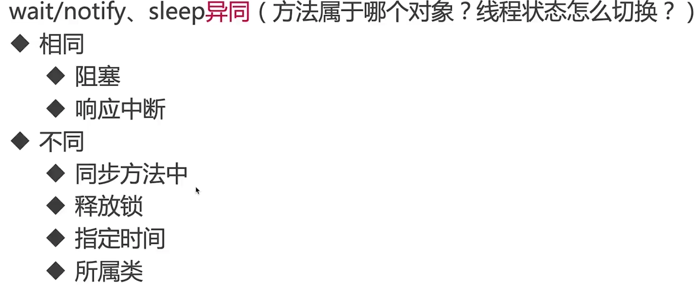

## 第1章 开宗明义【不看错过一个亿】

  本章一连串设问：为什么学并发编程？学并发编程痛点？谁适合学习本课？本课程包含内容和亮点？首先4大个理由告诉你为什么要学，其实源于JD岗位要求就不得不服了。其次5个痛点+12个亮点，是否说服你要死磕Java并发编程呢？...


  ###  1-1 Java并发成神之路——线程8大基础和Java内存模型**试看**

* 线程八大核心
* java内存模型
* 死锁的前世今生

## 第2章 跨越第一座山“线程八大核心”【适用于纵观全貌】

  八大核心-序章。从本章开始将带你攻克并发编程领域的“第一座大山”：多线程八大核心。

###  2-1 纵观全貌——线程八大核心

* 实现线程的方法
* 启动线程的正确和错误方法
* 停止线程的正确方法
* 线程的6个状态
* Thread和Object类中和线程相关的重要方法
* 线程各属性
* 线程的未捕获异常UncaughtException应该如何处理
* 线程是把双刃剑

###  2-2 抛砖引玉——初识八大基础

1. 实现多线程的方法到底有1中还是2种还是4种？
2. 怎样才是正确的线程启动方式？
3. 上山容易下山难-如何正确停止线程？（难点）
4. 线程的一生-6个状态（生命周期）
5. Thread和Object类中的重要方法详解
6. 线程的各个属性
7. 未捕获异常如何处理
8. 双刃剑：多线程会导致的问题

###  2-3 思维导图地址汇总

[面试题](https://docs.qq.com/doc/DSVNyZ2FNWWFkeFpO)

[线程八大核心](https://naotu.baidu.com/file/07f437ff6bc3fa7939e171b00f133e17?token=6744a1c6ca6860a0)

[java内存模型](https://naotu.baidu.com/file/60a0bdcaca7c6b92fcc5f796fe6f6bc9?token=bcdbae34bb3b0533)

[死锁--从产生到消除](http://naotu.baidu.com/file/ec7748c253f4fc9d88ac1cc1e47814f3?token=bb71b5895a747d67)

[思维导图面试必考](http://naotu.baidu.com/file/29942292cd032adfae23c09783676004?token=130df3d389cab703)

[并发工具分类](http://naotu.baidu.com/file/3902a010470d7c1cf76fe719be124797?token=bec25)

## 第3章 核心1：实现多线程的正确姿势【解读官方文档，够权威】

  相信很多小伙伴经常在各大技术博客或者论坛甚至面试中、工作中迷茫于线程到底有几种实现方式。真如网络所说实现线程有N种方式么？本章节利用【官方文档】现身说法，足够权威，让你即使面对面试官也能从容不迫。

###  3-1 迷雾重重——究竟如何创建新线程？


**方法一**

```java
package com.chenfeng.thread2.createthreadmenthod;
/**
 * @Classname RunnableStyle
 * @Description 创建线程的方式实现runnable接口
 * @Date 2020/5/7 0:39
 * @Created by  wrsChen
 */

public  class RunnableStyle implements Runnable{
    public static void main(String[] args) {
        Thread thread = new Thread(new RunnableStyle());
        thread.start();
    }
    @Override
    public void run() {
        System.out.println("使用runnable方式创建线程");
    }
}

```

**方法二**

```java
package com.chenfeng.thread2.createthreadmenthod;

/**
 * @Classname ThreadStyle
 * @Description TODO
 * @Date 2020/5/7 0:43
 * @Created by  wrsChen
 */
public class ThreadStyle extends Thread{


    public static void main(String[] args) {
        Thread thread = new Thread(new ThreadStyle());
        thread.start();
    }
    @Override
    public void run() {
        System.out.println("threadf方式");
    }

}

```

方法1实现（实现Runnable）更好

* 从代码架构角度：具体的任务（run方法）应该和“创建和运行线程的机制（Thread类）”解耦，用runnable对象可以实现解耦。

* 使用继承Thread的方式的话，那么每次想新建一个任务，只能新建一个独立的线程，而这样做的损耗会比较大（比如重头开始创建一个线程、执行完毕以后再销毁等。如果线程的实际工作内容，也就是run()函数里只是简单的打印一行文字的话，那么可能线程的实际工作内容还不如损耗来的大）。如果使用Runnable和线程池，就可以大大减小这样的损耗。

* 继承Thread类以后，由于Java语言不支持双继承，这样就无法再继承其他的类，限制了可扩展性。

**两种方法的对比**

* 方法一：最终调用(target=Runnable)target.run()
* 方法二：run()整个被重写

###  3-2 无独有偶——同时使用两种方法；正确实现方法的总结

```java
package com.chenfeng.thread2.createthreadmenthod;

/**
 * @Classname Both
 * @Description 同时使用两种方式Runnable和Thread两种实现线程的方式
 * @Date 2020/5/7 19:48
 * @Created by  wrsChen
 */
public class BothRunnableThread {
    public static void main(String[] args) {
        new Thread(new Runnable() {
            @Override
            public void run() {
                System.out.println("我是Runnable方式实现的");
            }
        }){
            @Override
            public void run(){
                System.out.println("我来自Thread");
            }
        }.start();
    }

}
// 原因是运行的是重写后的run方法而不是Thread类里的run方法
```

**精准描述**

* 通常我们可以分为两类，Oracle也是这么说的
* 准确的讲，创建线程只有一种方式那就是构建Thread类，而实现线程的执行单元有两种方式

###  3-3 偏信则暗——典型错误观点

认为下面这些都是创建线程的方法，这些观点是不正确的

* 线程池

  ```java
  package com.chenfeng.thread2.createthreadmenthod.errways;
  
  
  import java.util.concurrent.ExecutorService;
  import java.util.concurrent.Executors;
  
  /**
   * @Classname ThreadPool
   * @Description TODO
   * @Date 2020/5/7 20:32
   * @Created by  wrsChen
   */
  public class ThreadPool {
      public static void main(String[] args) {
          ExecutorService executorService = Executors.newCachedThreadPool();
          for (int i=0; i < 1000; i++ ) {
              executorService.submit(new Task() {
  
              });
          }
      }
  
  }
  
  class Task implements Runnable{
  
      @Override
      public void run() {
          try {
              Thread.sleep(500);
          } catch (InterruptedException e) {
              e.printStackTrace();
          }
          System.out.println(Thread.currentThread().getName());
      }
  
  }
  ```

* Callable和FutureTask

  

  

  

* 有返回值是callable无返回值是runnable

* 使用定时器

* 匿名内部类

  ```java
  package com.chenfeng.thread.wrongways;
  
  
  /**
   * @Classname Annony
   * @Description TODO
   * @Date 2020/5/7 21:13
   * @Created by  wrsChen
   */
  public class Annony {
  
      public static void main(String[] args) {
          // 匿名内部类Ruabble方式
          new Thread(new Runnable() {
              @Override
              public void run() {
  
              }
          }).start();
          // 匿名内部类Thread方式
          new Thread(){
              @Override
              public  void run(){
  
              }
          }.start();
      }
  }
  
  ```

* Lambda表达式

  ```java
  package com.chenfeng.thread.wrongways;
  /**
   * @Classname Lambda
   * @Description TODO
   * @Date 2020/5/7 21:19
   * @Created by  wrsChen
   */
  public class Lambda {
      public static void main(String[] args) {
          new Thread(() -> System.out.println(Thread.currentThread().getName()))
                  .start();
      }
  }
  ```

* 多线程的实现方式，在代码中写法千变万化，但其本质万变不离其宗

###  3-4 授人以渔——彩蛋：【优质学习路径】

 * 宏观上

        * 并不是靠工作年限，有的人工作了五年技术却还是只懂皮毛
        * 要有强大的责任心，不放过任务bug，找到原因并去解决
    * 主动：永远不会觉得自己的时间多于，重构、优化、学习、总结
    * 敢于承担：虽然这个技术没碰到过，但是移动的调研后，敢于承担技术难题
    * 关心产品，关系业务
    
 * 微观上
   
        * 看经典书籍（比如java并发编程实战、自顶向下计算机网络）
        * 看官方文档
    * 英文google和stackoverflow
    * 自己动手写，实践写demo尝试用到项目里
    * 不理解的参考领域的多个书本，综合判断

###  3-5 日新月异——彩蛋：【如何了解技术前沿动态？】

* 高质量固定途径：ohmyrss.com
* 订阅技术网址的邮件InfoQ
* 公众号不推荐作为技术知识来源，质量无法保证

###  3-6 奋发蹈厉——彩蛋：【如何在业务缠身的情况下让技术快速成长？】

* 偏业务方向
* 核心模型
  *  复杂的业务抽象化
  *  进行思考，业务扩展等
  
* 偏技术方法   
     * 两个25%
       * 程序员中的前25%
       * 在另外一个领域在做到25%

###  3-7 眼前一亮——实现多线程常见面试问题


## 第4章 核心2：开启多线程启动的世界

  本章借着案例深入剖析start()和run()方法原理，最后以面试问题检验小伙伴学习成果，巩固本章知识。

###  4-1 初出茅庐——启动线程的正确姿势

* start()he1run()的比较

  ```java
  package com.chenfeng.thread2.createthreadmenthod.startRunMethod;
  
  /**
   * @Classname StartAndRunMethod
   * @Description TODO
   * @Date 2020/5/7 22:09
   * @Created by  wrsChen
   */
  public class StartAndRunMethod {
      public static void main(String[] args) {
          Runnable runnable = () ->{
              System.out.println(Thread.currentThread().getName());  
          };
          runnable.run();
          new Thread(runnable).start();
      }
  }
  ```

  **执行结果**

  

###  4-2 起承转合——start()方法原理解读

* start()方法含义

  * 启动新线程

    start会有两个线程，父线程启动之后才会启动我们的新线程

  * 准备工作

    处于就绪状态（获取除cpu意外的其他资源），

  * 不能重复执行start，否则会报错（源码中有做重复判断）

* 源码解读

  * 启动新线程检查线程状态
  * 加入线程组
  * 调用start0方法

###  4-3 中流砥柱——run()方法原理解读

* 源码解读

* 两种情况

  实际上跟执行普通方法是一样的

###  4-4 天缘凑合——彩蛋：【Java名字由来的奇闻轶事】

咖啡豆，爪哇尼西亚-》爪哇

###  4-5 启动线程——常见面试问题

* 一个线程两次调用start()方法会出现什么情况？为什么？
* 既然start()方法会调用run()方法，为什么我们选择调用start()方法，而不是直接调用run()方法呢？

## 第5章 核心3：线程停止、中断之最佳实践【填“坑”式教学，从错误到正确】

  牢记线程停止原则，做优秀的线程掌门人。线程停止、中断，从错误到正确的最佳实践之路，带你从错误中总结真理。本章首先设“坑”，以错误方式停止或是中断线程，再回归正道。

###  5-1 偃旗息鼓——让线程停下来


###  5-2 奉公守法——牢记线程启停原则，做优秀的线程掌控者

* 原理介绍

  使用interrupt来通知，而不是强制

* 被停止的线程最清楚自己要干什么

###  5-3 普通情况——停止线程的最佳实践

* 通常线程会在什么情况下停止普通情况

* 线程可能被阻塞

* 如果线程在每次迭代后都被阻塞

  **普通情况停止线程**

  ```java
  package com.chenfeng.thread2.createthreadmenthod.stopthreads;
  
  /**
   * @Classname RightWayStopThreadWithoutSleep
   * @Description run方法没有sleep或wait方法时，停止线程
   * @Date 2020/5/8 21:01
   * @Created by  wrsChen
   */
  public class RightWayStopThreadWithoutSleep implements Runnable{
      public static void main(String[] args) throws InterruptedException {
        Thread thread =  new Thread(new RightWayStopThreadWithoutSleep());
        thread.start();
        Thread.sleep(1000);
        thread.interrupt();
      }
      @Override
      public void run() {
          int num = 0;
          // 判断当前线程的状态，如果检测到状态是中断状态
          while(!Thread.currentThread().isInterrupted()&&num<= Integer.MAX_VALUE/2){
              if (num%10000==0) {
                  System.out.println(num+"是10000的倍数");
              }
              num++;
          }
          System.out.println("程序运行结束");
      }
  }
  
  ```

###  5-4 遭遇阻塞——当停止线程遇到线程阻塞，怎么办？

```java
package com.chenfeng.thread2.createthreadmenthod.stopthreads;

/**
 * @Classname RightWayStopThreadWithoutSleep
 * @Description run方法带有sleep或wait中断方法时，停止线程
 * @Date 2020/5/8 21:01
 * @Created by  wrsChen
 */
public class RightWayStopThreadWithSleep{
    public static void main(String[] args) throws InterruptedException {
        Runnable runnable = () ->{
            int num =0;
            while (num<=300 && !Thread.currentThread().isInterrupted()){
                if (num % 100 == 0) {
                    System.out.println(num +"是100的倍数");
                }
                num ++;
            }
            try {
                Thread.sleep(1000);
            } catch (InterruptedException e) {
                e.printStackTrace();
            }
        };
        Thread thread = new Thread(runnable);
        thread.start();
        Thread.sleep(500);
        thread.interrupt();
    }
}

```

**实验结果**


```java
package com.chenfeng.thread2.createthreadmenthod.stopthreads;

/**
 * @Classname RightWayStopThreadWithSleepEveryLoop
 * @Description 果在执行过程中，每次循环都会调用sleep或wait等方法，那么不需要每次迭代都检查是否已中断
 * @Date 2020/5/8 22:11
 * @Created by  wrsChen
 */
public class RightWayStopThreadWithSleepEveryLoop {
    public static void main(String[] args) throws InterruptedException {
        Runnable runnable = () ->{
            int num =0;

            try {
                //while (num<=10000 && !Thread.currentThread().isInterrupted()){
                while (num<=10000){
                if (num % 100 == 0) {
                    System.out.println(num +"是100的倍数");
                }
                num ++;
                Thread.sleep(10);
            }
            } catch (InterruptedException e) {
                e.printStackTrace();
            }
        };
        Thread thread = new Thread(runnable);
        thread.start();
        Thread.sleep(5000);
        thread.interrupt();
    }
}
```

###  5-5 大跌眼镜——这是bug吗？自动清除中断信号

* 如果在while里面放try/catch会导致中断失效

  ```java
  /**
   * 描述：如果while里面放try/catch，会导致中断失效
   */
  public class CantInterrupt {
  
      public static void main(String[] args) throws InterruptedException {
          Runnable runnable = () -> {
              int num = 0;
              while (num <= 10000 && !Thread.currentThread().isInterrupted()) {
                  if (num % 100 == 0) {
                      System.out.println(num + "是100的倍数");
                  }
                  num++;
                  try {
                      Thread.sleep(10);
                  } catch (InterruptedException e) {
                      e.printStackTrace();
                  }
              }
          };
          Thread thread = new Thread(runnable);
          thread.start();
          Thread.sleep(5000);
          thread.interrupt();
      }
  }
  ```

  * 出异常之后线程的状态会被清除

###  5-6 最佳实践——中断线程的两种姿势之优先抛出

* 优先选择：传递中断

  ```java
  /**
   * @Classname RightWaysStopThreadInProd
   * @Description 最佳实践：catch了InterruptedExcetion之后的优先选择：在方法签名中抛出异常 那么在run()就会强制try/catch
   由顶层方法区处理异常
   * @Date 2020/5/9 10:51
   * @Created by  wrsChen
   */
  public class RightWaysStopThreadInProd implements Runnable{
      //run顶层方法无法排除异常，重写的是父类的方法，父类的方法没有对此做处理
      @Override
      public void run() {
          while (true && !Thread.currentThread().isInterrupted()) {
              System.out.println("go");
              try {
                  throwInMethod();
              } catch (InterruptedException e) {
                  Thread.currentThread().interrupt();
                  //保存日志、停止程序
                  System.out.println("保存日志");
                  e.printStackTrace();
              }
          }
      }
  
      private void throwInMethod() throws InterruptedException {
          Thread.sleep(2000);
      }
  
      public static void main(String[] args) throws InterruptedException {
          Thread thread = new Thread(new RightWayStopThreadInProd());
          thread.start();
          Thread.sleep(1000);
          thread.interrupt();
      }
  }
  ```
  
  
  

###  5-7 官复原职——中断线程的两种姿势之恢复中断

```java
/**
 * @descript:描述：最佳实践2：在catch子语句中调用Thread.currentThread().interrupt()来恢复设置中断状态，以便于在后续的执行中，依然能够检查到刚才发生了中断 * 回到刚才RightWayStopThreadInProd补上中断，让它跳出
 * @author： chenfeng
 * @date： 2020/5/9 11:02
 */
public class RightWayStopThreadInProd2 implements Runnable {

    @Override
    public void run() {
        while (true) {
            if (Thread.currentThread().isInterrupted()) {
                System.out.println("Interrupted，程序运行结束");
                break;
            }
            reInterrupt();
        }
    }

    private void reInterrupt() {
        try {
            Thread.sleep(2000);
        } catch (InterruptedException e) {
            Thread.currentThread().interrupt();// 如果出现异常重新设置中断信息
            e.printStackTrace();
        }
    }

    public static void main(String[] args) throws InterruptedException {
        Thread thread = new Thread(new RightWayStopThreadInProd2());
        thread.start();
        Thread.sleep(1000);
        thread.interrupt();
    }
}
```

* 不应屏蔽中断

###  5-8 耳听八方——网罗响应线程中断的N种方法


###  5-9 不速之客——彩蛋：【Java异常体系】


###  5-10 戛然而止——错误的停止线程方法之一-模拟军队发放武器

* 被弃用的stop，suspend（线程挂机，带着锁休息）和resume方法

  ```java
  /**
   * 描述：     错误的停止方法：用stop()来停止线程，会导致线程运行一半突然停止，没办法完成一个基本单位的操作（一个连队），会造成脏数据（有的连队多领取少领取装备）。
   */
  public class StopThread implements Runnable {
  
      @Override
      public void run() {
          //模拟指挥军队：一共有5个连队，每个连队10人，以连队为单位，发放武器弹药，叫到号的士兵前去领取
          for (int i = 0; i < 5; i++) {
              System.out.println("连队" + i + "开始领取武器");
              for (int j = 0; j < 10; j++) {
                  System.out.println(j);
                  try {
                      Thread.sleep(50);
                  } catch (InterruptedException e) {
                      e.printStackTrace();
                  }
              }
              System.out.println("连队"+i+"已经领取完毕");
          }
      }
  
      public static void main(String[] args) {
          Thread thread = new Thread(new StopThread());
          thread.start();
          try {
              Thread.sleep(1000);
          } catch (InterruptedException e) {
              e.printStackTrace();
          }
          thread.stop();
      }
  }
  ```

* 用volatile和boolean标记位

###  5-11 看似可行——错误的停止线程方法之二-volatile的标记位

```java
/**
 * 描述：     演示用volatile的局限：part1 看似可行
 */
public class WrongWayVolatile implements Runnable {

    private volatile boolean canceled = false;

    @Override
    public void run() {
        int num = 0;
        try {
            while (num <= 100000 && !canceled) {
                if (num % 100 == 0) {
                    System.out.println(num + "是100的倍数。");
                }
                num++;
                Thread.sleep(1);
            }
        } catch (InterruptedException e) {
            e.printStackTrace();
        }
    }

    public static void main(String[] args) throws InterruptedException {
        WrongWayVolatile r = new WrongWayVolatile();
        Thread thread = new Thread(r);
        thread.start();
        Thread.sleep(5000);
        r.canceled = true;
    }
}
```

```java
/**
 * 描述：     演示用volatile的局限part2 陷入阻塞时，volatile是无法线程的 此例中，生产者的生产速度很快，消费者消费速度慢，所以阻塞队列满了以后，生产者会阻塞，等待消费者进一步消费
 */
public class WrongWayVolatileCantStop {

    public static void main(String[] args) throws InterruptedException {
        ArrayBlockingQueue storage = new ArrayBlockingQueue(10);

        Producer producer = new Producer(storage);
        Thread producerThread = new Thread(producer);
        producerThread.start();
        Thread.sleep(1000);

        Consumer consumer = new Consumer(storage);
        while (consumer.needMoreNums()) {
            System.out.println(consumer.storage.take()+"被消费了");
            Thread.sleep(100);
        }
        System.out.println("消费者不需要更多数据了。");

        //一旦消费不需要更多数据了，我们应该让生产者也停下来，但是实际情况
        producer.canceled=true;
        System.out.println(producer.canceled);
    }
}

class Producer implements Runnable {

    public volatile boolean canceled = false;

    BlockingQueue storage;

    public Producer(BlockingQueue storage) {
        this.storage = storage;
    }


    @Override
    public void run() {
        int num = 0;
        try {
            while (num <= 100000 && !canceled) {
                if (num % 100 == 0) {
                    storage.put(num);//满了之后一直在这里阻塞着，没有继续往下走
                    System.out.println(num + "是100的倍数,被放到仓库中了。");
                }
                num++;
            }
        } catch (InterruptedException e) {
            e.printStackTrace();
        } finally {
            System.out.println("生产者结束运行");
        }
    }
}

class Consumer {

    BlockingQueue storage;

    public Consumer(BlockingQueue storage) {
        this.storage = storage;
    }

    public boolean needMoreNums() {
        if (Math.random() > 0.95) {
            return false;
        }
        return true;
    }
}
```


###  5-12 跌跌跄跄——失效导致永久等待【路走错了，莫慌，回头是岸】

```java
/**
 * 描述：     用中断来修复刚才的无尽等待问题
 */
public class WrongWayVolatileFixed {

    public static void main(String[] args) throws InterruptedException {
        WrongWayVolatileFixed body = new WrongWayVolatileFixed();
        ArrayBlockingQueue storage = new ArrayBlockingQueue(10);

        Producer producer = body.new Producer(storage);
        Thread producerThread = new Thread(producer);
        producerThread.start();
        Thread.sleep(1000);

        Consumer consumer = body.new Consumer(storage);
        while (consumer.needMoreNums()) {
            System.out.println(consumer.storage.take() + "被消费了");
            Thread.sleep(100);
        }
        System.out.println("消费者不需要更多数据了。");


        producerThread.interrupt();
    }


    class Producer implements Runnable {

        BlockingQueue storage;

        public Producer(BlockingQueue storage) {
            this.storage = storage;
        }


        @Override
        public void run() {
            int num = 0;
            try {
                while (num <= 100000 && !Thread.currentThread().isInterrupted()) {
                    if (num % 100 == 0) {
                        storage.put(num);
                        System.out.println(num + "是100的倍数,被放到仓库中了。");
                    }
                    num++;
                }
            } catch (InterruptedException e) {
                e.printStackTrace();
            } finally {
                System.out.println("生产者结束运行");
            }
        }
    }

    class Consumer {

        BlockingQueue storage;

        public Consumer(BlockingQueue storage) {
            this.storage = storage;
        }

        public boolean needMoreNums() {
            if (Math.random() > 0.95) {
                return false;
            }
            return true;
        }
    }
}
```


###  5-13 直击本质——彩蛋：【分析native层代码——以interrupt为例】


###  5-14 明辨是非——练习：判断interrupt状态的方法辨析


```java
/**
 * 描述：     注意Thread.interrupted()方法的目标对象是“当前线程”，
 * 而不管本方法来自于哪个对象
 */
public class RightWayInterrupted {

    public static void main(String[] args) throws InterruptedException {

        Thread threadOne = new Thread(new Runnable() {
            @Override
            public void run() {
                for (; ; ) {
                }
            }
        });

        // 启动线程
        threadOne.start();
        //设置中断标志
        threadOne.interrupt();
        //获取中断标志
        System.out.println("isInterrupted: " + threadOne.isInterrupted());
        //获取中断标志并重置，执行这个方法的线程，由于之前的线程被中断，则执行的是
        // 当前调用他的线程
        System.out.println("isInterrupted: " + threadOne.interrupted());
        //获取中断标志并重直
        System.out.println("isInterrupted: " + Thread.interrupted());
        //获取中断标志
        System.out.println("isInterrupted: " + threadOne.isInterrupted());
        threadOne.join();
        System.out.println("Main thread is over.");
    }
}
```

**实验结果**


###  5-15 停止线程——常见面试问题


* 如何处理不可中断

## 第6章 核心4：图解线程生命周期【适用于面试】

 一图胜千言，面试亮出此图“线程生命周期图”，优秀的候选人非你莫属。本章详解线程的6种状态、转化路径、触发条件，同时配备完善的案例演示，最后通过面试问题检验你的学习成果，助你轻松掌握内容。

###  6-1 纵观天下——线程的生命周期

* 有哪6种状态?
* 每个状态是什么含义？
* 状态间的转化图示？
* 阻塞状态是什么
* 常见面试问题

###  6-2 一图千言——状态的含义和变化

* New

  已创建还未启动

* Runnable（可运行的）

  调用start进入runnable

* Blocked

  进入synchronized修饰的代码块或者方法

* Waiting

* Timed Waiting

* Terminated

  

###  6-3 眼见为实——演示前3种状态：NEW、RUNNABLE、TERMINATED

```java
/**
 * 描述：     展示线程的NEW、RUNNABLE、Terminated状态。即使是正在运行，也是Runnable状态，而不是Running。
 */
public class NewRunnableTerminated implements Runnable {

    public static void main(String[] args) {
        Thread thread = new Thread(new NewRunnableTerminated());
        // 打印出NEW的状态
        System.out.println(thread.getState());
        thread.start();
        // 打印出RUNNABLE的状态
        System.out.println(thread.getState());
        try {
            Thread.sleep(10);
        } catch (InterruptedException e) {
            e.printStackTrace();
        }
        // 打印出RUNNABLE的状态，即使是正在运行，也是RUNNABLE，而不是RUNNING
        System.out.println(thread.getState());
        try {
            Thread.sleep(100);
        } catch (InterruptedException e) {
            e.printStackTrace();
        }
        // 打印出TERMINATED状态
        System.out.println(thread.getState());
    }

    @Override
    public void run() {
        for (int i = 0; i < 1000; i++) {
            System.out.println(i);
        }
    }
}
```


###  6-4 眼见为实——演示后3种状态：BLOCKED、WAITING、TIMED_WAITING

```java

/**
 * 描述：     展示Blocked, Waiting, TimedWaiting
 */
public class BlockedWaitingTimedWaiting implements Runnable{
    public static void main(String[] args) {
        BlockedWaitingTimedWaiting runnable = new BlockedWaitingTimedWaiting();
        Thread thread1 = new Thread(runnable);
        thread1.start();
        Thread thread2 = new Thread(runnable);
        thread2.start();
        try {
            Thread.sleep(5);
        } catch (InterruptedException e) {
            e.printStackTrace();
        }
        //打印出Timed_Waiting状态，因为正在执行Thread.sleep(1000);
        System.out.println(thread1.getState());
        //打印出BLOCKED状态，因为thread2想拿得到sync()的锁却拿不到
        System.out.println(thread2.getState());
        try {
            Thread.sleep(1300);
        } catch (InterruptedException e) {
            e.printStackTrace();
        }
        //打印出WAITING状态，因为执行了wait()
        System.out.println(thread1.getState());

    }

    @Override
    public void run() {
        syn();
    }

    private synchronized void syn() {
        try {
            Thread.sleep(1000);
            wait();
        } catch (InterruptedException e) {
            e.printStackTrace();
        }
    }
}
```


###  6-5 生命周期——状态转换的注意点、阻塞的定义、面试问题


* 线程有几种状态？生命周期是什么？

## 第7章 核心5：趣解Thread和Object类中线程相关方法【只学有用的】

  Thread类和Object类中，有很多和线程息息相关的重要方法，包含wait(), notify(), notifyAll(), sleep(), join(), yield(), Thread.currentThread()等，本章对这些重要方法进行详解，从用法到面试，面面俱到。

###  7-1 中流砥柱——7个重要方法概览


###  7-2 你方唱罢——wait的作用和用法

* 阻塞阶段

* 四种被唤醒

  * 另外一个线程调用这个对象的notify方法且刚好被唤醒的是本线程
  * 另一个线程调用这个对象的notifyAll
  * 过了wait（long timeout）规定的超时时间，如果传入0就是永久等待
  * 线程自身调用了interrupt

* 遇到中断

  ***

  ```java
  /**
  * 普通用法
   * 描述：     展示wait和notify的基本用法 1. 研究代码执行顺序 2. 证明wait释放锁
   */
  public class Wait {
  
      public static Object object = new Object();
  
      static class Thread1 extends Thread {
  
          @Override
          public void run() {
              synchronized (object) {
                  System.out.println(Thread.currentThread().getName() + "开始执行了");
                  try {
                      object.wait();// 线程等待被唤醒
                  } catch (InterruptedException e) {
                      e.printStackTrace();
                  }
                  System.out.println("线程" + Thread.currentThread().getName() + "获取到了锁。");
              }
          }
      }
  
      static class Thread2 extends Thread {
  
          @Override
          public void run() {
              synchronized (object) {// Thread1使用wait释放了锁，这边拿到了锁
                  object.notify();// 
                  System.out.println("线程" + Thread.currentThread().getName() + "调用了notify()");
              }
          }
      }
  
      public static void main(String[] args) throws InterruptedException {
          Thread1 thread1 = new Thread1();
          Thread2 thread2 = new Thread2();
          thread1.start();
          Thread.sleep(200);
          thread2.start();
      }
  }
  ```


###  7-3 我方登场——notify与notifyAll的区别

```java
/**
 * 描述：3个线程，线程1和线程2首先被阻塞，线程3唤醒它们。notify, notifyAll。 start先执行不代表线程先启动。
 */
public class WaitNotifyAll implements Runnable {

    private static final Object resourceA = new Object();


    public static void main(String[] args) throws InterruptedException {
        Runnable r = new WaitNotifyAll();
        Thread threadA = new Thread(r);
        Thread threadB = new Thread(r);
        Thread threadC = new Thread(new Runnable() {
            @Override
            public void run() {
                synchronized (resourceA) {
                    resourceA.notifyAll();
//                    resourceA.notify();
                    System.out.println("ThreadC notified.");
                }
            }
        });
        threadA.start();
        threadB.start();
//        Thread.sleep(200);
        threadC.start();
    }
    @Override
    public void run() {
        synchronized (resourceA) {
            System.out.println(Thread.currentThread().getName()+" got resourceA lock.");
            try {
                System.out.println(Thread.currentThread().getName()+" waits to start.");
                resourceA.wait();
                System.out.println(Thread.currentThread().getName()+"'s waiting to end.");
            } catch (InterruptedException e) {
                e.printStackTrace();
            }
        }
    }
}

```


###  7-4 忠心耿耿——wait只释放当前monitor

```java
/**
 * 描述：     证明wait只释放当前的那把锁
 */
public class WaitNotifyReleaseOwnMonitor {

    private static volatile Object resourceA = new Object();
    private static volatile Object resourceB = new Object();

    public static void main(String[] args) {
        Thread thread1 = new Thread(new Runnable() {
            @Override
            public void run() {
                synchronized (resourceA) {
                    System.out.println("ThreadA got resourceA lock.");
                    synchronized (resourceB) {
                        System.out.println("ThreadA got resourceB lock.");
                        try {
                            System.out.println("ThreadA releases resourceA lock.");
                            resourceA.wait();

                        } catch (InterruptedException e) {
                            e.printStackTrace();
                        }
                    }
                }
            }
        });

        Thread thread2 = new Thread(new Runnable() {
            @Override
            public void run() {
                try {
                    Thread.sleep(1000);
                } catch (InterruptedException e) {
                    e.printStackTrace();
                }
                synchronized (resourceA) {
                    System.out.println("ThreadB got resourceA lock.");
                    System.out.println("ThreadB tries to resourceB lock.");

                    synchronized (resourceB) {
                        System.out.println("ThreadB got resourceB lock.");
                    }
                }
            }
        });

        thread1.start();
        thread2.start();
    }
}
```


###  7-5 一针见血——wait/notify的原理、特点


###  7-6 生产消费——用wait/notify实现


```java
/**
 * 描述：     用wait/notify来实现生产者消费者模式
 */
public class ProducerConsumerModel {
    public static void main(String[] args) {
        EventStorage eventStorage = new EventStorage();
        Producer producer = new Producer(eventStorage);
        Consumer consumer = new Consumer(eventStorage);
        new Thread(producer).start();
        new Thread(consumer).start();
    }
}

class Producer implements Runnable {

    private EventStorage storage;

    public Producer(
            EventStorage storage) {
        this.storage = storage;
    }

    @Override
    public void run() {
        for (int i = 0; i < 100; i++) {
            storage.put();
        }
    }
}

class Consumer implements Runnable {

    private EventStorage storage;

    public Consumer(
            EventStorage storage) {
        this.storage = storage;
    }

    @Override
    public void run() {
        for (int i = 0; i < 100; i++) {
            storage.take();
        }
    }
}

class EventStorage {

    private int maxSize;
    private LinkedList<Date> storage;

    public EventStorage() {
        maxSize = 10;
        storage = new LinkedList<>();
    }

    public synchronized void put() {
        while (storage.size() == maxSize) {
            try {
                wait();
            } catch (InterruptedException e) {
                e.printStackTrace();
            }
        }
        storage.add(new Date());
        System.out.println("仓库里有了" + storage.size() + "个产品。");
        notify();
    }

    public synchronized void take() {
        while (storage.size() == 0) {
            try {
                wait();
            } catch (InterruptedException e) {
                e.printStackTrace();
            }
        }
        System.out.println("拿到了" + storage.poll() + "，现在仓库还剩下" + storage.size());
        notify();
    }
}
```


###  7-7 你来我往——两个线程交替打印0~100的奇偶数

* 两个线程交替打印0~100的奇偶数

  * 方式一：sychronized
  * 方式二：wait notify

* 方式一

  ```java
  /**
   * 描述：     两个线程交替打印0~100的奇偶数，用synchronized关键字实现
   */
  public class WaitNotifyPrintOddEvenSyn {
  
      private static int count;
  
      private static final Object lock = new Object();
  
      //新建2个线程
      //1个只处理偶数，第二个只处理奇数（用位运算）
      //用synchronized来通信
      public static void main(String[] args) {
          new Thread(new Runnable() {
              @Override
              public void run() {
                  while (count < 100) {
                      synchronized (lock) {
                          if ((count & 1) == 0) {
                              System.out.println(Thread.currentThread().getName() + ":" + count++);
                          }
                      }
                  }
              }
          }, "偶数").start();
  
          new Thread(new Runnable() {
              @Override
              public void run() {
                  while (count < 100) {
                      synchronized (lock) {
                          if ((count & 1) == 1) {
                              System.out.println(Thread.currentThread().getName() + ":" + count++);
                          }
                      }
                  }
              }
          }, "奇数").start();
      }
  }
  ```

* 方式二

  ```java
  /**
   * 描述：     两个线程交替打印0~100的奇偶数，用wait和notify
   */
  public class WaitNotifyPrintOddEveWait {
  
      private static int count = 0;
      private static final Object lock = new Object();
  
  
      public static void main(String[] args) {
          new Thread(new TurningRunner(), "偶数").start();
          new Thread(new TurningRunner(), "奇数").start();
      }
  
      //1. 拿到锁，我们就打印
      //2. 打印完，唤醒其他线程，自己就休眠
      static class TurningRunner implements Runnable {
  
          @Override
          public void run() {
              while (count <= 100) {
                  synchronized (lock) {
                      //拿到锁就打印
                      System.out.println(Thread.currentThread().getName() + ":" + count++);
                      lock.notify();
                      if (count <= 100) {
                          try {
                              //如果任务还没结束，就让出当前的锁，并休眠
                              lock.wait();
                          } catch (InterruptedException e) {
                              e.printStackTrace();
                          }
                      }
                  }
              }
          }
      }
  }
  ```

###  7-8 面试问题——wait相关高频面试题

          


###  7-9 熟悉陌生——彩蛋：Java相关概念辨析，JDK、JRE、JVM、Java SE


###  7-10 各持己见——sleep方法概览、不释放锁

* 作用：我只想让线程在预期的时间执行，其他时候不要占用cpu资源
* 不释放锁
  * 包括synchronized和lock
  * 和wait不同

```java
/**
 * 展示线程sleep的时候不释放synchronized的monitor，等sleep时间到了以后，正常结束后才释放锁
 */
public class SleepDontReleaseMonitor implements Runnable {

    public static void main(String[] args) {
        SleepDontReleaseMonitor sleepDontReleaseMonitor = new SleepDontReleaseMonitor();
        new Thread(sleepDontReleaseMonitor).start();
        new Thread(sleepDontReleaseMonitor).start();
    }

    @Override
    public void run() {
        syn();
    }

    private synchronized void syn() {
        System.out.println("线程" + Thread.currentThread().getName() + "获取到了monitor。");
        try {
            Thread.sleep(5000);
        } catch (InterruptedException e) {
            e.printStackTrace();
        }
        System.out.println("线程" + Thread.currentThread().getName() + "退出了同步代码块");
    }
}
```


```java
/**
 * 描述：     演示sleep不释放lock（lock需要手动释放）
 */
public class SleepDontReleaseLock implements Runnable {

    private static final Lock lock = new ReentrantLock();

    @Override
    public void run() {
        lock.lock();
        System.out.println("线程" + Thread.currentThread().getName() + "获取到了锁");
        try {
            Thread.sleep(5000);
            System.out.println("线程" + Thread.currentThread().getName() + "已经苏醒");
        } catch (InterruptedException e) {
            e.printStackTrace();
        } finally {
            lock.unlock();
        }
    }

    public static void main(String[] args) {
        SleepDontReleaseLock sleepDontReleaseLock = new SleepDontReleaseLock();
        new Thread(sleepDontReleaseLock).start();
        new Thread(sleepDontReleaseLock).start();
    }
}
```


###  7-11 阳春白雪——sleep响应中断、优雅写法、一句话总结、面试问题

```java
/**
 * 描述：     每个1秒钟输出当前时间，被中断，观察。
 * Thread.sleep()
 * TimeUnit.SECONDS.sleep()
 */
public class SleepInterrupted implements Runnable{

    public static void main(String[] args) throws InterruptedException {
        Thread thread = new Thread(new SleepInterrupted());
        thread.start();
        Thread.sleep(6500);
        thread.interrupt();
    }
    @Override
    public void run() {
        for (int i = 0; i < 10; i++) {
            System.out.println(new Date());
            try {
                TimeUnit.HOURS.sleep(3);
                TimeUnit.MINUTES.sleep(25);
                TimeUnit.SECONDS.sleep(1);
            } catch (InterruptedException e) {
                System.out.println("我被中断了！");
                e.printStackTrace();
            }
        }
    }
}
```




###  7-12 拭目以待——join的作用和普通用法


```java
/**
 * 描述：     演示join，注意语句输出顺序，会变化。
 */
public class Join {
    public static void main(String[] args) throws InterruptedException {
        Thread thread = new Thread(new Runnable() {
            @Override
            public void run() {
                try {
                    Thread.sleep(1000);
                } catch (InterruptedException e) {
                    e.printStackTrace();
                }
                System.out.println(Thread.currentThread().getName() + "执行完毕");
            }
        });
        Thread thread2 = new Thread(new Runnable() {
            @Override
            public void run() {
                try {
                    Thread.sleep(1000);
                } catch (InterruptedException e) {
                    e.printStackTrace();
                }
                System.out.println(Thread.currentThread().getName() + "执行完毕");
            }
        });

        thread.start();
        thread2.start();
        System.out.println("开始等待子线程运行完毕");
        thread.join();
        thread2.join();
        System.out.println("所有子线程执行完毕");
    }
}
```

###  7-13 望穿秋水——join遇到中断、join期间线程状态的两种查看方式

```java
/**
 * 描述：     演示join期间被中断的效果
 */
public class JoinInterrupt {
    public static void main(String[] args) {
        Thread mainThread = Thread.currentThread();
        Thread thread1 = new Thread(new Runnable() {
            @Override
            public void run() {
                try {
                    mainThread.interrupt();
                    Thread.sleep(5000);
                    System.out.println("Thread1 finished.");
                } catch (InterruptedException e) {
                    System.out.println("子线程中断");
                }
            }
        });
        thread1.start();
        System.out.println("等待子线程运行完毕");
        try {
            thread1.join();
        } catch (InterruptedException e) {
            System.out.println(Thread.currentThread().getName()+"主线程中断了");
            thread1.interrupt();
        }
        System.out.println("子线程已运行完毕");
    }

}

```

```java
/**
 * 描述：     先join再mainThread.getState()
 * 通过debugger看线程join前后状态的对比
 */
public class JoinThreadState {
    public static void main(String[] args) throws InterruptedException {
        Thread mainThread = Thread.currentThread();
        Thread thread = new Thread(new Runnable() {
            @Override
            public void run() {
                try {
                    Thread.sleep(3000);
                    System.out.println(mainThread.getState());
                    System.out.println("Thread-0运行结束");
                } catch (InterruptedException e) {
                    e.printStackTrace();
                }
            }
        });
        thread.start();
        System.out.println("等待子线程运行完毕");
        thread.join();
        System.out.println("子线程运行完毕");

    }
}

```

###  7-14 孪生兄弟——join注意点、原理、源码分析、替代写法、面试问题

```java
/**
 * 描述：     通过讲解join原理，分析出join的代替写法
 */
public class JoinPrinciple {

    public static void main(String[] args) throws InterruptedException {
        Thread thread = new Thread(new Runnable() {
            @Override
            public void run() {
                try {
                    Thread.sleep(1000);
                } catch (InterruptedException e) {
                    e.printStackTrace();
                }
                System.out.println(Thread.currentThread().getName() + "执行完毕");
            }
        });

        thread.start();
        System.out.println("开始等待子线程运行完毕");
        thread.join();
//        synchronized (thread) {
//            thread.wait();
//        }
        System.out.println("所有子线程执行完毕");
    }
}


```

###  7-15 孔融让梨——yield的作用、定位、和sleep的区别、currentThread举例

* 作用释放我的cpu时间片
* 定位：JV不保证遵循
* yiled和sleep区别：是否可以随时被再次调度
* Thread.currentThread,获取当前执行线程的引用

## 第8章 核心6：一网打尽线程属性

  线程属性三大经典面试问题，你晓得么？本章介绍线程的4个最重要的属性：守护线程和普通线程最大的区别是什么？为什么不应该利用线程优先级设计程序？

###  8-1 庖丁解牛——线程重要属性概览

* 什么时候需要设置守护线程
* 应该如何应用线程优先级来帮助程序运行？有哪些禁忌？
* 不同的操作系统如何处理优先级问题？


###  8-2 对号入座——线程ID，线程的唯一身份标识

```java
/**
 * 描述：     ID从1开始，JVM运行起来后，我们自己创建的线程的ID早已不是2（运行子线程时已运行其他线程）.
 */
public class Id {

    public static void main(String[] args) {
        Thread thread = new Thread();
        System.out.println("主线程的ID"+Thread.currentThread().getId());
        System.out.println("子线程的ID"+thread.getId());
    }
}

```

###  8-3 守护天使——线程名字、守护线程

* 线程名字：
  * 默认线程名字   thread-XXX 从0开始
  * 修改线程名字    线程一旦启动，native名字不能修改，但是java自己定义的名字可以修改
* 守护线程
  * 作用：给用户线程提供服务
  * 三个特性
    * 线程类型默认继承自父线程
    * 被谁启动
    * 不影响JVM退出
  * 与普通线程区别
    * 整体并无区别
    * 唯一区别在于JVM的离开


###  8-4 上上之选——线程优先级、4个属性总结、线程属性面试问题

* 10个级别，默认5
* 程序设计不应该依赖于优先级
  * 不同操作系统不一样
  * 优先级会被操作吸引改变


## 第9章 核心7：线程异常处理知多少？
无处不在的异常，只需一招自定义异常，即可御敌于千里之外。线程中的异常和我们平时的异常有很大区别，对线程内异常的处理也大有讲究。本章带你深入浅出“未捕获异常UncaughtException”。

###  9-1 居安思危——需要UncaughtException的3个理由

* 主线程可以轻松发现异常，子线程却不行
* 子线程异常无法用传统方法捕获
* 不能直接捕获的后果、提高健壮性

```java
/**
 * 描述：     单线程，抛出，处理，有异常堆栈 多线程，子线程发生异常，会有什么不同？
 */
public class ExceptionInChildThread implements Runnable {

    public static void main(String[] args) {
        new Thread(new ExceptionInChildThread()).start();
        for (int i = 0; i < 1000; i++) {
            System.out.println(i);
        }
    }

    @Override
    public void run() {
        throw new RuntimeException();
    }
}

```

```java
/**
 * 描述： 1. 不加try catch抛出4个异常，都带线程名字 2. 加了try catch,期望捕获到第一个线程的异常，线程234不应该运行，希望看到打印出Caught Exception
 * 3. 执行时发现，根本没有Caught Exception，线程234依然运行并且抛出异常
 *
 * 说明线程的异常不能用传统方法捕获
 */
public class CantCatchDirectly implements Runnable {

    public static void main(String[] args) throws InterruptedException {
        try {
            new Thread(new CantCatchDirectly(), "MyThread-1").start();
            Thread.sleep(300);
            new Thread(new CantCatchDirectly(), "MyThread-2").start();
            Thread.sleep(300);
            new Thread(new CantCatchDirectly(), "MyThread-3").start();
            Thread.sleep(300);
            new Thread(new CantCatchDirectly(), "MyThread-4").start();
        } catch (RuntimeException e) {
            System.out.println("Caught Exception.");
        }

    }

    @Override
    public void run() {
        try {
            throw new RuntimeException();
        } catch (RuntimeException e) {
            System.out.println("Caught Exception.");
        }
    }
}

```

###  9-2 层层递进——异常处理器的调用策略

方案一（不推荐）：手动在run方法里进行try catch

方案二（推荐）：利用UncaughtExceptionHandler

###  9-3 线程异常——自己实现并处理异常；常见面试问题


```java
/**
 * 描述：     自己的MyUncaughtExceptionHanlder
 */
public class MyUncaughtExceptionHandler implements Thread.UncaughtExceptionHandler {

    private String name;

    public MyUncaughtExceptionHandler(String name) {
        this.name = name;
    }

    @Override
    public void uncaughtException(Thread t, Throwable e) {
        Logger logger = Logger.getAnonymousLogger();
        logger.log(Level.WARNING, "线程异常，终止啦" + t.getName());
        System.out.println(name + "捕获了异常" + t.getName() + "异常");
    }
}

```

```java
/**
 * 描述：     使用刚才自己写的UncaughtExceptionHandler
 */
public class UseOwnUncaughtExceptionHandler implements Runnable {

    public static void main(String[] args) throws InterruptedException {
        Thread.setDefaultUncaughtExceptionHandler(new MyUncaughtExceptionHandler("捕获器1"));

        new Thread(new UseOwnUncaughtExceptionHandler(), "MyThread-1").start();
        Thread.sleep(300);
        new Thread(new UseOwnUncaughtExceptionHandler(), "MyThread-2").start();
        Thread.sleep(300);
        new Thread(new UseOwnUncaughtExceptionHandler(), "MyThread-3").start();
        Thread.sleep(300);
        new Thread(new UseOwnUncaughtExceptionHandler(), "MyThread-4").start();
    }


    @Override
    public void run() {
        throw new RuntimeException();
    }
}

```

## 第10章 核心8：追寻并发的崇高理想-线程安全【日常开发工作常用】

  线程安全与程序性能看似无法平衡的两个“死对头”，取舍之道怎么拿捏？做到“线程安全”是并发编程的最高境界和理想，但是理想丰满现实骨感，一不小心就会掉入并发安全的“陷阱”。本章将让小伙伴清晰拿捏取舍之道。

###  10-1 崇高理想——并发安全总起

* 一共有哪几类线程安全问题？
* 那些场景需要额外注意线程安全问题？
* 什么是线程带来的上下文切换？

###  10-2 线程安全——权威定义和通俗易懂的解读


* 线程不安全：get同时set、额外同步
* 全部线程安全？运行速度、设计成本、突然地off
* 完全不用于多线程：不过度设计

###  10-3 神出鬼没——结果错误，a++会让加的次数莫名消失

**什么情况下会出现线程安全问题，怎么避免？**

* 运行结果错误：a++多线程下出现消失的请求现象
* 活跃性问题：死锁、活锁、饥饿
* 对象发布和初始化的时候的安全问题

```java
/**
 * 描述：     第一种：运行结果出错。 演示计数不准确（减少），找出具体出错的位置。
 */
public class MultiThreadsError implements Runnable {

    static MultiThreadsError instance = new MultiThreadsError();
    int index = 0;
    static AtomicInteger realIndex = new AtomicInteger();
    static AtomicInteger wrongCount = new AtomicInteger();
    static volatile CyclicBarrier cyclicBarrier1 = new CyclicBarrier(2);
    static volatile CyclicBarrier cyclicBarrier2 = new CyclicBarrier(2);

    final boolean[] marked = new boolean[10000000];

    public static void main(String[] args) throws InterruptedException {

        Thread thread1 = new Thread(instance);
        Thread thread2 = new Thread(instance);
        thread1.start();
        thread2.start();
        thread1.join();
        thread2.join();
        System.out.println("表面上结果是" + instance.index);
        System.out.println("真正运行的次数" + realIndex.get());
        System.out.println("错误次数" + wrongCount.get());

    }

    @Override
    public void run() {
        marked[0] = true;
        for (int i = 0; i < 10000; i++) {
            try {
                cyclicBarrier2.reset(); // 在某一个地方启动
                cyclicBarrier1.await(); // 在某一个地方等待
            } catch (InterruptedException e) {
                e.printStackTrace();
            } catch (BrokenBarrierException e) {
                e.printStackTrace();
            }
            index++;
            try {
                cyclicBarrier1.reset();
                cyclicBarrier2.await();
            } catch (InterruptedException e) {
                e.printStackTrace();
            } catch (BrokenBarrierException e) {
                e.printStackTrace();
            }
            realIndex.incrementAndGet();
            synchronized (instance) {
                if (marked[index] && marked[index - 1]) {
                    System.out.println("发生错误" + index);
                    wrongCount.incrementAndGet();
                }
                marked[index] = true;
            }
        }
    }
}

```


###  10-4 不断进击——a++具体在哪里消失？又消失了几个呢？（上）


###  10-5 不断进击——a++具体在哪里消失？又消失了几个呢？（下）
###  10-6 互不相让——死锁发生

```java
/**
 * 描述：     第二章线程安全问题，演示死锁。
 */
public class MultiThreadError implements Runnable {

    int flag = 1;
    static Object o1 = new Object();
    static Object o2 = new Object();

    public static void main(String[] args) {
        MultiThreadError r1 = new MultiThreadError();
        MultiThreadError r2 = new MultiThreadError();
        r1.flag = 1;
        r2.flag = 0;
        new Thread(r1).start();
        new Thread(r2).start();
    }

    @Override
    public void run() {
        System.out.println("flag = " + flag);
        if (flag == 1) {
            synchronized (o1) {
                try {
                    Thread.sleep(500);
                } catch (InterruptedException e) {
                    e.printStackTrace();
                }
                synchronized (o2) {
                    System.out.println("1");
                }
            }
        }
        if (flag == 0) {
            synchronized (o2) {
                try {
                    Thread.sleep(500);
                } catch (InterruptedException e) {
                    e.printStackTrace();
                }
                synchronized (o1) {
                    System.out.println("0");
                }
            }
        }
    }
}

```

###  10-7 逃出生天——逸出private对象的后果


```java

/**
 * 描述：     发布逸出
 */
public class MultiThreadsError3 {

    private Map<String, String> states;

    public MultiThreadsError3() {
        states = new HashMap<>();
        states.put("1", "周一");
        states.put("2", "周二");
        states.put("3", "周三");
        states.put("4", "周四");
    }

    public Map<String, String> getStates() {
        return states;
    }

    public Map<String, String> getStatesImproved() {
        return new HashMap<>(states);
    }

    public static void main(String[] args) {
        MultiThreadsError3 multiThreadsError3 = new MultiThreadsError3();
        Map<String, String> states = multiThreadsError3.getStates();
//        System.out.println(states.get("1"));
//        states.remove("1");
//        System.out.println(states.get("1"));

        System.out.println(multiThreadsError3.getStatesImproved().get("1"));
        multiThreadsError3.getStatesImproved().remove("1");
        System.out.println(multiThreadsError3.getStatesImproved().get("1"));

    }
}

```

###  10-8 你中有我——this赋值

```java
/**
 * 描述：     初始化未完毕，就this赋值
 */
public class MultiThreadsError4 {

    static Point point;

    public static void main(String[] args) throws InterruptedException {
        new PointMaker().start();
//        Thread.sleep(10);
        Thread.sleep(105);
        if (point != null) {
            System.out.println(point);
        }
    }
}

class Point {

    private final int x, y;

    public Point(int x, int y) throws InterruptedException {
        this.x = x;
        MultiThreadsError4.point = this;
        Thread.sleep(100);
        this.y = y;
    }

    @Override
    public String toString() {
        return x + "," + y;
    }
}

class PointMaker extends Thread {

    @Override
    public void run() {
        try {
            new Point(1, 1);
        } catch (InterruptedException e) {
           e.printStackTrace();
        }
    }
}
```

###  10-9 心急火燎——隐藏的风险：注册监听器

```java
/**
 * 描述：     观察者模式
 */
public class MultiThreadsError5 {

    int count;

    public MultiThreadsError5(MySource source) {
        source.registerListener(new EventListener() {
            @Override
            public void onEvent(Event e) {
                System.out.println("\n我得到的数字是" + count);
            }

        });
        for (int i = 0; i < 10000; i++) {
            System.out.print(i);
        }
        count = 100;
    }

    public static void main(String[] args) {
        MySource mySource = new MySource();
        new Thread(new Runnable() {
            @Override
            public void run() {
                try {
                    Thread.sleep(10);
                } catch (InterruptedException e) {
                    e.printStackTrace();
                }
                mySource.eventCome(new Event() {
                });
            }
        }).start();
        MultiThreadsError5 multiThreadsError5 = new MultiThreadsError5(mySource);
    }

    static class MySource {

        private EventListener listener;

        void registerListener(EventListener eventListener) {
            this.listener = eventListener;
        }

        void eventCome(Event e) {
            if (listener != null) {
                listener.onEvent(e);
            } else {
                System.out.println("还未初始化完毕");
            }
        }

    }

    interface EventListener {

        void onEvent(Event e);
    }

    interface Event {

    }
}

```

###  10-10 时不我待——构造函数中新建线程

```java
/**
 * 描述：     构造函数中新建线程
 */
public class MultiThreadsError6 {

    private Map<String, String> states;

    public MultiThreadsError6() {
        new Thread(new Runnable() {
            @Override
            public void run() {
                states = new HashMap<>();
                states.put("1", "周一");
                states.put("2", "周二");
                states.put("3", "周三");
                states.put("4", "周四");
            }
        }).start();
    }

    public Map<String, String> getStates() {
        return states;
    }

    public static void main(String[] args) throws InterruptedException {
        MultiThreadsError6 multiThreadsError6 = new MultiThreadsError6();
        Thread.sleep(1000);
        System.out.println(multiThreadsError6.getStates().get("1"));
    }
}

```

###  10-11 狸猫太子——用“副本”代替“真身”

```java
/**
 * 描述：     发布逸出
 */
public class MultiThreadsError3 {

    private Map<String, String> states;

    public MultiThreadsError3() {
        states = new HashMap<>();
        states.put("1", "周一");
        states.put("2", "周二");
        states.put("3", "周三");
        states.put("4", "周四");
    }

    public Map<String, String> getStates() {
        return states;
    }

    public Map<String, String> getStatesImproved() {
        return new HashMap<>(states);
    }

    public static void main(String[] args) {
        MultiThreadsError3 multiThreadsError3 = new MultiThreadsError3();
        Map<String, String> states = multiThreadsError3.getStates();
//        System.out.println(states.get("1"));
//        states.remove("1");
//        System.out.println(states.get("1"));

        System.out.println(multiThreadsError3.getStatesImproved().get("1"));
        multiThreadsError3.getStatesImproved().remove("1");
        System.out.println(multiThreadsError3.getStatesImproved().get("1"));

    }
}
```

###  10-12 工厂模式——解决逸出的妙用

```java
/**
 * 描述：     用工厂模式修复刚才的初始化问题
 */
public class MultiThreadsError7 {

    int count;
    private EventListener listener;

    private MultiThreadsError7(MySource source) {
        listener = new EventListener() {
            @Override
            public void onEvent(MultiThreadsError5.Event e) {
                System.out.println("\n我得到的数字是" + count);
            }

        };
        for (int i = 0; i < 10000; i++) {
            System.out.print(i);
        }
        count = 100;
    }

    public static MultiThreadsError7 getInstance(MySource source) {
        MultiThreadsError7 safeListener = new MultiThreadsError7(source);
        source.registerListener(safeListener.listener);
        return safeListener;
    }

    public static void main(String[] args) {
        MySource mySource = new MySource();
        new Thread(new Runnable() {
            @Override
            public void run() {
                try {
                    Thread.sleep(10);
                } catch (InterruptedException e) {
                    e.printStackTrace();
                }
                mySource.eventCome(new MultiThreadsError5.Event() {
                });
            }
        }).start();
        MultiThreadsError7 multiThreadsError7 = new MultiThreadsError7(mySource);
    }

    static class MySource {

        private EventListener listener;

        void registerListener(EventListener eventListener) {
            this.listener = eventListener;
        }

        void eventCome(MultiThreadsError5.Event e) {
            if (listener != null) {
                listener.onEvent(e);
            } else {
                System.out.println("还未初始化完毕");
            }
        }

    }

    interface EventListener {

        void onEvent(MultiThreadsError5.Event e);
    }

    interface Event {

    }
}
```

###  10-13 面面俱到——预警编程时容易踩坑的地方


###  10-14 伤敌一千——上下文切换、内存同步

* 性能问题有哪些体现、什么是性能问题

* 为什么多线程会带来性能问题

  

* 调度：上下文和
  * 什么是上下文？：保存现场
  * 缓存开销：缓存失效
  * 何时会导致密集的上下文切换：抢锁、IO

###  10-15 自损八千——双刃剑总结

* 线程安全
* 性能问题

## 第11章 多线程的八大核心【最终回】

  在此，先预祝小伙伴们即将翻越并发的第一座大山“多线程八大核心”，本章将通过思维导图总结线程八大核心技能图谱，让小伙伴们巩固并升华前面所学知识。

###  11-1 对答如流——八大核心面试问题总结
###  11-2 全面总结——八大核心重点回顾
###  11-3 思维导图——八大核心梳理，资料下载地址

## 第12章 深入浅出并发编程底层原理-上篇

  Java内存模型是并发底层原理，是进阶必备。掌握Java内存模型，才能代表你学懂了并发编程。本章是知其所以然的章节，层层递进，深入原理，把重排序、可见性、原子性这三个JMM最重要的内容用多个代码形象地演示出来，理论结合实际，让小伙伴轻松掌握底层原理。最后引出面试高频考点和总结。...

###  12-1 纵观全貌——本章思维导图概览


###  12-2 自顶向下——彩蛋：【自顶向下学习方法的好处】

* 先讲使用场景，再讲用法，最后讲原理
* 直观的了解、具体而感性的认识，有助于加深理解，最后分析源码
* 兴趣：连这个原理有什么作用都不知道的话，我们肯定没有兴趣的而没有兴趣就意味着我们学不会

###  12-3 刨根问底——什么是“底层原理”？为什么要研究“底层原理”？

* 重要性：Java面试的必考知识点。只有学会了才能说真正懂了并发
* java-》cpu指令
* JVM实现会带来不同的“翻译”，不同的cpu平台的机器指令又千差万别，无法保证并发安全的效果一直
* 重点开始向下转移：转化过程的规范、原则

###  12-4 兄弟齐心——JVM内存结构、Java内存模型、Java对象模型

* JVM内存结构，和Java虚拟机的运行时区域有关

  

* Java内存模型，和Java的并发编程有关

  

* Java对象模型，和Java对象在虚拟机中的表现形式有关

  

  

###  12-5 难分伯仲——JMM是什么？重排序、可见性、原子性简介

* 为什么需要JMM

  

* JMM规范

  

* JMM是工具类和关键字的原理

  

* 最重要的3点内容：重排序、可见性、原子性

###  12-6 眼见为实——重排序的前3种可能性

* 什么是重排序

* 重排序的好处：提高处理速度

* 重排序的3种情况：编译器优化、cpu指令重排、内存的“重排序”

  ```java
  import java.util.concurrent.CountDownLatch;
  
  /**
   * 描述：     演示重排序的现象 “直到达到某个条件才停止”，测试小概率事件
   */
  public class OutOfOrderExecution {
  
      private static int x = 0, y = 0;
      private static int a = 0, b = 0;
  
      public static void main(String[] args) throws InterruptedException {
          int i = 0;
          for (; ; ) {
              i++;
              x = 0;
              y = 0;
              a = 0;
              b = 0;
  
              CountDownLatch latch = new CountDownLatch(3);
  
              Thread one = new Thread(new Runnable() {
                  @Override
                  public void run() {
                      try {
                          latch.countDown();
                          latch.await();
                      } catch (InterruptedException e) {
                          e.printStackTrace();
                      }
                      a = 1;
                      x = b;
                  }
              });
              Thread two = new Thread(new Runnable() {
                  @Override
                  public void run() {
                      try {
                          latch.countDown();
                          latch.await();
                      } catch (InterruptedException e) {
                          e.printStackTrace();
                      }
                      b = 1;
                      y = a;
                  }
              });
              two.start();
              one.start();
              latch.countDown();
              one.join();
              two.join();
  
              String result = "第" + i + "次（" + x + "," + y + ")";
              if (x == 0 && y == 0) {
                  System.out.println(result);
                  break;
              } else {
                  System.out.println(result);
              }
          }
      }
  
  
  }
  
  ```

  

###  12-7 意料之外——真正发生重排序


###  12-8 化零为整——重排序的好处和3种发生时机、重排序总结

* 重排序的好处：提高处理速度

  

* 编译器优化：包括JVM，JIT编译器等
* CPU指令重排：就算编译器不发生重排，CPU也可能对指令进行重排
* 内存的“重排序”：线程A的修改线程B却看不到，引出可见性问题

###  12-9 一叶障目——概述可见性


###  12-10 只见树木——演示可见性问题

```
/**
 * 描述：     演示可见性带来的问题
 */
public class FieldVisibility {

    volatile int a = 1;
    volatile int b = 2;

    private void change() {
        a = 3;
        b = a;
    }


    private void print() {
        System.out.println("b=" + b + ";a=" + a);
    }

    public static void main(String[] args) {
        while (true) {
            FieldVisibility test = new FieldVisibility();
            new Thread(new Runnable() {
                @Override
                public void run() {
                    try {
                        Thread.sleep(1);
                    } catch (InterruptedException e) {
                        e.printStackTrace();
                    }
                    test.change();
                }
            }).start();

            new Thread(new Runnable() {
                @Override
                public void run() {
                    try {
                        Thread.sleep(1);
                    } catch (InterruptedException e) {
                        e.printStackTrace();
                    }
                    test.print();
                }
            }).start();
        }

    }


}
```


###  12-11 不见森林——为什么会有可见性问题？

* CPU有多级缓存，导致读的数据过期
  * 高速缓存的容量比朱内存小，但是速度仅次于寄存器，所以在CPU和朱内存之间就多了Cache层
  * 线程间的对于共享变量的可见性问题不是直接由多核引起的，而是由多级缓存引起的。
  * 如果所有核心都只有一个缓存，那么也就不存在内存可见性问题
  * 每个核心都会将自己需要的数据读到独占缓存中，数据修改后也是写入到缓存中，然后等待刷入到主存中。所以会导致有些核心读取的值是一个过期的值

###  12-12 化繁为简——JMM的抽象：主内存和本地内存


###  12-13 瞻前顾后——如何利用规则保证“可见”


###  12-14 逐一列出——happens-before有哪些规则？

1. 单线程规则

   

2. 锁操作（synchronized和Lock）

   

   

3. volatile变量

   

4. 线程启动

   

5. 线程join

   

6. 传递性：如果hb(A,B)而且hb(B,C)，那么可以推出hb(A,C)

7. 中断:一个线程被其他线程interrupt，那么检测中断（isInterruptd）或者抛出InterruptException一定能看到

8. 构造方法：对象构造方法的最后一条指令hb于finalize()方法的第一行指令

9. 工具类的Happens-Before原则

   


###  12-15 学以致用——运用关键字解决问题


## 第13章 深入浅出并发编程底层原理-下篇

  易学难精的并发编程，就像一门艺术，其实掌握了诀窍和命门，才能立于不败之地。想必小伙伴们只以为volatile只是一个关键字，殊不知，它在并发编程领域中大有可为，就连单例模式因它也变得不一般。

###  13-1 神兵利器——volatile关键字概览

* 是什么
* 适用场合
* 可见性、禁止重排序
* 和sychronized的欢喜
* 修正重排序

###  13-2 没有银弹——volatile不适用于a++


* 不适用：a++

  ```java
  import java.util.concurrent.atomic.AtomicInteger;
  
  /**
   * 描述：     不适用于volatile的场景
   */
  public class NoVolatile implements Runnable {
  
      volatile int a;
      AtomicInteger realA = new AtomicInteger();
  
      public static void main(String[] args) throws InterruptedException {
          Runnable r =  new NoVolatile();
          Thread thread1 = new Thread(r);
          Thread thread2 = new Thread(r);
          thread1.start();
          thread2.start();
          thread1.join();
          thread2.join();
          System.out.println(((NoVolatile) r).a);
          System.out.println(((NoVolatile) r).realA.get());
      }
      @Override
      public void run() {
          for (int i = 0; i < 10000; i++) {
              a++;
              realA.incrementAndGet();
          }
      }
  }
  
  ```

###  13-3 雷厉风行——volatile适用场合之一：纯赋值操作


```java
/**
 * 描述：     volatile适用的情况1
 */
public class UseVolatile1 implements Runnable {

    volatile boolean done = false;
    AtomicInteger realA = new AtomicInteger();

    public static void main(String[] args) throws InterruptedException {
        Runnable r =  new UseVolatile1();
        Thread thread1 = new Thread(r);
        Thread thread2 = new Thread(r);
        thread1.start();
        thread2.start();
        thread1.join();
        thread2.join();
        System.out.println(((UseVolatile1) r).done);
        System.out.println(((UseVolatile1) r).realA.get());
    }
    @Override
    public void run() {
        for (int i = 0; i < 10000; i++) {
            setDone();
            realA.incrementAndGet();
        }
    }

    private void setDone() {
        done = true;
    }
}
```

```java
import java.util.concurrent.atomic.AtomicInteger;

/**
 * 描述：     volatile不适用的情况2
 */
public class NoVolatile2 implements Runnable {

    volatile boolean done = false;
    AtomicInteger realA = new AtomicInteger();

    public static void main(String[] args) throws InterruptedException {
        Runnable r =  new NoVolatile2();
        Thread thread1 = new Thread(r);
        Thread thread2 = new Thread(r);
        thread1.start();
        thread2.start();
        thread1.join();
        thread2.join();
        System.out.println(((NoVolatile2) r).done);
        System.out.println(((NoVolatile2) r).realA.get());
    }
    @Override
    public void run() {
        for (int i = 0; i < 10000; i++) {
            flipDone();
            realA.incrementAndGet();
        }
    }

    private void flipDone() {
        done = !done;
    }
}

```

###  13-4 一触即发——volatile适用场合之二：触发器


###  13-5 能者多劳——volatile的两点作用；和synchronized的关系；volatile的总结


###  13-6 温故知新——可见性对synchronized的升华、能保证可见性的措施、可见性总结


###  13-7 密不可分——什么是原子性？


###  13-8 无需多虑——long和double的原子性、原子操作的组合不具备原子性


###  13-9 独一无二——单例模式与JMM的联系


* 适用场景

  

```java
/**
 * 描述：     饿汉式（静态常量）（可用）
 */
public class Singleton1 {

    private final static Singleton1 INSTANCE = new Singleton1();// 类加载的时候就进行了实例化

    private Singleton1() {

    }

    public static Singleton1 getInstance() {
        return INSTANCE;
    }

}
```

```java
/**
 * 描述：     饿汉式（静态代码块）（可用）
 */
public class Singleton2 {

    private final static Singleton2 INSTANCE;

    static {
        INSTANCE = new Singleton2();
    }

    private Singleton2() {
    }

    public static Singleton2 getInstance() {
        return INSTANCE;
    }
}

```

###  13-10 车到山前——懒汉式的3种写法

```java
/**
 * 描述：懒汉式（线程不安全）
 */
public class Singleton3 {

    private static Singleton3 instance;

    private Singleton3() {

    }

    public static Singleton3 getInstance() {
        if (instance == null) {
            instance = new Singleton3();
        }
        return instance;
    }
}
```

```java
/**
 * 描述：     懒汉式（线程安全）（不推荐）
 */
public class Singleton4 {

    private static Singleton4 instance;

    private Singleton4() {

    }

    public synchronized static Singleton4 getInstance() {
        if (instance == null) {
            instance = new Singleton4();
        }
        return instance;
    }
}
```

```java
/**
 * 描述：     懒汉式（线程不安全）（不推荐）
 */
public class Singleton5 {

    private static Singleton5 instance;

    private Singleton5() {

    }

    public static Singleton5 getInstance() {
        if (instance == null) {
            synchronized (Singleton5.class) {
                instance = new Singleton5();
            }
        }
        return instance;
    }
}

```

###  13-11 万无一失——JMM的典型应用


```java
/**
 * 描述：双重检查（推荐面试使用）
 */
public class Singleton6 {

    private volatile static Singleton6 instance;

    private Singleton6() {

    }

    public static Singleton6 getInstance() {
        if (instance == null) {
            synchronized (Singleton6.class) {
                if (instance == null) {
                    instance = new Singleton6();
                }
            }
        }
        return instance;
    }
}

```


###  13-12 最佳实践——静态内部类写法、枚举写法

```java
/**
 * 描述：     静态内部类方式，可用
 */
public class Singleton7 {

    private Singleton7() {
    }

    private static class SingletonInstance {

        private static final Singleton7 INSTANCE = new Singleton7();
    }

    public static Singleton7 getInstance() {
        return SingletonInstance.INSTANCE;
    }
}
```

```java
/**
 * 描述：     枚举单例
 */
public enum Singleton8 {
    INSTANCE;

    public void whatever() {

    }
}

```

###  13-13 一争高下——哪种实现方案最好？单例模式总结


* 饿汉式的缺点？
* 懒汉式的缺点？
* 为什么要用doble-check？不用就不安全吗？
* 为什么双重检查模式要用volatile？
* 用哪种方案最好？

###  13-14 正中下怀——常见面试问题


6. 64位的double和long写入的时候是原子的吗

###  13-15 整章总结——Java内存模型重点回顾


###  13-16 思维导图——Java内存模型梳理，资料下载地址

## 第14章 并发死锁问题与企业级解决方案

  本章从活跃性问题入手，重点讲解了活跃性问题中最重要的死锁部分。最开始，我们为了让小伙伴们理解死锁的概念，先给出了一个必然死锁的例子，然后引出了死锁的四个必要条件，之后我们针对这四个必要条件，给出了3种解决策略，而其中哲学家刀叉问题是解决策略中最经典的问题。然后我们让理论结合实际，讲解了在实际工作中如...

###  14-1 至死方休——死锁问题概览


###  14-2 切瑳琢磨——考考你

* 写一个必然死锁的例子
* 发生死锁必须满足那些条件
* 如何定位死锁
* 有哪些解决死锁问题的策略
* 讲讲经典的哲学家就餐问题
* 实际工程中如何避免死锁
* 什么是活跃性问题？活锁、饥饿和死锁有什么区别

###  14-3 一图千言——什么是死锁？


###  14-4 墨菲定律——死锁发生几率不高，但危害大


###  14-5 冤家路窄——发生死锁时看程序停止的信号

```java
/**
 * 描述：     必定发生死锁的情况
 */
public class MustDeadLock implements Runnable {

    int flag = 1;

    static Object o1 = new Object();
    static Object o2 = new Object();

    public static void main(String[] args) {
        MustDeadLock r1 = new MustDeadLock();
        MustDeadLock r2 = new MustDeadLock();
        r1.flag = 1;
        r2.flag = 0;
        Thread t1 = new Thread(r1);
        Thread t2 = new Thread(r2);
        t1.start();
        t2.start();
    }

    @Override
    public void run() {
        System.out.println("flag = " + flag);
        if (flag == 1) {
            synchronized (o1) {
                try {
                    Thread.sleep(500);
                } catch (InterruptedException e) {
                    e.printStackTrace();
                }
                synchronized (o2) {
                    System.out.println("线程1成功拿到两把锁");
                }
            }
        }
        if (flag == 0) {
            synchronized (o2) {
                try {
                    Thread.sleep(500);
                } catch (InterruptedException e) {
                    e.printStackTrace();
                }
                synchronized (o1) {
                    System.out.println("线程2成功拿到两把锁");
                }
            }
        }
    }
}
```


###  14-6 互不相让——银行转账发生死锁


```java
/**
 * 描述：     转账时候遇到死锁，一旦打开注释，便会发生死锁
 */
public class TransferMoney implements Runnable {

    int flag = 1;
    static Account a = new Account(500);
    static Account b = new Account(500);
    static Object lock = new Object();

    public static void main(String[] args) throws InterruptedException {
        TransferMoney r1 = new TransferMoney();
        TransferMoney r2 = new TransferMoney();
        r1.flag = 1;
        r2.flag = 0;
        Thread t1 = new Thread(r1);
        Thread t2 = new Thread(r2);
        t1.start();
        t2.start();
        t1.join();
        t2.join();
        System.out.println("a的余额" + a.balance);
        System.out.println("b的余额" + b.balance);
    }

    @Override
    public void run() {
        if (flag == 1) {
            transferMoney(a, b, 200);
        }
        if (flag == 0) {
            transferMoney(b, a, 200);
        }
    }

    public static void transferMoney(Account from, Account to, int amount) {
        class Helper {

            public void transfer() {
                if (from.balance - amount < 0) {
                    System.out.println("余额不足，转账失败。");
                    return;
                }
                from.balance -= amount;
                to.balance = to.balance + amount;
                System.out.println("成功转账" + amount + "元");
            }
        }
        int fromHash = System.identityHashCode(from);
        int toHash = System.identityHashCode(to);
        if (fromHash < toHash) {
            synchronized (from) {
                synchronized (to) {
                    new Helper().transfer();
                }
            }
        }
        else if (fromHash > toHash) {
            synchronized (to) {
                synchronized (from) {
                    new Helper().transfer();
                }
            }
        }else  {
            synchronized (lock) {
                synchronized (to) {
                    synchronized (from) {
                        new Helper().transfer();
                    }
                }
            }
        }

    }


    static class Account {

        public Account(int balance) {
            this.balance = balance;
        }

        int balance;

    }
}

```

###  14-7 星罗棋布——500人同时随机转账，依然会发生死锁

```java
/**
 * 描述：     转账时候遇到死锁，一旦打开注释，便会发生死锁
 */
public class TransferMoney implements Runnable {

    int flag = 1;
    static Account a = new Account(500);
    static Account b = new Account(500);
    static Object lock = new Object();

    public static void main(String[] args) throws InterruptedException {
        TransferMoney r1 = new TransferMoney();
        TransferMoney r2 = new TransferMoney();
        r1.flag = 1;
        r2.flag = 0;
        Thread t1 = new Thread(r1);
        Thread t2 = new Thread(r2);
        t1.start();
        t2.start();
        t1.join();
        t2.join();
        System.out.println("a的余额" + a.balance);
        System.out.println("b的余额" + b.balance);
    }

    @Override
    public void run() {
        if (flag == 1) {
            transferMoney(a, b, 200);
        }
        if (flag == 0) {
            transferMoney(b, a, 200);
        }
    }

    public static void transferMoney(Account from, Account to, int amount) {
        class Helper {

            public void transfer() {
                if (from.balance - amount < 0) {
                    System.out.println("余额不足，转账失败。");
                    return;
                }
                from.balance -= amount;
                to.balance = to.balance + amount;
                System.out.println("成功转账" + amount + "元");
            }
        }
        int fromHash = System.identityHashCode(from);
        int toHash = System.identityHashCode(to);
        if (fromHash < toHash) {
            synchronized (from) {
                synchronized (to) {
                    new Helper().transfer();
                }
            }
        }
        else if (fromHash > toHash) {
            synchronized (to) {
                synchronized (from) {
                    new Helper().transfer();
                }
            }
        }else  {
            synchronized (lock) {
                synchronized (to) {
                    synchronized (from) {
                        new Helper().transfer();
                    }
                }
            }
        }

    }


    static class Account {

        public Account(int balance) {
            this.balance = balance;
        }

        int balance;

    }
}

```

###  14-8 缺一不可——逐一对比刚才的实例，分析成因

1. 互斥条件
2. 请求与保持条件
3. 不剥夺条件
4. 循环等待条件

###  14-9 精准打击——jstack命令介绍

* jstack

  

  

###  14-10 防患未然——ThreadMXBean工具介绍

```java
/**
 * 描述：     用ThreadMXBean检测死锁
 */
public class ThreadMXBeanDetection implements Runnable {

    int flag = 1;

    static Object o1 = new Object();
    static Object o2 = new Object();

    public static void main(String[] args) throws InterruptedException {
        ThreadMXBeanDetection r1 = new ThreadMXBeanDetection();
        ThreadMXBeanDetection r2 = new ThreadMXBeanDetection();
        r1.flag = 1;
        r2.flag = 0;
        Thread t1 = new Thread(r1);
        Thread t2 = new Thread(r2);
        t1.start();
        t2.start();
        Thread.sleep(1000);
        ThreadMXBean threadMXBean = ManagementFactory.getThreadMXBean();
        long[] deadlockedThreads = threadMXBean.findDeadlockedThreads();
        if (deadlockedThreads != null && deadlockedThreads.length > 0) {
            for (int i = 0; i < deadlockedThreads.length; i++) {
                ThreadInfo threadInfo = threadMXBean.getThreadInfo(deadlockedThreads[i]);
                System.out.println("发现死锁" + threadInfo.getThreadName());
            }
        }
    }

    @Override
    public void run() {
        System.out.println("flag = " + flag);
        if (flag == 1) {
            synchronized (o1) {
                try {
                    Thread.sleep(500);
                } catch (InterruptedException e) {
                    e.printStackTrace();
                }
                synchronized (o2) {
                    System.out.println("线程1成功拿到两把锁");
                }
            }
        }
        if (flag == 0) {
            synchronized (o2) {
                try {
                    Thread.sleep(500);
                } catch (InterruptedException e) {
                    e.printStackTrace();
                }
                synchronized (o1) {
                    System.out.println("线程2成功拿到两把锁");
                }
            }
        }
    }
}

```

###  14-11 统筹安排——用换序来避免转账死锁


* 思路：避免相反的获取锁的顺序

* 转转时避免死锁

  

###  14-12 思考人生——哲学家就餐问题描述


###  14-13 代码落地——哲学家就餐问题演示

```java
/**
 * 描述：     演示哲学家就餐问题导致的死锁
 */
public class DiningPhilosophers {

    public static class Philosopher implements Runnable {

        private Object leftChopstick;

        public Philosopher(Object leftChopstick, Object rightChopstick) {
            this.leftChopstick = leftChopstick;
            this.rightChopstick = rightChopstick;
        }

        private Object rightChopstick;

        @Override
        public void run() {
            try {
                while (true) {
                    doAction("Thinking");
                    synchronized (leftChopstick) {
                        doAction("Picked up left chopstick");
                        synchronized (rightChopstick) {
                            doAction("Picked up right chopstick - eating");
                            doAction("Put down right chopstick");
                        }
                        doAction("Put down left chopstick");
                    }
                }
            } catch (InterruptedException e) {
                e.printStackTrace();
            }
        }

        private void doAction(String action) throws InterruptedException {
            System.out.println(Thread.currentThread().getName() + " " + action);
            Thread.sleep((long) (Math.random() * 10));
        }
    }

    public static void main(String[] args) {
        Philosopher[] philosophers = new Philosopher[5];
        Object[] chopsticks = new Object[philosophers.length];
        for (int i = 0; i < chopsticks.length; i++) {
            chopsticks[i] = new Object();
        }
        for (int i = 0; i < philosophers.length; i++) {
            Object leftChopstick = chopsticks[i];
            Object rightChopstick = chopsticks[(i + 1) % chopsticks.length];
            if (i == philosophers.length - 1) {
                philosophers[i] = new Philosopher(rightChopstick, leftChopstick);
            } else {
                philosophers[i] = new Philosopher(leftChopstick, rightChopstick);
            }
            new Thread(philosophers[i], "哲学家" + (i + 1) + "号").start();
        }
    }
}
```

###  14-14 打破僵局——解决哲学家的死锁的4种办法

* 服务员检查（避免策略）
* 改变一个哲学家拿叉子的顺序（避免策略）
* 餐票（策略）
* 领导调节（检测与恢复策略）

###  14-15 剥夺权利——检测与恢复策略


###  14-16 海阔天空——实际工程中避免死锁的8个tips——使用tryLock


```java
/**
 * 描述：     用tryLock来避免死锁
 */
public class TryLockDeadlock implements Runnable {

    int flag = 1;
    static Lock lock1 = new ReentrantLock();
    static Lock lock2 = new ReentrantLock();

    public static void main(String[] args) {
        TryLockDeadlock r1 = new TryLockDeadlock();
        TryLockDeadlock r2 = new TryLockDeadlock();
        r1.flag = 1;
        r2.flag = 0;
        new Thread(r1).start();
        new Thread(r2).start();
    }

    @Override
    public void run() {
        for (int i = 0; i < 100; i++) {
            if (flag == 1) {
                try {
                    if (lock1.tryLock(800, TimeUnit.MILLISECONDS)) {
                        System.out.println("线程1获取到了锁1");
                        Thread.sleep(new Random().nextInt(1000));
                        if (lock2.tryLock(800, TimeUnit.MILLISECONDS)) {
                            System.out.println("线程1获取到了锁2");
                            System.out.println("线程1成功获取到了两把锁");
                            lock2.unlock();
                            lock1.unlock();
                            break;
                        } else {
                            System.out.println("线程1尝试获取锁2失败，已重试");
                            lock1.unlock();
                            Thread.sleep(new Random().nextInt(1000));
                        }
                    } else {
                        System.out.println("线程1获取锁1失败，已重试");
                    }
                } catch (InterruptedException e) {
                    e.printStackTrace();
                }
            }
            if (flag == 0) {
                try {
                    if (lock2.tryLock(3000, TimeUnit.MILLISECONDS)) {
                        System.out.println("线程2获取到了锁2");

                        Thread.sleep(new Random().nextInt(1000));
                        if (lock1.tryLock(3000, TimeUnit.MILLISECONDS)) {
                            System.out.println("线程2获取到了锁1");
                            System.out.println("线程2成功获取到了两把锁");
                            lock1.unlock();
                            lock2.unlock();
                            break;
                        } else {
                            System.out.println("线程2尝试获取锁1失败，已重试");
                            lock2.unlock();
                            Thread.sleep(new Random().nextInt(1000));
                        }
                    } else {
                        System.out.println("线程2获取锁2失败，已重试");
                    }
                } catch (InterruptedException e) {
                    e.printStackTrace();
                }
            }
        }
    }
}
```


###  14-17 一心一意——实际工程中避免死锁的8个tips——part 2


###  14-18 徒劳无功——什么是活锁？


###  14-19 你推我让——活锁演示：牛郎织女没饭吃

###  14-20 难以捉摸——解决活锁：引入随机性


```java
/**
 * 描述：     演示活锁问题
 */
public class LiveLock {

    static class Spoon {

        private Diner owner;

        public Spoon(Diner owner) {
            this.owner = owner;
        }

        public Diner getOwner() {
            return owner;
        }

        public void setOwner(Diner owner) {
            this.owner = owner;
        }

        public synchronized void use() {
            System.out.printf("%s吃完了!", owner.name);


        }
    }

    static class Diner {

        private String name;
        private boolean isHungry;

        public Diner(String name) {
            this.name = name;
            isHungry = true;
        }

        public void eatWith(Spoon spoon, Diner spouse) {
            while (isHungry) {
                if (spoon.owner != this) {
                    try {
                        Thread.sleep(1);
                    } catch (InterruptedException e) {
                        e.printStackTrace();
                    }
                    continue;
                }
                Random random = new Random();
                if (spouse.isHungry && random.nextInt(10) < 9) {
                    System.out.println(name + ": 亲爱的" + spouse.name + "你先吃吧");
                    spoon.setOwner(spouse);
                    continue;
                }

                spoon.use();
                isHungry = false;
                System.out.println(name + ": 我吃完了");
                spoon.setOwner(spouse);

            }
        }
    }


    public static void main(String[] args) {
        Diner husband = new Diner("牛郎");
        Diner wife = new Diner("织女");

        Spoon spoon = new Spoon(husband);

        new Thread(new Runnable() {
            @Override
            public void run() {
                husband.eatWith(spoon, wife);
            }
        }).start();

        new Thread(new Runnable() {
            @Override
            public void run() {
                wife.eatWith(spoon, husband);
            }
        }).start();
    }
}
```

###  14-21 命运不公——得不到执行


###  14-22 面试问题——死锁常见面试问题总结


###  14-23 整章总结——死锁从产生到消除重点回顾
###  14-24 思维导图——死锁从产生到消除梳理，资料下载地址

## 第15章 【最终回合】思维导图助你攻克并发

  对全课的精华和重点进行提炼和总结，并把数十道高频面试题快速回顾了一遍，方便小伙伴们准备面试，最后对【并发工具全图鉴】进行了展望。

###  15-1 有的放矢——八大重点提炼
###  15-2 直击目标——Java内存模型、死锁重点总结
###  15-3 知己知彼——面试高频考点汇总
###  15-4 百尺竿头——结语

## 第16章 【赠送体验章】修炼J.U.C十八般武艺，成为并发多面手

  喜迎双旦，重磅福利来了!并发易学难精，希望小伙伴们：百尺竿头，更进一步~跟着悟空老师，升级打怪，以终为始，攻克并发难题！新课程：10米长思维导图==J.U.C的精髓==并发界的AK47~~希望小伙伴用好这把“突击枪”，所向披靡~记住新课ID:409...

###  16-1 Java并发封神之路：精通JUC
###  16-2 并发工具类纵览：建立起Java并发体系的大厦

## 第17章 【赠送体验章】CAS+AQS

  喜迎双旦，重磅福利发射!慕课网盛情邀请实力人气新生代讲师悟空，再推新课：10米长思维导图==J.U.C的精髓==并发界的AK47~~希望小伙伴用好这把“突击枪”，所向披靡~~新课ID记住：409，不要钱的导图：http://naotu.baidu.com/file/89fb28b05e3395800f9dc2d332d2b198?token=9b45e08e55281667...

###  17-1 什么是CAS
###  17-2 CAS的等价代码、使用案例
###  17-3 如何学习AQS？