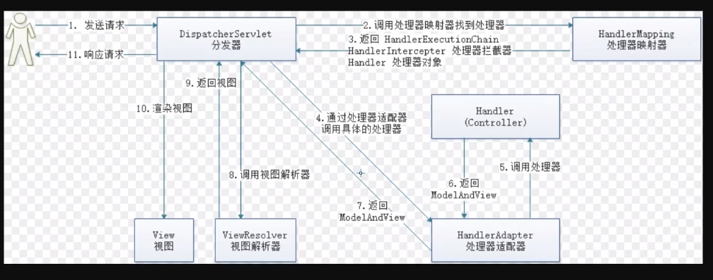
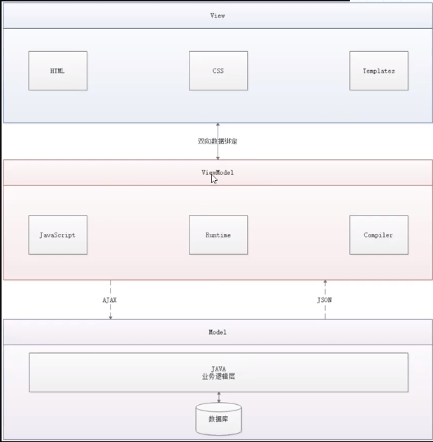
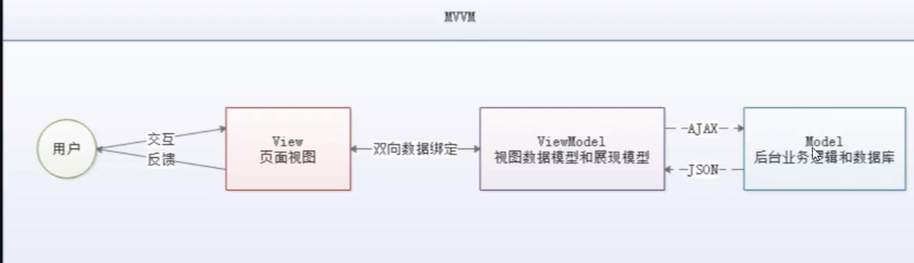

## 1.VUE是什么？
Vue (读音 /vjuː/，类似于 view) 是一套用于构建用户界面的渐进式框架。
与其它大型框架不同的是，Vue 被设计为可以自底向上逐层应用。Vue 的核心库只关注视图层，
不仅易于上手，还便于与第三方库或既有项目整合。另一方面，当与现代化的工具链以及
各种支持类库结合使用时，Vue 也完全能够为复杂的单页应用提供驱动.

是一款渐进式的JavaScript框架，逐步实现新特性的意思；

**SpringMVC**




m

v

vm（模型视图双向绑定）

虚拟dom

]



**实例**

```html
<!DOCTYPE html>
<html lang="en">
<head>
    <meta charset="UTF-8">
    <title>Title</title>
</head>
<body>
<!-- view层 模块 -->
    <div id="app">
        {{message}}
    </div>
</body>
</html>

<script src="https://cdn.jsdelivr.net/npm/vue/dist/vue.js"></script>
<script>
    var vm = new Vue({
        el:"#app",
        // model ： 数据
        data:{
            message:"hello,vue"
        }
    });
</script>
```

## 2.Vue实例

**v-if**

```html
<!DOCTYPE html>
<html lang="en">
<head>
    <meta charset="UTF-8">
    <title>Title</title>
</head>
<body>
<!-- view层 模块 -->
    <div id="app">
        <h1 v-if="ok">Yes</h1>
        <h1 v-else>NO</h1>

        <h1 v-if="type==='A'">2121</h1>
        <h1 v-else-if="type==='A'">3213</h1>
        <h1 v-else>321321312</h1>
    </div>
</body>
</html>

<script src="https://cdn.jsdelivr.net/npm/vue/dist/vue.js"></script>
<script>
    var vm = new Vue({
        el:"#app",
        // model ： 数据
        data:{
            ok:true,
            type: 'A'
        }
    });
</script>
```

**v-for**

```html
<!DOCTYPE html>
<html lang="en">
<head>
    <meta charset="UTF-8">
    <title>Title</title>
</head>
<body>
<!-- view层 模块 -->
    <div id="app">
        <li v-for="item in items">
        {{item.message}}
        </li>
    </div>
</body>
</html>

<script src="https://cdn.jsdelivr.net/npm/vue/dist/vue.js"></script>
<script>
    var vm = new Vue({
        el:"#app",
        // model ： 数据
        data: {
            items: [
                {message: 'chenfeng01'},
                {message: 'chenfenbg02'}
            ]
        }
    });
</script>
```

**v-for**

```html
<!DOCTYPE html>
<html lang="en">
<head>
    <meta charset="UTF-8">
    <title>Title</title>
</head>
<body>
<!-- view层 模块 -->
    <div id="app">
        <li v-for="item in items">
        {{item.message}}
        </li>

        <button v-on:click="sayhi"></button>
    </div>
</body>
</html>

<script src="https://cdn.jsdelivr.net/npm/vue/dist/vue.js"></script>
<script>
    var vm = new Vue({
        el:"#app",
        // model ： 数据
        data: {
            items: [
                {message: 'chenfeng01'},
                {message: 'chenfenbg02'}
            ],
            message: "helleo"

        },
        // 方法必须定义在Vue的Methids对象中
        methods:{
            sayhi:function(){
                alert(this.message)
            }
        }
    });
</script>
```

## 3.双向绑定

数据变了，视图变；视图变了，数据变；

```html
<!DOCTYPE html>
<html lang="en">
<head>
    <meta charset="UTF-8">
    <title>Title</title>
</head>
<body>
<!-- view层 模块 -->
    <div id="app">
        输入的文本<input type="text" v-model="message"> {{message}}

        <input type="radio" name = "sex" value="男" v-model="chenfeng">
        <input type="radio" name = "sex" value="女" v-model="chenfeng">
        选中了{{chenfeng}}

        <select v-model="selected">
            <option >--请选择--</option>
            <option>A</option>
            <option>B</option>
            <option>C</option>
        </select>

    </div>
</body>
</html>

<script src="https://cdn.jsdelivr.net/npm/vue/dist/vue.js"></script>
<script>
    var vm = new Vue({
        el:"#app",
        // model ： 数据
        data: {
            message:"123",
            chenfeng:"",
            selected:''
        }
    });
</script>
```

## 4.Vue组件

```html
<!DOCTYPE html>
<html lang="en">
<head>
    <meta charset="UTF-8">
    <title>Title</title>
</head>
<body>
<!-- view层 模块 -->
    <div id="app">
    <chenfeng v-for="item in items" v-bind:chen="item"></chenfeng>
    </div>
</body>
</html>

<script src="https://cdn.jsdelivr.net/npm/vue/dist/vue.js"></script>
<script>
    Vue.component("chenfeng",{
        props:['chen'],
        template:'<li>{{chen}}<li>'
    });

    var vm = new Vue({
        el:"#app",
        data:{
            items:['java','linux','前端']
        }

    });

</script>
```

## 5.Axios异步通信

链式编程

axios.get("").then(response=>(console.log(response)))

## 6.Vue的生命周期

## 7.计算属性

计算属性：计算出来的结果，保存在内存中

### 8.slot


