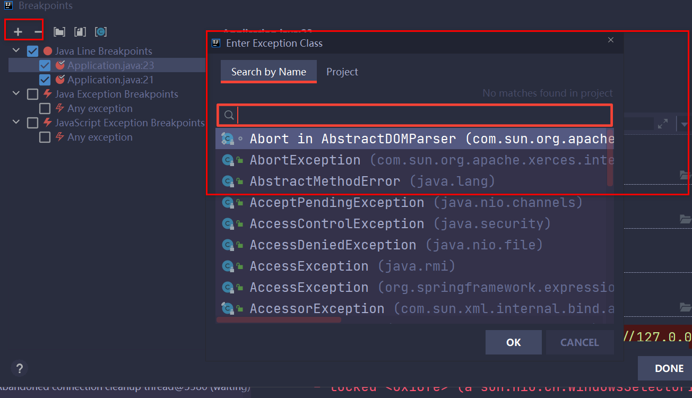

## IDEA分层简介

1. Config：所有配置；用于存放SpringBoot相关的配置类，包括启动类
2. Controller：请求入口；所有请求的入口
3. Service：逻辑层；负责所有的业务逻辑
4. Mapper：持久层；或叫dao负责Java和数据量交互。包括interface和xml两类文件
5. Domain（PO）：表映射实体；用一个java类来映射数据库表，类名就相当于表名，类的属性就相当于表的字段；、
6. Dto：数据传输对象 用于前后端数据交互

## 项目初始设置

1. 常用的设置

   * 合适的字体大小

     * 菜单栏

       

     * 编辑区

       

     * 控制台

     * ctrl + 鼠标滚动

       

2. UTF-8

   

3. 设置项目JDK版本

   

4. autoscroll：自动切换文件

   

5. 自动导入

   

## 编辑区设置

1. 行号设置

   

2. tabs设置

   

   

## 开发中必回的技能

1. 复制和复制历史

   复制一行：光标放任意位置 Ctrl + C

   复制历史： ctrl + shift + v 双击记录后，可在当前光标处粘贴

2. 普通粘贴和简单粘贴

   简单粘贴，不会格式化，但是会保留空格

3. 格式化美观

   ctrl + A 全选

   ctrl + alt + L

4. 删除复制

   ctrl + x 剪切光标所在行，可以当删除用

   ctrl + d 复制光标所在行

5. 移动

   shif + 上 选中 

   alt shift 上/下 当前行向上下移动一行

## 光标跳转

1. 行内跳转和选中

   ctrl  + 左右跳一个单词

   ctrl + shift + 左右选中一个单词

2. 根据行号定位

   ctrl + G

3. tabs快速切换

   alt + 左右

4. 查看浏览过的文件列表

   ctrl + e

5. 移动到光标上一个位置

   ctrl + alt + 左右

6. 导航栏文件切换

## 快速查找和切换

现在版本中随便一个就切换到现在的所有功能

1. 当前文件查找内容

   ctrl + f

2. 全局内容

   ctrl +  shift + f

3. 查找文件

   ctrl + shift + n

4. 搜索菜单文件

   ctrl  shift A

5. 万能搜索

   连按两次shift 查找文件、菜单、操作等，单不能查找文件内容

## ALT + Enter 万能键

1. 见到红色报错就按
2. 见到波浪线警告就按
3. 没报错没警告也可以按

## 键盘鼠标的配合

1. 纵向粘贴

   alt + 鼠标

2. 选中一大行

   * 鼠标点击开始位置
   * 找到行尾位置
   * 按住shit+鼠标点击结尾位置

3. 创键盘移动多行

   1. 按住SHift + 上/下选中多行
   2. 按住shift+alt上下移动多行

4. 类或方法的挑战

   ctrl + alt + 方向左键

   

## 调试

1. 执行当前方法的下一句

   step over （F8）

2. 进入当前调用的方法体内（可以进到第三方）

   step into （F7）

3. 执行完当前的方法

   step out （shift + F8）

4. 可以进到第三方jar包或jdk自带的方法

   force step into

5. 运行到光标所在处

   alt + F9

6. 端点管理

   

7. 右击断点

   右击断点可以选择端点的状态

8. 条件断点

   右击断点，输入条件表达式

9. 异常断点

   

10. 添加变量监控

## 代码重构

1. 重命名变量名

   shift + f6

2. 方法重命名

   shift + f6

3. 类重命名

   shift + f6

4. 删除上一次的操作

   ctrl +z

5. 抽取方法

   ctrl + alt + m

6. 自动生成返回值

   ctrl + alt + v 

7. F5

   文件复制

8. 文件删除

   alt + delte

9. live template 与 postfix

   * live templcat 直接打快捷键
   * posttfix 先打变量或表达式，再打快捷键

## 常用窗口

1. project只保留后台代码
2. struct窗口
3. todo窗口
4. favorites
   * 用法一：将项目中干一些独立的文件加入收藏夹，如pom.xml，application.properties
   * 用法二：把当前正在开发的几个文件加入某个分组，方便及时查找，开发完再删除分组

## 更多实用技巧

1. 分屏

   

2. 日志链接及浏览器

   搜索browser

3. 历史

4. 查看方法调用

   ctrl + alt + h

5. 多列操作

   1. 寻找多行有相同的字符串，选中其中一串
   2. ctrl + shift + alt + j 选中当前文件中，所有一样的字符串

6. 