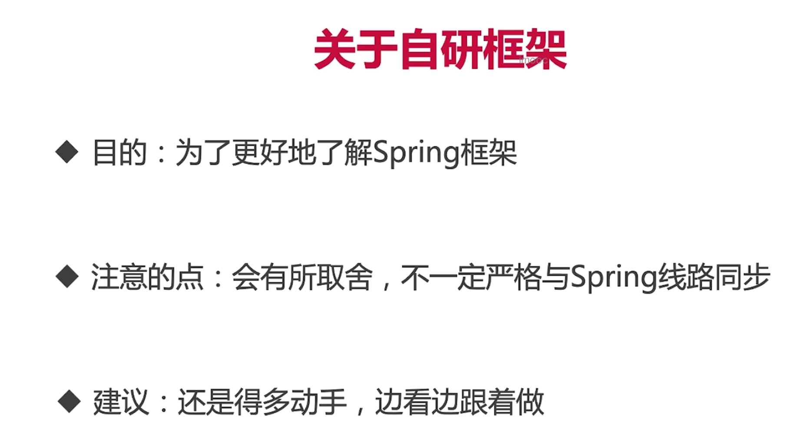
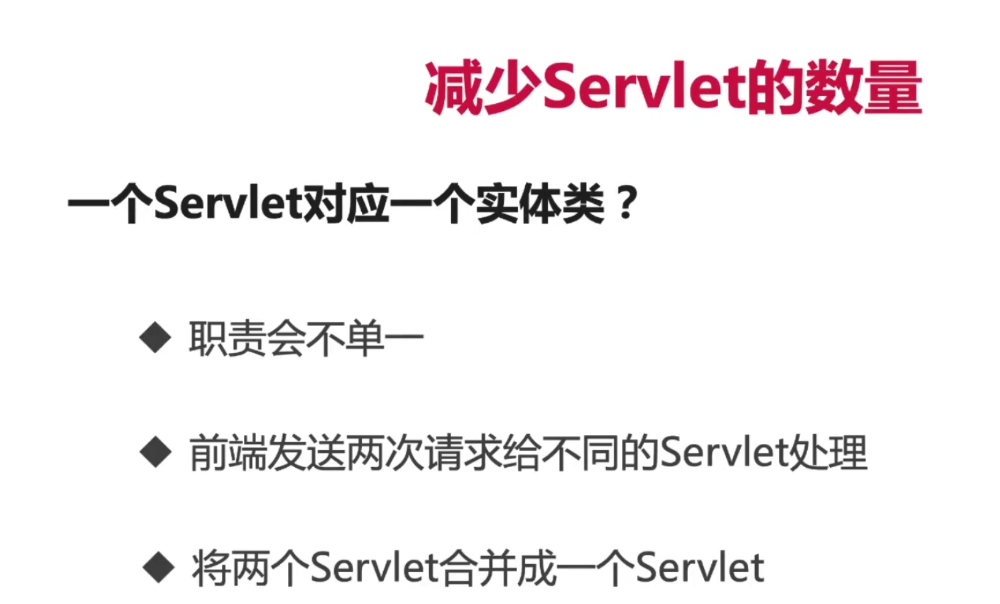
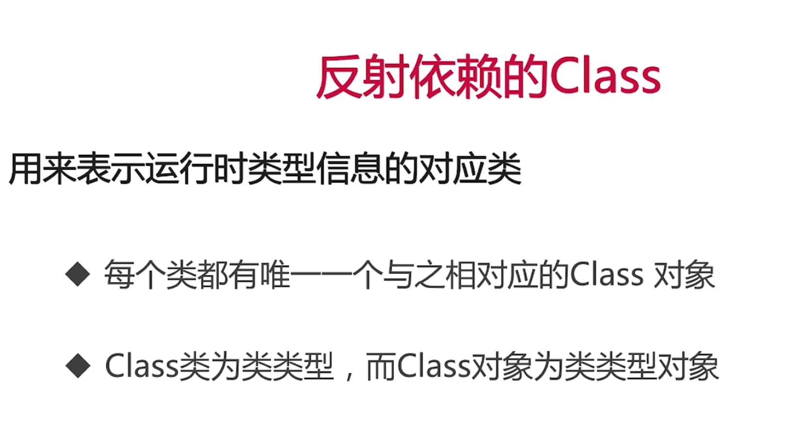
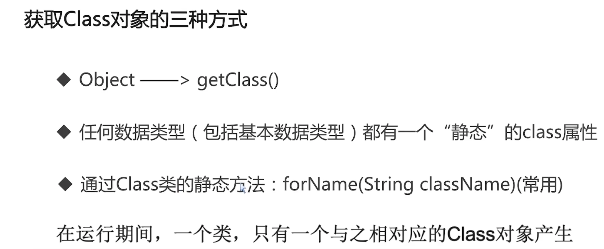
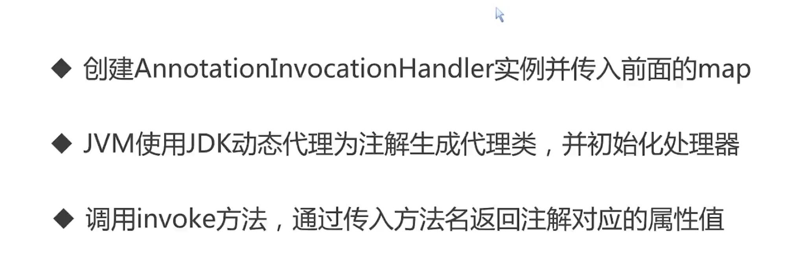
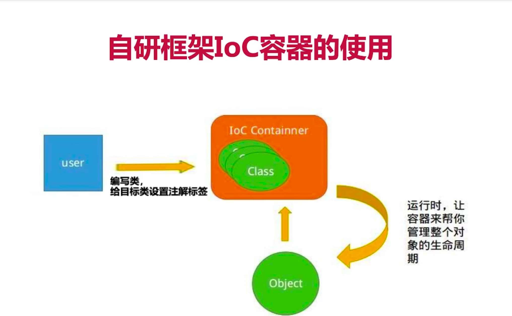
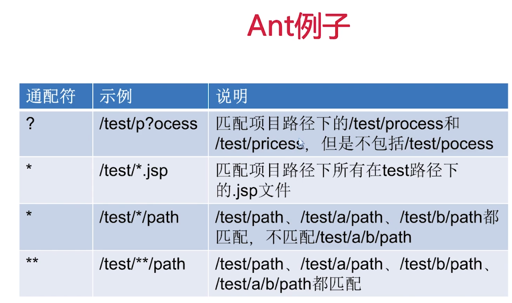

编译器擦除泛型











```java
package demo.reflect;

import java.lang.reflect.Constructor;
import java.lang.reflect.InvocationTargetException;

/*
 * 通过Class对象可以获取某个类中的：构造方法；
 *
 * 获取构造方法：
 *         1).批量的方法：
 *             public Constructor[] getConstructors()：所有"公有的"构造方法
              public Constructor[] getDeclaredConstructors()：获取所有的构造方法(包括私有、受保护、默认、公有)
 *         2).获取单个的方法，并调用：
 *             public Constructor getConstructor(Class... parameterTypes):获取单个的"公有的"构造方法：
 *             public Constructor getDeclaredConstructor(Class... parameterTypes):获取"某个构造方法"可以是私有的，或受保护、默认、公有；
 *
 *             调用构造方法：
 *             Constructor-->newInstance(Object... initargs)
 */
public class ConstructorCollector {
    public static void main(String[] args) throws ClassNotFoundException, NoSuchMethodException, IllegalAccessException, InvocationTargetException, InstantiationException {
        Class clazz = Class.forName("demo.reflect.ReflectTarget");
        //1.获取所有的公有构造方法
        System.out.println("**********************所有公有构造方法*********************************");
        Constructor[] conArray = clazz.getConstructors();
        for(Constructor c : conArray){
            System.out.println(c);
        }
        //2.获取所有构造方法
        System.out.println("************所有的构造方法(包括：私有、受保护、默认、公有)***************");
        conArray = clazz.getDeclaredConstructors();
        for(Constructor c : conArray){
            System.out.println(c);
        }
        //3.获取单个带参数的公有方法
        System.out.println("*****************获取公有、有两个参数的构造方法*******************************");
        Constructor con = clazz.getConstructor(String.class, int.class);
        System.out.println("con = " + con);
        //4.获取单个私有的构造方法
        System.out.println("******************获取私有构造方法*******************************");
        con = clazz.getDeclaredConstructor(int.class);
        System.out.println("private con = " + con);
        System.out.println("******************调用私有构造方法创建实例*******************************");
        //暴力访问（忽略掉访问修饰符）
        con.setAccessible(true);
        ReflectTarget reflectTarget = (ReflectTarget) con.newInstance(1);
    }
}

```

```java
package demo.reflect;

/*
 * 获取成员变量并调用：
 *
 * 1.批量的
 *      1).Field[] getFields():获取所有的"公有字段"
 *      2).Field[] getDeclaredFields():获取所有字段，包括：私有、受保护、默认、公有；
 * 2.获取单个的：
 *      1).public Field getField(String fieldName):获取某个"公有的"字段；
 *      2).public Field getDeclaredField(String fieldName):获取某个字段(可以是私有的)
 *
 *   设置字段的值：
 *      Field --> public void set(Object obj,Object value):
 *                  参数说明：
 *                  1.obj:要设置的字段所在的对象；
 *                  2.value:要为字段设置的值；
 *
 */

import java.lang.reflect.Field;
import java.lang.reflect.InvocationTargetException;

public class FieldCollector {
    public static void main(String[] args) throws ClassNotFoundException, NoSuchFieldException, NoSuchMethodException, IllegalAccessException, InvocationTargetException, InstantiationException {
        //获取Class对象
        Class reflectTargetClass = Class.forName("demo.reflect.ReflectTarget");
        //1.获取所有公有的字段
        System.out.println("************获取所有公有的字段********************");
        Field[] fieldArray = reflectTargetClass.getFields();
        for (Field f : fieldArray){
            System.out.println(f);
        }
        //2.获取所有的字段
        System.out.println("************获取所有的字段(包括私有、受保护、默认的)********************");
        fieldArray = reflectTargetClass.getDeclaredFields();
        for (Field f : fieldArray){
            System.out.println(f);
        }
        //3.获取单个特定公有的field
        System.out.println("*************获取公有字段并调用***********************************");
        Field f = reflectTargetClass.getField("name");
        System.out.println("公有的field name : " + f);
        ReflectTarget reflectTarget = (ReflectTarget)reflectTargetClass.getConstructor().newInstance();
        //4.给获取到的field赋值
        f.set(reflectTarget, "待反射一号");
        //5.验证对应的值name
        System.out.println("验证name : " + reflectTarget.name);
        //6.获取单个私有的Field
        System.out.println("**************获取私有字段targetInfo并调用********************************");
        f = reflectTargetClass.getDeclaredField("targetInfo");
        System.out.println(f);
        f.setAccessible(true);
        f.set(reflectTarget, "13810592345");
        System.out.println("验证信息" + reflectTarget);
    }
}

```

```java
package demo.reflect;

import java.lang.reflect.InvocationTargetException;
import java.lang.reflect.Method;

/*
 * 获取成员方法并调用：
 *
 * 1.批量的：
 *      public Method[] getMethods():获取所有"公有方法"；（包含了父类的方法也包含Object类）
 *      public Method[] getDeclaredMethods():获取所有的成员方法，包括私有的(不包括继承的)
 * 2.获取单个的：
 *      public Method getMethod(String name,Class<?>... parameterTypes):
 *                  参数：
 *                      name : 方法名；
 *                      Class ... : 形参的Class类型对象
 *      public Method getDeclaredMethod(String name,Class<?>... parameterTypes)
 *
 *   调用方法：
 *      Method --> public Object invoke(Object obj,Object... args):
 *                  参数说明：
 *                  obj : 要调用方法的对象；
 *                  args:调用方式时所传递的实参；
):
 */
public class MethodCollector {
    public static void main(String[] args) throws ClassNotFoundException, NoSuchMethodException, IllegalAccessException, InvocationTargetException, InstantiationException {
        //1、获取Class对象
        Class reflectTargetClass = Class.forName("demo.reflect.ReflectTarget");
        //2、获取所有公有方法
        System.out.println("***************获取所有的public方法，包括父类和Object*******************");
        Method[] methodArray = reflectTargetClass.getMethods();
        for(Method m : methodArray){
            System.out.println(m);
        }
        //3、获取该类的所有方法
        System.out.println("***************获取所有的方法，包括私有的*******************");
        methodArray = reflectTargetClass.getDeclaredMethods();
        for(Method m : methodArray){
            System.out.println(m);
        }
        //4、获取单个公有方法
        System.out.println("***************获取公有的show1()方法*******************");
        Method m = reflectTargetClass.getMethod("show1", String.class);
        System.out.println(m);
        //5、调用show1并执行
        ReflectTarget reflectTarget = (ReflectTarget)reflectTargetClass.getConstructor().newInstance();
        m.invoke(reflectTarget, "待反射方法一号");
        //6、获取一个私有的成员方法
        System.out.println("***************获取私有的show4()方法******************");
        m = reflectTargetClass.getDeclaredMethod("show4", int.class);
        System.out.println(m);
        m.setAccessible(true);
        String result = String.valueOf(m.invoke(reflectTarget, 20));
        System.out.println("返回值 ： " + result);
    }
}

```

```java
package demo.reflect;

public class ReflectTarget extends ReflectTargetOrigin{
    //---------构造函数-----------
    //(默认的带参数构造函数)
    ReflectTarget(String str) {
        System.out.println("(默认)的构造方法 s = " + str);
    }

    //无参构造函数
    public ReflectTarget() {
        System.out.println("调用了公有的无参构造方法 。。。");
    }

    //有一个参数的构造函数
    public ReflectTarget(char name) {
        System.out.println("调用了带有一个参数的构造方法，参数值为 " + name);
    }

    //有多个参数的构造函数
    public ReflectTarget(String name, int index) {
        System.out.println("调用了带有多个参数的构造方法，参数值为【目标名】： " + name + " 【序号】" + index);
    }
    //受保护的构造函数
    protected ReflectTarget(boolean n){
        System.out.println("受保护的构造方法 n :" + n);
    }
    //私有的构造函数
    private ReflectTarget(int index){
        System.out.println("私有的构造方法 序号：" + index);
    }

    //**************字段*******************//
    public String name;
    protected int index;
    char type;
    private String targetInfo;
    @Override
    public String toString(){
        return "ReflectTarget [name=" + name + ", index=" + index + ", type=" + type
                + ", targetInfo=" + targetInfo + "]";
    }
    //***************成员方法***************//
    public void show1(String s){
        System.out.println("调用了公有的，String参数的show1(): s = " + s);
    }
    protected void show2(){
        System.out.println("调用了受保护的，无参的show2()");
    }
    void show3(){
        System.out.println("调用了默认的，无参的show3()");
    }
    private String show4(int index){
        System.out.println("调用了私有的，并且有返回值的，int参数的show4(): index = " + index);
        return "show4result";
    }

    public static void main(String[] args) throws ClassNotFoundException {
        //第一种方式获取Class对象
        ReflectTarget reflectTarget = new ReflectTarget();
        Class reflectTargetClass1 = reflectTarget.getClass();
        System.out.println("1st : " + reflectTargetClass1.getName());
        //第二种方式获取Class对象
        Class reflectTargetClass2 = ReflectTarget.class;
        System.out.println("2nd: " + reflectTargetClass2.getName());
        //判断第一种方式获取的class对象和第二种方式获取的是否是同一个
        System.out.println(reflectTargetClass1 == reflectTargetClass2);
        //第三种方式来获取Class对象
        Class reflectTargetClass3 = Class.forName("demo.reflect.ReflectTarget");
        System.out.println("3rd: " + reflectTargetClass3.getName());
        System.out.println(reflectTargetClass2 == reflectTargetClass3);
    }
}

```

```java
package demo.reflect;

public class ReflectTargetOrigin {
    String defaultMember = "default";
    public String publicMember = "public";
    protected String protectedMember = "protected";
    private String privateMember = "private";
}

```


```
-Djdk.proxy.ProxyGenerator.saveGeneratedFiles=true
-XX:+TranceClassLoading
```







-


```java
package org.simpleframework.core.core;

import lombok.AccessLevel;
import lombok.NoArgsConstructor;
import lombok.extern.slf4j.Slf4j;

/**
 * @Classname BeanContainer
 * @Description 可以抵御反射和序列化
 * @Date 2020/6/5 7:57
 * @Created by  wrsChen
 */
@Slf4j
@NoArgsConstructor(access = AccessLevel.NONE)
public class BeanContainer {
    public static BeanContainer getInstance(){
        return ContainerHolder.HOLDER.instance;
    }
    private enum ContainerHolder{
        HOLDER;
        private BeanContainer instance;
        ContainerHolder(){
            instance = new BeanContainer();
        }
    }

}

```





Resource 与 ResourceLoad


xmlbeandefinitionreader


委派


实现自己的BeanDefinitionRegistryPostProcessor，就能将第三方或者其他矿建的实例注册到容器中


aware一种能力


枚举是饿汉式，根据反编译看到的代码类在一加载时就进行了初始化


do字开头的是最终干活的


singletionObjects最终的对象，一级缓存

earlySingletonObject 二级缓存

singletonFactories 三级缓存

