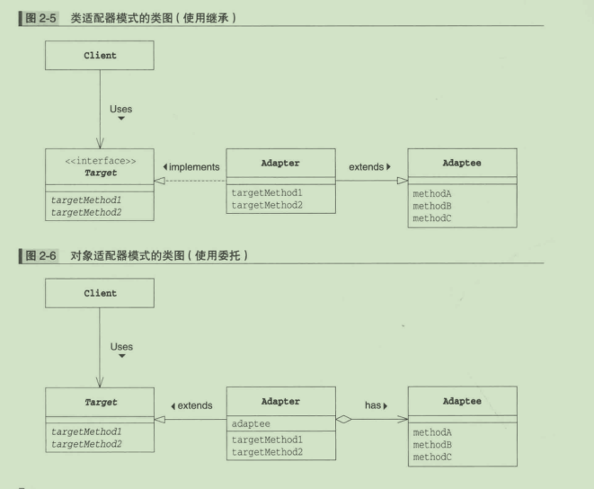
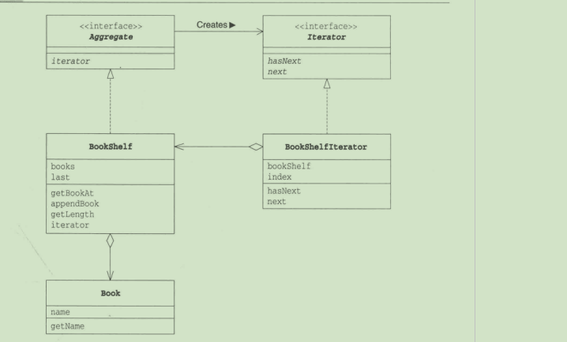

## 类图整体图

## 整体结构图概要

* 实现

  小汽车是车的实现类，用的是空心的类型加虚线，因为很虚所以用的虚线

* 泛化

  泛化就是实现的意思

  suv是小汽车的子类，suv继承了小汽车

* 依赖

  自行车依赖学生（一般是用作参数）多用于运行时，可以动态进行变化，用的是带箭头的虚线

  双向依赖是一种非常糟糕的结构，我们应该保持单向依赖杜绝双向依赖的产生

* 聚合

  学生与班级的关系就是聚合

  聚合是一种带空心菱形箭头的直线表示，表达的是A聚合到B上，或者说B由A组成

  表示的是整体由部门构成，例如一个部门由多个员工组成

  与组合关系不同的是，整体和部分不是强依赖的，即整体不存在了，部分依然存在；

* 组合关系

  轮胎与小汽车的关系就是组合关系。是一个整体，不可分割

* 关联

  直线，表示的是一种静态关系，是一种强关联。不强调方向，如果强调方向就是A知道B，B不知道A、通常对象通常是以成员变量的形式实现的。

## 时序图

### 概念

显示对象之间的交互细节，是显示对象之间交互的图。时序图中显示的是参与交互的对象及其对象之间消息交换的顺序。

### 建模元素

对象（Actor）、生命线（Lifeline）、控制焦点（Focus of control）、消息（Message）

## 设计模式分类

1. 创建型

   对象的创建

   * 单例
   * 建造者
   * 原型（克隆）
   * 工厂
   * 抽象工厂

2. 结构性

   类和对象的组合

   - 适配器

     * 类适配器（使用继承的适配器）

       目标对象

       被适配者

       适配器类

       请求者

       则适配器类只需要实现目标对象接口并继承被适配者类即可

     * 对象适配器（使用委托的适配器）

       适配器中持有被适配者对象

       

       

       

   - 桥接

   - 过滤器

   - 组合

   - 装饰器

   - 外观

   - 享元

   - 代理

3. 行为型

   对象之间的通信

   * 责任链

   * 命令

   * 解释器

   * 迭代器

     * 迭代器类图

       

       

     * 迭代器的角色

       | 名字              | 说明             | 承担的角色   |
       | ----------------- | ---------------- | ------------ |
       | Aggregate         | 集合的接口       | 集合         |
       | Iterator          | 遍历集合的接口   | 迭代器       |
       | Book              | 表示书的类       |              |
       | BookShelt         | 表示书架的类     | 具体的集合   |
       | BookSheltIterator | 遍历书架的类     | 具体的迭代器 |
       | Main              | 测试程序行为的类 |              |

      * 迭代器的优点
     
   
   将遍历与实现就行分离

* 中介者
  
* 备忘录
  
* 观察者
  
* 状态
  
* 空对象
  
* 策略
  
* 模板
  
* 访问者
  
4. J2EE模式

   * mvc
   * 业务代表       
   * 数据访问对象
   * 前段控制器
   * 拦截过滤器
   * 服务定位器
   * 传输对象

​	

