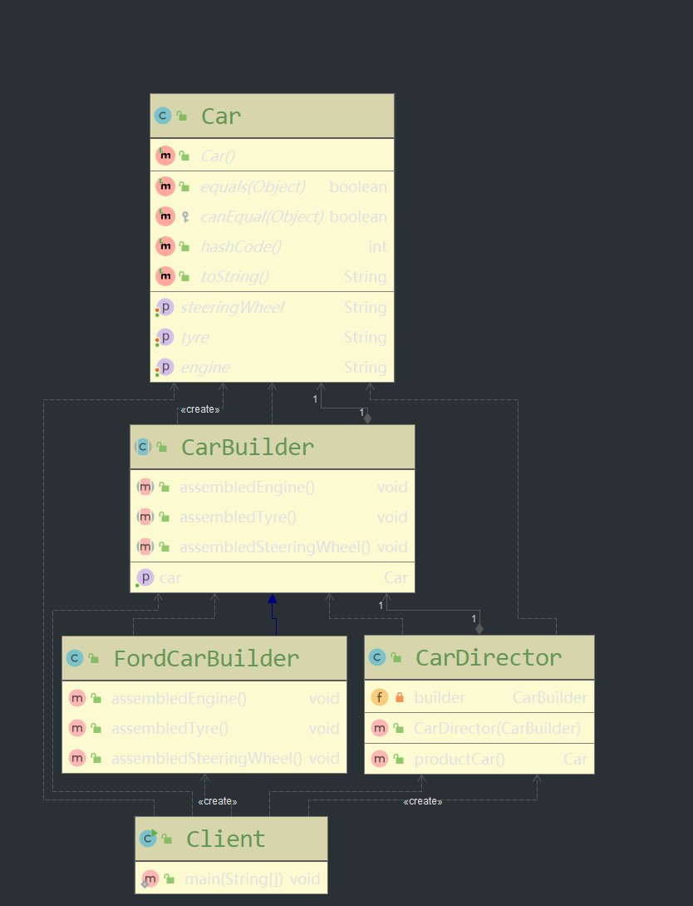
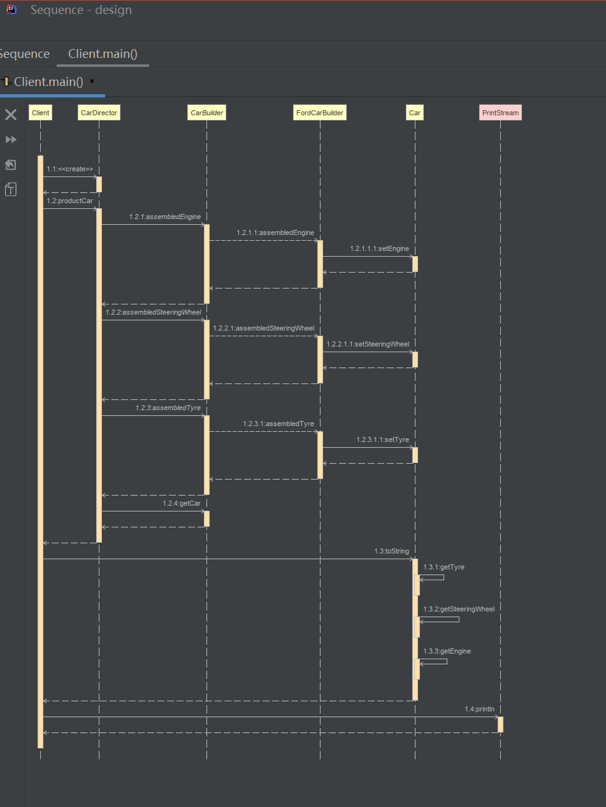

## 建造者模式（Builder）

* 我的一句话理解

  抽象建造者创建对象，并实现相关方法，具体建造者实现抽象建造者的方法，指挥者用于组装对象

* **模式动机**

  ​	该模式的应用是现实世界中复杂对象是由多个部分组成的，而对于大多数客户端来说，只需要关注对象如何创建而不需要知道其具体的实现细节。

  ​	复杂对象相当于一辆待建造的汽车，对象的属性相当于汽车的部件，建造过程就相当于组合部件的过程。组合部件的过程非常复杂，因此，这些部件的组合过程往往被外部化到一个建造者对象中，建造者返还给客户端一个建造完毕的完整产品对象，而用户无需关注核心对象所包含的属性以及组装方式

* **模式定义**

  **定义**：讲一个复杂对象的构建与它的表示分离，使得同样的构建过程可以创建不同的表示

  **讲解**：一步步创建一个复杂对象，它允许影虎只通过指定复杂对象的类型和内容就可以构建他们，用户不需要知道内部的具体构建细节。有时又被称为生成器模式。

* **模式结构**

  主要包含如下角色

  * Builder：抽象建造者
  * ConcreteBuilder：具体建造者
  * Director：指挥者
  * Product：产品角色

* **模式图**

  **类图**

  

  **时序图**

  

* **模式代码**

  [github代码]( https://github.com/fengchenzhihun1/design/tree/master/src/main/java/com/chenfeng/designtwo/creational_pattern/builder )

  **产品类**

  ```java
  package com.chenfeng.designtwo.creational_pattern.builder;
  
  import lombok.Data;
  
  /**
   * @Classname Car
   * @Description TODO
   * @Date 2019/11/25 20:08
   * @Created by  wrsChen
   */
  @Data
  public class Car {
      /**
       * 轮胎
       */
      private String  tyre;
      /**
       * 方向盘
       */
      private String  steeringWheel;
      /**
       * 发动机
       */
      private String  engine;
   }
  
  ```

  **抽象建造者**

  ```java
  package com.chenfeng.designtwo.creational_pattern.builder;
  
  /**
   * @Classname CarBuilder
   * @Description TODO
   * @Date 2019/11/25 20:26
   * @Created by  wrsChen
   */
  public abstract class CarBuilder {
      Car car = new Car();
      public abstract void assembledEngine();
      public abstract void assembledTyre();
      public abstract void assembledSteeringWheel();
      public Car getCar(){
          return car;
      }
  
  }
  
  ```

  **具体建造者**

  ```java
  package com.chenfeng.designtwo.creational_pattern.builder;
  
  /**
   * @Classname FordCarBuilder
   * @Description TODO
   * @Date 2019/11/25 20:32
   * @Created by  wrsChen
   */
  public class FordCarBuilder extends CarBuilder  {
      @Override
      public void assembledEngine() {
         car.setEngine("开始构建发动机引擎");
      }
  
      @Override
      public void assembledTyre() {
          car.setTyre("开始构建轮胎");
      }
  
      @Override
      public void assembledSteeringWheel() {
          car.setSteeringWheel("开始装配轮子");
      }
  }
  
  ```

  **指挥者**

  ```java
  package com.chenfeng.designtwo.creational_pattern.builder;
  
  
  
  /**
   * @Classname CarDirector
   * @Description TODO
   * @Date 2019/11/25 20:41
   * @Created by  wrsChen
   */
  public class CarDirector {
      private CarBuilder builder;
      public  CarDirector(CarBuilder builder){
          this.builder = builder;
      }
      public Car productCar(){
          builder.assembledEngine();
          builder.assembledSteeringWheel();
          builder.assembledTyre();
          return builder.getCar();
      }
  }
  
  ```

  **客户端**

  ```java
  package com.chenfeng.designtwo.creational_pattern.builder;
  
  import com.sun.xml.internal.ws.api.model.wsdl.WSDLOutput;
  
  /**
   * @Classname Client
   * @Description TODO
   * @Date 2019/11/25 20:46
   * @Created by  wrsChen
   */
  public class Client {
      public static void main(String[] args) {
          CarBuilder carBuilder = new FordCarBuilder();
          CarDirector carDirector = new CarDirector(carBuilder);
          Car car = carDirector.productCar();
          System.out.println(car.toString()     );
      }
  
  
  }
  
  ```

  

* **模式分析**

  抽象建造者中定义了产品的创建方法，以及返回产品的方法

  建造者模式中引入了指挥者类：两个作用，（1）隔离了客户与生产过程

  （2）负责控制产品生成过程。指挥者针对抽象编程，客户端只需要知道具体建造者的类型就可以通过指挥者调用相关方法返回一个完整地产品对象

* **优点**

  * 客户端不需要产品内部的具体细节，将产品本身与产品的创建过程解耦，使得相同的创建过程可以创建不同的对象
  * 每一个具体建造者相对独立，与其他建造者无关，因此可以方便的替换或增加的新的建造者，客户端使用不同的具体建造者可以得到不同的产品
  * 可以更加清晰的控制产品的创建过程
  * 增加新的具体建造者无需改变类的原有逻辑，指挥者针对抽象编程，符合开闭原则

* **缺点**

  - 使用受限，创建的产品都有相似的部分
  - 产品内部负责，可能导致需要定义很多具体的建造者来实现

* **使用场景**

  对象内部复杂，需要生成的对象有固定规则，

* **模式扩展**

  建造者模式的简化:

  - 省略抽象建造者角色：如果系统中只需要一个具体建造者的话，可以省略掉抽象建造者。
  - 省略指挥者角色：在具体建造者只有一个的情况下，如果抽象建造者角色已经被省略掉，那么还可以省略指挥者角色，让

  Builder角色扮演指挥者与建造者双重角色。

  建造者模式与抽象工厂模式的比较:

  - 与抽象工厂模式相比， **建造者模式返回一个组装好的完整产品** ，而 **抽象工厂模式返回一系列相关的产品，这些产品位于不同的产品等级结构，构成了一个产品族。**
  - 在抽象工厂模式中，客户端实例化工厂类，然后调用工厂方法获取所需产品对象，而在建造者模式中，客户端可以不直接调用建造者的相关方法，而是通过指挥者类来指导如何生成对象，包括对象的组装过程和建造步骤，它侧重于一步步构造一个复杂对象，返回一个完整的对象。
  - 如果将抽象工厂模式看成 **汽车配件生产工厂** ，生产一个产品族的产品，那么建造者模式就是一个 **汽车组装工厂** ，通过对部件的组装可以返回一辆完整的汽车。

* **总结**

  - 建造者模式将一个复杂对象的构建与它的表示分离，使得同样的构建过程可以创建不同的表示。建造者模式是一步一步创建一个复杂的对象，它允许用户只通过指定复杂对象的类型和内容就可以构建它们，用户不需要知道内部的具体构建细节。建造者模式属于对象创建型模式。
  - 建造者模式包含如下四个角色：抽象建造者为创建一个产品对象的各个部件指定抽象接口；具体建造者实现了抽象建造者接口，实现各个部件的构造和装配方法，定义并明确它所创建的复杂对象，也可以提供一个方法返回创建好的复杂产品对象；产品角色是被构建的复杂对象，包含多个组成部件；指挥者负责安排复杂对象的建造次序，指挥者与抽象建造者之间存在关联关系，可以在其construct()建造方法中调用建造者对象的部件构造与装配方法，完成复杂对象的建造
  - 在建造者模式的结构中引入了一个指挥者类，该类的作用主要有两个：一方面它隔离了客户与生产过程；另一方面它负责控制产品的生成过程。指挥者针对抽象建造者编程，客户端只需要知道具体建造者的类型，即可通过指挥者类调用建造者的相关方法，返回一个完整的产品对象。
  - 建造者模式的主要优点在于客户端不必知道产品内部组成的细节，将产品本身与产品的创建过程解耦，使得相同的创建过程可以创建不同的产品对象，每一个具体建造者都相对独立，而与其他的具体建造者无关，因此可以很方便地替换具体建造者或增加新的具体建造者，符合“开闭原则”，还可以更加精细地控制产品的创建过程；其主要缺点在于由于建造者模式所创建的产品一般具有较多的共同点，其组成部分相似，因此其使用范围受到一定的限制，如果产品的内部变化复杂，可能会导致需要定义很多具体建造者类来实现这种变化，导致系统变得很庞大。
  - 建造者模式适用情况包括：需要生成的产品对象有复杂的内部结构，这些产品对象通常包含多个成员属性；需要生成的产品对象的属性相互依赖，需要指定其生成顺序；对象的创建过程独立于创建该对象的类；隔离复杂对象的创建和使用，并使得相同的创建过程可以创建不同类型的产品。

  ​	


