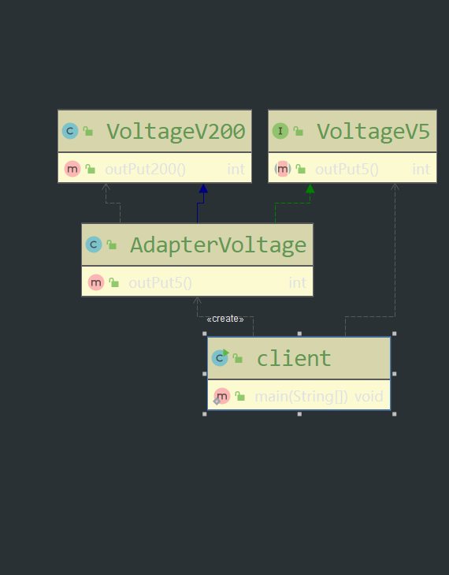

## 模式说明

* 将某个类的接口转换成客户端期望的另外一个接口表示，主要母的是兼容性，让原来两个不匹配，不能一起工作的两个类可以协同工作。其别名为包装器（Wrapper）
* 适配器属于结构型模式
* 主要有三类：类适配器、对象适配器、接口适配器

## 工作原理

* 适配器模式：将一个类的接口转换成另一种接口.让原本接口不兼容的容

*  从用户的角度看不到被适配者是解耦的

*  用户调用适配器转化出来的目标接口方法，适配器再调用被适配者的方法4) 用户收到反馈结果，感觉只是和目标接口交互，

* 用户收到反馈结果，感觉只是和目标接口交互，如图

  

## 适配器分类

### 类适配器

#### 模式介绍

通过继承 src类，实现 dst 类接口，完成src->dst的适配。

#### 注意细节

* Java是单继承机制，所以类适配器需要继承src类这一点算是一个缺点, 因为这要
  求dst必须是接口，有一定局限性
* src类的方法在Adapter中都会暴露出来，也增加了使用的成本
* 由于其继承了src类，所以它可以根据需求重写src类的方法，使得Adapter的灵
  活性增强了。

#### 类图




#### 代码

适配者

```java
package com.chenfeng.designtwo.structural_pattern.adapter.classmodel;

/**
 * @Classname VoltageV5
 * @Description TODO
 * @Date 2019/12/3 20:00
 * @Created by  wrsChen
 */
public interface VoltageV5 {
     int outPut5();
}

```

被适配者

```java
package com.chenfeng.designtwo.structural_pattern.adapter.classmodel;

/**
 * @Classname VoltageV200
 * @Description TODO
 * @Date 2019/12/3 20:04
 * @Created by  wrsChen
 */
public class VoltageV200 {
    public int outPut200(){
        return 200;
    }
}

```

适配器

```java
package com.chenfeng.designtwo.structural_pattern.adapter.classmodel;


/**
 * @Classname AdapterVoltage
 * @Description TODO
 * @Date 2019/12/3 20:04
 * @Created by  wrsChen
 */
public class AdapterVoltage extends VoltageV200 implements VoltageV5 {


    @Override
    public int outPut5() {
        return outPut200()/40;
    }
}

```

客户端·

```java
package com.chenfeng.designtwo.structural_pattern.adapter.classmodel;


/**
 * @Classname Client
 * @Description TODO
 * @Date 2019/12/3 20:06
 * @Created by  wrsChen
 */
public class Client {
    public static void main(String[] args) {
        VoltageV5 voltage5V = new AdapterVoltage();
        voltage5V.outPut5();
    }
}

```
### 对象适配器

#### 模式介绍

* 基本思路和类的适配器模式相同，只是将Adapter类作修改，不是继承src类，而
  是持有src类的实例，以解决兼容性的问题。 即：持有 src类，实现 dst 类接口，
  完成src->dst的适配
* 根据“合成复用原则”，在系统中尽量使用关联关系来替代继承关系。
*  对象适配器模式是适配器模式常用的一种
#### 注意细节
* 对象适配器和类适配器其实算是同一种思想，只不过实现方式不同。
根据合成复用原则，使用组合替代继承， 所以它解决了类适配器必须继承src的
局限性问题，也不再要求dst必须是接口
*  使用成本更低，更
#### 代码
适配者

```java
package com.chenfeng.designtwo.structural_pattern.adapter.objectmodel;

/**
 * @Classname VoltageV5
 * @Description TODO
 * @Date 2019/12/3 20:00
 * @Created by  wrsChen
 */
public interface VoltageV5 {
     int outPut5();
}

```

被适配者

```java
package com.chenfeng.designtwo.structural_pattern.adapter.objectmodel;

/**
 * @Classname VoltageV200
 * @Description TODO
 * @Date 2019/12/3 20:04
 * @Created by  wrsChen
 */
public class VoltageV200 {
    public int outPut200(){
        return 200;
    }
}

```

适配器

```java
package com.chenfeng.designtwo.structural_pattern.adapter.objectmodel;


/**
 * @Classname AdapterVoltage
 * @Description TODO
 * @Date 2019/12/3 20:04
 * @Created by  wrsChen
 */
public class AdapterVoltage implements VoltageV5 {
    private VoltageV200 voltagev200;
    public AdapterVoltage(VoltageV200 voltageV200){
        this.voltagev200 = voltageV200 ;
    }

    @Override
    public int outPut5() {
        return voltagev200.outPut200()/40;
    }
}
```

客户端·

```java
package com.chenfeng.designtwo.structural_pattern.adapter.objectmodel;


/**
 * @Classname Client
 * @Description TODO
 * @Date 2019/12/3 20:06
 * @Created by  wrsChen
 */
public class Client {
    public static void main(String[] args) {
        VoltageV5 voltage5V = new AdapterVoltage();
        voltage5V.outPut5();
    }
}

```

### 接口适配器

####  模式介绍

* 一些书籍称为：适配器模式(Default Adapter Pattern)或缺省适配器模式。
* 当不需要全部实现接口提供的方法时，可先设计一个抽象类实现接口，并为该接
  口中每个方法提供一个默认实现（空方法），那么该抽象类的子类可有选择地覆
  盖父类的某些方法来实现需求
* 适用于一个接口不想使用其所有的方法的情况

#### 代码

接口

```java
package com.chenfeng.designtwo.structural_pattern.adapter.interfacemodel;

/**
 * @Classname Interface4
 * @Description TODO
 * @Date 2019/12/3 20:49
 * @Created by  wrsChen
 */
public interface Interface4 {
     void m1();
     void m2();
     void m3();
     void m4();
}

```

抽象实现

```java
package com.chenfeng.designtwo.structural_pattern.adapter.interfacemodel;

/**
 * @Classname AbstractAdapter
 * @Description TODO
 * @Date 2019/12/3 20:52
 * @Created by  wrsChen
 */
public class AbstractAdapter implements Interface4{
    @Override
    public void m1() {

    }

    @Override
    public void m2() {

    }

    @Override
    public void m3() {

    }

    @Override
    public void m4() {

    }
}

```

客户端

```java
package com.chenfeng.designtwo.structural_pattern.adapter.interfacemodel;

/**
 * @Classname Client
 * @Description TODO
 * @Date 2019/12/3 20:52
 * @Created by  wrsChen
 */
public class Client {
    public static void main(String[] args) {
        AbstractAdapter abstractAdapter = new AbstractAdapter(){
            @Override
            public void m1() {
                super.m1();
            }
        };
        abstractAdapter.m1();
    }
}

```

