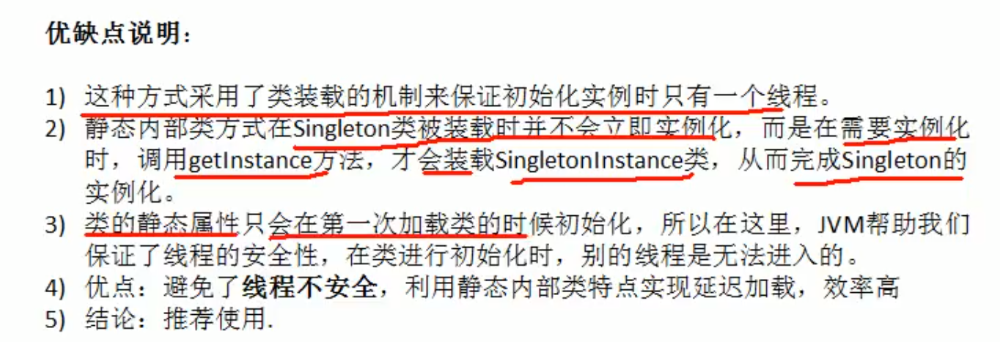

## 设计模式七大原则

### 原则介绍

1. 代码可重用
2. 可读性
3. 可扩展
4. 可靠性
5. 高内聚低耦合

### 单一职责原则

1. 基本介绍

   

2. 总结

   

### 接口隔离原则（Interface Segregation Principle）

一个类对另外一个类的通过接口进行依赖，则接口应该最小！


* 通过接口依赖其他类接口应该最小！
* 接口拆分，接口的依赖建立在最小的接口上；用不到的方法拆成小的接口

### 依赖倒装


### 里氏替换原则


* 在继承一个类时不要重写方法，实在需要重写时可以使用依赖继承；

  

* 将一个基类对象替换成一个子类对象时，将不会产生错误和异常（这里主要就是不要对父类的方法进行重写）

### 开闭原则


* 对扩展开放（提供方），对修改关闭（使用方）


### 迪米特法则


### 合成复用原则


### UML


## 创建型

### 单例模式

#### 静态常量（饿汉式）


```java
class Singleton {
    private Singleton() {
    }
    private final static Singleton singleton = new Singleton();
    public static Singleton getInstance() {
        return singleton;
    }
}
```

#### 静态代码块(饿汉式)


```java
package com.chenfeng.designpattern.create.single;

/**
 * @Classname StaticSingle
 * @Description TODO
 * @Date 2020/7/28 21:43
 * @Created by  wrsChen
 */
public class StaticSingle {
    private StaticSingle() {
    }
    private static StaticSingle staticSingle;
    static {
        staticSingle = new StaticSingle();
    }
    public static StaticSingle getInstance() {
        return staticSingle;
    }
}

```

#### 懒汉式（线程不安全）


```java
package com.chenfeng.designpattern.create.single;

/**
 * @Classname SingleLazy
 * @Description TODO
 * @Date 2020/7/28 21:56
 * @Created by  wrsChen
 */
public class SingleLazy {
    private SingleLazy singleLazy;
    private SingleLazy(){
    }
    public SingleLazy getInstance() {
        if (singleLazy == null) {
            singleLazy = new SingleLazy();
        }
        return singleLazy;
    }
}

```

#### 懒汉式Sychronized（线程安全）


```java
package com.chenfeng.designpattern.create.single;

/**
 * @Classname SingleSync
 * @Description TODO
 * @Date 2020/7/28 22:02
 * @Created by  wrsChen
 */
public class SingleSync {
    private static  SingleSync singleSync;
    private SingleSync() {
    }
    public static synchronized SingleSync  SingleSync() {
        if (singleSync == null) {
            singleSync = new SingleSync();
        }
        return singleSync;
    }
}

```

#### 懒汉式同步代码块（线程不安全）


```java
package com.chenfeng.designpattern.create.single;

/**
 * @Classname SingleSync
 * @Description TODO
 * @Date 2020/7/28 22:02
 * @Created by  wrsChen
 */
public class SingleSyncBlock {
    private static SingleSyncBlock singleSync;
    private SingleSyncBlock() {
    }
    public static  SingleSyncBlock SingleSync() {
        if (singleSync == null) {
            synchronized(SingleSyncBlock.class) {
                singleSync = new SingleSyncBlock();
            }
            }
        return singleSync;
    }
}


```

#### 懒汉式doublecheck（线程安全）

```java
package com.chenfeng.designpattern.create.single;

/**
 * @Classname SingleDoubleCheck
 * @Description TODO
 * @Date 2020/7/28 22:13
 * @Created by  wrsChen
 */
public class SingleDoubleCheck {
    private static volatile SingleDoubleCheck singleDoubleCheck;
    private static SingleDoubleCheck getInstance() {
        if (singleDoubleCheck == null) {
            synchronized (SingleDoubleCheck.class) {
             if (singleDoubleCheck == null) {
                 singleDoubleCheck = new SingleDoubleCheck();
             }
            }
        }
        return singleDoubleCheck;
    }
}
```

#### 懒汉式静态内部类（线程安全）



```java
package com.chenfeng.designpattern.create.single;

/**
 * @Classname SingleIntter
 * @Description TODO
 * @Date 2020/7/28 22:43
 * @Created by  wrsChen
 */
public class SingleIntter {
    private static class SingletonInsatnce{
        private static final SingleIntter SINGLE_INTTER = new SingleIntter();
    }
    public static synchronized SingleIntter getInstance() {
        return SingletonInsatnce.SINGLE_INTTER;
    }
}


```

#### 饿汉式枚举方式（线程安全，防序列化）

```java
package com.chenfeng.designpattern.create.single;

/**
 * @Classname SingEnum
 * @Description TODO
 * @Date 2020/7/28 22:51
 * @Created by  wrsChen
 */
public class SingEnum {

}

enum Singletion{
    INSTANCE;
    private SingEnum singEnum;
    private Singletion() {
        singEnum = new SingEnum();
    }
    public SingEnum getSingEnum() {
        return singEnum;
    }
}
```

