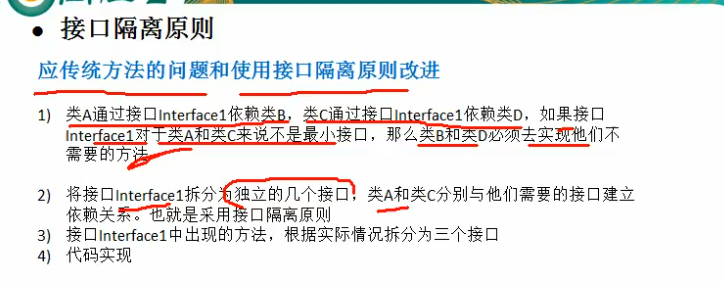

## 设计模式七大原则

### 原则介绍

1. 代码可重用
2. 可读性
3. 可扩展
4. 可靠性
5. 高内聚低耦合

### 单一职责原则

1. 基本介绍

   

2. 总结

   

### 接口隔离原则（Interface Segregation Principle）

一个类对另外一个类的通过接口进行依赖，则接口应该最小！




* 通过接口依赖其他类接口应该最小！
* 接口拆分，接口的依赖建立在最小的接口上；用不到的方法拆成小的接口

### 依赖倒装


**通过setter方法进行依赖**

```java
package com.chenfeng.designpattern.principle.inversion;

/**
 * @Classname DependcyBySetMethod
 * @Description TODO
 * @Date 2020/7/20 20:08
 * @Created by  wrsChen
 */
public class DependcyBySetMethod {
    public static void main(String[] args) {
        ITV2 itv2 = new ITV2Impl();
        IOpenAndClose2 iOpenAndClose2 = new OpenANdclose2Impl();
        iOpenAndClose2.setTv(itv2);
        iOpenAndClose2.open();
    }
}

interface IOpenAndClose2{
    void open();
    void setTv(ITV2 itv2);
}
interface ITV2{
    public void play();
}

class ITV2Impl implements ITV2{

    @Override
    public void play() {
        System.out.println("set方式");
    }
}

class OpenANdclose2Impl implements  IOpenAndClose2{
    private ITV2 itv2;
    @Override
    public void open() {
        itv2.play();
    }
    @Override
    public void setTv(ITV2 itv2) {
        this.itv2 = itv2;
    }
}
```

**通过构造方法进行依赖**

```java
package com.chenfeng.designpattern.principle.inversion;

/**
 * @Classname DependecyMethod
 * @Description TODO
 * @Date 2020/7/20 19:53
 * @Created by  wrsChen
 */
public class DependecyByConstructMethod {
    public static void main(String[] args) {

    }
}

interface IOpenAndClose1{
    void open();
}

interface ITV1{
    public void play();
}

/**
 * 通过构造方法进行依赖
 */
class OpnAndCloseImpl implements IOpenAndClose1{
    ITV1 iTv1;
    public OpnAndCloseImpl(ITV1 itv1){
        this.iTv1 = itv1;
    }

    @Override
    public void open() {
        iTv1.play();
    }
}
```

**通过接口进行依赖**

```java
package com.chenfeng.designpattern.principle.inversion;

/**
 * @Classname DependecyMethod
 * @Description TODO
 * @Date 2020/7/20 19:53
 * @Created by  wrsChen
 */
public class DependecyByInterface {
    public static void main(String[] args) {
        ITV itv = new ITVOpenClose();
        IOpenAndClose itvOpenClose = new OpenAndClose();
        itvOpenClose.open(itv);
    }
}

/**
 * 通过接口实现依赖
 */
class ITVOpenClose implements ITV{
    @Override
    public void play() {
        System.out.println("TV的依赖");
    }
}

interface IOpenAndClose{
public void open(ITV itv);
}

interface ITV{
    public void play();
}

class OpenAndClose implements IOpenAndClose{

    @Override
    public void open(ITV itv) {
        itv.play();
    }
}
```

### 里氏替换原则


* 在继承一个类时不要重写方法，实在需要重写时可以使用依赖继承；

  

* 将一个基类对象替换成一个子类对象时，将不会产生错误和异常（这里主要就是不要对父类的方法进行重写）

### 开闭原则


* 对扩展开放（提供方），对修改关闭（使用方）


### 迪米特法则


### 合成复用原则


### UML


## 创建型

### 单例模式

#### 静态常量（饿汉式）


```java
class Singleton {
    private Singleton() {
    }
    private final static Singleton singleton = new Singleton();
    public static Singleton getInstance() {
        return singleton;
    }
}
```

#### 静态代码块(饿汉式)


```java
package com.chenfeng.designpattern.create.single;

/**
 * @Classname StaticSingle
 * @Description TODO
 * @Date 2020/7/28 21:43
 * @Created by  wrsChen
 */
public class StaticSingle {
    private StaticSingle() {
    }
    private static StaticSingle staticSingle;
    static {
        staticSingle = new StaticSingle();
    }
    public static StaticSingle getInstance() {
        return staticSingle;
    }
}

```

#### 懒汉式（线程不安全）


```java
package com.chenfeng.designpattern.create.single;

/**
 * @Classname SingleLazy
 * @Description TODO
 * @Date 2020/7/28 21:56
 * @Created by  wrsChen
 */
public class SingleLazy {
    private SingleLazy singleLazy;
    private SingleLazy(){
    }
    public SingleLazy getInstance() {
        if (singleLazy == null) {
            singleLazy = new SingleLazy();
        }
        return singleLazy;
    }
}

```

#### 懒汉式Sychronized（线程安全）


```java
package com.chenfeng.designpattern.create.single;

/**
 * @Classname SingleSync
 * @Description TODO
 * @Date 2020/7/28 22:02
 * @Created by  wrsChen
 */
public class SingleSync {
    private static  SingleSync singleSync;
    private SingleSync() {
    }
    public static synchronized SingleSync  SingleSync() {
        if (singleSync == null) {
            singleSync = new SingleSync();
        }
        return singleSync;
    }
}

```

#### 懒汉式同步代码块（线程不安全）


```java
package com.chenfeng.designpattern.create.single;

/**
 * @Classname SingleSync
 * @Description TODO
 * @Date 2020/7/28 22:02
 * @Created by  wrsChen
 */
public class SingleSyncBlock {
    private static SingleSyncBlock singleSync;
    private SingleSyncBlock() {
    }
    public static  SingleSyncBlock SingleSync() {
        if (singleSync == null) {
            synchronized(SingleSyncBlock.class) {
                singleSync = new SingleSyncBlock();
            }
            }
        return singleSync;
    }
}


```

#### 懒汉式doublecheck（线程安全）

```java
package com.chenfeng.designpattern.create.single;

/**
 * @Classname SingleDoubleCheck
 * @Description TODO
 * @Date 2020/7/28 22:13
 * @Created by  wrsChen
 */
public class SingleDoubleCheck {
    private static volatile SingleDoubleCheck singleDoubleCheck;
    private static SingleDoubleCheck getInstance() {
        if (singleDoubleCheck == null) {
            synchronized (SingleDoubleCheck.class) {
             if (singleDoubleCheck == null) {
                 singleDoubleCheck = new SingleDoubleCheck();
             }
            }
        }
        return singleDoubleCheck;
    }
}
```

#### 懒汉式静态内部类（线程安全）


```java
package com.chenfeng.designpattern.create.single;

/**
 * @Classname SingleIntter
 * @Description TODO
 * @Date 2020/7/28 22:43
 * @Created by  wrsChen
 */
public class SingleIntter {
    private static class SingletonInsatnce{
        private static final SingleIntter SINGLE_INTTER = new SingleIntter();
    }
    public static synchronized SingleIntter getInstance() {
        return SingletonInsatnce.SINGLE_INTTER;
    }
}


```

#### 饿汉式枚举方式（线程安全，防序列化）

```java
package com.chenfeng.designpattern.create.single;

/**
 * @Classname SingEnum
 * @Description TODO
 * @Date 2020/7/28 22:51
 * @Created by  wrsChen
 */
public class SingEnum {

}

enum Singletion{
    INSTANCE;
    private SingEnum singEnum;
    private Singletion() {
        singEnum = new SingEnum();
    }
    public SingEnum getSingEnum() {
        return singEnum;
    }
}
```


### 工厂模式

#### 传统方式


**PIzz类**

```java
package com.chenfeng.designpattern.create.factory.simplefactory.pizzstore.pizz;

/**
 * @Classname Pizz
 * @Description TODO
 * @Date 2020/7/29 20:34
 * @Created by  wrsChen
 */
public abstract class Pizz {
    /**
     * Pizz名称
     */
    protected String name;

    /**
     * 准备原材料，不同披萨不一样，因此做成抽象方法
     */
    public abstract void prepare();
    public void bake() {
        System.out.println(name + "baking");
    }
    public void cut() {
        System.out.println(name + "cutting");
    }
    public void box() {
        System.out.println(name + "boxing");
    }
    public void setName(String name) {
        this.name = name;
    }
}


```
**CheesePizz**

```java
package com.chenfeng.designpattern.create.factory.simplefactory.pizzstore.pizz;

/**
 * @Classname CheesePizz
 * @Description TODO
 * @Date 2020/7/29 22:12
 * @Created by  wrsChen
 */
public class CheesePizz extends Pizz {

    @Override
    public void prepare() {
        System.out.println("给希腊pizz准备原材料");
    }
}
```

**GreekPizz**

```java
package com.chenfeng.designpattern.create.factory.simplefactory.pizzstore.pizz;

/**
 * @Classname CheesePizz
 * @Description TODO
 * @Date 2020/7/29 22:12
 * @Created by  wrsChen
 */
public class CheesePizz extends Pizz {

    @Override
    public void prepare() {
        System.out.println("给希腊pizz准备原材料");
    }
}
```

**OrederPizz**

```java
package com.chenfeng.designpattern.create.factory.simplefactory.pizzstore.order;

import com.chenfeng.designpattern.create.factory.simplefactory.pizzstore.pizz.CheesePizz;
import com.chenfeng.designpattern.create.factory.simplefactory.pizzstore.pizz.GreekPizz;
import com.chenfeng.designpattern.create.factory.simplefactory.pizzstore.pizz.Pizz;

/**
 * @Classname OrderPizz
 * @Description TODO
 * @Date 2020/7/29 22:16
 * @Created by  wrsChen
 */
public class OrderPizz {
    /** 不使用工厂模式的缺陷
     * @descript:
     * @param:
     * @return：
     * @exception：
     * @author： chenfeng
     * @date： 2020/7/29 22:24
     */
    public OrderPizz() {
        Pizz pizz;
        String orderType = getType();
        do{
            if (orderType.equals("greak")) {
                pizz = new GreekPizz();
            } else if (orderType.equals("chess")) {
                pizz = new CheesePizz();
            } else {
                break;
            }
        }while(true);
    }

    // 返回一个pizz类
    private String getType(){
        return "";
    }
}

```

#### 简单工厂模式


```java
package com.chenfeng.designpattern.create.factory.simplefactory.pizzstore.order;

import com.chenfeng.designpattern.create.factory.simplefactory.pizzstore.pizz.CheesePizz;
import com.chenfeng.designpattern.create.factory.simplefactory.pizzstore.pizz.GreekPizz;
import com.chenfeng.designpattern.create.factory.simplefactory.pizzstore.pizz.Pizz;

/**
 * @Classname SimpleFactory
 * @Description TODO
 * @Date 2020/7/29 22:55
 * @Created by  wrsChen
 */
public class SimpleFactory {
    // 根据类型返回对应的pizz
    // 这里也可以是静态的
    public Pizz createPizz(String orderType) {
        Pizz pizz = null;
        System.out.println("简单工厂");
        if (orderType.equals("greak")) {
            pizz = new GreekPizz();
            pizz.setName("grrrk");
        } else if (orderType.equals("chess")) {
            pizz = new CheesePizz();
        }
        return pizz;
    }

}

```

#### 工厂方法

 {
        this.orderType = orderType;
    }
    public abstract Pizz createPizz();
}

```

**OrderFactory**

```java
package com.chenfeng.designpattern.create.factory.factorymethod.order;

import com.chenfeng.designpattern.create.factory.factorymethod.pizz.BJGreekPizz;
import com.chenfeng.designpattern.create.factory.factorymethod.pizz.BJPerPizz;
import com.chenfeng.designpattern.create.factory.factorymethod.pizz.Pizz;
import com.chenfeng.designpattern.create.factory.simplefactory.pizzstore.pizz.GreekPizz;

/**
 * @Classname BJOrderFactory
 * @Description TODO
 * @Date 2020/7/29 23:28
 * @Created by  wrsChen
 */
public class BJOrderFactory extends OrderPizz{
    public BJOrderFactory(String orderType) {
        super(orderType);
    }
    @Override
    public Pizz createPizz() {
        Pizz pizz = null;
        if (orderType.equals("chess")) {
            pizz = new BJPerPizz();
        } else if (orderType.equals("gre")) {
            pizz = new BJGreekPizz();
        }
        return pizz;
    }
}

```

**Test**

```java
package com.chenfeng.designpattern.create.factory.factorymethod.test;

import com.chenfeng.designpattern.create.factory.factorymethod.order.BJOrderFactory;
import com.chenfeng.designpattern.create.factory.factorymethod.order.OrderPizz;

/**
 * @Classname Test
 * @Description TODO
 * @Date 2020/7/29 23:32
 * @Created by  wrsChen
 */
public class Test {
    public static void main(String[] args) {
        OrderPizz orderPizz = new BJOrderFactory("pizz");
        orderPizz.createPizz();
    }
}
```

#### 抽象工厂


### 克隆模式（原型）

**传统模式**

```java
//直接创建对象
```

**克隆（浅拷贝）**

```java
package com.chenfeng.designpattern.create.factory.prototype;

/**
 * @Classname ObjectCloneMethod
 * @Description TODO
 * @Date 2020/8/2 22:32
 * @Created by  wrsChen
 */
public class ObjectCloneMethod {
    /**
    * 12
    */
    private String age;
/**
* s1
*/
    private String name;
    @Override
    protected Object clone() throws CloneNotSupportedException {
        Sheep sheep = null;
        sheep = (Sheep) super.clone();
        return sheep;
    }
}
```

**克隆（深拷贝）***案例一*****


```java
package com.chenfeng.designpattern.create.factory.prototype;

import java.io.Serializable;

/**
 * @Classname DeepProType
 * @Description TODO
 * @Date 2020/8/2 23:02
 * @Created by  wrsChen
 */
public class DeepProType implements Serializable, Cloneable {
    private String name;
    private DeepCloneAble  deepCloneAble;

    public DeepCloneAble getDeepCloneAble() {
        return deepCloneAble;
    }

    public void setDeepCloneAble(DeepCloneAble deepCloneAble) {
        this.deepCloneAble = deepCloneAble;
    }

    public String getName() {
        return name;
    }
    public void setName(String name) {
        this.name = name;
    }

    // 方式一clone方法

    @Override
    protected Object clone() throws CloneNotSupportedException {
        Object deep = null;
        // 对基本数据类型和字符串的克隆
        deep = super.clone();
        // 单独处理对象的clone
        DeepProType deepProType = (DeepProType) deep;
        deepProType.deepCloneAble = (DeepCloneAble) deepCloneAble.clone();
        return deepProType;
    }
}

```

**克隆（深拷贝）案例二**

```java
package com.chenfeng.designpattern.create.factory.prototype;

import java.io.*;

/**
 * @Classname DeepProType
 * @Description TODO
 * @Date 2020/8/2 23:02
 * @Created by  wrsChen
 */
public class DeepProType implements Serializable, Cloneable {
    private String name;
    private DeepCloneAble  deepCloneAble;

    public DeepCloneAble getDeepCloneAble() {
        return deepCloneAble;
    }

    public void setDeepCloneAble(DeepCloneAble deepCloneAble) {
        this.deepCloneAble = deepCloneAble;
    }

    public String getName() {
        return name;
    }
    public void setName(String name) {
        this.name = name;
    }
    // 方式二通过对象的序列化实现
    public Object deepClone(){
        ByteArrayOutputStream bos = null;
        ObjectOutputStream oos = null;
        ByteArrayInputStream bis = null;
        ObjectInputStream ois = null;
        DeepProType deepProType = null; 
        try {
            // 序列化
            bos = new ByteArrayOutputStream();
            oos = new ObjectOutputStream(bos);
            oos.writeObject(this);
            // 反序列化
            bis = new ByteArrayInputStream(bos.toByteArray());
            ois = new ObjectInputStream(bis);
             deepProType = (DeepProType) ois.readObject();

        }catch (Exception e){
        } finally{
            //todo 关闭流
        }
    return deepProType;
    }
}
```


### 创建者模式

**传统方式**

```java
package com.chenfeng.designpattern.create.builder;

/**
 * @Classname House
 * @Description TODO
 * @Date 2020/8/3 20:24
 * @Created by  wrsChen
 */
public abstract class House {
    public abstract void buildBasic();
    public abstract void buildWalls();
    public abstract void roofed();
    public void build(){
        buildBasic();
        buildBasic();
        roofed();
    }
}

```

```java
package com.chenfeng.designpattern.create.builder;

/**
 * @Classname CommonHouse
 * @Description TODO
 * @Date 2020/8/3 20:28
 * @Created by  wrsChen
 */
public class CommonHouse extends House{
    @Override
    public void buildBasic() {
        System.out.println("普通房子打地基");
    }

    @Override
    public void buildWalls() {
        System.out.println("普通房子砌墙");
    }
    @Override
    public void roofed() {
        System.out.println("普通房子封顶");
    }
}

```


**建造者模式**


**产品**

```java
package com.chenfeng.designpattern.create.builder.improve;

/**
 * @Classname House
 * @Description TODO
 * @Date 2020/8/3 20:24
 * @Created by  wrsChen
 */
public  class House {
    private String baise;
    private String wall;
    private String roofed;

    public String getBaise() {
        return baise;
    }

    public void setBaise(String baise) {
        this.baise = baise;
    }

    public String getWall() {
        return wall;
    }

    public void setWall(String wall) {
        this.wall = wall;
    }

    public String getRoofed() {
        return roofed;
    }

    public void setRoofed(String roofed) {
        this.roofed = roofed;
    }
}

```

**抽象建造者**

```java
package com.chenfeng.designpattern.create.builder.improve;

/**
 * @Classname HpurseBuilder
 * @Description TODO
 * @Date 2020/8/3 21:14
 * @Created by  wrsChen
 */
public abstract class HourseBuilder {
    private House house = new House();
    public abstract void buildBasic();
    public abstract void buildWalls();
    public abstract void roofed();
public House huilderHouse() {
    return house;
}
}
```

**具体建造者**

```java
package com.chenfeng.designpattern.create.builder.improve;

/**
 * @Classname CommonHouse
 * @Description TODO
 * @Date 2020/8/3 21:20
 * @Created by  wrsChen
 */
public class CommonHouse extends HourseBuilder {
    @Override
    public void buildBasic() {
        System.out.println("普通房子");
    }

    @Override
    public void buildWalls() {
        System.out.println("普通房子");
    }

    @Override
    public void roofed() {
        System.out.println("普通房子");
    }
}
```

**指挥者**

```java
package com.chenfeng.designpattern.create.builder.improve;

/**
 * @Classname HouseDirector
 * @Description TODO
 * @Date 2020/8/3 21:22
 * @Created by  wrsChen
 */
public class HouseDirector {
    HourseBuilder hourseBuilder = null;
    public  HouseDirector(HourseBuilder hourseBuilder){
        this.hourseBuilder = hourseBuilder;
    }
    public void setHourseBuilder(HourseBuilder hourseBuilder){
        this.hourseBuilder = hourseBuilder;
    }
    public House constractHouse() {
        hourseBuilder.buildBasic();
        return hourseBuilder.huilderHouse();
    }

}
```

### 适配器模式


#### 类适配器

