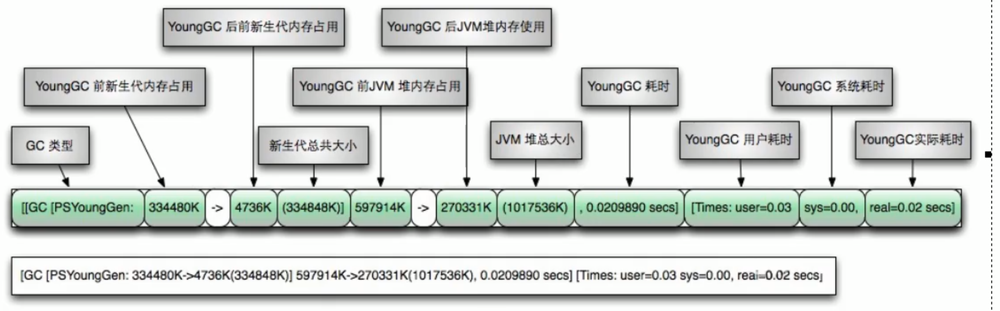
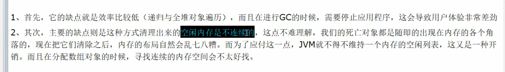

6 stack

* 栈管运行
* 堆管存储


第一次gc  存活下来的到s1区

第二次gc  交换

活过十五次到养老区


第一次：eden gc copy  from  清空eden

第二次：                                     复制，交换

 第三次：


```java
package com.chenfeng.inter.jvm;

/**
 * @Classname MemoryTest
 * @Description TODO
 * @Date 2020/6/21 20:28
 * @Created by  wrsChen
 */
public class MemoryTest {
    public static void main(String[] args) {
        int i = Runtime.getRuntime().availableProcessors();
        long l = Runtime.getRuntime().totalMemory();
        long l1 = Runtime.getRuntime().freeMemory();
        long l2 = Runtime.getRuntime().maxMemory();
        System.out.println("核心数" + i);
        System.out.println("总内存数" + l1/1024/1024);
        // 生产环境调成一样的，避免忽高忽低 内存变动，震荡
        //1/16 默认
        System.out.println("可用内存数" + l/1024/1024);
        //1/4 默认
        System.out.println("可用最大内存数" + l2/1024/1024);
        
    }
}

```


**轻GC**



**重GC**


怎么判断这个对象是垃圾？

怎么回收？


首先非常感谢up,和视频的周阳老师，然后JVM 那块我补充一点点：
判断对象是否已经死亡的算法：引用计数算法，可达性分析算法；
四个垃圾收集算法：标记清除算法，复制算法，标记整理算法，分代收集算法；
七个垃圾收集器：Serial，SerialOld,ParNew,Parallel Scavenge,Parallel Old,CMS,G1.
视频中把引用技术算法归到垃圾收集算法了，以及没有提到可达性分析算法。还有就是垃圾收集器那块没有讲到。大家可以根据2,4,7这几个数字来差缺补漏。





G1


## JMM java内存模型

* 可见性
* 原子性
* 有序性


[java内存模型、对象模型、内存结构](https://blog.csdn.net/robothj/article/details/89564183)

