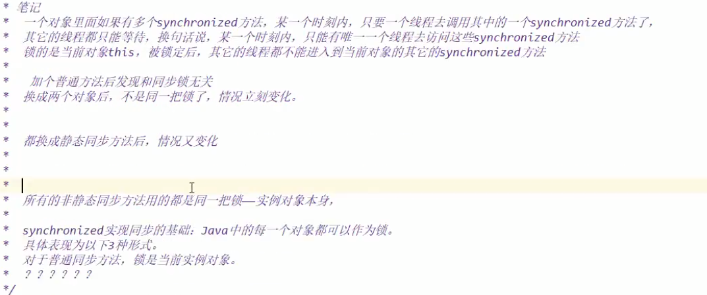
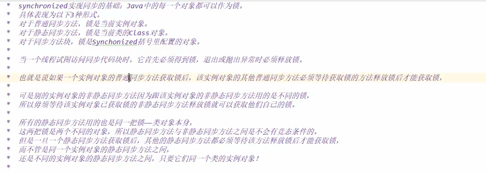
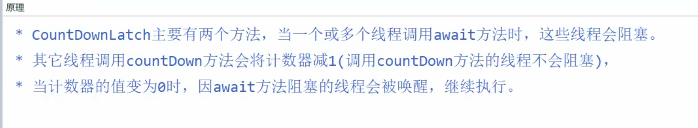
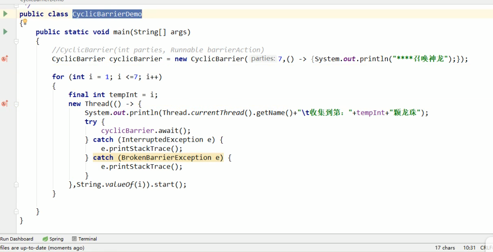
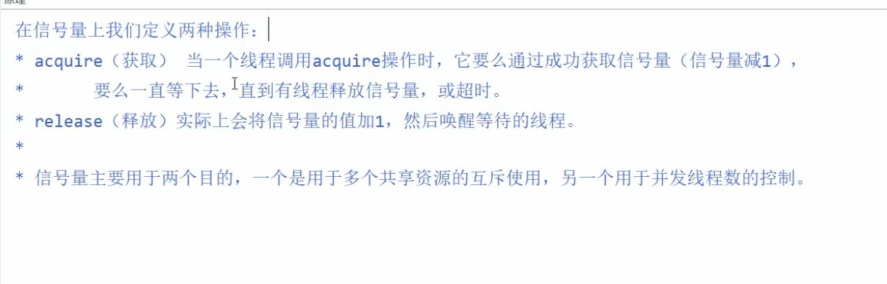
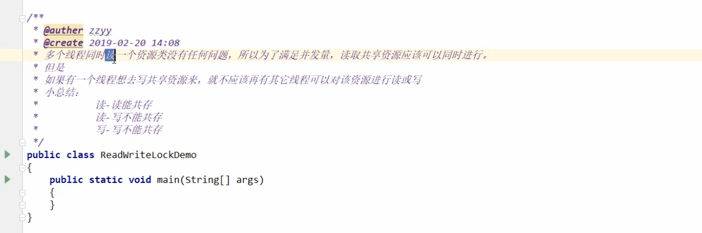
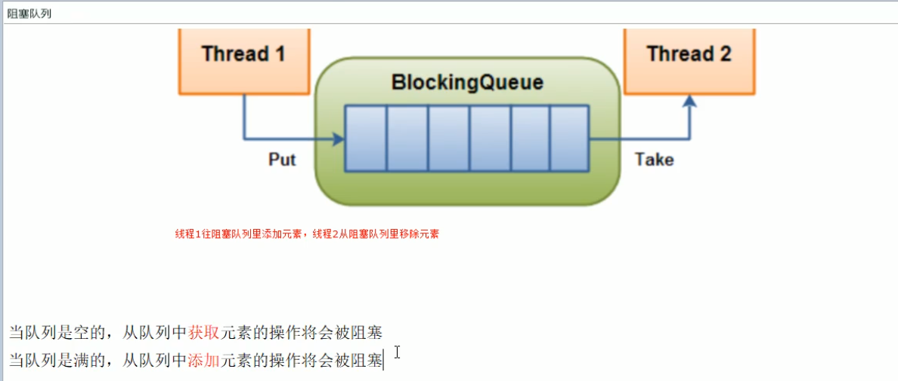
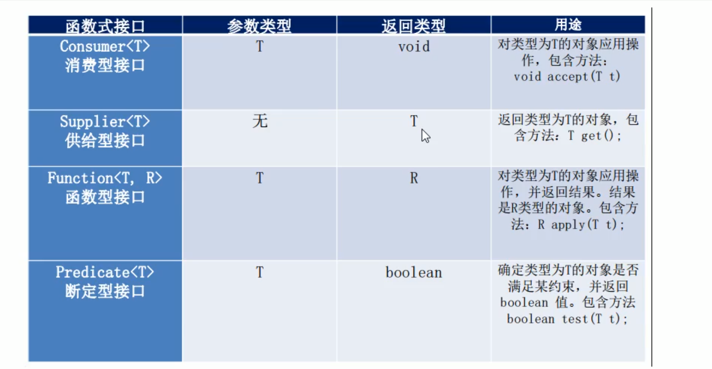

## Lock

锁的粒度

## Lambda

函数式接口

* 函数式接口（一个接口只有一个抽象方法）@FunctionalInterface
* 拷贝小括号，写死右箭头，落地大括号
* 可以有多个default默认方法
* 可以有多个静态方法实现

## 生产者消费者

线程操作资源类

* 判断
* 干活
* 通知

多线程交互中，必须要防止多线程的虚假唤醒，也即（判断只能用while，不能用if）

标志位

ONE生产者，消费者模式

```java
package com.chenfeng.inter.thread;

/**
 * @Classname ThreadWaitNotifyDemo
 * @Description TODO
 * @Date 2020/6/22 23:27
 * @Created by  wrsChen
 */
public class ThreadWaitNotifyDemo {
    public static void main(String[] args) {
        AirConditioner airConditioner = new AirConditioner();
        new Thread(() -> {
            try {
                for (int i = 0; i < 10; i++) {
                    airConditioner.increment();
                }
            } catch (InterruptedException e) {
                e.printStackTrace();
            }
        },"A").start();

        new Thread(() -> {
            try {
                for (int i = 0; i < 10; i++) {
                    airConditioner.decrement();
                }
            } catch (InterruptedException e) {
                e.printStackTrace();
            }
        },"B").start();

    }
}
class AirConditioner{
    private int number = 0;
    public synchronized void increment() throws InterruptedException {
        // 1.判断
        if (number != 0) {// 换成while就对了
            this.wait();
        }
        // 2.干活
        number++;
        System.out.println(Thread.currentThread().getName() + number);
        //3.通知
        this.notifyAll();
    }
    public synchronized  void decrement() throws InterruptedException {
        if (number != 1) {// 换成while就对了  防止虚假唤醒
            this.wait();
        }
        number--;
        System.out.println(Thread.currentThread().getName() + number);
        this.notifyAll();
    }
}
```

多个线程抢占资源，被唤醒时，可能会产生虚假唤醒，因此需要使用while再经历一次检查

题目：多线程8锁

两个线程

* 标准访问，先打印邮件还是短信
* 邮件方法暂停4秒，请问先打印邮件还是短信
* 新增一个普通方法hello(),请问先打印邮件还是hello
* 两部手机请问先打印邮件还是短信
* 两个静态同步方法，同一部手机，请问先打印邮件还是短信
* 两个手机，两个静态同步方法，同一部手机，请问先打印邮件还是短信
* 一个普通同步方法，一个静态同步方法，同一部手机，请问先打印邮件还是短信
* 一个普通同步方法，一个静态同步方法，两部手机，请问先打印邮件还是短信





java.connect,modifyException

Collections.SychronizedSet();

CopyOnWriteArrayList










读写锁

```java
package com.chenfeng.inter.thread;

import java.util.HashMap;
import java.util.HashSet;
import java.util.Map;
import java.util.concurrent.locks.ReadWriteLock;
import java.util.concurrent.locks.ReentrantReadWriteLock;

/**
 * @Classname WriteReadLockDemo
 * @Description TODO
 * @Date 2020/6/27 10:08
 * @Created by  wrsChen
 */
public class WriteReadLockDemo {

    public static void main(String[] args) {
        Mychcae mychcae = new Mychcae();
        for (int i = 0; i < 1000000; i++) {
            final int tempInt  = i;
            new Thread(() -> {
                mychcae.wrieteResource(tempInt + "", tempInt + "");
            },String.valueOf(i)).start();
        }
        for (int i = 0; i < 1000000; i++) {
            final int tempInt  = i;
            new Thread(() -> {
                mychcae.readResource(tempInt + "");
            },String.valueOf(i)).start();
        }
    }
}
class Mychcae{
    private ReadWriteLock writeLock = new ReentrantReadWriteLock();
    private volatile  Map<String, String> map = new HashMap();
    public void wrieteResource(String key, String value){
        writeLock.writeLock().lock();
        try {
            System.out.println(Thread.currentThread().getName() + "我正在写" + key);
            map.put(key, value);
            System.out.println(Thread.currentThread().getName() + "我写完了");
        } finally {
            writeLock.writeLock().unlock();
        }
        }

    public void readResource(String key){
        writeLock.readLock().lock();
        try {
            System.out.println(Thread.currentThread().getName() + "我正在读");
            String a =  map.get(key);
            System.out.println(Thread.currentThread().getName() + "我读完了" + a);
        } finally {
            writeLock.readLock().unlock();
        }
        }
}
```




