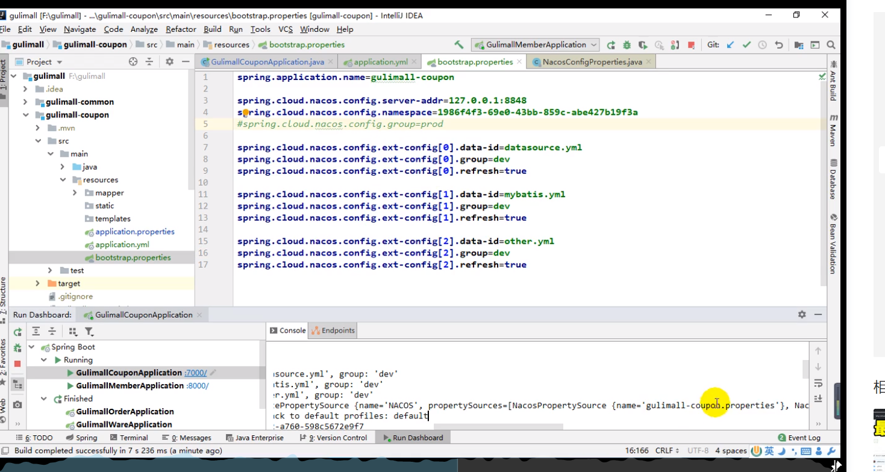

## 1.忏悔
予2020-03-05始习谷粒商城、JVM。。。，然6月懈怠退出！于12月12日幡然醒悟，“不切实际的幻想与空谈只是自我麻醉、自我幻想、自我价值的贬值”！不如脚踏实地，封印心魔，踏上自我救赎之路！望蓦然回首时不再慨叹！

## 1.1虚拟机

**[VirtualBox](https://download.virtualbox.org/virtualbox/6.0.10/VirtualBox-6.0.10-132072-Win.exe)**

## 1.2装机神器

**[Vagrant]( https://releases.hashicorp.com/vagrant/2.2.5/vagrant_2.2.5_x86_64.msi)**

​	再装软件的时候，由于是下载的国外的镜像所以下载速度异常缓慢不说还有可能下载不下来，下载不下载怎么办呐？vagrant是以box为基础的，因此本质上我们可以下载box再把box加入本地列表就行了；折中方案就是在网上下载[box]();下载下来之后，可按下面的方式进行操作[操作步骤](https://jingyan.baidu.com/article/642c9d34e15cdd644b46f74b.html)

​	下载完centeros的box之后，进行对应的操作

1. 在下载的box路径下按cmd进入当前，目录的命令行模式,这里是我box的路径

   ```shell
   vagrant box add centos7  E:\software\centeros7\Vagrant-CentOS-7.box
   ```

2. 执行init命令,其中centos7为刚才镜像的名称

   ```SH
   vagrant init centos7
   ```

3. 启动虚拟容器

   ```ssh
   vagrant up
   ```
   
4. 链接虚拟机

   ```sh
   vagrant ssh
   ```

5. 修改Vagrantfile文件

   使用ipconfig命令查询本机的ip地址网段将其设置一直

   

   

6. 重启vagrant

```ssh
vagrant reload
```

7. ip addr IP地址
8. 


## 1.3docker安装

虚拟化容器技术，基于镜像。秒启各种容器，每一个容器就是一个完整地运行环境，环境之间相互隔离；

### 1.3.1docker安装

外国镜像地址：https://hub.docker.com/

docker安装地址：https://docs.docker.com/install/linux/docker-ce/centos/

1.卸载

```sh
sudo yum remove docker \
                  docker-client \
                  docker-client-latest \
                  docker-common \
                  docker-latest \
                  docker-latest-logrotate \
                  docker-logrotate \
                  docker-engine
```

2. 安装依赖包

   ```sh
   sudo yum install -y yum-utils \
     device-mapper-persistent-data \
     lvm2
   ```

   

3. 从那个仓库下载

   ```sh
   sudo yum-config-manager \
       --add-repo \
       https://download.docker.com/linux/centos/docker-ce.repo
   ```

   

4. 安装docker管理工具

   ```sh
   sudo yum install docker-ce docker-ce-cli containerd.io
   ```

5. 启动docker

   ```sh
   sudo systemctl start docker
   ```

6. 查看docker有哪些镜像

   ```sh
   sudo docker images
   ```

7. 设置docker自启动

8. ```
   sudo systemctl enable docker
   ```

9. 配置docker镜像加速

   镜像默认是国外的太慢了，使用国内的阿里云加速；下面是找到那段加速代码的方式

   登陆阿里云-》控制台-》左侧产品与服务-》容器镜像服务-》镜像加速器-》可以找到如下代码

   1.创建文件

   ```sh
   sudo mkdir -p /etc/docker
   ```

   2. 执行命令

      ```sh
      sudo tee /etc/docker/daemon.json <<-'EOF'
      {
        "registry-mirrors": ["https://kbhu3ofq.mirror.aliyuncs.com"]
      }
      EOF
      ```

   3. 执行命令

      ```
      sudo systemctl daemon-reload
      sudo systemctl restart docker
      ```
      
   4. docker仓库地址

      ```sh
      hub.docker.com
      ```

   5. 安装mysql镜像

      ```shell
      docker pull mysql:5.7
      ```

   6. mysql启动参数配置

      ```sh
      docker run -p 3306:3306 --name mysql \
      -v /mydata/mysql/log:/var/log/mysql \
      -v /mydata/mysql/data:/var/lib/mysql \
      -v /mydata/mysql/conf:/etc/mysql \
      -e MYSQL_ROOT_PASSWORD=root \
      -d mysql:5.7
      ```

      

   7. 查看镜像

      ```
      docker ps
      docker images
      docker rm
      ```

      

   8. 进入docker镜像中装的mysql里

      ```
      docker exec -it mysql /bin/bash
      ```

   9. 退出mysql

   10. 更改mysql配置
   
      ```sh
      vi /mydata/mysql/conf/my.cnf
      ```
   
10. mysql相关配置
   
    ```
       [client]
       default-character-set=utf8
       [mysql]
       default—character—set=utf8
       [mysqld]
       init_connect='SET collation_connection = utf8_Unicode_ci'
       init_connect='SET NAMES utf8'
       character-set-server=utf8
       collation-server=utf8_unicode_ci
       skip-character-set-client-handshake
       skip-name-resolve
    ```
   
       
   
   11. 重启容器
   
       ```
       docker restart mysql
       ```
   
   12. 拉取redis镜像
   
       ```
       docker pull redis
       ```
   
       
   
   13. redis配置
   
       ```ssh
       mkdir -p /mydata/redis/conf
       touch /mydata/redis/conf/redis.conf
       ```
   
       
   
   14. redis配置
   
       反斜杠代表的是换行的意思 注意它两边是有换行的
   
       ```sh
       docker run -p 6379:6379 --name redis \
       -v /mydata/redis/data:/data \
       -v /mydata/redis/conf/redis.conf:/etc/redis/redis.conf \
       -d redis redis-server /etc/redis/redis.conf
       ```
   
       
   
   15. 进入redis客户端
   
       ```sh
       docker exec -it redis redis-cli
       ```
   
       
   
   16. 在 mydata/redis/conf/redis.conf添加持久操作
   
       ```
       appendonly yes
       ```
   
       
   
   17. 设置容器自动启动

       ```sh
       sudo docker update redis --restart=always
       ```

       

   18. 前端vue下载

       github的地址已经没有了

       ```tex
       其中的package.json中搜node-sass将依赖版本改成目前可以下载的最低版本4.12.0
       ```

19. nacos

    应用名称是必须的

20. nacos配置集

    https://github.com/alibaba/spring-cloud-alibaba/wiki/Nacos-config

21. vscode快捷键

    ```
    shift + ！ 快速生成html代码块
    alt+shift+f 代码整理 
    
    
    ```
    
    
 ## ES6学习

    * var
    
      * 会越域
    
      * 变量可以声明多次
  * 变量提升
    
    * let

      * 只能在自己的作用域内
  * 变量只能声明一次
      * 不存在变量提升
      
    * const

      * 是常量
  * 声明的变量不可更改
    
    * 解构表达式.字符串模板

      ```js
      
      ```
  <script>
          let arr = [1,2,3];
          /**************解构表达式开始*********************/
          // 原始写法
          let a = arr[0];
           let b = arr[1];
           let c = arr[2];
          // 数据解构
          let[a,b,c] = arr;
          console.info(a,b,c);
              const person = {
              name: "jack",
              age:21,
              langguage:['java','js','css']
          }
          //原始写法
          const name = person.name;
          const age = person.age;
          const langguage = person.language;
          // 对象解构
          const {name,age1,language} = personl;
          const {name:abc,age1,language} = personl;//把值赋给abc
          //字符串扩展
          let str = "hello.vue";
          str.endsWith("vue");
          str.startsWith("hello");
          str.includes("e");
          /*****************解构表达式结束******************************/
          // 字符串模板
          // 用反引号括起来，支持多行
          let ss = 
              `<div>
          <span>qqq</span>
              </div>`;
          function fun() {
              return "这是一个函数";
          }    
          // 字符串插入变量和表达式，变量名写在${}中，${}中可以放入js表达式,以及函数
          let info = '我是${abc},今年${age—+10}了,${func()}'; 
      </script>
      ```


​      

    * 函数优化
    
      ```js
  <script>
      // 在es6之前无法给一个函数参数设置默认值，只能采用变通写法
      function add(a, b){

          b = b||1;
          return a +bl
      }
      // es6之后可以这样写，没有传的话就给默认值
      function add(a, b=1){
      b = b||1;
      return a +bl
      }
      
      // 不定参数
      function func(...values){
          console.info(values.length);
      }
      // 箭头函数
      
      // 以前声明一个方法
      var print =  function (obj) {
      console.log(obj);
      }
      print("hello");
      // es6
      var print = obj => console.log(obj);
      
      var sum = function (a, b) {
          return a+b;
      }
      //  函数名称  参数列表   函数体
      var sum2 = (a,b) => a+b;
      console.log(sum2(11,12));
      let person = {
          name:"宅男",
          age:18
      }
      // 箭头函数 + 解构函数
      var hello2 = ({name}) => console.log("hello," + name);
      // 传对象
      hello2(person);
      
      // 直接在对象上书写方法的方式
      var tool = {
          trim(str){
              
          }
          
      }
      </script>
      ```

23. 对象优化

    ```js
    <script>
    let person = {
        name:"宅男",
        age:18,
        language:['a','v','b']
    }
    // key值的集合
    console.log(Object.keys(person));
    // value值的集合
    console.log(Object.values(person));
    // 集合，每一个元素是键值对集合
    console.log(Object.entries(person));
    
    // 将一个对象放在另外一个对象里
    const target = {a:1};
    const source1 = {b:2};
    const  source2 = {c:3};
    Object.assign(target, source1, source2);
    
    // 声明对象优化
    
    const age =23;
    const name = "张三";
    //es6之前
    const person3 = {age:age, name:name}; 
    //es6之后，属性名和属性值一样可以这样简写
    const person1 = {age,name};
    // 对象函数简写
    let person4 = {
        name:"jack",
        // 以前
        eat:function(food){
            console.log(this.name + "吃" + food);
        },
        // 箭头函数this不能使用，对象.属性
        eat2: food => console.log(person4.name + "吃" +food),
        eat3(food){
            console.log(this.name + "吃" + food);
        }
    }
    /* 对象扩展运算符*/
    //1. 拷贝对象，深拷贝
    let person1 = {name:"a",age:15};
    let somone = {...person1};
    //2. 合并对象
    let  age1 = {age:15};
    let name1 = {name:"amy"};
    let person2 = {...age1,...name1};
    </script>
    ```

24. map和reduce

    ```js
    <script>
        // 数组中新增看map和reduce方法
        // map() 接收一个函数，将原数组中的所有元素用这个函数处理后放入新数组返回
        let arr = ['1','20','-5','3'];
       // console.log(arr);
        arr.map((item) => {return item *2});
      
        arr = arr.map(item => item*2);
        console.info(arr);
        // reduce(callback,[initalValue]) 为数组中的每一个元素依赖依次执行回调函数，不包括数组中被删除或者从未被赋值的元素
        // callback（执行数组每个函数，包含四个参数）
        /*
        1. perviousValue （上一次调用回调返回的值，或是提供的初始值（initlValue））
        2. currentValue （数组中当前被处理的元素）
        3. index（当前元素在数组中的索引）
        4. array （调用reduce的数组）
        */
        let result = arr.reduce((a,b)=>{
            console.log("上一次处理后"+a);
            console.log("当前正在处理后"+b);
            return a+b;
        })
    console.log(result);
    </script>
    ```

    

25. promise异步编排

    ```js
    // 可以封装异步操作,可以一直then，然后继续封装promise
    let p = new Promise((resolve, reject)=>{
        // 1.异步操作
        $.ajex({
            url:"mock/user.json",
            success:function(data){
                resolve(data);
            },
            error:function(err){
             reject(err);   
            }
        });
    });
    p.then((obj)=>{
     return new Promise((resolve, reject)=>{
        // 1.异步操作
        $.ajex({
            url:"mock/user.json",
            success:function(data){
                resolve(data);
            },
            error:function(err){
             reject(err);   
            }
        });
    });
    }).catch((err)=>{
        
    }).then((data)=>{
       
    })
    // 封装promise
    
    function get(url, data) {
       return new Promise((resolve, reject)=>{
        // 1.异步操作
        $.ajex({
            url:url,
            data:data,
            success:function(data){
                resolve(data);
            },
            error:function(err){
             reject(err);   
            }
        });  
    }
    //使用
     get("ss").then((data)=>{
           return get("aa");
       }).then((data)=>{
           
       });                     
    
    
    
    
    ```

    

25. import,export、

    hello.js

    ```js
    // 第一种写法声明了一个对象并直接导出
    export const util = {
        sun(a,b){
            a+b;
        }
    }
    // 第二种写法
    export default{
        sum(a,b){
            return a+b;
        }
    }
    // 第三种写法
    export{util}
    // export不仅可以到处对象，一切js变量都可以导出。比如：基金类型、函数、数据对象
    ```

    user.js

    ```js
    var name = "jack";
    var age = 21;
    function add(a,b){
        return a+b;
    }
    export {name,age,add}
    ```

    main.js

    ```js
    import util from "./hello.js"
    import {name,add} from "./user.js"
    // 如果是default这种导入方式则export中的名称可以随意写 
    
    util(1,2);
    
    ```

    

26. 

## 1.4vue学习

1. 初始化项目

   ```js
   npm init -y
   ```

2. 在初始化项目的时候遇到受限问题

   ```txt
   解决的网址：https://www.cnblogs.com/stonege/p/12599942.html
   ```

3. 安裝vue

   ```js
   npm install vue
   ```

4. 引入vue.js

   ```js
   <!DOCTYPE html>
   <html lang="en">
   <head>
       <meta charset="UTF-8">
       <meta name="viewport" content="width=device-width, initial-scale=1.0">
       <title>Document</title>
   </head>
   <body>
       <div id="app">
           // 插值表达式 双大括号
           <h1> {{name}},非常帅</h1>
       </div>
       <script src="./node_modules/vue/dist/vue.js"></script>
       <script>
           let vm = new Vue({
               el:"#app",
               data:{
                   name:"张三"
               }
           })
       </script>
   </body>
   </html>
   ```

   

5. 数据绑定

   ```
   声明式数据{{数据值}}
   双向绑定，模型变化，视图变化；反之亦然
   v-xx指令
   插值表达式只能用在标签体内
   使用bind时属性或者名字要用''引用起来
   
   ```

6. VUE开发过程

   * 创建VUE实例，关联页面模板，将自己的数据（data）渲染到关联的模板，响应式
   * 指令来简化dom的一些操作
   * 声明方法来做一些更复杂的操作。methods里面可以封装方法
   * el绑定元素
   * data封装数据
   * methods

7. v-on

   * v-on:click 可以简写成@click
   * 事件修饰符
   * 按键修饰符

8. v-for

   ```js
   // 加上key可以提高渲染效率，一般是区分的唯一值
   <li v-for="(元素,下标) in 数组" :key="user.name">
   	<span v-for = "(键,值,索引) in 元素">
   	</span>
   </li>
   ```

9. v-if，v-show

   

10. 计算属性和侦听属性

   ```
   type：设置为number
   computed：计算属性
   watch：侦听属性
   ```

11. 过滤器

    ```
    //局部过滤器
    {{ 数值|过滤器}}
    filters:{
    genderfilter(){
    
    }
    }
    //全局过滤器
    Vue.filter("gFilter",function(val){
    	
    })
    
    ```

    

12. 组件化

    // 全局声明注册一个组件

13. 安装webpack

    选项-》快速编辑选项去掉。不然会出问题

    ```
    npm install webpack -g
    ```

    

14. 安装vue/cli

    ```
    npm install -g @vue/cli-init
    -- 上面这个命令不行又使用了下面的命令
    npm install -g vue-cli
    ```

15. 初始化vue项目

    ```
    vue init webpack appname
    ```

16. vue环境搭建遇到的两个问题

    ```js
    1.安装成功脚手架后提示，vue不是可用的命令，则node_global/bin添加到path路径下即可
    2.安装成功后提示目录名不对什么的
    @"%~dp0\C:\Users\liux\AppData\Local\Yarn\Data\global\node_modules\.bin\vue.cmd" %*
    改成
    @C:\Users\liux\AppData\Local\Yarn\Data\global\node_modules\.bin\vue.cmd" %*
    ```

    

17. VUE组件的运行原理基本介绍

    ```
    index页面-》启动靠main.js，里面包含了组件以及路由的信息；实际上是在index页面挂载了main.js中的组件信息
    ```
    
    
    
18. 安装element-ui

    ```js
    npm i element-ui
    ```


## 1.5PowerDesigner

[**PowerDesigner**](http://forspeed.onlinedown.net/down/powerdesigner1029.zip )

## 1.6其他软件

https://www.lanzous.com/b015ag33e

密码:2wre

## 1.6电商相关知识点

1. 设置entry中字段表单中不存在的注解

   ```java
   @TableField(exist=false)
   ```

   

2. @RequestBody注解

   springmvc自动将请求体的数据（json），转为对应的对象，所以只能使用post做请求

3. mubaitis逻辑删除

   也就意味着数据实际上是没有被删除的，只是设置了一个逻辑位；删除实际上是改变了逻辑位的值而已；

   1. 在xml中配置逻辑删除（高版本不需要）
   2. 写逻辑代码删除注解（高版本不需要）
   3. 在bean上添加逻辑删除规则@TableLogic

4. jsr303

   使用相关注解来进行数据校验

   1. 需要在RequestBody前加valid注解

   2. 在校验注解中可以加自定义信息

   3. @Pattern 自己写正则表达式，自定义校验规则

   4. 统一异常处理

      自定义异常

      全局枚举

      分组校验

      * 校验注解标注什么时候校验
      * spring提供的validated中指定对应的分组
      * 指定分组的时候，不写属于哪个组则校验不生效

   5. 自定义校验

      * 正则表达式
      * 自定义注解
        * 编写一个自定义的校验注解
        * 编写一个自定义校验器
        * 管理自定义校验注解，自定义校验器

   6. spu

      标准化产品单元

      基本属性

   7. sku

      销售属性

      

   8. 


## 1.7renrenfast使用

### 1.7.1代码生成器的使用

### 1.7.2管理界面的使用

1. 安装renrenfast锁需要的依赖

2. 登陆renrenfast

   账号密码均为admin

3. 点击菜单管理

   * 创建菜单

     菜单由一级菜单，二级菜单组成；二级菜单有路由；

     在views-moduls下建对应的一级，二级目录；每个二级目录对应一个页面

     如创建一级目录：商品管理，二级目录菜单分类，二二级目录下的菜单路由为product/categroy

     则应该在moduls目录下创建product目录，同时创建category.vue文件

4. 对象获取

   获取当前对象的vue实例都要用this

5. auth控制

   在util里面吧index里的真假控制


## 1.8GIT学习

* 代码的提交需要先进行commit再进行push
* 

## 1.9springCloudAlibaba

### 1.9.1nacos学习

1. 先下载nacos目前使用的是1.3.1，下载的是zip包，下载完成之后解压缩，然后使用startup.cmd进行启动

   ```
   nacos地址：http://localhost:8848/nacos
   ```

2. nacos作为配置中心

   bootstrap.properties优先于properties加载

   默认的名称

   ```java
   @RefreshScope
   @RestController
   @RequestMapping("coupon/coupon")
   public class CouponController {
       @Autowired
       private CouponService couponService;
       @Value("${test.server}")
       private String server;
       @RequestMapping("/test")
       public R test(){
           return  R.ok().put("testService", server);
   
       }
   ```

   

   

   
   

* 名称空间，可以分别对应不同的环境，需要配置命名空间的ID（利用命名空间做环境隔离）

* 

  

* 


### 1.9.2openfeign

服务提供端

```java
    @RequestMapping("/member/list")
    public R membercoupons() {
        CouponEntity couponEntity =  new CouponEntity();
        couponEntity.setCouponName("满100减50");
        return R.ok().put("coupons", Arrays.asList(couponEntity));
    }
```

消费方fegin调用端,辅助消费端的方法签名与服务提供方签名一致

```java
@FeignClient("gulimall-coupon")
public interface CouponFeginService {
    @RequestMapping("coupon/coupon/member/list")
    public R membercoupons() ;
}
```

消费端调用端

```java
@Autowired
    CouponFeginService couponFeginService;
    @RequestMapping("/coupons")
    public R test() {
        MemberEntity memberEntity = new MemberEntity();
        memberEntity.setNickname("张三");
        R memberCoupons = couponFeginService.membercoupons();

        return R.ok().put("member", memberEntity).put("coupons",  memberCoupons.get("coupons"));
    }
```

### 1.93springgatway

1. 三个重要角色
   * Route 路由规则 
   * Predicate 断言 （条件判断）
   * Filter 过滤器
2. 从gatway进来处理后，处理完之后再返回给客户端


